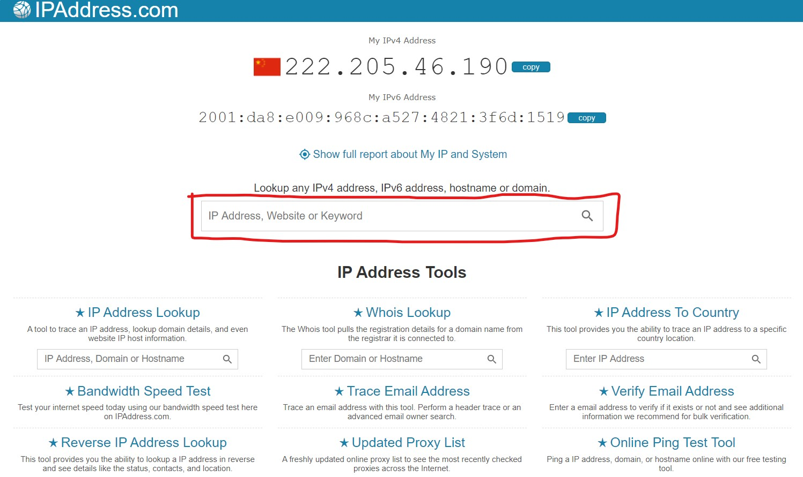
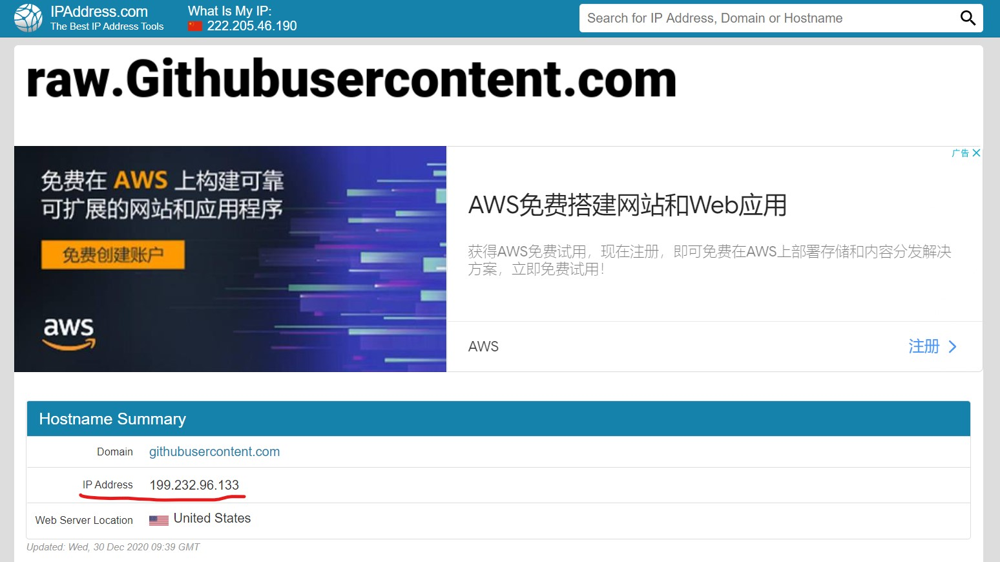
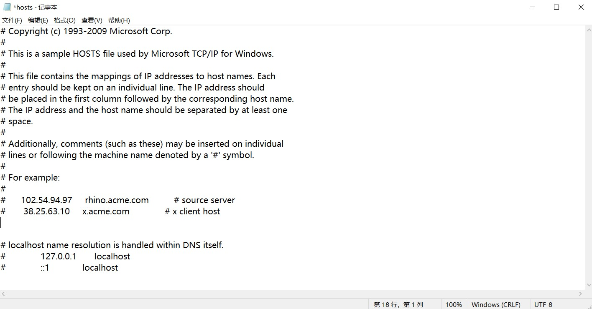

注：网页上看到的MarkDown文档中可能看不到图片，可能是因为raw.githubusercontent.com被DNS污染。

### 解决方法
1. 访问https://www.ipaddress.com/（这是一个解析域名对应的ip地址的网站）
2. 在该网站中间的搜索栏内输入raw.githubusercontent.com，然后点击搜索框右侧的放大镜（搜索）按钮

3. 跳转到搜索结果界面，表格中IP Address后面即为域名对应的真实ip地址

4. （WINDOWS10）在资源管理器地址栏中输入C:\Windows\System32\drivers\etc即可跳转到hosts文件所在的文件夹
5. 右键hosts文件，用记事本打开。如果你之前从未修改过hosts文件，记事本显示内容应如下图

6. 在文件末尾加上199.232.96.133	raw.githubusercontent.com，然后保存hosts文件并关闭，此时再打开网页即可看到图片。（199.232.96.133是你查到的raw.githubusercontent.com对应的ip地址）