https://zhuanlan.zhihu.com/p/338973792

若看不到图片，请进入https://facturi.github.io/Record/%E4%BD%90%E4%BC%8A/%E4%B8%AD%E5%9B%BD%E7%A4%BE%E4%BC%9A%E8%B0%83%E6%9F%A5%E7%A0%94%E7%A9%B6-%E7%AC%AC%E4%B8%80%E6%9C%9F

# 中国社会调查研究

第一期

**2020.12**

序言
====

社会性质到底是什么，社会矛盾到底是什么，推动社会进步的力量到底是什么。这是每一个追求进步的青年人必须弄清的问题，这些问题不清楚，就只会在漩涡中打转。

调查研究，是搞清这些问题最重要的方法。调查研究不能解决一切问题，但调查研究是解决一切问题的基础，是必要条件。

理论是我们认识社会的工具，但只有工具不行，我们还需要被认识的素材，这些素材从哪里来呢，从调查研究中来。

企业家是不是资本家，中国社会还有没有阶级矛盾，阶级矛盾在中国社会占怎样的地位，劳动者能不能接受马克思主义，等等问题，不仅是理论问题，更是现实问题。

流水线的工人每天工作12小时，所得却仅能完成劳动力再生产。中小型公司的脑力劳动者动辄无偿加班，而他们的努力只不过是让老板多买了一个法拉利。垄断资本的普工员工工资会更高一些，但他们也只能“租住在不足十平米的单间中，与两三个人共用浴室、厨房和客厅。”

这些员工，不论是在大企业还是小企业，不论是在国企还是民企（或者外企），他们都没有质的区别，他们不过是资本（国资或者非国资）的雇员，他们的工资仅够他们完成劳动力再生产而已。当全社会的企业都以资本的方式运营，而全社会的劳动者都是资本的雇员时，这个社会的性质以及矛盾，会是什么呢。以上是本次调研的主要内容，对应报告的第一部分至第五部分。

本报告第六部分描述了部分新兴小资产阶级和传统小资产阶级。

列宁对阶级有一个经典定义：“所谓阶级，就是这样一些集团，这些集团在历史上一定社会生产体系中所处的地位不同，对生产资料的关系（这种关系大部分是在法律上明文规定了的）不同，在社会劳动组织中所起的作用不同，因而领得自己所支配的那份社会财富的方式和多寡也不同。所谓阶级，就是这样一些集团，由于它们在一定社会经济结构中所处的地位不同，其中一个集团能够占有另一个集团的劳动。”

列宁时期，小资产阶级主要是自耕农、小商人、小作坊主等等，他们掌握了生产资料，并主要通过自己的劳动使用生产资料，通过商品交换获取货币。小资产阶级不受雇于资本家，也基本不雇佣人（或者非常少），也就是说，他们不无偿占有别人的剩余劳动，也不被人无偿占有自己的剩余劳动。他们受着资本的压迫，却又揣着发家致富的梦想，有一亩三分地的牵挂，总是动摇在反抗和妥协之间。这就是传统的小资产阶级，本报告第二十章略有涉及。

随着社会生活的发展，小资产阶级这个概念的内涵也在发展。新兴小资产阶级就是有别于传统小资产阶级的另一个重要群体。新兴小资产阶级是随着经济的发展而新兴的群体。二战后，随着经济越来越复杂，随着垄断资本所有权和使用权的分离，大公司中层管理人员作为一个新兴群体诞生了。他们是一个执行高管意志，并具体安排、协调劳动的中层管理人员群体。这个群体的人员，主要是大中型公司的部门经理或者相应层级的人员。他们在本部门（本劳动领域）中具有实际安排劳动的权力，能够支配下属从事劳动，对下属的晋升、薪酬、奖金具有一定的话语权，他们的薪酬也明显高于基层的劳动者。这样的一个群体，名义上也不掌握生产资料，但是他们在“社会生产体系中所处的地位”明显有优于基层劳动者，在“社会劳动组织中所起的作用”也比基层劳动者更主动，因此他们也能获得比基层劳动者更多的薪酬，比如某些二线城市传统企业大公司，部门经理薪酬在数十万左右。然而，他们薪酬主要来源并不是劳动者的剩余价值，而是自己的劳动。因此，他们的阶层可类比于传统的小资产阶级，我们称之为新兴小资产阶级。这个群体和传统小资产阶级一样，虽然也受着大资本的压迫，却有些坛坛罐罐舍不得，有些许发家致富的现实可能性让他们魂牵梦绕，在斗争和妥协之间不断动摇。本报告第十九章描述的某公司职场女性属于这个群体。

中国当前的识字率远高于历史上任何一个时期，历史唯物主义（不论怎么阉割）的普及度远高于当前任何一个国家，而中国的互联网普及程度又是如此地高。这导致了这样一个现象：被资本压迫而自发思考未来、寻找出路的先进劳动者，首先抓的工具就是马克思主义。

恩格斯曾为德国工人继承了德意志民族的理论素养而自豪，列宁也曾描述过俄国工人学习《资本论》时的情景，并称俄国工人继承了德国工人对理论的自觉。

无疑，这个趋势在今天的中国再次兴起。中国先进无产者对马克思主义的兴趣近年来逐步高涨，这个高涨的趋势在疫情之后进一步加速。很多青年人在回顾自己思想变化时，都将疫情作为一个分水岭。

这个趋势目前来看有如下特点：（1）虽然这些人在劳动者中占比非常小，但是绝对数量并不小，并且越来越多。（2）这些人主要以青年脑力无产者为主。（3）对毛主席的崇敬，以及对毛主席著作的自发学习，构成了很多人思想转变的桥梁。

这些特点是现实所决定的。

脑力劳动者至少是高中毕业，很大部分是大专和本科，他们在学校的时候就听闻了“阶级”、“剥削”等等概念。当他们真正被某个“阶级”所“剥削”，并在互联网（以知乎、微博、B站、公众号为代表的新媒体）上再次接触到这些概念的时候，模糊的概念自然变得更清晰了。他们有更多的时间、渠道和知识储备去思考、去了解这些内容，因此，他们是当前第一批觉醒的劳动者。

体力无产者多是初中毕业，多数人从事着6天12小时（甚至更长时间）的工作。生活把他们压得疲惫不堪，他们甚至没有时间去了解痛苦的根源。他们太疲惫了，他们只想用娱乐化来打发不多的休息时间，他们首先看的是抖音、快手和QQ，而不是知识量更足的知乎、微博、公众号和B站。这使得无产阶级的主体还处于一个沉睡的状态，体力无产者主动寻找出路并回顾马克思主义的还非常少（绝对人数应该远少于脑力无产者）。但是，矛盾越来越尖锐了，冲突也越来越多了，寻找出路的体力无产者也出现了，他们中最敏锐、最优秀的极少数人，已经转向了马克思主义。

上述典型人员的思想转变，记录在本报告第七部分。

第一部分 工业区的无产阶级
=========================

第一章  某工业区调研
--------------------

编者按：这篇文章是一篇工业区调研。文章大致描述了某沿海城市某街道工业区情况，通过解剖麻雀，我们能够概括性地了解当前沿海工业园区工人的分布、劳动和意识情况，并大致掌握劳资矛盾的基本状态。这是一篇有价值的调研报告，推荐朋友们耐心阅读。

### 一、概述

按公开资料显示，甲区F街道工人数30万，企业约6000多家。百人以上企业200余家，500人以上企业30-40家。其余企业均为不足百人的小微企业。据F街道公开数据显示，大中型企业（300人以上）占比仅2%左右，雇工却接近60%。

F街道的企业可分为小黑厂和大厂两种，其中大厂又可按待遇、合法程度、管理严苛程度等分成四个小类：

一类厂、加班不超过36小时能满足劳动力再生产的（即到手工资超过4000元）；

二类厂、6天10/11小时能满足劳动力再生产的，且管理制度较为规范的；

三类厂、6天10/11小时能满足劳动力再生产，但管理制度不规范的；

四类厂、6天10/11小时能满足劳动力再生产，管理极不规范,且存在大量克扣工资的。

### 二、一类和二类大厂

（一）基本情况

一二类厂特点类似，雇工合计占比约20%（占所有工厂工人比例）。

资本特点。这两类厂主要以欧美日等外资企业为主，产品高端并一定程度形成垄断，利润率较高。

与政府关系方面。一二类厂多是国际集团公司的子公司，利润较丰厚。他们一般为地方纳税大户，也受地方政府重视，能够享受各种政府补贴。整体而言，他们比较配合地方的工作，内部一般有专人负责政府对接。他们往往会参加商会/行业协会，且为副会长单位、理事单位等。为增强资本家及其代理人的政治归属，地方特别重视在商会内搞党建工作。

劳资关系的特点。一方面，资方有足够的利润提高员工的工资和福利；另一方面，因其主要客户是国际大公司，这些国际大公司多受制于某些国际标准（如SA8000、RBA、OHSAS），而这些国际标准中往往又安排有劳工条约，因此一二类厂的经营比较规范，且在工资之外，还会有餐补、住房补贴、年终奖等福利。这两类厂流动性小，老员工较多，工人容易形成自己的社会关系，这有助于增强工人的团结。这两类厂职工维权意识普遍较强，工人不仅关注工资，还关注工作日常中的各种矛盾（食堂、宿舍、空调、高温补贴等），厂里也有相应的形式上的意见反映渠道（如知心姐姐团队、员工沟通会等）。劳资双方核心矛盾仍然是工资，但是厂里工人倾向于追求更加长期的利益，不会轻易以离开工厂为代价去抗争。

一二类厂的区别。一二类厂主要的区别在于普工的工资，一类厂普工基本工资（加上福利）较高，且随工龄不断增加。一般而言一类厂普工5天8小时到手工资在4000-6000元左右，可以不考大量加班维持生计；而二类厂普工5天8小时到手工资不到3000元，必须靠大量加班维持生计。一二类厂的利润均较为丰厚，都能够支撑较高的普工工资。区别往往在于，一类厂普工曾有过集体行动，迫使工资上涨。因此，随着劳资力量对比发生变化，一二类厂经常互换位置，一类厂可能掉落成二类厂（物价涨工资不涨），二类厂可能升级为一类厂（集体行动后基本工资大幅上涨）。

因为二者高度类似，下面我们主要以二类厂为例，讲解这类厂的特点。

（二）分群体工资工时情况

大厂内的人员可以分为体力无产者（普工、基层班组长等）、脑力无产者（普通文职人员、技术员、普通工程师）、小资产阶级（部长、部门经理等，在生产安排、原材料购买、工人升职加薪等重要事项方面有权力，可以决定部门内部的财务使用）、资产阶级（总经理、副总经理等）。

二类厂大部分普工在刚进厂的时候底薪为当地最低工资（或者略高），随着工龄的增长，底薪会有一定的增加，但十分有限，10年的老员工底薪也不会超过3000。一般而言，二类厂加班时间在80-110小时左右（周一至周五加2-3小时，周末加10-11小时），到手工资在5000元左右。

班组长工资比普工略高，有几百块的岗位津贴。他们一般脱离了体力劳动，可以决定一条拉的人员安排、加班等，有一定的安排生产的权利，但非常有限。在劳资纠纷中，往往站在普工一边。有些班组长为了补贴家用，下班后还会去打临工。

文职人员属于脑力无产者，他们工资很低（4-5k），往往是拿月薪，没有加班费，大部分为5天8小时，很少加班。

二类厂一般会有一个比较稳定的技术人员队伍（这是二类和三类的重要区别），通常为大专或高中学历以上。技术员和工程师的工资要比普工、班组长、文员都高一些，往往能拿到7、8k以上，甚至1w+。他们往往会加班（特别是跟线技术员），有些公司有加班费，有些没有。有加班费的厂中，跟产线的技术员和工程师有加班费，驻办公室的技术员和工程师往往也没有加班费。多数加班费以当地最低工资为基数计算，部分人员加班的时薪甚至少于正常工作的时薪。

部长、部门经理等级别员工属于典型的新兴小资产阶级。他们的工资往往在1.5w以上，能够相当程度上掌握本部门生产资料使用权，并一定程度上享有生产资料的收益权。他们另外一个可能的收入来源为灰色收入，如自家小厂等。这些人在劳资纠纷中一般占资方立场。但是当劳资冲突有利于他们的时候，他们也会参与或者利用劳资冲突。比如，在有工会的二类厂，工会常常被中层把持，他们会利用工会动员普通工人和资方谈判。近年来随着经济下滑，这部分人也越来越不稳定，部分下层小资下班后开滴滴补贴家用。

（三）其他福利和工作环境

二类厂一般都会缴纳公积金和社保，缴纳基数多数按实际工资，部分按基本工资缴纳。大多福利较好，有些厂依法缴交工会经费，过年过节会发放过节费或比较高标准的慰问品。公司食堂在干净、卫生、菜品丰富程度等方面比其他厂要好很多，但工人对食堂并不一定特别满意，这说明工人往往会在新的起点上继续斗争。宿舍通常有空调，条件也不错，但因为这类厂老员工多，老员工有家庭，更倾向于在外租房。

由于他们受到国际客户关于职业安全健康、环境保护等方面的约束，同时他们也比较遵守关于安全生产方面的法律法规，同等岗位、同等职能的部门在工作环境方面较三类厂、小黑厂好一些，但工伤和职业病仍然不可避免甚至高发，违法事项也不时可见。比如某二类厂冲压车间有很大的噪声，员工往往出现听力方面的职业损伤。该二类厂在前几年勾结体检单位，隐瞒体检报告，让听力受损的员工继续在噪音岗位工作。

（四）用工管理

二类厂用工比较规范，管理相对人性化。这体现在如下方面。

休假方面。二类厂一般不会克扣员工的病假工资、产假工资、年休假等，普通员工可依法享有上述假期。

劳资沟通。出于国际标准的要求以及稳定内部劳资关系的需求，部分企业会开展形式上的劳资沟通，如某二类厂每年都会进行工资集体协商（实际上该公司本来就有涨工资的预算，但在形式上需要工会代表工人和资方谈判），另一二类厂每半年会召开一次员工代表沟通会。

日常管理。企业的管理比较人性化，基层管理人员不会动不动就训斥工人。如果基层管理无理训人，员工可以通过企业内部的某种机制解决，比如找工会、人事或上级投诉等。

派遣工。为缓解招工困难，并为了方便管理（解除劳动合同不支付补偿），这些厂也较多使用派遣工，但他们往往会选择有信用、规模较大的劳务派遣公司合作，派遣工干够一定时间可以转为正式工。他们使用派遣工主要是为了灵活用工，而非通过克扣工资降低成本，这是二类厂与小黑厂使用派遣工的重要区别。

企业文化。二类厂会组办生日会、旅游以及各类问题活动，丰富员工业余生活，但普工参与度并不高。二类厂试图通过这种方式灌输某种理念，但效果非常有限。

其他。二类厂比较注重员工参与公司的改善，日本厂尤其重视。这种后福特管理模式很大程度受鞍钢宪法启示，但又加入了资本主义的物资刺激。日资厂会以奖金为刺激，发动技术人员写提案，提出合理化建议。

（五）工人意识情况

二类厂工人意识相比三类及以下厂要高，但仍停留在法律层面。比如，很多常年在小黑厂打工的人，对不交社保习以为常，而二类厂的员工听闻某老乡没有社保公积金，他会知道这是违法的。有些积极的员工，还会鼓励老乡去要社保。

二类厂由于老员工较多，有自己的社会关系，并有自己的社会生活。而流动性高的三类厂或者小黑厂，员工原子化程度很高，下班后就回家玩手机，社会生活很少。

二类厂大部分工人没有结社意识，少部分人有结社的意识，但多数组织水平不高，在当前劳资对抗下不足以实现结社的目标。

（六）矛盾分析

总体上二类厂的工人的权益意识比其他厂要好。

在当前的条件下，任何工人面临的主要矛盾都是工资工时的问题，即使是这样的“好厂”，工人仍然需要6天10小时甚至更多才能维持劳动力再生产。二类厂老员工多，经济压力较年轻人更大。近年来生活成本急剧增加，房租逐年上涨，猪肉、菜价也涨得快，但最低工资标准几年都没有增加，这种情况下，小孩上学、老人赡养等问题，困扰着每一个中男人。

在二类厂中，如无意外，多数人会一直干到工厂搬迁（可拿到数万至十数万补偿金），而不会以丢掉饭碗为代价进行斗争。因此，二类厂中工资工时的矛盾一般会以一种长期但不激烈的方式展现。他们更关注日常生活中的矛盾，比如加班、夜班津贴、劳动条件改善等。

只有普遍而巨大的利益（比如搬厂的经济补偿金等），才能成为也往往成为激发剧烈抗争的导火索。二类厂工人不轻易停工，但一旦发生停工，组织程度和斗争性比其他厂要高。

### 三、三类厂

（一）基本情况

三类厂是大厂的主体，雇工占比大致在40%（占所有工厂工人比例）。

资本特点。三类厂以内资、港资、台资为主，资本规模也较大，但处于竞争比较激烈的行业，技术含量不高，不具备垄断优势，利润率比较低。他们大多为代工厂，没有自己的主打品牌，为典型的劳动密集型企业。三类厂产品以元器件和低端的最终消费品为主。比较典型的三类厂产品有变压器、光纤、学习机、家用电器、耳机、手机配件等等。这些产品的特点是技术含量低，一般小公司购买流水拉和元器件后也能生产。三类厂竞争的就是规模，或者说是雇佣工人的人数。能开一条拉还是三条拉、能雇十个人还是三十个人，是他们经营的关键。他们主要靠形成规模效应，挤垮其他竞争者（多为小黑厂）。

劳资关系方面。该类厂普工基本工资低（一般是当地最低工资），普工需靠大量加班维持生计。该类厂管理经营有诸多不规范之处，比如社保公积金一般仅按基本工资而非实际工资缴纳，再如休息休假和日常管理方面也常常违法（普工无法依法享受产假、病假）。

和政府关系方面。这类老板通常和当地有一定的关系，熟知劳动法的漏洞，并且能够摸清楚地方（尤其是劳动部门）在执行层面的一些潜规则，见缝插针地违反各种劳动法律法规，从各种方面压榨工人。他们所在的地区商会、台商商会等机构，也会邀请仲裁员等法律专家给企业人事培训如何规避法律风险。

（二）工资工时

这类厂的工资和第二类厂类似，普工底薪为当地最低工资，加班往往和淡旺季有关，旺季加班较多，接近6天11小时，每月约100-110小时，淡季则5天8小时或10小时。普工通过大量加班，每月到手工资可达4000-5000元。

假期方面。三类厂在病假工资、产假工资、年假工资、婚假丧假工资以及工伤医疗期工资等方面都有克扣。比如产假，一般文职人员能休产假但会被克扣产假工资，比如按规定为生育津贴和平时应发工资取最高值，而厂里实际上按当地最低工资来发；非文职人员没有产假可休，普通怀孕后就会被厂方以各种方式挤兑开除。

津贴方面。三类厂通常不依法支付高温津贴，普工如要求支付，资方会各种扯皮，即使最终答应支付，也会耍各种小手段。比如，按法律规定如果工作场所温度能控制在33度以下即可不支付高温津贴，资方就会把温度计放在空调出风口处测温。

社保和公积金方面。这类厂大多数按照当地最低工资的基数缴纳社保，不缴纳住房公积金。

其他福利待遇。基本没有工资以外的福利待遇。有些厂号称包吃住，但住宿、水电都要员工交一定的费用。而食堂往往外包，仅会提供一定比例的伙食补贴。

除普工外的其他工作人员。文职人员拿月薪，没有加班费，平时一般不需要加班，工资在4000-5000左右。这类厂的工程师、技术员和普工的工资待遇没有太大差距，比如某三类厂的技术员，工资和普工几乎一样，他们和普工的区别在于工作相对轻松，有大量摸鱼的时间。

（三）工作环境和劳动强度

这类厂大多数是流水线生产，整体劳动强度较大。

不同厂工作环境有较大区别。以装空调为例，有些厂装空调，有些厂不装。是否装空调，并不取决于员工是否酷热难忍，而是取决于温度是否会对生产有影响。比如，电子厂害怕员工滴汗损坏元器件，车间通常都有空调；而设备制造厂很多不装空调。某次某电镀车间员工说，“老板眼中，我们比不上一台机器。电子设备沾了汗水，他会心痛，而我们，热得内裤全湿了，他问都不问。”

职业病方面。政府要求所有工厂每年向主管部门报备本厂的职业健康危害因素，同时还要求工厂每年进行职业健康体检。但由于主管部门是卫健委，和生产领域距离很远，执法力量不足，难以掌握各厂的职业病危害情况，所以三类厂在职安健方面不规范的地方很多。很多工人罹患有机溶剂慢性中毒，导致身心俱残，厂里面往往把他们扫地出门了事。

（四）用工管理

三类厂没有那么多国际大客户，或者和国际大客户之间隔了两三层之远，不受各种国际标准的限制，在管理和压迫方面更为严酷。

三类厂普工没有任何技术含量，稍加培训即可上岗作业。对资方而言，新员工比老员工更便宜。新员工以二十多岁的年轻人为主，他们没有结婚，没有太大的经济压力，社交高度原子化，对于社保公积金、食宿空调的要求都更低（如某三类厂规定，干满一年的员工才给买公积金）。因此，保持员工的高流动性有利于资方。这种厂形成了这样的现象，即线长天天在产线上骂人，驱赶工人离开工厂，而人事部门天天为招工而苦恼。这既是厂方纵容的结果，也是资本逐利的结果。

由于工资待遇并不高，工作毫无技术含量且强度大，厂方管理粗暴，因此普工流动性非常大。一般来说，三类厂里普工工龄很少在一年以上。文职人员流动性不强，因为5天8小时的工资基本能满足生活需要，且工作强度并不大。

派遣工。三类厂会大量使用派遣工，因为灵活用工可以大量节省资方开除工人的补偿金。三类厂与一二类厂在派遣工方面区别很大，一二类厂会要求派遣公司按正式工的标准给派遣工购买住房公积金，而三类厂不会。他们合作的派遣公司往往不是规范的派遣公司，通常没有社保公积金，也没有规范的劳动合同。如某三类厂和派遣工签订两份合同，一份按传统的底薪+加班费的方式算工资，另一份则是实际履行的小时工薪算工资（前一种计发方式下拿到手的工资会比较低，当派遣工要维权的时候他们就会拿出前一份合同威胁员工）。

三类工厂还会大量违规使用日结工、小时工。法律规定日结工、小时工每天工作不超过4小时，但三类厂日结工工作时间和正式工一样，往往是每天11小时。并且三类厂不会按法律规定的标准支付小时工资。比如某地法律规定小时工资不得低于20元/小时，但三类厂会根据供求情况调整工资，只有在极少数情况时薪才会达到或者高于法律标准。

（五）工人意识情况

三类厂工人的普工大多是二十来岁的年轻人，没有长期的规划和打算，往往是过了年就不来了。他们的社会关系高度原子化的，组织性差，权益意识很弱，厂里不拖欠工资即可，一般没有更进一步的要求。三类厂技术员的意识和普工类似。

三类厂的文职人员相较于一二类厂更加软弱，因为本厂的普工没有行动力，他们看不到力量，往往认为维权行动毫无意义。

三类厂线长、领班和课长这个层次，一般会有一些老员工，社会关系更加稳定，权益意识会更强。

三类厂也有一些流动性较小的部门，这种部门往往是环境较差的部门（气味大、高温、粉尘等等），这些部门的员工多是40来岁的老员工，他们出厂后很难找到其他工作，因此不会轻易流动。这些老员工权益意识会更强一些，往往会采取积极的行动维护权益。

三类厂部门主管和经理这一层次，基本属于站资方立场的新兴小资产阶级上层，一般斗争时会站在工人的对立面来考虑问题，成为资产阶级的走狗帮凶。

（六）矛盾分析

三类厂的主要矛盾仍然是工资问题，但表现形式是年轻员工用脚投票，自己辞职，而老员工可能会以争取社保公积金为突破口。

某三类厂，一老员工离职时发现企业未按规定缴纳公积金，他的基本工资在2000左右，每月加班后平均工资在5000左右，企业按2000的基数和5%的比例缴纳公积金（法律规定应该按实际工资，即5000缴纳），每月少交150元，两年下来少交3600元。该员工向住房公积金管理中心投诉后，成功追讨3600元公积金。消息传出，该三类厂陆续有200多名员工投诉该厂，导致该厂承诺给全厂员工补缴公积金。

### 四、小黑厂和四类厂

300以下企业几乎均为小黑厂，主要是电子厂，以生产电子元器件为主的，如电路板，Pcb板，遥控器，手机外壳，电子烟，等等。

小黑厂资本规模小，现金流吃紧，因此会想尽办法从各个方面“减少开支”。

（一）工资工时

小黑厂基本工资普遍为最低工资，以沿海为例，基本工资在1500-2200元之间。工人无法靠最低工资完成劳动力再生产，因此被迫自愿加班。

小黑厂加班时间一般在一个月100-110小时（周一至周五加班3小时，周末加班11小时），部分企业会更多。多数小黑厂单休，但旺季时期部分厂会取消休息。

加班费方面，多数小黑厂能够按法定标准支付，少部分低于法律标准。如一月加班100小时，工人到手工资在4000元左右。

小黑厂经常用其他方式克扣工资，比如罚款、逼迫自离、违法滥用综合工时等等。此外，小黑厂普遍不缴纳社保和公积金。

小厂部门负责人级别的管理人员工资能达到7k-10k，这个工资明显比普工高，但在当地往往达不到社平工资。

（二）用工和管理

小黑厂用工极不规范，这主要体现为以下三个方面。

第一，不签合同。很多小黑厂不签劳动合同，或者签了收走。因为小黑厂经常违法，小黑厂的资本家甚至将违法压榨作为其利润重要来源之一，因此他们会通过不签合同的方式增加工人的维权难度。

第二，违规用工。小黑厂多为电子厂，且资本体量小，因此订单具有极强的季节属性。上半年淡季，下半年旺季，用工需求差异很大。小黑厂今年下半年也许需要100个人，明年上半年就可能只需要30人。为了规避解除劳动合同的补偿义务，小黑厂往往违反法律规定，大量滥用小时工、派遣工。

第三，管理严苛。小黑厂有大量罚款条款，厂里面动辄扣钱。不仅如此，在小黑厂几乎不可能依法休病假，产假更是天方夜谭。在小黑厂能休产假的都是管理人员，工人怀孕就会被赶走。

（三）矛盾分析

小黑厂工资待遇不高，不缴纳社保和公积金，管理严苛，违法事项多，因此工人流动性很强。小黑厂普工工龄很少有在一年以上的。由于工人流动性强，难以沉淀下来形成自身的社会关系，因此小黑厂工人的团结意识和组织意识是最弱的。

在此情况下，资方对员工的权益侵犯较严重。乱发款、不缴社保等是最常见的事项，其他诸如违法压工资（这个月底发上个月的工资，或者发上上个月的工资）、勾结中介克扣工资、逼迫自离克扣工资，也是常见的事项。

由于工人流动性强，难以形成组织力量，只能单个和资本对抗。而资方不签合同，且侵犯权益往往采取零敲碎打的方式（这里克扣200，那里克扣200），很多人会觉得没多少钱，去维权又很麻烦，因此放弃争取。

整体而言，小黑厂员工意识比大厂弱。遇到问题多是被动维权，即权力被侵犯后维权（大厂当前也是被动为主，但主动的更多）。小黑厂权益问题主要围绕工资、工伤和搬厂补偿金展开，很少涉及劳动条件改善（如在车间安装空调等），几乎没有主动进攻涨薪。然而，由于小黑厂违法频发，因此小黑厂爆发员工维权的频率并不低，不时出现因拖欠工资而导致的维权事件。

四类厂就是规模达到了大厂标准的小黑厂，工人常戏称为大黑厂，基本特点和小黑厂类似，在此不再赘述。

### 五、结语

通过对甲区F街道的工业情况分析，我们能得出如下结论。

1、该街道40%工厂工人受雇于小黑厂或四类厂，几乎不签合同，不买社保，难以享受正常的休假，厂里管理严苛，且通过各种违法手段克扣工人薪资。该街道另有40%的工厂工人受雇于三类厂，会签署合同，买社保但不符合法定标准，基本不缴纳公积金，普工难以享受正常的休假，厂里管理严苛，基层管理骂人较为普遍。余下20%的工人受雇于一二类厂，会签署合同，基本按法律规定缴纳社保和公积金，普工能够享受正常的休假，由于受制于国际客户的各种标准，厂里管理相对人性化，且在形式上设有各种沟通渠道。

2、小黑厂、四类厂、三类厂，合计约雇佣工厂工人80%，这80%的人都随时遭受这不同程度的违法侵害。由于工资低、福利待遇差、工作强度大且技术含量低，工人的流动性很强。这种高强度的流动性，一方面有利于资本违法获利（比如自离不支付工资、不干满一年不买公积金），一方面不利于员工形成本地的社会关系，因此也不利于员工形成团结意识。一二类厂，合计雇佣工厂工人20%左右，这20%的人在基本合法的状态下被剥削。由于管理相对人性化，且福利待遇交好，一二类厂普工流动性不大，老员工较多，形成了自己的社会关系，有长远规划（比如一直干到工厂搬迁），较为注重日常权益，团结意识明显更强。

3、从未来来看，二类厂工人经济方面的目标是提高基本工资，在5天8小时内（或者每月加班不超过36小时的情况下）能够完成劳动力再生产，即现行物价下获得4000-6000元的工资。二类厂由于垄断或者优势市场地位，有较高盈利，由于工人相对稳定，有长期团结的可能性，因此有可能达到这一目标。从日常来看，一二类厂工人经济方面的目标是进行日常权益维护，并在此过程中加强相互的联系。

4、三类厂、四类厂和小黑厂盈利微薄，工人流动性强，因此较难出现工人团结争取基本工资上涨的局面。并且由于利润微薄，单个资本能否支持工人在5天8小时内（或者每月加班不超过36小时的情况下）完成劳动力再生产的诉求，存在较大不确定性。因此，在小黑厂或三四类厂落实8小时工作制，可能需要全局层面的调整。从日常来看，这些厂工人经济方面的目标是敦促厂方落实基本法律，比如购买社保和公积金，享受法定休假等等，这些是工人能做并且已经在做的事情。在这个过程中，能够唤醒更多人的权益意识。

5、还有一些其他结论，就不便在这里说了。

 

第二章 A厂基本情况
------------------

### 一、基本情况

A厂是沿海某市重点单位，员工合计1251，部门合计40个。员工中男女比例接近3:1，地域分布以两广两湖为主，两广两湖外和江西员工合计近70%。公司员工学历远比普通电子厂高，大专及以上合计20%，另有中专及高中生合计60%。员工以中青年为主，30-40岁的员工占多数。工厂流动性不大，5年以上老员工超过80%。

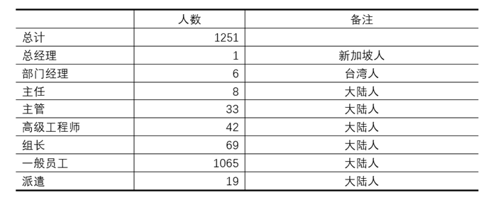

公司总经理是新加坡人，总经理以下是部门经理，部门经理均为台湾人，共计6人。部门经理管辖共计40个部门，高级经理手底下有多个部门，初级经理手下就一个部门。经理下面是主任，一般只设一人。主任下面是主管，主管视部门情况而定，大的部门一般有多个主管，小的部门一般就一个主管。主管下面是组长，组长下面是普通员工。此外，另有高级工程师42人。

经理收入较高，大致数十万至百万左右。经理有很大的权力，不仅有本部门所有事务的最终决定权，还控制了本部门的人事权。组长升主管、主管升主任，都是经理提名。凡是经理提名的，上面一般都会批准。

主任薪酬一年20万左右，并拥有一定的人事权。普工升组长或者组织升主管，一般是由主任提名经理审批，实际上，凡是主任提名的经理都会批。从收入看主任薪酬并不高，但主任握有组织生产的实际权力。经理都是台湾人，并不负责直接组织生产，而只负责对接业务，以及协调与总部的关系。生产基本都是主任实际负责。从哪里买原材料，怎么安排生产，在实际上都是主任决定的。这使得主任有了很大的以权谋私的空间。两年前有一个主任被抓，就是因为他从供应商那里拿回扣。这个案子涉案金额数千万，牵扯质量、采购等多个部门员工。

主任下面是主管，主管协助主任具体安排生产。主管工资明显高于普工，但也明显低于主任，一般也就是在一年12万左右。主管除了具体安排生产外，主要的权利就是审批加班和定每月绩效，绩效分四挡，从200-500元/月不等。

组长是最低一层的基层管理人员，实际安排生产，催促产量。组长唯一的权力就是提请主管审批工人加班或者建议工人每月绩效。组长的工资和普工相差无几。

前五大部门生产部门人员合计共600人，占所有员工数的48%。

### 二、部门生产情况概述

生产部门分成两类，一类是有技术含量且找工作较容易的，如装配部门；一类是无技术含量的重复性劳动的，如检测部门。下面以装配部门和检测部门为例，讲一下两类部门的不同情况。

（一）装配部门

公司共计有3个装配部门，合计人数290人左右。长白班，上六休一，不轮休。下面我们主要介绍装配一部。

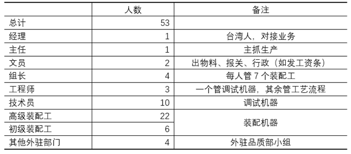

装配一部在编人员49人，另有4为其他部门常驻人员（品质部）。所有员工均为正式工，无派遣（以前有派遣，2018年后因企业效益不好退回派遣人员）。

经理是台湾人，不负责具体生产事务，主要是对接订单并协调总部关系。经理有自己的独立办公室，每天8点半上班，五点半准时下班。平时一天巡视车间3次，其他时间都在自己办公室。

主任实际负责部门生产。本部门并无主管，因此主任直接管辖4个组长组织生产。主任、文员和工程师共用一个办公室。主任平时都在办公室里面，偶尔会出来巡视，监督工人工作。文员负责物料、报关以及其他行政事务，文员还协助主任安排生产。工程师平时事情不多，技术员搞不定的事情就找工程师。照理说工程师可以一直呆在办公室，但是很少有人一直坐着。工程师担心被主任骂，他就经常去车间走动，找技术员聊天消磨时间。

装配工负责装配机器，技术员在装配工组装完成后，校验调试机器，并写出校验和调试的报告。装配工和技术员是车间最主要的劳动力。

组长安排装配工工作，并具体负责监督。组长一般不参与劳动，但特别忙的时候会搭把手帮忙。

从是否脱离具体生产来看，装配工、技术员和文员，都从事具体劳动，是一线劳动者；主任和经理完全脱离生产，是劳动的组织和监督者；组长和工程师基本不参与具体劳动，但身处车间，时时在劳动一线。

装配工年龄主要集中在25-40岁。男工20人，女工8人。多数工人已婚，并育有小孩。装配工具体负责三个子工种：散件装配、组件装配和排线（把组件和电子产品的线接上，并有序排列）。

散件装配和组件装配需要搬运较重的零部件，因此几乎全是男工。排线最轻松，以女工为主。排线最轻松，组件和散件比较累。

就劳动环境而言，车间有空调，无粉尘，但装配时有可能被砸伤，因此装配部门很强调安全生产。

一个具体的生产过程如下：任务开始后，由组长分配人手。装配工先去楼下把空机架用叉车拉上来，并通知物料房发料，备料完成后就开始装机。先是装机底，再是拉线，然后是盖模板以及装机顶组件，完成后就把线和组件拉在一起，组装完毕后交测试。

最简单的机器一般有6个工位（机底散件2个、组件1个、模板线1个、左右拉线共2个），大概每个工位要30分钟，有些工序可以并行，有些不行。公司要求一天装机10台，但是工人不会干这么快，工人会拖到一天只干8台左右，剩下的2台留到加班再干，这样就可以赚取加班费。工人看得很清楚，自己干得越快，钱就越少。一个工人说，“我们正式工并不积极，效率就70-80%。也有人拼命干，比如派遣工为了转正就拼命干。但是一旦转正，也就开始偷懒了。”

工人一天的生活大致如此：早上8点半到工厂，组长召集开早会。早会会讲工作安排，强调安全生产（这个厂非常重视安全，因为一有工伤，管理人员晋升就受阻）。开完早会装配工就集体上洗手间或者去茶水间喝水，少的五分钟，多的要磨蹭半小时（老油条）。9点前多数人就开始工作了，上午一般装机4台。整体而言，工作不太累。当然，对工人而言这样的工作也没有任何乐趣可言，他们总会找些机会去找人聊天打趣。比如，装配工装好机底就可以去旁边找大姐聊天，你来我往相互打趣，并不时开开车。装配一部是12点半吃饭，1点15接着上班。下午重复着上午的工作。下午上班有些人会犯困，他们犯困了就去喝水或者跑出厕所蹲里面睡一小会儿。下午到正常5点15下班，一般合计装配8台。公司一般会安排两个钟，这种加班多为连班，工人在7点15下班。

经理一般5点半前就下班了，主任一般6点15下班（公司不会给管理人员多加班，因为他们工资高）。管理人员下班后，工人就开始大规模磨洋工、玩手机，一边玩一边干，到7点15下班。

工人有很多方法可以偷懒。下面列举五种常见的方法。

1、拉机架。不忙的时候，工人自己用叉车去楼下取件。下楼后工人就在树底下休息，一个20分钟能拉上来的机架，工人磨磨蹭蹭可以拉出40分钟来。

2、拧螺丝。本来有电动扭力批，几秒就能搞定拧螺丝，但工人会用手动的六角扳手去扭，十几分钟才扭好。

3、找物料。每种机型上百种物料，有些物料员都不知道放哪里了。如果是批量装机，物料一般是物料员备料，如果是非批量装机，物料就是装配工自己去找。这个时候，装配工就会慢慢找，一边找一边休息。一个装配工说，“我还能玩手机，只要不被领导看到就行。玩手机要机灵一些。有一次我们不忙的时候，有人在一个角落玩了半天手机，领导来了兄弟就给他打配合，发信息告诉他，让他出来露个脸，领导就放心了。玩手机大家都会打配合，只要抓到一个人，领导就会骂一个组。所以组长给我们说，你们玩手机要机灵点，这样我也会少挨骂，我也不来骂你们。”

4、装组件。装配工装了组件就慢慢扭螺丝，因为螺丝很大，电批打不了，就只能手动，这样非常适合偷懒。

5、拉线。拉线偷懒最容易，一边拉线一边发呆。一个装配工说，“我见过有个老乡拉线，插进去拔出来，插进去拔出来，搞了一个早上。”

一个装配工总结说，“偷懒要有技术性，第一，手不能停，要让领导觉得你在做事。第二，不能一直呆在一个位置，一个小时就要换个位置，不然容易被发现。”

在谈及偷懒是否会有愧疚的时候，上述装配工说，“愧疚毛！干这么快干嘛，干快了就没有加班了。我们比较团结，你催得太急，我们就集体不干了。有一次端午，我们部门不忙，其他部门忙，别的部门加班，我们没有加班，我们不乐意了，老员工带头停工不干了，后来主任就给我们加班了，我们才开始干活。”

（二）检测部门

公司只有2个检测部门，合计人数68人左右。两班倒，上六休一，轮休。

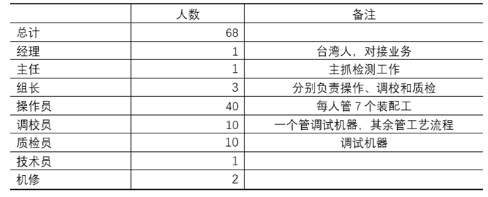

结构与装配部类似。这里主要讲一下普工的情况。操作员、调校员和质检员都是普通。由于采取机器流水线作业检测，操作员毫无技术含量，是重复劳动。因为每批检测的零件大小不一致，因此需要调整机器参数，调校员就是在每次转货的时候校对机器。一般一天转货4-5次，一次要花1小时左右调校。调校完后多数调教员会帮助操作员干活，因为操作员的产量也算他的产量，会影响调校员的月度绩效（最低档和最高档差300元）。

操作员是开机器检查铝片是否有瑕疵，检查完后，通过的就出货，不通过的就报备。操作员主要是女工，年龄在25-40岁之间，多数结婚有小孩。

操作员的工作非常辛苦。由于是两班倒，她们7点半开始上班。早会上组长会点名、安排工作，还会训斥昨天被投诉的人员。开完会后立马开始工作，没有偷懒上厕所的机会。待检查的铝片拉过来后，操作员就将其放在机器待检查区域，机器流水线般不停运转，自动检查并分开良品和不良品，操作员需要将良品取出并封包。一个操作员需要照看3-5台机子。为了工作效率，操作员必须站立工作，在一天之中不断重复几个动作：装片、取片、穿针、装盒子、摆放，一个订单跑完后操作员还需填写报表（良品不良品数量等）并输入电脑。由于是流水线式操作，机器跑起来是固定速度，不装片、片好了不拿，机器都会报警。机器一报警，组长就会跑过来训斥。操作员要是做慢了，组长就会拿月度绩效来威胁。

中午是分批吃饭，一批是11点半，一批是12点15，吃饭时间45分钟。下午2-3点是最困的时候，非常困，非常累。有些其他部门外调的员工，困了就跑厕所蹲着睡觉。但是本部门的员工不敢，困了还得继续干活。

由于全程站立作业，一天下来是腰酸背痛，很多人腿都麻了。

一个工人说，“这里是无尘车间，穿防尘服看不到脸，工作了很长时间人都不认识。我工作了一年，连主管长什么样子都不知道，只能通过衣服的颜色辨别。”

另一个人说，“在这里工作非常压抑，我非常厌恶这份工作。工作的时候，人停下来，空气又不流通，虽然有空调，但整个环境很闷。而且还要上夜班，一个月就要倒班一次。我上夜班时经常睡眠不好。更可恶的是它还轮休。一个部门的人，有人这天休息，有人那天休息，你休息的时候连个朋友都找不到，什么社交活动都没有，毫无个人生活。除了上班吃饭睡觉，真是啥都没了，真正三点一线。一旦上夜班那更是与世隔绝。简直比小厂还黑。”

### 三、工资和福利

以前该厂工资基本按当地最低工资标准，也没有什么福利。2012年该厂发生了一次全厂范围的集体维权，自此后，该厂工资上涨，福利也往上调整。

我们以装配部门为例说明工资情况。

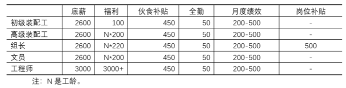

最底层员工如果五天八小时，税前工资合计3400-3700。一个5年工龄的高级装配工，五天八小时税前工资合计4300-4600。文员和高级装配工薪资相当，组长比同工龄的高级装配工略多。工程师薪资明显高于上述人员，一个两年工龄的工程师税前工资在7000左右。

另外，公司为了节省成本：1、所有加班非的基数都是按底薪计算，而不是按真实工资计算。2、公司往往从初级装配工中提拔文员，这样有些文员干着文员的活，却拿着初级装配工的工资。

公司不押工资，一般是每月7号发放工资。公司五险一金都缴纳。但之前的住房公积金缴纳不合法，公司是以当地最低工资为基数缴纳的。有些工人知道厂里面缴纳公积金不合法（很多人不知道），但是即使知道了，也表示无可奈何，“难道你还去投诉啊，你不想要工作了啊”。后来某一天，某离职人员投诉并拿到了补缴的公积金，这个事情慢慢在公司传开。很多人一算，哇，原来厂里面欠了我这么多钱（10年工龄往往差出一万多），于是越来越多的人去投诉公司，最后公司压力太大，把所有人的都补缴了。

### 四、公司其他情况

（一）管理方面

公司管理并不算严苛，没有明文的罚款制度。违规会记过，降福利或奖金等级。比如机器没装好，本次的月度绩效就降低了，但这并不影响下一次。打架、抽烟、偷东西等行为要开除。主任、主管骂人情况不普遍。组长骂人也不多。在装配部门，主管很难给看不惯的职工加产量，因为加产量就涉及到集体都会加，不能针对某一个人。在检测部门，主管倾向在转货调机的时候，把速度加快一些，但也不敢太快。

（二）贪污和盗窃

装配部偷东西很少，不值钱。贪污情况不了解。检测部门是后端，贪污也不多。

贪污的部门主要有两种。一种是涉及采购原材料的部门，领导能从供应商拿回款。另一种是涉及外协件的部门，领导往往在外面开个小厂，让采购部门的人买自己厂的产品。

工人也会从厂里面偷东西，比如偷铜片。现在越来越难了，保安会不定期从出厂人员中抽查，用探测器扫。有听说工人把铁棒放在有金离子的药水里，将金置换出来带走。有工程师偷含有银离子的药水，提取银带走，提取过程其实会产生剧毒的氢氰酸，他要钱不要命，一边开着通风橱一边搞。这种事很快就会被发现，因为厂里面有密集的监控，贵金属管理的控制也很精细。

（三）斗争

2012年有一次大规模集体维权。在此之前福利不高，之后加了福利和底薪。工人团结意识增强。2020年疫情期间有各种各样的小斗争，前段时间补缴公积金就是。装备部的人斗争性最强，因为他们技术强，出去很好找工作，不怕被炒。检测部明显较差，因为可替代性很强，不行就炒了。

（四）工作时间和休息

长白班的，从8点半到7点15。两班倒的，从7点半到7点15。基本都是上六休一，节假日一般正常放假，有些部门也安排加班，但安排三倍的较少，双倍的较多。装配部门无夜班，其他生产部门多数是两班倒。

请假方面，病假事假都好请。病假提前讲一下，事后补病假条即可。事假一般也不为难。由于工人有斗争传统，厂里面整体而言比较守法，一般不敢随意延长工作时间，不会提前开会或者延后下班。

### 五、员工生活

以一个3年工龄员工为例。该员工每月加班60个小时，其中，周一至周五的平时时间加班合计28个小时，四个周六加班合计32个小时。如此，每月能到手4500元左右。以下是该员工的基本花销。

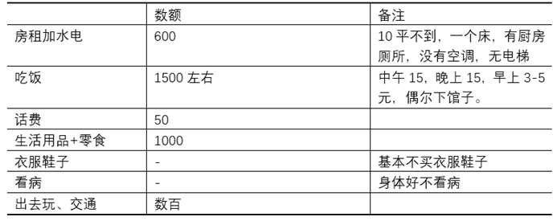

如此一来，该员工每月能攒下不到1000元。如果省吃俭用，可以攒下1500-2000元。该员工以前喜欢去按摩洗脚（一次不到200，一月1-2次）。后来闲花销大就不去了。

该员工表示，他现在下了班就买些东西，回到房间一边吃一边看电视。周末也去同事家做饭吃（多数是单身同事，也有结婚但分居的）。他现在也喜欢去网吧上网，看视频或者打游戏。有时候也会出去周边旅游，节假日或者双休日的时候去，但是这种旅游花销较大，他并不常去。

2018年经济下滑以来，公司取消了之前的住房补贴。今年年终奖更是离谱，最高级别比去年最低还低。以前例行5月涨薪，今年也取消了。该员工说，“其实集团整体层面，效益比去年还好。公司这样做，大家有怨气，但是疫情期间，也没啥好说的。”

### 六、后记

1、这次调研的厂，是工人眼中难得的“好厂”。底薪加福利远高于最低工资，而之所以能做到这一点，一方面是由于该厂是细分行业龙头，有足够的利润涨薪，另一方面是由于2012年工人大规模的集体行动。

2、在这个厂里面，所有人都不占有生产资料，但是不同人群与生产资料的关系明显不同。经理能够控制部门一起事务，调配人财物的使用，主任能够在实际上组织生产，具备一定的人事权和奖金分配权，甚至能以权谋私。组长能够安排工人生产，并一定程度脱离了生产，但他的工资和普工相差无几。工程师工资明显高于普工，但万把块钱在沿海也就过着社畜的生活而已。技术员和文员，都是没有脱离生产的底层劳动者。这一切，使得不同的人群在生产中处于不同的地位，获得不同的收益，因而也具有不同的意识（以后会详细报道）。

3、从两个部门的生产过程可以看出，资本主义体制下，劳动对工人本身仅仅是一种折磨。工人一有机会就会想办法偷懒，因为他能意识到自己的利益和资本是对立的。越是技术性强的工人，越能偷懒，越是可替代性强的工人，越难于偷懒。因此，通过偷懒而进行消极斗争，只适用于一部分工人，对更多工人而言，必须采取更积极的方式才能维护自己的权益。

4、即使这样的厂，一个工人每个月也攒不下什么钱。一年攒钱一万多点，十年也就十万，一场大病就能全部清零。

 

 

第三章 A厂M部门阶级分析（原文为`A厂P部门阶级分析`）
-----------------------

前一篇A厂调研大致描绘了A厂各方面的轮廓，本篇则将介绍一个部门的情况。通过后续进一步的访谈，将以A厂为例更加具体地介绍当前中国产业工人的工作、生活、权益维护等各方面情况。各位读者如想继续了解可以在评论区留言，也欢迎各种不同行业的朋友投稿介绍情况互通有无。唯有通过积累大量的一手信息，广泛地进行调查研究，才能在时代的迷雾中擦亮双眼，不致在意识形态宣传的洪流中随波浮沉。

### 一、部门概况

A厂作为一家拥有相当长历史的大厂，先后涉足了多种领域业务。但公司的核心业务还是技术含量较高、附加值较高的的装备制造，因此不少部门都是负责装备组装的，M部门就是其中较大的一个。

M部门负责装配的设备型号众多，因复杂程度不同价格也有不同，据称便宜的一般一台几十万，最贵的要300万以上。设备订单情况随着市场情况波动较大，市场繁荣的时候每个月要出50-60台，但这种大爆发的情况并不多见，市场萧条时可能每个月只出15-20台。今年的订单情况则属于一般，基本保持每个月25台左右的产量。

因为工资福利在区域内的相对优势，A厂整体的人员流动性比较低，因此多年来一直很少招人，招聘时也有很高的要求。周边电子厂多是简单的流水线作业，招聘时只要认识26个英语字母就可以上岗，基本没什么学历要求；A厂则要求至少中专学历，以M部门为例，哪怕是最基层的装配工也需要先通过专业知识考试（高于70分），然后再由主管、经理逐层面试曾能入职，入职之后至少也需要3个月的培训周期才能独立开展工作，从往年的情况来看，录用率仅有10%-15%左右。

### 二、人员情况

M部门共计84人。其人员结构大致如下：

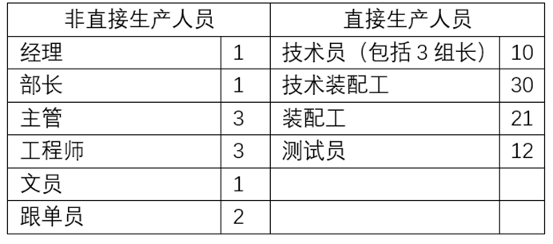

其中经理和部长主要负责对外沟通、上传下达，具体的生产管理则由主管及基层的组长完成，另外还有一些工程师、跟单员和文员作为生产辅助人员。基层的装配工、技术装配工和装配技术员占了部门人员的大多数，是实际负责生产装配的直接人员。

所有人员当中，5年老员工超过80%；男女比例大约为10：1，女工主要负责配料等一些较为轻松的工作。过去公司都是直接招聘正式员工，从最近几年来开始使用派遣工，并主要通过在派遣工转正的形式补充人员（前几年订单多时招聘了一大批派遣工进来，订单减少后则将人员退回派遣公司，40个派遣工中最终有4人转正）。

M部门的最基层员工为装配工，随着工龄增长和工作经验增加，可以通过公司的升职系统逐渐升级为技术装配工、装配技术员，技术员亦有资格升职为工程师，每个阶段均分为初中高三级。作为一家外资企业，A公司有一套严格繁琐的培训考核机制，连最基层的组长都需要每年考试考核上岗。因为手续麻烦，M部门的主管在提名员工升职上并不积极。

### 三、工作情况

M部门的工作内容包括功能模块组装、整机组装和整机测试三大主要部分，前两部分各30人左右，测试部分则有10多人。M部门的工作具有一定的技术门槛，以装配工为例，至少需要了解各种机械知识、特别是要能读懂指导装配的爆炸图；设备又分为很多种，仅仅其中功能模块的组装普遍都需要8-10小时，复杂的甚至需要20-30个小时。

作为复杂程度较高的工业用重型装备，M部门的产品实际订单数量也相对稳定，且利润可观，并不需要在市场上以量取胜。工作性质和市场情况共同决定了M部门的工作无需也不能拆分为普通电子厂流水线式的简单重复劳动，因此在工作时间上M部门的工人们完全不像普通电子厂工人那样被完全绑架在流水线上、成为机器的一部分，而是有比较大的自主权。

活儿是永远干不完的，因为物料源源不断。具体而言，当订单不多时，依旧可以安排工人组装模块和整机，并收入库存备用。但多年下来，在部门工作当中已经基本形成了约定俗成的工作节奏，在文件层面上则体现为IE的标准工时（或“工作效率”），因而部门领导也不会随意增加工作量。只要工人在指定时间内完成了自己负责的任务量（即完成了“工作效率），便不会被无端刁难。

因此在日常工作中，完成工作量时大家都心照不宣，从来都是讲”工作时就好好工作，休息时就好好休息“。做了更多工作除了让自己更累不会有更多好处，只有订单增加时部门才会安排更多的加班。整机装配需要多人配合，而模块装配都是分配到个人，因此负责模块装配的工人在时间支配上有更多的自主权。

现代资本主义的高速发展离不开分工的精细化和简单化，复杂劳动拆分为简单劳动后工人的可替代性也就越来越强，而在这种”精细科学“的指导下工人被剥削的程度也就被不断提高。同样是每天工作8个小时，流水线工人需要一直干个不停，连上厕所的时间都被严格限制；而在M部门，通过各种方式”摸鱼“”划水“”磨洋工“，8小时工作时间内工人的工作时间一般只有5-6个小时。部长及主管一般都很少出自己的办公室，到点就下班，并不关心车间的情况，而组长也对这种状况视若无睹，因为平时他们自己也是一样状态。只要这种情况不被大领导或者来访的客户看到，一般也不会有太大的问题。

如果被资本家们和为数更多的“精神资本家”们了解到这个情况，恐怕要跳起来大叫了，这不正是薛兆丰教授所说的“不是资本剥削劳动力，而是劳动力剥削资本吗”！且不论“剥削”的概念被如何歪曲，我们应当明确的一个基本事实是，即便这些工人每天只工作了5个小时，他们的劳动也创造了远高于他们的工资水平的价值。这一点在设备的价格、公司的利润上可以得到反映，更具体的衡量则可以结合工人们的工资水平来进行。

### 四、工资情况

在中国的制造业，一个普遍的情况是工人“希望”加班，他们在找工作时一般也都先问“这个厂加班多不多”。造成这种现象的原因是过低的工资标准，工人如果不加班挣取加班费连最基本的生活都难以维持。A厂的工资水平虽然相对周边已经算高，但加班工资仍是他们工资的重要组成部分，他们也普遍希望加班多些。

A厂工人的工资由这样几部分构成：

（1）基本工资，大多为2600。工程师、主管及以上会有更高的基本工资，但技术员及以下普遍为2600。新员工入职时基本工资是本地最低工资标准，之后几年中会逐渐提高，直到达到2600的上限。

（2）津贴，随工龄等差异较大，新员工为0，工作15年以上的组长可达4000以上。新员工入职时没有津贴，基本工资涨到2600上限后才开始有津贴。基本工资相同，大家的工资差异主要体现在津贴上。津贴多少主要取决于两个因素：一是工龄，因为每年都会有一次加薪（津贴调整）；二是领导对你的评价，因领导评级不同，有的人可能只加一百多，有的却能加三百多。技术员及以下的津贴标准并没有拉开差距，因此升职与加薪并不存在必然关系，装配工的津贴调整高过技术员也并不少见。

（3）月度绩效。技术员以下分为200/300/400/500四档，技术员200/400/600/800，工程师400/600/800/1000。主管及以上则为季度奖。

（4）全勤奖及其他补贴。全勤奖50；膳食补贴450；住房补贴200，但只有一部分老员工还有（合并入工资中），因为几年前公司已经取消；夜班补贴10/天，仅限于一些上夜班的部门，M部门并无夜班；其他则主要为一些岗位补贴，如组长、接触危化品等岗位会有，但数额一般也不多。

在工人工资中带来最大差异的是津贴部分，根据工龄情况大致划分，5年以下普遍在200-500；5-10年大致在500-1500；10年以上则差异更大些，大致分布在2000-4000。在津贴固定的情况下，还能带来工资变化的就是月度绩效和加班。

在M部门，订单一般的情况下，每月会加班60-80小时（一般平时每天2小时，周六10小时），订单较少时可能每个月只加20-30小时，甚至给一部分工人放长假。在工人中，加班安排为公平起见一般都一样，组长可能会少一点。

工资的不同构成造成了不同地位人员对于加班的不同态度。对于普通装配工尤其是新员工而言，加班工资占到了工资的1/3多，因而对于加班非常看重；主管、组长的津贴已经远远超过了自己的基本工资，加班工资在工资总额中占比不高，因此就没有那么在意加班；而部长及以上则是采用月薪制，他们往往到点下班，多一秒也不肯在公司待，更不要提加班了。

早些年时A公司的工资待遇相对周边有比较强的竞争力，想要入职往往要找人内部推荐。近几年随着中高管理层中有更多大陆人进入（过去经理及以上职位基本为新加坡/台湾人垄断），各种福利补贴都被削减甚至取消、加薪也变慢了，工资待遇的优势逐渐被周边企业追赶上来，在同行业中也不再具备竞争力。在工人声音亦得不到管理层正视的情况下，大家越来越多地选择了用脚投票，M部门仅今年就已经流失了20%的人员，其中的测试组更是走了近2/3，这是前所未有的情况。

### 五、权力与阶级

如前所述，M部门的经理和部长主要负责对外沟通、上传下达，尽管升职、加薪及其他很多内容需要他们审核通过，但由于缺乏对下面情况的了解，部门内部的实际权力掌握在主管层面。

主管的权力主要体现在加薪和月度绩效的评级上。以加薪为例，尽管每年都会加薪，但是如果主管对某人评价不高，持续给的加薪评级都比较低的话，每年的加薪都比别人少个一两百，累积下来就会是相当大的差距。比如M部门有一个一直很受自己主管欣赏的组长，基本每次升职都被最快安排、每次加薪都按最高标准来加，目前津贴已经达到了4500以上。但加薪每年才又一次，主管手中最直接可以拿来威胁工人的是绩效的评级。例如在一次小规模停工后，被视作“带头者”的几个工人下个月的绩效直接被评为了最低等。除了直接利用权力之外，如果主管对一个工人印象不好，也可以用各种间接方式加以排挤，仅仅更加频繁地去“关照”一下车间纪律、看看这个人有没有在玩手机、早会时点名批评等等都会给当事人较大的心理压力，过去M部门一些不被主管待见的工人就是这样被排挤走的。

经理和部长极少下到车间去，与工人接触其实不多。组长一直在车间与其他工人共同工作、长期相处，平时关系就比较好，在很多事情上也能够保持一致立场。比如之前A厂的人密集去投诉公司公积金未足额缴纳，很多都受到了自己组长的鼓励，有些组长就讲道“你们快都去投诉，你们都去了我才好去”。除非组长要传达一些上面的行政任务，否则也很少与工人发生冲突，在传达行政任务时的难处一般也能得到工人的理解。因此相对而言，主管与工人之间的冲突时比较常见的。

本文涉及的所有人员，从法律层面讲，均不占有生产资料。但现实的情况往往相当复杂的，我们需要从生产本身做一些分析。

经理/部长/主任这一级别虽然在名义上并不具有生产资料的所有权，但生产资料可以由他们经手和配置，于是他们实际上就拥有了通过这些生产资料牟取私利（相对于公司的“公”而言）的权力，勾结供应商吃回扣、外发订单至自己名下公司、提前报废公司机器设备等以获得工资外的“隐形收入”都是通过这一权力实现的。从经济上看，他们能获得可观的收益；从日常权益维护上看，他们一般是明确站资方立场。因此，这个意义上，我们可以将他们归之为小资产阶级的上层，他们在资本主义和平发展时期，是异常保守反动的。

主管能在实际上组织生产，拥有生产的组织权，并一定程度拥有收入的分配权（调整工人福利和月度绩效的权力）。从经济上看，收入高于一线工人不少；在权益维护中往往也是墙头草。因此可将其归为小资产阶级，他们是小资产阶级的中层。他们在资本主义和平发展期，一般也是保守的。但他们的地位不如经理稳定，因此在资本主义动荡期更容易跌落下来。

辅助生产的工程师之流，从经济上看，收入高于一线工人，在权益维护中往往也不坚定，但在与生产资料的关系和对剩余价值的占有上，其实与技术员、装配工等在阶级地位上并没有质的差别，因而可归入脑力无产阶级。

技术员、装配工从事一线劳动，是典型的体力无产者。他们工资最低，最没有地位，劳动强度也是这群人种最大的。在A厂历次权益维护中，都是站在最前线的。

得益于较高的文化程度和一定的技术门槛，相比周边企业A厂工人在权益维护的意识和行动上都要先进些。对于这种阶级身份上的差异A厂工人们在感性上有所意识，但在行动上仍然缺乏自觉。过去也有过一些不同规模的停工，但最近几年来基本都局限于少数几个部门。在较低的人员流动性下工人中形成了一些较为稳定的社交圈子，但基本还都局限于本部门。怎样建立相对稳固的广泛联系，这是A厂员工面临的迫切问题。

 

 

第四章 B厂调研
--------------

编者按：这是一位在工厂的工程师写的调研报告，在这份调研中，作者明确指出工程师的升职空间很小，也讲到了作为脑力无产者的工程师在争取权益时不如产线工人有斗争性。在这份调研中，作者还详细描述了工厂的生产情况，具体描述了工厂是怎么压迫和剥削工人，以及工人是怎么一步步变成机器附庸的。同时，在调研的末尾，作者还分析了该厂工人行动意愿与所处行业、工作技术水平以及工厂管理制度之间的关系，这尤其可贵。很多没有进过深入调查研究的朋友，经常想当然的觉得越苦的工人越容易组织起来，这看似成立的逻辑往往与现实不符。本文作者通过调研明确指出，具有一定技术竞争力的工人（因此往往也不是最苦的）更容易组织起来。

### 一、工厂概况

尽管同样处于被剥削的地位，但不同行业的工人在工作时间、劳动强度、技术门槛（同时也是议价能力）以及社会地位等方面都有着相当大的差别。这些客观差别在横向上造成了工人阶级中的一些分化和歧视，例如脑力无产者歧视体力无产者、技工歧视普工、高端服务业工人歧视制造业工人等。这些分化和歧视往往也是各行各业的资产阶级乐于看到并有意维护的。从英国等工人自发运动开始较早的国家来看，很多工人能在本行业内形成联合已经实属不易，而跨行业的联合——迈向真正意义的”工人阶级”则是更加困难的事情。下面我们就以B厂P部门为例来具体做一些介绍。

B厂是J市的龙头企业，主要生产各类电镀产品。该厂历史悠久、资本雄厚，且产品门类齐全，滚镀、挂镀、连续电镀等产品均有生产销售，因此订单情况一直比较稳定。即使是在今年疫情期间也没有受到太大的影响，反而因为5G的更新换代对于各类电子元件市场的拉动而效益更好。电镀产品的附加值普遍不高，多数产品并没有太多技术含量，不少技术设备已经十几年了还在继续沿用，所以在产品定位上主要是以量取胜。

生产流程。电镀产品涉及到前后多个工序，简单而言可分为冲压、电镀、后工序和检查四大部分，冲压和电镀是人数最多的部门，在全厂小2000人中约占3/4。而这两个部门也是工作环境最为恶劣的两个部门：冲压车间内主要是噪音污染，因为带着较厚的隔音耳罩，大家平时交流都是靠吼。

工作条件。在此环境下常年工作，不少工人的听力受损，而这类工伤鉴定并不容易，公司甚至会勾结医院篡改体检报告，该厂数次在明知工人听力受损时，勾结医院瞒报检测结果，让工人继续从事冲压劳动。电镀车间则更加恶劣些，除噪音污染以外，各种强酸、强碱和剧毒化学品的大量使用都会给工人的安全健康带来较大的威胁。尽管工厂也会提供眼镜、口罩、靴子、手套、围裙等护具，但因电镀车间由于工艺原因无法安装空调，夏季时身着护具会很不方便，不少工人并不会规范佩戴，这种无奈之举给大家带来了更多的安全隐患。

工资和工时。但即便在如此恶劣的工作环境下，相对稳定的工资收入仍然保障了该厂人员较低的流动性。老员工普遍较多，工龄5年以上据估计占到80％以上。较大的工作强度和恶劣的工作环境导致女工较少，仅仅在检查等部门有所分布。由于电镀产品以量取胜，工厂内各部门基本都是采取两班倒轮休制（即未必以周六日为休息日）、工人换班休息但机器几乎全年运转。在这种情况下工人的加班普遍较多，平时加周末加班普遍在80小时以上，多者甚至高达150小时，一线工人工资大致在5000-8000范围。工人工资主要由底薪、工龄奖和加班费三部分构成，5年以上老员工中，加班费大概占到总工资的1/4-1/3。

### 二、P部门工程师概况

（一）基本情况

P部门是一个相当庞大的部门，在电镀各部门中负责连续电镀产品，相对其他工艺流程自动化程度更高，因此技术人员的占比也相对更高。在直接人员当中，各类工程师、技术员（包含组长）以及调校员均属于技术人员，占比高达近30%。

从工作职能角度进行区分，P部门可分为生产和工程两部分，各自由1个部长负责。生产部分部长依次下属主管、组长、技术员/调校员或操作员，而工程部分部长则依次下属高级工程师和工程师/技术员。
两部分虽然都有技术员层级，但仍有较大差别。

生产部门人员学历一般是高中或中专，其中的技术员往往由最底层的操作员经调校员经历较长时间（普遍超过10年）升职而来；而工程部门人员学历则更高些，普遍是大专和本科，大专入职便有技术员职称，有一定工作年限还可升职为工程师，本科学历入职则直接给予工程师职称。

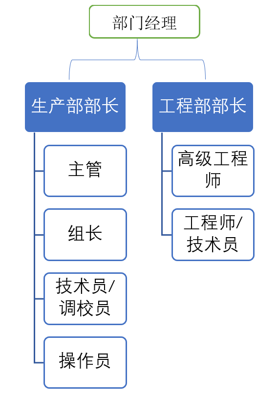

（二）工程师的情况

（1）两种工程师的工作内容和工作强度

工程师队伍主要分为两部分，一部分是直接跟进产线生产、及时进行工艺改善的生产工程师，另一部分是负责技术支援和设备维护的其他工程师。

工作内容的区分造成了二者在工作时间和劳动强度上的巨大差别和不平衡，前者的工作场所主要在车间，也没有自己的固定工位和工作电脑，需要跟着产线其他人员一起两班倒、轮休和高强度加班（因为要跟进产线且人手有限，生产工程师的安排一般都是提前一个月排好，如果临时变动就必须得有其他同事顶岗，所以请假相当困难，加班安排上几无自由）；后者的主要工作场所则在办公室，偶尔出现问题时才会去车间处理一下，固定长白班工作、在加班安排上也比较自由。

生产工程师的工作强度也相当大，绝大部分是体力劳动，需要自己去调整硬件、添加药水等等，此外还要完成软件调试、工作总结等脑力劳动。从工作内容上而言，生产工程师与调校员相当类似，同样都是跟进产线处理突发问题，只是一个负责工艺改善，一个负责模具改善。而且多数情况下劳动强度可能更大，因为每个调校员一般固定负责3－4条产线，生产工程师则要负责多达10条产线。这样的工作内容导致生产工程师的流动性相当大，刚从学校毕业的本科生多数干不到一个月就会走掉，留下来的一般也都是工作1－2年积累些工作经验、攒点钱然后另谋出路。产线上的操作员、调校员对此也早就司空见惯，并总结说，一般能在这边待下去的都是一些家庭条件比较差比较缺钱的大学生，同时私下也会善意劝告他们不要在这里耽误人生。

（2）工程师升职空间

这种说法并非空穴来风，因为在B厂这样的大公司，任凭上级领导再怎么画大饼，升职的希望都很渺茫，历来都是多年的媳妇熬成婆、一个萝卜一个坑，如果前面的位置不空出来，后面的人就一直没有机会。尽管公司希望通过技术、标准文件化等一些措施来保证生产的稳定性，但为了避免新进的人上来挤占自己的机会和资源，老工程师们基本都对自己的经验严格保密，总在提防着怕被新人学了去。B厂有一整套繁琐细致的考核升职系统，名义上的升职讲来也算不少，但除了会增加一点津贴，其实并没有什么质的变化。以工程师队伍为例，多年积累下来，负责管理和监督的人员越来越多了，实际在干活的人其实只有下面那么几个。生产工程师自己也吐槽说“现在TM的基本是一个人干活，五个人在屁股后面监督”、“做的越多，错的越多，刚来的时候我觉得自己要认真负责点，后来才发现意思意思就行了”。

（3）生产工程师和普工的关系及其意识形态

底层的生产工程师除了在津贴上比技术员、调教员高出一点（一些资历较老的技术员、调校员可能工资还高一点），在工作环境和内容上其实同他们完全一样，在日常的社会关系中也和他们打成一片，而明显将自己与那些坐办公室的工程师区分开来。但在真正发生劳资冲突时，仍能看出工程师身份对其阶级立场的保守影响。在之前一次小规模的集体停工中，很多操作员、调校员都积极参与，但工程师却都躲去办公室以划清界限。上级领导对他们敲打时也会刻意强调“你们是工程师，都是受过高等教育的，要有素质，不要和那些产线上的工人搞在一起、无理取闹”，并乐于看到且主动制造一些矛盾来增大生产工程师和其他产线人员的分裂，例如要求生产工程师在一些生产问题上不要向其他人员妥协、坚守一些人为划定的规格标准，或者直接讲“你们看哪个操作工做事不踏实、沟通有困难、喜欢搞事情，都可以跟我讲，我有的是办法把他弄走”。

（三）其他补充情况

在工程师群体中生产工程师处于最底层的位置，身份上也更接近于体力无产者，除了自己的工资之外并没有其他的收入来源，别说肉吃不上，就连汤也难分上一口。而骑在他们头顶的高级工程师、部长和经理却完全不一样。考虑到一年到头产线一直不停转，日常的原材料消耗就已经达到相当庞大的数目，在其中如果能够掌握一点权力，就足以触摸到相当大的利益空间。高级工程师级别在原材料（如化学品、消耗性硬件）以及检测设备的采购上都有一定的话语权，部长和经理更不用提。大家在平常也会听到一些传言，虽然难以了解个中细节，但从前任经理的主动辞职移民海外、前任部长的经济犯罪立案被捕等切实消息也能看得到其中的冰山一角。

窃钩者诛，窃国者侯。工人当中虽然也偶有偷盗原材料的情况发生，但相比于这些身居高位、所谋甚大的大盗也只能算得上是小偷而已了。公司方面对于这样的情况虽然严防死守，但也抵不住巨大利益的驱动，于是所谓腐败与经济犯罪层出不穷、屡禁不止。但谈回“公”与“私”，公司之“公”岂不也是公司董事会、一众高层之“私”吗，这样的腐败问题究其本质不过是资产阶级内部的分赃不均罢了。一切新增价值归根结底来自于工人阶级创造的剩余价值，以公司为形式的资本主义生产与分配其实都是一种更加隐蔽且被合法化的面向工人阶级的偷盗。

### 三、P部门底层员工的工作与生活

（一）P部门各工种主要职责

P部门所有人的共同目标都是为了让产线顺畅地跑起来、稳定运转。

操作工。操作工负责一些最基本的操作，比如挂货、收货、驳片，开机、试机，产线设备的日常检查和保养等等。这些内容听起来也许简单且不多，但一般也需要一两个月的上岗培训才能独立进行操作。而且很多内容每天都要重复多次，毕竟产线跑的速度很快，同一款产品即便订单很多长期在跑，也要定期挂货、收货和驳片；如果遇到很多小批量的产品，就要不断的转货、驳片、试机，工作量要比稳定生产时增加很多。产线设备的日常检查和维护也不是可以轻易逃避的工作，哪怕很多区域已经检查过多次了，但只要出了问题还是会追究操作员的责任，上级领导也会不定期调取各处的摄像头录像来监督操作员的执行情况。由于设备的陈旧老化，火灾风险成为较为频繁出现的安全隐患，设备的更新换代需要巨大成本，而让人多跑几趟还不用加工资显然更合算些，于是这样的压力又继续增加了他们的工作负担。

调教员、技术员和工程师。他们的职责则主要是负责解决转货、试机阶段和生产中途出现的各类问题。其中调校员和部分技术员负责模具相关的问题，而工程师和部分技术员则负责工艺相关的问题，如果转货较少大家都会比较轻松，而转货较多、生产一些较为复杂特殊的产品时则要一直忙个不停，许多问题可能要试机多次才能解决或者勉强过关。这当中也会出现一些责任的推脱、工作中的矛盾，但由于多年的默契配合一般也不至于特别激化，大家日常也都朝夕相处并保持着较好的关系。

（二）劳动环境

恶劣的工作环境对于所有人都是巨大的挑战。

首当其冲的是高温环境，J市地处南方，夏季可以持续半年多，由于电镀产线上很多位置需要使用高温加热，车间就没有办法安装空调。一些位置虽然也有安装电扇，但吹出来的也都是热风，形同虚设。而许多工作都要在产线上、尤其是一些加热区域进行，所以大家基本都有过被汗水浸透的经历，忙碌的时候可能汗水会浸透好几遍，下班时可以看得到工衣上析出的层层盐花。

其次是有毒有害的化学品。这是要格外留意的，各种强酸强碱和剧毒品的使用都要格外小心，但所幸公司一直有强化这方面的安全教育，并给大家配备了手套、眼罩、口罩、围裙等护具，所以这些年来直接因化学品导致的工伤并不多见，但也有听说被碱液灼伤眼球和被硫酸烧伤手部的案例。在安全措施方面，大家普遍都比较关注，可护具的佩戴无疑使得炎热的天气更加难熬，在这种工作环境下大家只能做出两难抉择。

再次是夜班和超长的工作时间。这对于许多人简直是一种煎熬。不停运转的产线绑架了工人们只能跟着它一起运转，在工作时间上几乎没有什么自由支配的空间，连去上个厕所都要特别叮嘱工友先帮忙照看下自己负责的产线，否则出了问题就会是自己的责任。有些工友并不喜欢上夜班，因为每一次转班过来基本都需要一周的时间才能调整好自己的生物钟，刚转班过来时大家个个都是红着眼睛，但也只能强撑着去完成自己逃不掉的任务。

也有些工友会讲自己更喜欢上夜班些，因为组长之外的其他领导都是长白班，夜班的管理也就相对松懈一些，至少忙完了可以好好歇口气，不像白班时只要被领导看到闲着就会挨叼。但夜班的产量要求其实也是和白班一样的，从工作量上来说其实并不更轻松。

由于B厂的订单长期稳定，产品就像怎么也做不完似的。工人们的加班也几乎达到了极限，除了每周休一天，大家每天几乎都要上满12个小时。在人手没有那么充足时，甚至连每周休一天也得不到保证，有些工友可能要连续上十几二十天才能休息一下。由于流水线的工作性质，要求不加班和申请请假也都是极其困难的事情。

（三）工人成了机器的附庸

制造业工友们的886和程序员们的996听起来好像差不多，都是每天上满12个小时，而且工厂里还有加班费可以拿，仿佛工厂里的待遇还要好些似的。但显然没有多少程序员愿意抛弃写字楼的生活来下工厂，我们姑且不谈实际工资水平、年终奖和社会地位这些，同样的工作时间，制造业工人显然有着更大的劳动强度，在自己的工作时间上也完全没有支配的自由，似乎也只是一台不知停歇的机器、流水线的附属物罢了。而他们的不知停歇何不又是一种无奈，因为如果不服从领导、不去加班挣取加班费，仅凭一点点底薪恐怕连一家老小的温饱都难以维持。

产线工人的个人生活几乎被压缩到了极致。加剧这一点的是他们的轮休制度，即出于生产需要大家无法在周末统一休息，而要在一周当中轮着休息。这一点导致了他们的个人生活极其有限、社会关系也非常狭小，几乎陷入了一种与外部社会隔绝的境地。假设你每周还算能幸运地休息一天，但只能休周三，你休息时别的朋友在上班，别人休息时你又在上班。不要说公司外的朋友，就连本部门的同事如果休息不在同一天也难得能够一起聚一下。年轻工人会讲“我其实是不怕苦不怕累的，但这样下去别说找对象了，怕是女生都见不着”，年纪大些的工友则会讲“我们没什么个人生活的，每天其实就跟坐牢差不多，坐牢干的活其实也比我们轻松，至少环境要好吧”。

### 四、日常管理

恶劣的工作环境、超长的工作时间和有限的个人生活对于不少工友而言也还算可以习惯的。他们说，生活就是如此，不习惯也没有办法，特别是自己年纪大了，又没有别的一技之长，出去也难找到一份同等工资的工作。但来自于物的压迫或许是看得到头的，来自于人的压迫却仿佛永无止境。

（一）加速再加速

流水线就是工厂的生命线，伴随着流水线滚滚而下的是工人们的劳动和新增的价值，是财务报表上老板永不满足的利润。所以在车间生产的量化管理当中，最核心的指标就是产量和停机时间。产量越高越好，在保证质量的前提下流水线跑得越快越好，于是从经理到部长到主管再到组长，提高产量的目标被一层层压下来，每个坐办公室的都高喊着“加速，加速！”停机时间当然越短越好，一旦一条产线停下来，动态指示图上的对应图标由绿变红，在办公室遥控的老板就开始皱眉头，时间过长了还要亲自过来了解情况，看看有没有人在偷懒。

B厂的管理一贯采取简单粗暴的作风，往往大领导一句话下来，下面的小领导就会搞点动作以示诚意，完全不管基层员工的感受。最典型的一个例子莫过于“撤凳子”事件，有一天经理来车间巡视，看到许多工人没有那么忙，很多人坐在产线一端的凳子上休息，回去后就跟生产部长讲了这个情况。生产部长如临大敌，第二天就下了命令，要求撤掉一半的凳子，好像大家没地方休息了就有更多的活需要去做似的。

（二）其他情况

B厂的主管掌握着车间内的实质权力，可以安排大家的加班、决定大家的奖金和年终奖评级，因此平时也是和大家直接冲突最多的。但主管以上的部长和经理则会更多地来车间巡视，日常抓生产任务和现场纪律。特别是日本厂出身的新经理更重视工作现场的整洁整顿，桌面上的东西摆放只要不合他的胃口便会被勒令整改，一时间搞得大家苦不堪言。

就主管而言，除了暗中对加班、评比等情况进行操作之外，也会采取一些直接的措施来针对他眼里的“坏员工”，其中最常用的就是调岗和增加工作量。各条电镀产线因设备情况和产品情况的区别往往在劳动强度上也会有所差异，把人调到“烂产线”去成了一种明目张胆的惩罚措施。

### 五、出路何在

面对这样一些不公平的待遇，不同工人的反应程度不同，有些拿出玩命的姿态拒不服从还表示“下班路上你给老子小心点儿的”往往就不再那么多被针对，而那些逆来顺受的听话工人却往往在这种处境中越陷越深，似乎主管已经拿准了你不敢吱声不敢反抗才会这样挑软柿子捏。有些头脑灵活就开始以一种比较消极的方式来“抵抗”，例如并不和主管撕破脸，而是去各种软磨硬泡，说好话、送礼以表现出讨好的姿态，而这似乎也需要较为高超的技巧，多数工人很难学会。

日常的压迫只是预演，在之前发生的小规模集体停工中，出现的情况也是类似的。其中跳的最高、闹得最厉害的很快就被公司以雷霆手段“无条件开除”，说是一分钱都不会赔，但实际上已经私下给了足够的封口费、据说还签了保密协议。而现场参与的其他人则被各种威逼，当时是被威胁停工期间不会给支付工资，事后则纷纷被评最低等奖金。这种杀鸡儆猴无疑也是有效的，斗争很快被平息，敢于出头的人少了，说风凉话的却越来越多。

B厂工人的维权意识和行动意愿仍然有待提高，造成这一点的原因可能是多样的。首先，就行业而言，B厂的工人虽然需要一定的技术水平和较长的培训周期，但B厂的很多产品则属于较小的门类，即便在整个电镀行业可能没有几家同类型的，这就导致许多工人在这里积累的技术经验几乎仅在这里适用，一旦出了厂就很难找到同等工资水平的工作，而且工龄5年以上的老员工占多数，基本都有着较大的生活压力，所以他们考虑自己的工作稳定会更加保守。其次，B公司较为复杂的升职体系和其他措施客观上造成了工人当中的身份差别，成功导致大家被分化较多而难以联合。以电镀产线的调校员为例，他们虽然也都是做了很多年的操作员熬上去的，但是他们意识里一直把自己和操作员严格区分，日常也会对操作员说“你要好好干，东西都学会了，以后我这个位置就是你的”，而其他技术员、工程师虽然平日里也都和大家和和气气、打成一片，但在冲突和斗争中往往会更加明确自己的特殊身份而不会去和底层操作员站在一起。

和J市的其他很多高污染企业一样，B厂的搬迁也只是时间早晚的问题。B厂的工人们虽然也开始有所担忧，但却并不知道自己除了任人宰割外还能够去做些什么。面对公司管理层的种种破坏和分化措施，B厂的工人们一直还没有多少清晰的概念，即便有些工友已经意识到自己只有更广范围地团结起来才有可能争取到自己应得的合法利益，但也觉得在这种氛围之下寸步难行，不仅看不到多少希望反而有很大风险背后挨刀子。然而未来的情况仍是存在不同可能的，当大家发现自己已经无路可退时一定会更多地思考自己的处境和唯一的出路。从意识的觉醒再到行动的联合诚然绝非一蹴而就的事情，哪怕是从失败的教训当中也一定会有不少工友学到宝贵的经验。当今中国的工人阶级仍是一个年轻的阶级，哪怕前途艰险我们仍能看得到那光明的前途。

 

第二部分 中小型企业的脑力无产者
===============================

第五章 在电话销售公司的日子
---------------------------

编者按：这篇文章简要介绍了一个50人规模的电销公司的基本情况，通过这篇文章，我们能大致了解这类大量存在的小型销售公司的问题：工作时间长，压迫严重，违法事项普遍，多数员工的阶级意识尚未觉醒。

服务业员工被成功学洗脑，被鸡汤文荼毒，被消费主义束缚，比制造业工人的意识更差一些，组织性更弱一些，这是普遍存在的现象，因此这类公司员工的阶级意识的觉醒往往会更晚一些。但是，很明显，本文作者拥有清晰的阶级意识，这也说明，即使在这样的行业中，先进无产者也开始逐步出现了。

### 一、基本情况

我是河南人，自小生活在农村，独生子，父母务农。

2013年我大专毕业后，第一份工作是在老家一机械厂做下料工，主要是对钢板进行裁剪、折弯、冲孔。我不满足机械厂两千块的工资，希望能多赚些钱改变家庭的困境。不久后，便辞职转向大城市寻找出路。因听人说销售能赚大钱，就在广州入职了一个电话销售公司。这是一家小公司，在这家公司里面，我深深地体会到了资本对我们的压榨。

这家公司规模40多人，其中老板一人，下设四个业务组，每组设组长一人，负责统筹属下十余人左右。公司的业务非常简单。老板将电话资源分发给各组，各组员拿到名单后拨打电话联系客户，推销产品。组长辅助组员，教导组员销售话术、帮组员进行客户升级维护，活跃气氛等等。

最初到公司工作，还有一些新鲜感，但几天后就陷入了无聊的重复劳动之中。

每天的工作都重复着枯燥的流程。

早上八点半到公司开早会，会上领导对昨天的工作进行奖惩。奖惩简单粗暴，完成任务的直接给钱，没有完成任务的挨批挨吊，甚至还有体罚，比如男生做俯卧撑，女生做上下蹲。网上经常爆出来各种奇葩体罚，比如相互打耳光，学狗爬，这些在这个行业并不少见。

体罚完后，组长例行给大家打鸡血，灌鸡汤。这种东西，最初两次还有些新鲜感，后来除了恶心，实在剩不下什么。

9点钟开始正式工作，工作内容就是打电话联系客户推销产品。打一百个电话，得有九十几个被粗暴地挂断，脆弱的心灵被不断摧残。一上午都在不停地打电话中度过。好不容易熬到十二点，开开心心下班吃午饭，然后是难得的一个半小时的午休。

一点半午休结束，全体员工一起做游戏，或者跳集体舞，这样做是为了给我们醒觉，免得我们偷懒。两点正式开始下午的工作，还是打电话扫客户。重复又重复，枯燥又枯燥。没有任何技术含量，整个人成了工作的附庸。

下午一直要不停地打电话，从两点打到六点，你想想，一天都在打电话，这是一种怎样的折磨。六点吃晚饭，稍事休息后，七点开晚会。晚会上，领导带着我们总结今天的收获，有成绩的分享自己成功的案例，学习交流销售技巧。七点半左右，开始晚上的工作，继续打电话扫客户。晚上九点半完成任务的可以下班，没完成销售任务的加班到11点。

这就是一天的生活，从早上八点半到晚上九点半（甚至11点），除了吃饭、开会以及少量的休息外，全部时间都在打电话。而所有的电话，绝大部分被挂断。无聊、枯燥而折磨人。一天难得有开心的时候，也许最开心的时候，就是下班后，和同事一起去吃个夜宵。

### 二、薪酬情况

在这样枯燥的生活中，我们的薪酬也是少得可怜。我们是底薪加提成，底薪3000，提成是销售业绩的十个点。公司小组长也是底薪加提成，底薪是5000，提成是小组整体业绩的3个点。组长自己也做业务的话，也有自己做业务的10个点提成。

至于加班费，那是传说中的事情，法律上有，现实中无。
除了加班费外，公司还有很多违法的地方。事实上，这样的小公司往往都是这样，违法行为随处可见，我大致列举如下：（1）电话号码来源一般是老板通过某些渠道非法获得。（2）没有与员工签订劳动协议，也没有给员工买社保，一般还会让员工签放弃社保协议。按平均工资4000元/月计算，公司每月每人少交社保就能违法获利800元，50个人就是4万元，一年下来就是48万元。（3）一般会给员工发放现金工资，是为了逃税。（4）普遍存在体罚甚至辱骂员工的现象。（5）辞退员工只需要老板或组长一句话，辞退员工也没有任何补偿，而且辞退之后员工的业绩提成甚至正常工资都不发放。公司通过这种方式，每年不知克扣多少员工的血汗钱。

然而，违法虽然严重，劳资纠纷却并不多，因为在电销行业，员工维权意识普遍不强，一般员工不会跟公司发生什么纠纷。

### 三、初步分析

在公司里面，老板拥有绝对的权威，是我们公司的统治阶级（资产阶级）。组长对上讨好老板，对下压迫员工，薪酬比普通员工高一些，但是也很难买房安家，属于依附于资产阶级的中间阶层，我觉得他们其实也是无产阶级，但是他们的意识却被老板洗脑了。我们这些员工是最底层，往往逆来顺受。员工之间无所谓团结不团结，大部分私下关系还是比较好的，但是没有反抗意识。原因一是行业现状，大家默认的潜规则，二是被这些公司的企业文化洗脑，阶级意识没有觉醒，最大的反抗就是辞职不干。没想过用法律手段维护自己的权利，因为他们做的工作也不是特别光明的工作，电话骚扰，里边的员工自己其实也很反感自己做的工作，但是为了挣个快钱，贪图安逸，不愿意去踏踏实实的赚钱。

像我们这样的员工，每个月省吃俭用，也只能过着最底层的生活。

我算是很好的了，因为我个人做业绩还行，每个月到手有7000多。每个月发了工资之后，我会打回家2000给父母。余下的钱，房租700，日常吃饭900（每天30），抽烟每月花300（每天10元一盒），其他开销几乎没有。因为我比较节俭，还想攒些钱以后过日子。我基本上都是生存必须花销，社交花销非常少，每月也就跟朋友偶尔去搓一顿，花费最多几百块钱。生活用品不常买，一般买的时候也尽量买便宜的，一个月几十块吧。基本上每个月固定支出在4000多块钱（包含给父母的2000）。一年下来，能存四万左右（不包含给父母的）。

像我这样的员工其实不多，一是很多同事收入并不高，基本是底薪，这部分人被辞职或者自己干不下去辞职了，员工流动性特别大，几个月就能换一批新鲜血液。另外很多同事发了工资之后，就会去KTV、酒吧、洗浴中心消费，特别是当月业绩不错的同事。他们有些还会买一些自己喜欢的东西，名牌衣服等等，这样下来，好多同事一年下来存不了多少钱，有的甚至要借钱过年。

这样的小公司在中国大量存在，他们很多游走在灰色地带，穿梭于法律边缘，他们不仅剥削员工的权益，而且也存在欺诈客户的现象。公司给我们灌输狼性文化、消费主义、享乐主义，导致员工为了做业绩不择手段丧失道德感，在普遍竞争中也丧失了权益意识，在发家致富的幻想中变得麻木，在享乐主义的气氛中弄得身无分文，最终的结果就是员工更加依附公司。

 

 

第六章 电话销售公司和我的转变
-----------------------------

编者按：这篇文章第四章的姊妹篇。在这篇文章中，作者更详细地讲述了他在电话公司的经历，他怎么入职，怎么培训，怎么经历低谷，怎么开单，已经怎么被老板忽悠。在这个过程中，我们看到了一个坚韧的劳动者，希望改变自己命运而付出的努力，但是这种努力，在整个资本体系下，更多只是转化为了老板的利润。

在文章的最后，作者回顾了自己思想转变的历程，从相信个人奋斗，到认清资本的面目。这样的劳动者仍然只是极少数，毕竟“光是活着已经让我用尽了全力”。但是，这样的劳动者也越来越多，而作者已经经历的思想历程，也将成为越来越多的劳动者未来将经历的历程。

### 一、面试

2014年我怀揣发家致富的梦想南下广州，经朋友建议找起了电销公司的工作。怀着忐忑的心情我参加了一家电销公司的面试。公司位于一个较繁华的商业区，刚到公司门口就听到了嘈杂的电话声。

做完自我介绍，面试官问了一些简单的问题，在了解我没有销售经历后，面试官又问我能不能吃苦，并且强调销售没有那么光鲜，要想赚钱就得吃苦。我说，“我不怕苦我怕穷”。

面试官对我的回答很满意，告诉我“销售就是多劳多得，做的好的月入三四万很轻松，如果运气好碰到一个大客户，那就上不封顶了。之前一个新员工，刚来公司不到一个月就碰到一个大客户，当月提成20多万”，为了增加可信度，面试官话锋一转，“当然运气这个事不靠谱，我们说正常情况下，做的好的又肯努力的一个月三四万，如果你正常月收入三四万，哪天运气来了碰到个大客户，那就翻身了。”

当天的面试我聊得很好，我以为是面试官赏识我，后来才知道公司招聘销售几乎来者不拒。而且与其说面试官在考核你，还不如说面试官在诱导你。他们在面试中会使用各种销售技巧，比如听闻我希望赚钱，那么他们就会给我吹嘘做销售一个月能赚三四万。他们一般的技巧就是抬价之后再打折：第一步，他们会说一个大的数额，比如某个幸运儿赚了几十万，引起你极大的兴趣。第二步，他们会否定这个数额，“不是谁都能赚几十万，这个要靠运气。”第三步，他们会在几十万的基础上打折，给你一个足够心动的数额。比如他们会说，“但是，一般情况下干得好每个月三四万没问题。”如此一来，你自己通过对比，就觉得三四万还是可信的，而实际上大部分销售员保持月入过万都难。

### 二、入职

面试的次日，我怀着满腔的期待正式入职，幻想着能像幸运儿一样撞到一个大客户，一下子翻身农奴把歌唱。

这个公司有一百多平，五十多个业务员密密麻麻地呆在卡座上。他们带着耳机，在自己的工位上，或是站着，或是坐着，或是蹲着，一刻不停地打着电话。

公司有四个业务组，每个业务组有一个组长，我被安排在二组。我旁边是一个胖胖的老员工，他一上午都在联系老客户，跟老客户天南地北的聊着天。

上午有好几个业务员出单。每当有人做出了业绩，他们组长就会在业务厅高喊：“恭喜XX组员工XX，达成交易XX元！大家一起恭喜！”这个时候整个业务厅所有的人都会热烈鼓掌，对做出业绩的员工表示祝贺。掌声通过电话传递给客户，多数客户会好奇，你们那里怎么那么热闹啊？业务员就会用非常兴奋的语气跟客户说：“XX姐/哥，刚才我们一个客户下单了，下了XX元。。。。”这样就将交易的喜悦传递给客户，同时也利用羊群效应逼单客户，提高成交率。后来经过培训后我才知道，业务员一定要用激动、兴奋的语气，让客户感受到这种氛围，让客户自己感觉不下单好像吃了大亏一样。

当时我还是新人，这种热烈气氛无疑也感染到我，恨不得我就是做出业绩的那个人，被人大声的叫出名字，喊出业绩。

下午四点多，组长抽出时间对我进行了第一次入职培训。培训基本就是话术介绍和灌鸡汤。培训之后组长将话术本子交给我，让我熟悉话术之后跟他申请电话号码，开始打电话。

### 三、第一次打电话

第一次电话任务有300个。打电话之前，尽管我有了思想准备，但是临到关头还是非常的紧张。手几乎颤抖地点下了第一个电话号码，刚嘟嘟了两秒钟，自己就给挂掉了。第二个电话鼓足了勇气自己没有挂，一直到60秒结束，没有接通，心理顿时一阵轻松，有点庆幸这个电话没有接通。

在这样紧张的状态下，我用了一天时间打完了300个电话，除了自己挂的几个外，大部分没有接通，接通后对方立马挂掉的又占了相当部分，真正能听我把话说完的也就不到二十个，而这些人也多是礼貌的拒绝了我。

300个电话打完我一无所获，但自己还是按业务流程对客户进行了分类，以便后续开展工作（一般分成ABCD四类：D类就是没有接听或者刚接听就挂掉的，C类是愿意聊的，但是没有多少意向的，B类是有意向的，但是还有顾虑的，A类是成交的客户）。

组长适时出现，帮我总结经验，并且给我打气，“没事，都是正常现象，新人都会有这段经历，害怕打电话，打电话结巴，脑袋一片空白……电话对面的人又看不到你，又不能把你怎么着，没必要害怕……脸皮要厚起来，我们这行‘脸皮厚，吃个够，脸皮薄，吃不着’。你要像这样，把面子装进口袋里。”组长边说话边做手抹脸装口袋的动作。完了组长还鼓励我，“老员工每天起码打500个电话，你才打多少，没事，加油。要突破自己，现在是积累的时候，学习上要急，工作上要稳扎稳打。”

组长及时的心理辅导，让我又重拾了信心。对啊，反正隔着电话，你又不能把我怎么着，又掉不了一块肉，万一成交了就是实打实的提成。

### 四、低谷

接下来一段时间，我开始内练话术，外练脸皮，但是收效还是很小。我每天打几百个电话，但是每一个电话几乎都是一次自我摧残，特别是遇到破口大骂的，当时都有点自闭了。但是一方面组长会及时做心理辅导，另一方面每天早会看到做得好的人拿到现金奖励，我又觉得还是自己不够努力，要加油。

慢慢地一个月了，我一无所获。一天，组长找我谈话，“按照规定，新人一个月不出业绩就要被淘汰了，但是我感觉你做事的态度很好，打电话也努力，我给老板保证了，再给你宽限两周，如果这两周哪怕你开出一个小单，我就有理由留下你。为了保你，我被老板狠狠地批了一顿，我是顶了很大压力的，你不要让我失望，明白吗？”

当时组长的话对我是一个重重的打击，但又让我感动，我跟组长保证，我如果两周内还不出业绩，我自动离职。

哎，那时候毕竟还是年轻。后来才知道，公司想开除人又不想引起反抗，一般就会来这招。你如果被逼做出了业绩当然好，如果没出单那就顺势开除你，让你毫无怨言。

### 五、出单

接下来两周，我每天下班之后反复听别人成功案例的电话录音，把几乎所有时间都投入到工作中了。

时间一点点过去，到了第十四天，我还没有出业绩，我很着急，这是我最后的期限，再不出业绩我就要离开了，一无所获的离开了。

当天晚上九点多，我拨打电话出去。嘟嘟嘟。。。。。。。漫长的嘟嘟声中电话接通了。

“喂？”

“晚上好先生！我是XX公司的小李，有没有了解过。。。。”我重复了千百遍的开场白，根本不需要再看着稿子念了脱口而出。

“谢谢，不要！”

“先生，我们公司的这个新产品有XXX的好处。。。。”

“谢谢，不要！”

一般往常到这里，我就会说：“那好，打扰您了，祝您生活愉快！”而那天我心里想着反正也出不了业绩了，我就讲话术一个一个挨着说，走之前也让我说个痛快。

“先生，我们的产品真的很适合你。。。。。”

“谢谢，不要！”

“先生，您知道。。。。”

“谢谢，不要！”

。。。。。。。

“先生。。。。”继续话术输出。

“谢谢，不要！”

我也不知道我说了多少，客户始终一句话“谢谢，不要！”，但是不知道什么原因这个客户没有挂电话。说着说着我也想放弃了，我也感觉心累了。最后我跟客户说：“好的，先生，谢谢您没有挂掉我的电话，这可能是我干这一行业最后一天了，因为我入这一行一个半月了，没有出业绩，今天是最后一天了，我不是在卖惨，也不想给您推什么东西了，我这一个月很压抑，每天要打几百个电话，每通电话都被客户拒绝，有的甚至破口大骂，每个电话都让我心里备受摧残，您可以当一个听众，听一听我的故事吗？”

“你说说看。”客户终于换了一个话，让我备受感动。

“我其实从小性格很内向，不爱说话。。。。。。。”我跟他分享了我从小到大的经历，我跟父母和朋友之间的故事，出来工作之后的辛酸，家里的困境。。。。我当时就想发泄下压抑良久的心情。最后我说：“先生非常感谢您听我把话说完，祝您生活愉快，我准备挂电话了”。

“怎么下单？”

“什么？”我当时有点懵逼。

“你不想做业绩了吗？那就算了”

“没。。没，我只是一时没反应过来，我现在教您下单。。。。”

于是我第一单就这样诞生了，在最后期限的那天晚上。

“恭喜二组员工小李，成功开单20000元，大家一起恭喜！”我们组长高亢的声音响彻业务大厅，随后大家鼓掌祝贺我的第一单。当时心里挺复杂，没有多少的兴奋感，而且有点蒙，感觉有点庆幸，同时也因为第一单的成交，自己对销售更加的明白了一些什么。

第二天早会，公司奖励了我一百元的开单奖励，并让我做分享。

我说：“其实这次能开单最大的感受是自己运气好，碰到了一个好客户，硬要我说分享一点经验的话，我认为第一点是不要自我放弃，第二点我认为是讲故事，最后我几乎放弃了，我就跟客户讲我自己的故事，可能是我自己的故事，我讲的语气、语速、情感都是真实的，客户也感受到了我确实讲的是自己真实的故事，所以客户被我的真诚和我的故事打动了，才下的单。我要分享的就这两点了。另外要感谢我们组长对我的帮助和支持，也谢谢公司给我提供的平台，和对我一个销售小白的包容。谢谢大家”

我分享完之后，老板总结发言：“小李刚才讲的很好，搞客户就不要轻言放弃，客户没挂电话，自己着急挂了，怎么搞业绩？狼行千里吃肉，狗行千里吃屎，做业务就要有狼性，我们是来吃肉的，不是来吃屎的，看到肉就要咬着不放，没有狼性，肉就没得吃，最后屎都没得吃。我以前搞业绩的时候，为了成交一个单子，天天缠着客户，就这样客户被我缠了三个月，最后跟我说，我太能缠人了，就成交了。有些老员工，现在有点骄傲自满了，取得了一点业绩就不好好搞了，就没狼性了。你那点业绩算什么，一辈子也买不起一套房子，没有狼性就只能吃屎，狼性就是不满足，要吃不够。大家都要有狼性，我这里有大把的钱，就看你们有没有本事拿了！”

### 六、看破

就这样我慢慢地适应了每天打电话的日子，每天都要不停地打电话，联系客户，或者扫电话，我的业绩也慢慢稳定的下来，后来我仔细的算了一下，公司不包吃住，我能存下来的钱其实跟工厂打工一样的，唯一一点可能办公室白领似乎比工厂打工仔好听一点。时间久了，也发现，其实高薪没有那么多，每个月可能只有一两个人能拿到三四万的工资，一年中有个别人有运气当月提成破十万。

大部分人月收入不过万，而每天工作要起码十三个小时，这远远超过劳动法的规定。

在这样的环境下，人员流动性非常大，新人换了一茬又一茬，我来公司三个月时间就算老人了，来公司半年后，老面孔一个手就能数的过来。而公司也就是靠这种方式强迫我们不断加班。

有一次我接到了一个大单子，这个单子如果按照奖金的要求起码要给我发2000的奖金，结果只给我发了1000，提成起码要给我发20万以上，结果老板说最后只给我发了七万，说没有这个平台我也不会赚到这些钱，这次运气好，有了这个大单子，不能一下子给你，你也要懂得回报公司，如果以后你能经常做出这样的成绩，我给你按百分之20提成也没问题。

我本来业绩还不错，老板承诺干到过年给我发年终奖，结果年终的时候跟我说，过完年回来给我发，过完年又说拖到五月份发。这件事搞得我很窝火，做业绩动力也不足了。到五月份，跟老板说年终奖的事，老板说：“你看看你，现在干的这么差，还好意思要年终奖，你脑子怎么想的？”

老板一次次欺骗让我彻底失望，所谓狼性不过是违法的借口，所谓吃肉不过是他这只狼在吃我们这些小绵羊的肉。

这件事之后，我离职了。后面几年兜兜转转一直做销售，由电销转为网销，总的销售技巧没变，还能一直混饭吃。

我28岁那年，从一家销售公司辞职找工作，看到招聘要求一般都是18-28岁，我突然意识到我老了，我即将因为年龄被淘汰了，这一刻我的心里真的翻起了浪涛，这种心情很复杂。

回想起这几年干销售的经历，这么多年来，我们这些销售为了业绩欺骗客户、骚扰客户的事，真是没少干。但是即使这样，身边有哪一位业务员真真的靠销售实现了财务自由？没有一个。反而是老板养起了小三，给小三买房又买车，我们业务员辛辛苦苦，还不如一个小三。真正赚钱的还是老板，老板不可能让你真的财务自由，让你财务自由了，你还愿意辛辛苦苦工作吗？我开始回忆起自己上学读过，但已经遗忘很久的马哲和毛选。资本家依然是资本家，他不会放弃剥削员工的机会。当我的青春被榨干后，他就会无情地把我抛弃。

现在我彻底离开了销售公司，踏踏实实的找了一份工程类工作。但是，销售的资本在压迫人，工程的资本就不会吗？销售的资本让我为了利润欺骗客户，工程的资本就不会吗？这个资本的世界就是这样，换了地方，换了工作，不过又是一个新的轮回。

### 七、回顾

我虽然出生在贫困的家庭，但很长一段时间内，我都相信努力能改变自身的命运。我小时候喜欢儒家文化，颜回安贫乐道，这对我影响很大。

在高中时期，我受网络小说影响比较大，小说里面的各种主角，对个人享乐也不在乎，过着苦行僧一般的日子，通过个人奋斗改变了自身命运。

工作之后，在很长的一段时间内，我都认为我当前的处境，是因为自身的原因造成的。比如我以前成绩很好，但是高中和班主任闹矛盾，导致我厌学，从而影响了高考。我时常在想，如果我以前有现在的阅历，这样的错误完全可以避免，人生或许不一样。即使是现在，我也认为造成今天的困境是因为我个人的不努力，只不过，看事情的维度更多，分析也更立体了。

我并不否认个人努力可以改变命运，但是对于家庭贫困的人来说，他要付出更多的努力，而改变命运的概览也会更小一些。机会可能就那么一两次，不允许你有任何闪失，不然失去了就失去了。而家庭条件好的，可以失败一次又一次，他们试错的机会更多。对于底层人来说，通过教育上大学的几率是不公平的，因此改变自身处境会很难。

不仅是学习，工作也是这样。我体会最大的就是在社会上翻身很难，你所有的努力创造的价值，大部分被资本家拿去了，你越努力，资本家越富有，但是生活逼迫着你必须努力，不然你就没有收入，没办法正常的生活。也就是说，工作上的努力，只是让你解决温饱问题，却改变不了命运。

还有教育和医疗，也许它维系了社会最底层的稳定，但它无疑造成了更大的阶层固化。教育和医疗太不平等了，但它们又是如此重要，一个关乎着下一代的希望，一个关乎着现实的幸福。很多贫苦人家因为贫穷不能也不敢接受教育，而一旦这样的家庭出现一个重病号，整个家就轰然倒塌。近年来父亲身体不好，我常常赔父亲看病。在医院，我见过太多辛酸的事情，穷人生病看不起，有些人没钱了就回家等死。有一次我在医院一楼抓药，听见嘭的一声响，我扭头一看，一个女士跳楼自杀了，离我也就十多米远。后来打听到，这个女士才20多岁，有一个不到一岁的小孩，她自己患上了尿毒症，为了不拖累家人，自杀了。

我应该说是比较坚强的，很小的时候，父母下地忙农活，我还没灶台高，就支着板凳给父母做饭。每年的暑假我都会帮忙家里做农活。但即使这样，改变命运也太难了。

我现在看很多短视频，真是成年人的崩溃只在一瞬间。我看不得这样的视频，情感脆弱了，容易流泪。而处于社会底层的人，太多太多，加上我自身也是社会底层，所以我对这个群体天然的有感情。

当我经历了很多事情之后，再次重读毛选，重新认识马克思，我才真正体会到他们的伟大。

我现在的思想发生了明显的变化，不再那么相信个人斗争以及资本家的那些鬼话。我的思想的变化，我归为两个方面，一个是社会的毒打，一个是自身的学习。这两者结合，让我的思想转向无产阶级。当然我现在还不是一个战士，我现在只是无产阶级的一员，我的思想认识还远远不够，因为光是活着已经让我用尽了全力。

我感到迷茫，但是我不会停止思考。打工人的出路到底在哪里？我在寻找，这是我除了工作外思考得最多的事情。

 

第七章 一家小型游戏公司的情况
-----------------------------

编者按：在这篇文章中，作者描述了一个典型的小型互联网公司的情况，从中可以看到，这种小型互联网公司多数从业人员工资非常低，甚至并不比体力无产者高多少。他们的工作时间很长，工作强度并不小，他们受到资本的压迫是很严重的。这样的公司，通常不仅没有加班费，且社保和公积金缴纳不规范，他们比垄断资本的压迫更重。在资本的压迫下，核心技术人员更容易妥协，而底层员工却能在一定条件下团结起来维护权益。作者在文章的末尾描述了一次小的维权，维权虽然失败了，但作者却从中看到了更多的含义，“以前唯唯诺诺的脑力无产者，居然敢集合起来抗争了，这表明脑力工作者阶级意识开始在逐步觉醒。”

### 一、 基本情况 

D先生（以下简称为D）是一名杭州的游戏产业工人，大专学历。父母早年来到杭州发展。D毕业后在两家游戏公司呆过，工龄加起来大概有2年左右（第一家公司加上毕业实习的时间加起来9个月，第二家公司大概一年两个月）。

杭州Z游戏公司（以下简称为Z公司）是D就职的第一家公司。该公司是杭州的一家中小型手游研发公司，旗下已上线游戏有一款二次元手游。D在就职期间担任文案策划一职。下面大致描述一下Z公司情况（数据不具有时效性，仅供参考）。

（一）学历和流动性

Z公司员工最低文凭是大专，男女比例大致在四比一以上，女性员工大多集中在运营、人事部门工作。员工以青年为主，基本上没有三十岁以上的员工。

公司长时间没有盈利从而导致薪酬很低，管理混乱、加班频繁且工作多为重复性工作导致员工没有成长，这些问题导致了Z公司比其他游戏血汗工厂还要糟糕，也造成了员工巨大的流动性。除了策划、程序的某几个重要岗位以及高管外，员工大多只会在公司里呆一年甚至更短，呆一年以上的员工都很少。

（二）部门结构和薪酬等级

公司人员约30人，有两位高管，分管五大部门，基本结构为：策划、美术、程序（技术）、运营和人事部门。

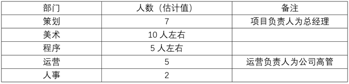

Z公司没有具体的职称等级，每个部门有一到两位组长组织生产（但没有决策权），组长一般是熟练或是高技术员工（例如制作底层代码的程序员与高级策划），在工资待遇上会比员工更高。组织上面是项目负责人，由公司总经理直接担任。

Z公司员工的工资与级别和工作内容相关。通常来讲，相同级别工资从高到低排序为：程序组、美术组、策划组、运营组以及人事组（这一点与大部分游戏公司是一样的）。

另一方面，由于高工作压力导致的人员高流动性，除了一些技术水平高的老员工外，大部分岗位都是刚入职的新员工或是实习生。这导致大部分员工工资差距其实不大，并且相比于大型游戏企业员工工资而言，有较大的差距。闲聊中，D得知自己策划组的组长（不是负责人）工资在五千左右，仅比自己高了两千左右（D的工资是3000，这是包括社保的）。而与自己同一个部门的同事工资差距也和自己仅有一千左右的差距。

### 二、部门生产情况

在生产方式上，各个生产部门大体类似——使用公司提供的电脑产出价值。而以此细分则可以分为两大类，即直接产出游戏内容的，例如策划组、程序组、美术组；以及为游戏研发与维护提供间接支持的人事组、运营组。

在职权上，无论是组长还是普通员工，都没有决策权。关于游戏制作生产方面的决策均由总经理负责；关于公司人事与其他杂务均由运营负责人分管。组长们的工作仅仅是对于一些在工作中遇到的困难问题进行答疑，并监督组员进度而已。由于游戏研发公司的特殊性，包括高管在内的所有公司成员或多或少的都会参与到直接生产中去。

下面以策划组为例，讲一下大致情况。

（一）基本情况

策划组共计7名策划。上午九点十五上班（允许迟到十五分钟左右），下午七点下班。在明面上施行做五休二工作制。

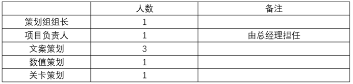

策划组均为正式合同工（D补充说似乎全公司的合同全签的是五年合同）。所有员工均来自全国的大小城市，本地居民只有D一个。

项目负责人（即总经理）负责整个游戏的制作规划。为方便监督员工，总经理常与其他策划混坐在一起工作。总经理经常加班加通宵，第二天却能够正常上班。他在公司里几乎没有什么社交活动，除项目外很少与人沟通。

策划组组长负责对一些游戏关键系统提供方案，同时负责在其他人对接工作时提供帮助并对疑难点进行解答。

文案、数值、关卡策划各自负责各自工作范围内的工作内容，并且需要向其他两个制作部门提交制作方案并与其进行沟通。

从是否脱离具体生产来看，所有的策划组的员工都会参与工作，但项目负责人所干的第一线生产工作会更少一些；其余组长、普通策划在工作内容上是高度相似的。

（二）具体工作内容和劳动情况

策划年龄均在30岁以下，6男1女，均未婚。策划部分为三个子类：文案策划、数值策划、关卡策划。

就劳动环境而言，公司是常见的白领办公室——有空调、有联排的办公桌。公司没有工位之间的隔板、每个人桌子旁有一个放东西的三联柜，以及生产必备的电脑一台。D还特意提到他任职期间公司进行了一次搬迁，搬迁后的办公室里贴满了“奋斗逼”风格的标语与贴纸。

一个具体的生产过程如下：先由策划组开会决定任务内容，然后由组长与负责人商议决定人手。相应员工完成任务后交由组长与负责人（如果有必要的话）检查，通过的话就代表任务完成。

同时，还有一种生产方式为迭代。迭代的意思是对游戏中原有的内容进行修改，用新的内容替代旧的内容。由于负责人与各个部门令人绝望的沟通效率与水平，迭代类的生产方式经常出现，并且会出现单个内容短时间内多次不间断连续迭代的情况。这让大部分员工都对迭代深恶痛绝。

所有策划在内容制作上都会受到很大的限制。这一点在商业化的手游与端游上是通常状态。类似于记者不得不写自己都不信的稿件一样，策划经常不得不策划一下自己非常厌恶的游戏。在高强度工作与不人道的管理下，实际上没有员工会有什么创作欲望与表达欲，他们只是资本驱使下行走的工具，他们只想赶紧下班回家休息。至于自己做了什么，会不会被玩家骂，那更是顾不上了。

（三）工作时间

策划组和其他组作息保持一致，都是明面上的朝九晚七，做五休二。但是经常会有例外，我举几种主要的例外情况：（1）有急活必须加班。（2）周二基本会加班。公司每周二都要对游戏封包测试，策划组必须陪同程序组完成封包。（3）周三基本会加班。周三要开策划周会，周会通常在7点钟饭后开始，一直到凌晨12点才结束。有一次D问经理，为什么不在上班开策划会，经理表示这样会占用工作时间，并且说，“你到外面看看，没有公司是在正常工作时间内开会的。”（4）每两周会加一次周末。策划组每隔一周就需要到公司玩游戏搞头脑风暴。这其实就是大小周工作制。

另外，由于本身管理混乱，公司的各种工作协同软件非但没有帮助员工们提升效率，反而增加了工作复杂性，导致工作时长被再次延长（有些组工作时间更长，比如运营组。由于运营工作只要有一台电脑就能完成，因此运营组常常会被经理在非工作时间委派工作，哪怕在家里也是如此）。

从上面可以看出，Z公司的加班很多。但是和大部分公司一样，Z公司没有任何加班工资。

假定周二周三合计加班7小时，周末隔周加班8小时，加上偶发性急活，每月加班时间大致为50小时。如此一来，对一个工资为5000元的员工，公司每月仅加班费就少支付2400元，一年就少支付28800元。如果公司按30人计，仅加班费就克扣了86.4万元，而这些都成了老板的利润。

（四）摸鱼

在这样低工资、高工时的压迫下，员工不可能乖乖任打，但他们又还不能团结起来抗争，因此摸鱼式地消极怠工成了员工主要的反抗方式。员工有多种方法偷懒，常见的摸鱼有如下方式：（1）上班玩手机；（2）看电脑视频、看小说或是浏览其他的内容（这种偷懒方式不适用于坐在负责人或经理附近的员工，因为电脑屏幕难以掩盖）；（3）所谓带薪拉屎，即偷懒上厕所；（4）抽烟。

在谈及偷懒时，大部分员工都有一种复杂的态度。一方面，偷懒可以提供很好的精神放松；但另一方面，偷懒完不成任务，很可能被留下来加班。这意味着偷懒实质上无法减少自己的工作时间，甚至会拖延自己的下班时间。但是不论如何，没有人会对偷懒有愧疚之情，也就是说所有人都能模糊地感受到自己和资本的对立。

但是，绩点与网络协同软件的引进大大加强了企业的管控能力。让以偷懒而进行消极斗争的方式变得越来越难。联系近些年以来物联网概念的提出与推广，新时代的劳动者恐怕将体会到和前辈比更为严峻的斗争环境。

### 三、其他情况

（一）发放工资情况

Z公司的工资有如下特点：（1）由于人员流动性大，公司中有不少员工领的是实习工资或是试用期工资。公司往往会招实习生，并在实习结束前将其逼走，以此节省成本；（2）公司仅仅缴纳三险一金，且以最低标准缴纳员工社保。（3）Z公司在入职后会押一个月工资，等到员工离职时再发放。

对于违法缴纳社保与公积金这一点上，并没有员工表达过异议。

（二）管理方面

公司在出勤方面管理允许迟到十五分钟左右，但一旦超出十五分钟就要受到惩罚——为同组所有员工购买奶茶。

管理人员一般不会或者说很少骂人，但他们普遍会摆出一副漠不关心的表情。他们不会关注员工的想法、不会重视员工的建议也不会尝试对员工进行更为人性化的管理。

基层管理权力不大，主要是在安排工作上有一定权限。某些基层管理（小组长）对组员比较苛刻，如果谁违背他，就会受到刁难。以美术组长为例，有员工和他有矛盾，他就会加大该员工的工作量，在验收时也会挑刺，说些难听的话。另外，由于项目负责人本身糟糕的专业水平与沟通能力，所有员工在不被刻意刁难的情况下，同样会收到大量难以忍受的工作内容。

四、初步分析

（一）基本分析

Z公司是一家典型的小型互联网游戏公司，也是一家典型的“血汗工厂”。由于混乱的管理以及高层有限的技术水平，Z公司甚至在诸多血汗工厂中都属于非常糟糕的那种。另外，由于公司游戏一直处于研发阶段而没能盈利，薪资待遇在业界也属于较低水平。

Z公司的所有生产资料由各个出资方按照比例占有（总经理、经理、投资商）。在生产上，所有人都参与了第一线生产，但比例有所不同，这也是小型互联网企业的一个常见的特征。

从策划组生产过程而言，在资本主义与绩点化管理下，劳动变成了一种惩罚与折磨，而非对自我价值的实现。同样的，在资本主义体制下，类似游戏、影视等文创类工作也很难调动劳动者的创作欲望与主观能动性。管理者更多的将员工视作工具与机器，让其重复进行机械化劳动并漠视员工的意见。

新技术与新生产方式被资本绑架，并没有造福人类，反而给无产阶级带来了更多的苦难。如果无产者本身不去改变这个现状，那么菲利普·k·迪克与威廉·吉布森笔下那个“他想象一辈子都替一家大公司打工的生活。公司宿舍，公司赞美诗，公司葬礼”的赛博社会雏形，就会如一台崭新的CRT显示器一样，用着低频的扫描线，一帧一帧地向我们昭示着它的到来。它将伸展它那丑陋的，像素化的身躯，将我们吞没在一片绝望的黑暗之中。

但是，无产者已经开始尝试改变现状了。

（二）阶级分析

公司是一个小社会，这个社会里面也有统治者和被统治者。

公司的两名高管是统治阶级。他们掌握公司的生产资料，控制公司的生产运营，享受公司可能带来的利润。一些与高管有私人关系的员工则充当了“统治阶级的狗腿子”的角色，与高管一起构成了公司的核心层。

核心程序、核心策划人员，属于维系公司的核心员工，他们构成了公司的中间派。他们虽然也饱受工作时长与非人道管理之苦，但由于公司支付了高薪，他们更多的选择去维持现状，并不愿意参加斗争。

普通员工以及普通的组长（和高管没有私人关系的）是被统治阶级，他们的斗争性是最强的。

在D离职后不久，公司就发生过一次大规模维权活动。起因是公司延长工作时间，并试图严格对美术组的管理（之前管理比较宽松）。这场斗争中美术组的斗争性较强，因为美术岗属于技术岗位，出去容易找工作。美术组在斗争中甚至有更为激进的行动（例如与美术组组长发生直接的肢体冲突）。

这次激进斗争的时间正好在996.icu事件前后，这一点非常值得研究。

这次斗争中，积极分子先是私下建立QQ或微信群串联，其后集体与老板对峙，用集体辞职为筹码与公司谈判。然而，公司高层通过“在谈判上与员工挨个单独谈判，挽留优待高价值员工，集中清理闹事的积极分子，分化瓦解斗争员工“的方式瓦解了斗争。参加斗争的多是基层员工，而前述核心员工参与不多，甚至从某种程度上来说，这些中间派不愿意与普通员工团结，间接导致了维权斗争被分化瓦解。

谈到这次斗争，D认为斗争虽然失败了，但表明了一种趋势。以前唯唯诺诺的脑力无产者，居然敢集合起来抗争了，这表明脑力工作者阶级意识开始在逐步觉醒。

 

 

第八章 某二线城市餐饮公司调研
-----------------------------

编者按：这篇文章，作者描述了某连锁餐饮公司的基本情况。这家餐饮公司直营与加盟门店合计近百家，是一家颇有规模的餐饮企业。从作者的描述中我们可以看到，这家公司上至总监、下至员工，都在一种高压的环境下工作。员工薪资不高，动辄罚款（文中描述：总部每迟到1分钟扣10块，着装不得体扣50块）。与这种高压环境对应的是，公司存在大量的违法行为，比如缴纳社保和公积金违法，不支付加班费，等等。

这造成员工对工作的极端厌恶，因此员工的流动性很强。为了缓和公司内部的阶级矛盾，人事等部门想尽办法搞团建、搞感恩教育，寄望于通过洗脑的方式维持员工的工作热情。然而，现实的毒打远远比口头的宣传更能教育人。

雇佣劳动者对资本的认识是一个由表及里的过程。从文章中我们可以看到，单个资本的谎言已经不管用了。但是，认识单个资本的压迫远远不够。现实的生活必然会让更多的劳动者认识到，不是某一个资本在压迫他，压迫他的是资本本身。而这又会构成劳动者思想进一步前进的桥梁。

### 一、公司概况

始建于2010年的J公司是一家私营餐饮公司，主营西式快餐，目前旗下拥有两个餐饮品牌。其总部位于浙江省S市，拥有近百家门店（包括直营店和加盟店），主要分布在浙江省各市，邻近省份亦设有少量门店。总部员工30人左右，加上直营店一线员工，总人数在200人以内。

公司开设在某文化创意园区内，附近单位施工时会有噪音和粉尘。整个园区共用一个厕所，且距离较远。去解手要带伞，否则路上要忍受风吹日晒雨淋。公司是一栋两层楼的小建筑，隔壁是旗下其中一家直营店，员工吃饭通常会选择去隔壁店或者点外卖。某部门五六个人挤在一个小办公室里，开窗通风已经无法解决夏天闷热的问题，必须打开空调。公司每天都有阿姨来打扫卫生，每周五例行5s检查，清洁度尚可。

### 二、层级体系和总部工作内容

（一）部门划分

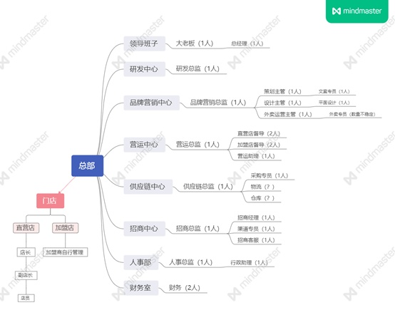

（注：由于加盟店与总部是合作关系而非从属关系，故不在本次调研的讨论范围内）

公司总部人数30人左右，按职能划分为研发中心、品牌营销中心、营销中心、供应链中心、招商中心、人事部、财务部等部门，以下是主要部门的职能概览。

研发中心：该中心通常只有1人，由具备一定烹饪技术与从业经验的人员担任总监，对学历的要求相对较低。研发总监主要负责菜品的开发、测试、调整。由于总部场地有限，研发阶段需要在附近的某家直营店的厨房进行，与领导班子、供应链中心讨论采购、控制成本、定价等问题，并在总部多次举办试吃会后，保证产品通过验收再上线。而宣传阶段则与品牌营销中心互相协作。

研发总监与大老板之间经常会出现矛盾。比如，当大老板认为菜品不够完美时，会要求总监不断调整，时常令其焦头烂额、渐失信心。而研发是一个较为复杂、艰苦的过程，总监既要让领导满意，又要在时间节点前完成任务，因此不得不接受加班。如果这些问题没有处理好，总监就会受到非常严厉的斥责，老板的骂声响彻整个公司。曾有人忍无可忍，当场与老板爆发冲突，随后主动辞职。

品牌营销中心：该中心分为3个部门——策划部、设计部、外卖运营部，负责各类活动策划、品牌宣传、物料设计、外卖平台运营，并对产品销量、投入预算、活动效果进行预估、统计及分析。人数较其他部门多，主要由专科及以上学历的年轻人构成，阴盛阳衰。

虽然该中心职能划分较为明确，但仍存在身兼数职、工作量大等情况。比如，平面设计除了设计大量图片与物料，还要拍摄、剪辑视频，经常需要赶进度，并与其他部门频繁对接，因为几乎全司的图片、视频工作均由其承担；文案专员除了本职工作，还兼任新媒体运营、数据统计员、商户中心管理、客服，并与其他部门频繁对接，因为几乎全司的文字工作均由其承担；外卖专员负责管理美团、饿了么、口碑等点餐平台，每日处理大量枯燥无味的数据，并努力达到指标。员工领着低薪干大量活，怨声载道，多次向上级反映，但大老板以公司还在转型期为由，并不打算多招几个人。许多人累出了职业病，如颈椎病、肩周炎、腰腿疼痛。

加班、开会频繁，是该中心的另一个特点。总监、主管需要经常开会向大老板汇报，不能准时下班，曾有人抱怨开会占据了大半天，无法好好工作。策划、设计加班严重,工作日留司至21:00、休息日回来加班也见怪不怪，有时回家后凌晨一两点还在工作群上传报表、工作计划、设计稿。虽然老板不会强迫员工加班，但总是在群里不停催促，迫使员工不得不自愿加班赶进度。当然，加班费、节假日三倍工资是没有的，最多只有调休假。

因此，该中心成为员工流动性最大的部门。

营运中心：负责对门店（尤其是直营店）的各项业务制定指标，进行培训、督导、考核、奖惩、签约等一系列经营管理活动，主要由营运总监、直营店督导、加盟店督导、营运助理等人员组成。由于专门负责管理门店，需要经常与店长接触。营运总监对店长要求极高，态度严厉。该中心是业绩压力最大的部门，即便到了周末、法定节假日、寒暑假也无法安心休息，经常被大老板疯狂点名。

供应链中心：该中心分为采购部、配送部2个部门，拥有冷藏库、常温库、自营配送冷链系统，负责物资的定制、采购、仓储、物流运输及配送，根据供应状况和市场价格控制物资成本。在高温天气下，配送部需提前搬卸货物，避免其受热变质，在冷藏库和常温库之间来回穿梭，条件较为艰苦，容易出现工伤。

招商中心：负责与加盟商进行宣传、对接，开展招商签约工作。主要由招商总监、招商经理、渠道专员、招商客服等人员组成。如果长期达不到业务指标，成员会感到压力较大。

其他部门：略。

（二）职务层级与薪酬待遇

| 职务               | 招聘信息           | 实际薪资           | 学历要求           |
|-|-|-|-|
| XX总监             | 暂无数据           | 未知               | 未知               |
| XX经理             | 9k~10k            | 未知               | 大专及以上学历     |
| XX主管             | 暂无数据           | 未知               | 大专及以上学历     |
| XX专员             | 4k~6k             | 之前招聘信息是3k~5k时，到手只 | 大专及以上学历 |
|                    |                    | 有三千多           |                    |
| XX助理             | 3k~5k             | 未知               | 大专及以上学历     |
| 督导               | 6k以上             | 未知               | 大专及以上学历     |
| 店长               | 5k~7k             | 未知               | 欢迎优秀应届生     |
| 储备店长           | 3.5k~4k           | 未知               | 欢迎优秀应届生     |
| 店员               | 具体面议           | 未知               | 初中以上文化程度   |

（注：由于收入问题略敏感，员工之间很少交流，只能参考招聘信息）

总部的职级从高到低的排列顺序是总监-（经理）-主管-专员-助理，而门店是店长-储备店长-店员。职务越高，工资越高。

总部员工的晋升路线通常是助理/专员-主管/经理-总监。总监和主管偶尔会出现缺员或空降的情况，且仅是与薪酬待遇挂钩的职级，并不一定会有下属。总监、主管对大老板、总经理负责，经常需要开会讨论，而话事权通常在大老板手里。专员、助理则与总监、主管对接，通常是较为轻松平等的扁平化管理。门店时常出现营运中心总监训斥店长，店长训斥店员的情况。暂无辱骂、殴打等行为。

总部不包食宿，也无房补、车补、餐补，由员工自行解决。门店一线员工可住在公司提供的小区宿舍或店内简陋房间。疫情期间有店长连续二十多天无法回小区宿舍，只能住在店内房间，无空调，无热水器，只有木板床和破被子。

S市最低工资标准为1800元。一般而言，如果招聘信息说月薪3k-5k，基本上只能看最低那个数字。比如之前网上写着XX专员的月薪是3k-5k，实际上试用期是2800元/月（为期2个月），转正后只有3500元/月，绩效占其中的15-20%。扣完社保到手不足3500，且无公积金，无工龄工资，无加班费，无岗位补贴。社保缴费基数3322元，个人缴费金额265.76元。没有公积金也没办法，因为当地大多数私企都不交。

据说J公司半年调薪一次，工作一年后会交公积金，但很多年轻人因为事多钱少，畏惧大老板，厌恶公司规章制度、团建活动、企业文化，熬不到那个时候就辞职了，也不知道公司有没有画饼。能坚持下去的多数是中高层管理者。

（三）劳动过程

总部员工主要从事的是脑力劳动，相对于流水线工人来说，对自己的劳动具有一定的掌控力。但由于大老板的控制欲较强，希望事无巨细地把控整个局面，时常要求汇报情况、赶进度，因此员工普遍感到压力很大，尤其是中低层管理者。

以品牌营销中心为例，劳动过程如下：大老板、总经理提出要求，总监和主管按年/月/周/日制定计划、安排任务，专员、助理负责落实。期间由总监和主管负责监督，最终成果由大老板和总经理验收。如果任务量太大，总监和主管会帮忙调整。

在进度上，策划部与设计部需要相互协作，共享资料，并一起对方案进行讨论。偶尔会发生分歧，但整体来说关系融洽。由于策划案、设计稿需要不断修改，以满足大老板的要求，所以加班、开会、熬夜通宵是常态。

### 三、管理制度与企业文化

1．工作时间：总部长白班（夏令时8:30-17:30，冬令时8:30-17：00），午休时间为12:00-13：30（夏令时）或12:00-13：00（冬令时），固定周末休息（大小周，一周单休，一周双休）。门店实行早晚班、轮休制。实际上，休息时间还是会被领导、同事、客户烦扰，休息时间被严重侵占。大老板尤其没有尊重意识，不管是下班时间、周末还是节假日，都会在群里疯狂@人汇报情况。有员工私下戏称：“我仿佛签的不是合同，而是卖身契，24小时全给了公司。”

​2.
加班费：加班满4小时才能申请审批，否则不计时。无加班费，无节假日三倍工资，只有调休假，且必须先加班后调休，不能先调休后加班。

​3.
福利：过节可能会有水果（如一片西瓜或一个苹果）、零食、小礼物，但不一定每次都发。暂不清楚有无其他福利。

​4.
奖励：通常拼业绩的部门才有奖励，比如营运中心、招商中心每成功签约或续签一家加盟店，督导、招商总监/经理可获得1000～2000元。业绩优秀的直营店店长有月度奖、季度奖。

​5.
惩罚：总部每迟到1分钟扣10块，着装不得体扣50块，8:20-8:30被抓到在公司吃早餐也要扣钱（但实际上班时间是8:30），美其名曰“乐捐”。第一次忘记上下班打卡不扣钱，再犯就要扣钱（每次50块），无论是否补卡。门店收到差评要扣钱（负责该门店的督导也要被扣钱），某项指标不合格也要扣钱。

​6.
请假：事假好请，因为请了就不用发工资。但年假、病假、产假要提前申请，并满足一定条件。如工作满一年才能休年假，出示相关证明才能休病假、产假、丧假。

​7.
工会：不存在的。有问题就和上级协商，实在无法解决就走劳动仲裁，或者辞职后在网上曝光。

​8. 企业文化：

（1）晨会：主要分为周一晨会和部门每日晨会。周一晨会的参与者是总部全体成员，主要内容是颁布新的规章制度、各部门工作汇报、正能量故事分享。部门晨会的参与者是部门成员，由人事主持监督，主要流程是强调会议纪律、大声问好、宣读部门文化、分享心灵鸡汤、互相拥抱鼓励、喊“加油！加油！加油！”之类的结束语，没什么营养，且耽误工作进度，引起很多人的不满，后来就逐渐不搞了。

（2）亲情与感恩文化：大老板和人事将劳资关系美化成家庭关系，宣称老板是大家长，同事是亲人，一家人要互相帮助，互相包容。又言公司为大家提供了发展平台，员工要学会感恩、无私奉献、努力奋斗。但年轻人普遍不接受这套说辞，因为工资不见涨，任务却越来越多。

（3）团建与读书会：公司经常发起读书交流会和团建，但多数员工极度反感，尤其是年轻人。人事要求员工抽时间阅读成功学、管理学、心灵鸡汤之类的书（如《做一个懂得感恩的员工》），不定期检查阅读进度，并展开交流会，严重影响个人作息。团建一般在工作日举行，不会占用休息时间，内容通常是羽毛球赛、破冰游戏、素质拓展（如军训）、自行车赛等，但也是强制参与的，很难请假，没有考虑到身体不好的员工。很多人宁愿留在公司干活，因为团建会耽误工作进度。

（4）企业内刊：赞扬受伤或临盆前依然坚守岗位、加班加点熬到凌晨的员工，竭力宣扬其无私奉献精神，暗示怀孕职工“干活干到生”。尚不清楚有无对受伤员工进行工伤赔偿或奖励。

总体来说，总经理、总监和主管善于安抚下属情绪，懂得协商问题和调整进度，颇得人心。人事虽然性格不差，但通常是站在大老板的角度考虑问题的，制定了一大堆规章制度，大搞团建，宣扬洗脑企业文化，加上大老板的处事方式令人神经紧绷，许多员工对此颇有微词，甚至产生辞职的念头。不少人表示：“要不是因为同事关系好，舍不得大家，早就辞职了。”辞职还算自由，只要提前30天申请并交接好工作就行了。有人透露，从她入职以来短短半年，已有将近20人离开。

### 四、员工思想

​1.
对僵硬、繁杂且不合理的规章制度感到不满，尤其是加班制度和惩罚制度。曾有员工加班后忘记下班打卡，被倒扣正常工资，与人事理论无果，回来后抱怨道：“以后再也不加班了，不仅没有奖励，还受了惩罚，吃力不讨好。”
如果某个部门出现业绩不达标的情况，该部门全体成员要参加市马拉松，这一决定使很多人产生了离职的念头。

​2.
对团建和企业文化感到不满。比起接受毫无意义的洗脑，员工更倾向于加工资。

​3.
对薪酬待遇感到不满，比如面谈薪资低于招聘信息的承诺，且任务越做越多，堪称“加量（工作量）不加价（工资）”。有人称：“要不是因为前东家搬走了，离家太远，我就不来这儿了。以前干同样的活儿有5000多块，现在只有毛4000，老是要加班。”

​4.
对领导感到不满。如前所述，话事权通常在大老板手里，其掌控欲较强，时常要求员工汇报情况、赶进度，不及时回复会挨批。因此员工普遍感到压力很大，尤其是中低层管理者。而人事通常站在大老板的角度考虑问题。另外，领导为了与同行竞争，热爱跟风，加上对某些事情缺乏经验，经常朝令夕改。

然而，S市没什么好企业可以选择，不守规矩的公司比比皆是（如不签合同、不交社保、单休、强制加班且无调休假），当地公务员、事业单位、国企的报考热度很高。像J公司这种入职第一天就签合同、转正后缴纳社保、有单双休和调休假、同事关系融洽的企业并不多。就算它钱少事多，没有公积金、加班费、工龄工资、岗位补贴，很多人也只能继续忍耐，但依然无法改变员工流动性较大的问题。

 

第九章 学徒制”与“工具人”——我在设计院的经历
------------------------------------------

编者按：这篇文章的作者是建筑设计院的脑力无产者，作者以亲身经历，描述了设计院的工作情况、层级情况以及各种违法用工的情况。

在设计院的几年，作者体会过超长时间的加班，“有一次，我和同事加班到凌晨3点，走出写字楼的时候，我感觉自己整个人都是轻飘飘的，仿佛这个躯壳已经不再属于我，灵魂仿佛升到空中审视着地面上的自己，有如一架由钢铁混合着血肉构成的绘图仪器，只知道麻木而机械地重复着敲击键盘的行为。”作者也遇到过突如其来的解雇，“果不其然，三个月后的一个傍晚，老板把我叫到了他的办公室里，用和之前同样的理由告诉我，我被单方面辞退了，但还是要感谢我这段时间以来对单位的贡献。这时候，我才明白，眼前的这个文质彬彬、谦逊有礼的人，是一个不折不扣的笑面虎，也是一只披着人皮的吸血鬼。”

在这个过程中，作者逐步认清了资本家的丑陋嘴脸，作者开始怀疑自己工作的价值，“做建筑要有社会责任感，但扪心自问，在这个一切事物都被视作商品的年代，倘若从个人层面来说，医护尚能救死扶伤、老师尚能教书育人，那么我们这些基层从业者无数个昼夜的加班与熬夜，到头来就只是构成了房地产商和金融机构巨大利润的一部分，巩固了普遍压在劳动人民头上的大山——住房，供养了一个又一个的亿万富翁和曹译文iris们的花天酒地，而这才是令人痛苦的普遍现实。那些满是象牙塔式华丽辞藻、充斥着资产阶级的精英主义和狂妄自大的概念文案，以及变化多端、造型丰富的当代建筑，到头来究竟和劳动者充满辛酸的现实生活有多少关系呢？”

但是作者没有仅仅停留在怀疑层面，作者更进了一步，他揭露资产阶级的谎言，“脑满肠肥的老板们，总是说他们靠工作岗位养活了我们……殊不知，正是我们基层劳动者的辛勤和汗水，才养活了他们庞大的企业帝国和这个社会的运转；而要不是他们完完全全地垄断了土地、机器、原材料等生产资料，我们又除了劳动力之外别无他物可以出卖，又有谁会心甘情愿地为他们卖命呢？”并大胆地预言，“在资产阶级猖狂地对劳动群众进行着持续进攻的当下，由主流社会所塑造的一系列形形色色的身份认同，连同消费主义一起，构成了笼罩在我们这个时代上空的、沉重的围城，每一个人都无法置身事外。作为脑力劳动者的我们，除了要努力摆脱资产阶级系统性的诱骗带给我们的影响外，也千万不能因为自己所发出的声音就自视甚高（如之前没有下文的996.icu）。只有充分理解并认识到传统体力无产阶级（如产业工人、服务业工人等）在劳资斗争中的先进性、坚决性，在口头和行动上支持、帮助乃至融入到体力无产者的斗争中去，只有这个时候，才能真正地表明自己和无产阶级的利益是一致的。过去，资产阶级总是想方设法地试图在我们之间制造割裂和隔阂，而拨开这一层虚幻的意识形态迷雾，正是如今这个时代的我们首要的任务，也是劳动者之间走向普遍团结的开始。”

这是一篇非常优秀的调研报告，值得每一个朋友仔细地阅读。

### 一、一线城市设计院概况

我高考结束后，服从调剂进入一所本科的建筑系学习。毕业后，我来到了一家一线城市设计院，做起了建筑设计人员的工作。

（一）设计院概况

（1）结构与分工

这家设计院的规模大概在40-50人左右，隶属于某个大型房地产集团，主要经营范围为建筑工程的设计和咨询。老板是作为总工程师的院长，通常并不直接参与一线生产活动，他负责与各专业以及甲方的沟通、协同工作，并在进度把控和设计内容上给出一定的建议。单位大致设有建筑、结构（土木）、水暖电、人事、财务这几个部门，其中建筑和结构这两个部门各有1-2名相应专业的高级工程师作为专业负责人，在具体的建设项目中负责勘察施工现场、和甲方沟通汇报，以及制定计划、分解任务、安排工作，同时他们也会参与基层的工作。基层设计人员在高级工程师的指导下开展工作。就建筑设计专业的人员来说，大致的项目工作流程是：绘制方案设计阶段的图纸，制作概念文本——拟定初步方案，深化方案设计图纸，与其他专业的人员进行沟通和校对——绘制施工图——核查图纸——出图。但对于我们这种刚入行的新人来说，通常的工作内容，是在不同时期的项目流程中帮老员工打下手，与此同时积累经验，因此到手的通常都是并不复杂，但重复工作量较大的任务。

（2）工时与工资

我们这些新人开出的是3000元/月的工资，而同部门的老员工则普遍在4000-5000元/月左右，院长则是10000元/月，发薪日统一为每个月的25号，头一年没有任何年终项目提成奖金，这之后由年限和个人在项目中的贡献占比来决定具体发放多少年终奖金。由于单位所在的城市是一座一线城市，有着不低的生活成本和物价水平，而单位也并不包吃住，因此这样的收入只能勉强地在这里存活下来，谈不上什么个人积蓄抑或是生活质量。就工作时间而言，根据大家签订的合同，明面上实行965制，但由于建筑行业本身的特殊性（这一点我会在后面进行介绍），所以实际上负责主要工作的部门通常要在正常工时结束后加班3-4个小时不等，甚至一连数月无休。在建筑业圈子里，不支付加班费可以说是长年以来公开的秘密，而这家设计院自然也是不例外的。

（3）羊毛出在羊身上

很多不了解情况的朋友也许会说，你们还有很高的年终奖啊。殊不知，羊毛出在羊身上，年终奖的数目相比我们免费加班给老板省下的，也是小巫见大巫了。以建筑、结构两部门共约20人来作为对象，暂定平均工资为4000元，一天除正常8小时工时外还需要加班4小时，每周工作六天，那么一个员工平时的加班费大约为138元，周六的加班费大约为552元，折合一个月约4967元，一年下来就是约59602元；而二十个人一年下来的加班费，总共可达约1192080元，也就是将近120万元，这还是没有算上法定节假日加班和项目周期紧张时一连几个月无休的情况。所以，这一行工资构成中所谓年终提成（或曰年终奖金）的部分，其真面目是从业者应得的加班费，却往往被以“多劳多得”和“个人业绩占比”的名义来进行“计算”，遇上工程烂尾、施工方跑路、项目尾款收缴难的情况，这部分的费用还往往很难发放到设计人员的手中。绝大部分的设计人员，也几乎从来没有想过向资方讨要自己的加班费，而是默认了资方多年来所塑造出的这种环境的存在。

（二）建筑行业的“学徒制”

（1）高强度的工作

在单位，每天的工作内容，就是根据部门高级工程师的安排使用电脑进行绘图作业，正式的工作时间是早上9点到晚上6点，期间中午12点到下午2点是休息和吃饭的时间。除了方案设计阶段以外，大部分工作时间都是在重复劳动中度过的，仅仅需要按照高级工程师的构想和相关专业规范的要求来绘制出上级想要的设计图纸，除此之外便再无他物。由于建筑界这一行的甲方（也就是形形色色的地产开发商们）惯于压缩工期提高利润，因此基层设计人员通常工作强度极高。由于甲方随时可能改变先前方案，也由于设计过程中其他人的意见反馈，我们经常修改返图，甚至彻底推翻重做，数不清的加班和通宵赶图伴随着每一个设计人员。而紧凑的时间节点，也导致很少有员工从格子间内起身活动或者去上厕所，虽然单位并没有对这些作出强行限制。

工期繁忙的时候，我经常加班到晚上10点以后才得以回家。反复的意见调整，来来回回的修改返图，再加上长时间的伏案工作，使得我心神涣散、精疲力竭，即使是回到家洗漱完毕躺到床上以后，脑海里面还在自动播放着工作时的片段和细节。有一次，我和同事加班到凌晨3点，走出写字楼的时候，我感觉自己整个人都是轻飘飘的，仿佛这个躯壳已经不再属于我，灵魂仿佛升到空中审视着地面上的自己，有如一架由钢铁混合着血肉构成的绘图仪器，只知道麻木而机械地重复着敲击键盘的行为。久而久之，往日闲暇之余的消遣变得索然无味，而我也患上了这个行业常见的职业病——腰椎间盘突出，一些同事也早早就被这一病症乃至颈椎病缠身。对于这类职业病，单位领导只会提醒大家平时要注意身体、保持良好的生活习惯，并不会像在工地勘察验收受伤那样计入工伤，而大部分同事也将之归因为自己“坐姿不良”。

（2）习以为常的辱骂

刚进入单位的时候，我觉得身上的压力非常大，因为在学校里学到的知识和具体工作的要求是断层的——大学的老师们所教授的，大部分是理论性的基础内容；而设计院所看重的，则是求职者对工作软件以及专业规范的掌握程度。于是，大部分的工作时间，我都是在重复着无数次对图纸的修改与校对，同时承受着个别同事的斥责和辱骂。对于我们这种刚出社会、不具备任何工作经验的实习生来说，来自老员工的训斥乃至人格羞辱在这一行可谓是家常便饭。对于老员工而言，这种做法自然是为了让新来的员工能够更好地“记住”相关的专业经验，而被呵斥的新人大多数时候都不敢表现出反对的态度，只能默默接受这类教育，并将责任归咎于自己，很少有人会认为这种类似封建学徒制的情景是不正当的。

（3）“温情脉脉”与“有话好说”

不过，即便如此，由于单位存在着五险一金（按最低标准缴纳）、节假日/高温补贴费用、加班报销、加班调休（尽管实际上由于项目周期安排，能够调休的机会几乎可以说是没有）、年假、聚餐和年会聚餐等福利的缘故，加上项目来源稳定、能按时发放工资，单位的工作氛围也一直比较生活化，而院长待人向来亲和友善，每逢节假日会给一些员工串门送礼，所以许多员工都愿意留在这家设计院进行长久发展，在工作之余的个人生活中，也有不少同事形成了较为亲密的朋友关系。工龄在三年以上的员工，在这家单位内的占比至少达到了80%。然而，即使是像这种“温情脉脉”的设计院，在整个行业当中来看也可以说是属于极少数的。

在这家设计院就职期间，发生了两起令我印象深刻的事件：一次是财政部门的财务人员和我们部门的直系领导发生争执而被迫离职，起因是直系领导对她不尊重；一次是结构部门的高级工程师和基层设计人员就工作安排和院长产生冲突，最后双双离职。对于前者，同事们大多持事不关己、冷嘲热讽的态度，有的人还觉得该财务是“本事不大，事情蛮多”；对于后者，大部分人也是作壁上观，同部门的同事还有不少持和事佬态度，认为他们应该服从院长的指令，不应该“擅作主张”，而该高级工程师也只有在这种时候才会想起要维护自己的权益，在矛盾未发生前立场始终倒向院领导一方。

就这样，带着内心的迷惘和对加班常态的抵触，我在这家设计院度过了将近三年的时光，期间并没有什么明显的建树。去年，由于异地的对象确定了工作地点的缘故，我犹豫再三，最终决定离开这所设计院，去她所在的地方进行打拼。于是，我来到了对象所处的一座位于南方的二线城市，开始了新一轮的谋生。

### 二、二线城市设计院概况

刚到这座城市的时候，正好碰上了招工淡季。受迫于此，我不得不暂时从事于一家当地的建材厂，做起了绘图员的工作，薪水是一个月3500元。今年年初，由于疫情的缘故，再加上我终究还是想回到建筑行业工作（因为我只会这个），我便趁机辞去了这份职务，再一次找起了工作。

（一）被“承包“的设计院

这家设计院表面上看来人员庞杂、具有过硬的行业资质，实际上构成它的各个“部门”的，是一个个由个体注册、属于个人名义下的小型工作室。这些工作室以该单位的名义对外进行招聘，彼此之间各自为营，所有的设计工作均是挂靠该设计院的正规资质的产物（后来，我才了解到，类似这种结构的设计院在当地乃至周边城市可谓是司空见惯）；而这些个人注册的工作室，其注册地点多为周边的其他城市，导致一旦产生劳动纠纷，往往会加大劳动者的维权难度。

面试的时候，工作室的老板跟我口头约定，试用期为一个半月，试用期工资为4000元/月，转正后工资为5000元/月，不包吃住，第一年没有任何提成奖金，试用期结束后再签订劳动合同，并按最低标准缴纳社保和公积金，在此之前则不缴纳任何社保抑或公积金。同时，他告知了我单位的一些福利，如带薪年假、公费旅游、聚餐团建、加班后有交通补贴、正式职工按季度发放提成奖金等，我同意了他的要求。

令我不曾想到的是，此时此刻的这个决定，即将成为后面一系列波折的开端。

（二）试用期与工具人

刚开始在这家工作室工作的时候，我很是积极，每天总是想方设法地揽活来干，为的是能够最终在这家单位留下来——毕竟，外面的选择并不多。期间，我曾经有一次生了病，不得不请了一周左右的假，老板还很是关心地让我照顾好身体，暂时不用担心工作上的事情。谁曾想，一个半月的试用期到来的时候，老板却以我工作能力不达标为由，只给我发了不到3000元的工资，并且还扣除了我请假时的工资，同时认为我可以栽培，口头做出了转正的承诺，但要再继续延长试用期，签订合同和缴纳社保同样还是在转正之后。鉴于当时没有其他的选择，而这个工作室的老板又有一定的专业造诣，我咬了咬牙，最终还是同意了他的要求。

与此同时，这家工作室又招收了两三个实习生，用的是同样的承诺和更低的工资，并且在试用期结束后同样做出了延长试用期的举措。发工资的时候，采取的是发一部分现金、剩余的一部分通过银行转账的形式（银行转账的记录通常被用来报账），老板还说这样导致他“个税交得高了”。后来，我了解到，这家工作室用同样的手段自去年至今招聘了十来个人（其中大部分是实习生），每个人的工作时长都不会超过3-4个月，就会被工作室单方面解除劳动关系，或者是被故意压低的薪水自动逼走，而他们被分配的都是一些基础而重复性高的工作，主要的顶梁柱则是三四个老员工，立场自然也都完全倒向老板一方。像我所使用的电脑的上一位工作者，就是在延长的试用期结束以后，老板告诉他：现在是“特殊时期”（即疫情期间），我能给你的就只有这么多，你能接受就继续在这里干，我不会亏待你的云云，结果他自然是头也不回地离开了。

在这家单位工作时的交流，除了员工间彼此的协调和专业上的往来外，就再也没有别的内容了。员工彼此之间仿佛有着一层无形的隔阂，没有人提及自己的个人生活或是琐碎趣事，只有具体的工作和利益牵扯，以及部分老员工惯例对新员工的辱骂，格子间的空气中时时刻刻弥漫着冰冷的氛围。老板在平时的工作安排中，也时常用一些话术来暗示我们这些新来的员工是有愧于他，想要使我们产生一种愧疚的心理，从而更加卖命地进行自己的工作。

（三）该来的总会来

再后来，也许是进入了工期淡季的缘故，分配给我们这些新员工的任务逐渐地少了下来。我仍旧想方设法抢活来干，但与此同时，内心深处某种不详的预感正在变得越来越强。果不其然，三个月后的一个傍晚，老板把我叫到了他的办公室里，用和之前同样的理由告诉我，我被单方面辞退了，但还是要感谢我这段时间以来对单位的贡献。这时候，我才明白，眼前的这个文质彬彬、谦逊有礼的人，是一个不折不扣的笑面虎，也是一只披着人皮的吸血鬼。

就这样，我再度成为了产业预备军的一员，重新踏上了求职的道路。在对这座二线城市的建筑业有了更多了解后我才知道，由于建筑业在本地并不是十分发达，仅有的一些设计单位之间竞争往往十分激烈，所以存在着大量用工不规范的现象，比如少缴甚至不缴社保、拖延或者不签劳动合同、规定的法定节假日少放假、签阴阳合同等。去年该市的大型设计单位还存在着与基层设计人员的大量劳动纠纷，最后均以劳方败诉告终。但这更让我倍感愤懑，这家工作室对劳动者明目张胆的欺骗和压榨居然已经成为业界常态，于是开始了漫长的劳动仲裁之旅。

### 三、出路何在

回首过去至今的历程，不由得令人感慨万分。在学校的时候，我们最常被教育的就是要绝对服从于甲方、服从于老板，要耐得住寂寞，要“像对待自己的孩子一样对待自己的作品”，并以此来扬名立万。但鲜有人问过，“采得百花成蜜后，为谁辛苦为谁甜？”也常有人说建筑是社会性的，做建筑要有社会责任感，但扪心自问，在这个一切事物都被视作商品的年代，倘若从个人层面来说，医护尚能救死扶伤、老师尚能教书育人，那么我们这些基层从业者无数个昼夜的加班与熬夜，到头来就只是构成了房地产商和金融机构巨大利润的一部分，巩固了普遍压在劳动人民头上的大山——住房，供养了一个又一个的亿万富翁和“曹译文iris”们的花天酒地，而这才是令人痛苦的普遍现实。那些满是象牙塔式华丽辞藻、充斥着资产阶级的精英主义和狂妄自大的概念文案，以及变化多端、造型丰富的当代建筑，到头来究竟和劳动者充满辛酸的现实生活有多少关系呢？讽刺的是，在数十年前，前卫方面同样不逊色于今的先锋派建筑，却是无产阶级试图证明自身存在的标志。大城市的灯红酒绿和纸醉金迷，属于那些日复一日在工地上挥汗如雨、却几乎永远也无法融入自己所创造的高楼大厦的建筑工人吗？

（一）基层设计人员的阶级地位与意识

至于弥漫在这一行的个人功利主义和冷漠，从阶级分析的角度上来看，大部分设计院的基层从业人员属于脑力无产者乃至半无产者出身（有些甚至是城市小资产阶级），区别于经典马克思主义语境上的工人阶级，由于他们所处的工作环境和工作性质的影响，比起制造业和服务业工人来说，更容易受到资产阶级的主流社会意识的影响和改造。另外，层级食利的升迁机制（当然，最大的食利层是房地产商和诸如银行这类的金融机构）、隐性捆绑的工资结构（倘若在年终奖金尚未发放前就离职，那么大概率这个钱是一分也拿不到的）、过去至今很长一段时间内稳定的项目来源（尽管这一点在这两年间正在以肉眼可见的速度持续崩坏着），以及名为终身责任制的法律枷锁，这一切使得大部分基层设计人员在相当长的一段时期内都不愿随意离职、维护自己的权益，基于责任感进行着自己的工作，同时相信着资产阶级编织出的发财迷梦，想要“熬出头”晋升为管理层，于是在追逐个人名利和消费主义的环绕下变得更加依附于公司。与此同时，有许多的房企和设计院在这两年的经济低迷中陆续破产清算抑或改组，而长期以来国内的土地开发也已经日暮西山，再加上混改的浪潮同样波及到了隶属于国资的设计院，在未来，基层设计人员的劳动处境想必只会变得愈加恶劣。

（二）谁养活了谁

过去那个火红的年代中，劳动者是国家和社会的主人，是人类社会真正的创造者，工厂和企业是属于劳动者集体所有或全民所有的，企业的利润以各种方式最终回馈给劳动者，比如免费的医疗、教育和住房，工厂的管理也不是一级压一级，劳动者能最大程度参与工厂管理，这使得劳动者爆发了冲天的干劲，这是为现代人（也即私有化社会长大的人）所不能理解的。而在资本全面复活的今天，劳动者早已由过去的主人再度沦为资本及其人格化存在——资产阶级的奴隶，一切都是为了钱、为了效率、为了利润服务，而不再是为人服务；劳动，也从原先劳动者满足自我认同的需要，沦为了一种枯燥的、异于劳动者自身的、想要逃离的强迫之物，因为不工作，就没有办法在这个物价飞涨的社会存活下来。脑满肠肥的老板们，总是说他们靠工作岗位养活了我们，总是指责作为成年人的我们不应该有“不务正业的”个人爱好，总是站在道德的高地上蔑视我们“廉价的娱乐消遣”……殊不知，正是我们基层劳动者的辛勤和汗水，才养活了他们庞大的企业帝国和这个社会的运转；而要不是他们完完全全地垄断了土地、机器、原材料等生产资料，我们又除了劳动力之外别无他物可以出卖，又有谁会心甘情愿地为他们卖命呢？

对于把一天中绝大部分的时间奉献给单位、奉献给工厂、奉献给老板，而只有极少数时间属于自己和家庭的基层劳动者来说，类似挤地铁和公交车上低头看手机的时间，或者是躺在蟑螂出没的出租屋或是宿舍的床上的时间，才是我们仅剩的一点可怜的、得以逃离高压和焦虑的“自由”时间；作为对平时工作压力的消遣和缓解，很多人又怎能不深陷到消费主义的漩涡当中去呢？正如恩格斯在《英国工人阶级现状》中所指出的那样：“因为穷人到底也应当有一点享受，而其余的一切享受社会又不容许他有，所以他就只好到小酒店里面去。……既然社会使他陷入几乎不可避免地要成为一个酒徒的那种境地，既然社会丝毫不关心他，注定他要变得粗野，那末，当他真正变成酒徒的时候，这个社会又怎么能够责备他呢？”

（三）拨开迷雾

在资产阶级猖狂地对劳动群众进行着持续进攻的当下，由主流社会所塑造的一系列形形色色的身份认同，连同消费主义一起，构成了笼罩在我们这个时代上空的、沉重的围城，每一个人都无法置身事外。作为脑力劳动者的我们，除了要努力摆脱资产阶级系统性的诱骗带给我们的影响外，也千万不能因为自己所发出的声音就自视甚高（如之前没有下文的996.icu）。只有充分理解并认识到传统体力无产阶级（如产业工人、服务业工人等）在劳资斗争中的先进性、坚决性，在口头和行动上支持、帮助乃至融入到体力无产者的斗争中去，只有这个时候，才能真正地表明自己和无产阶级的利益是一致的。过去，资产阶级总是想方设法地试图在我们之间制造割裂和隔阂，而拨开这一层虚幻的意识形态迷雾，正是如今这个时代的我们首要的任务，也是劳动者之间走向普遍团结的开始。

 

 

第三部分 垄断企业分子公司的脑力无产者
=====================================

第十章 国有保险企业调研
-----------------------

编者按：这是一篇优秀的报告，内容详实，结构清晰。这篇文章描述了某国有保险公司区县支公司的基本情况。由于该公司是垄断资本下属公司，利润比私企更为丰厚，因此待遇也比私企更好。然而，“这种剥削”与“那种剥削”都是剥削，只是程度不同而已。

从文中我们可以看出该公司内部森严的等级、不平等的薪酬结构以及资本怎么具体压榨员工。在这个区县支公司，国企的领导层渲染着奋斗逼的文化，熬着有毒的鸡汤，为了自身收入，严酷地盘剥着基层员工，俨然一副“厂主”与“工头”的模样。而基层员工的权益却时常被侵犯，他们加班没有加班费，节假日经常不能休假，而稍微发发怨言就被通报批评，与私企的雇佣劳动者无异。企业为了最大限度压迫员工，通过过程控制、全体待机等方式，试图从各个方面掌控员工的行为，甚至一度在员工身上安装定位环。

员工也有怨言，但是往往敢怒不敢言，年轻人会选择离职，年纪大的却不得不忍气吞声，毕竟，私企的剥削更为严重。但是怨言和愤怒在积聚，而这总有爆发的一天。

### 一、发展历史

A公司是B市（某发达地区二线城市）一家国营保险集团下属财产险公司的区县支公司，主营财产保险业务（以车辆保险为主，兼营财产险，责任险，健康险，意外险等）。集团总

部下属十多家子公司，拥有二十万左右员工，其财产险公司网点遍布全国31个省（自治区、直辖市），参与大多数国内重要项目和工程的承保工作。

### 二、管理体系

（一）分工与部门划分

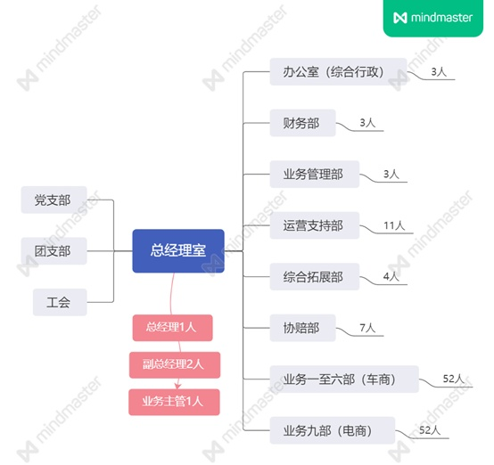

注：党支部，团支部，工会因不是职能部门且人数不常定，故不统计人数

公司有员工139人（包含正式工、派遣与外包）。与一般保险公司类似，除领导班子外主要分为业务部门和非业务部门。业务部门主要有负责非车险业务的综合拓展部，负责车险以及和车商（4S店、经销商以及二手车商）对接的业务一至六部，负责车险电子商务平台的业务九部（以下简称电商部）。非业务部门主要包括办公室（综合行政）、财务部、业务管理部、运营支持部、协赔部。以下是部门情况概述。

业务一至六部（车商）：这六个车商业务部门为主要业务部门，因工作内容基本相同整合概述。以下简称车商业务部。

车商业务部目前有员工52人，大部分为专科与本科学历。各部门一般设有部门经理（副经理或主管）一名对部门员工进行管理。部门日常工作分三大类：（1）业务拓展及办理。部门各成员主要派驻到各车商门店驻点办公，通过和车商的合作从车商处获取新车保险业务，并为新客户以及续保客户办理业务、出具单证。（2）日常咨询和文案工作。部门员工须为客户提供咨询，引导出险客户前往合作车商进行维修等。部门员工还需整理并上报各种报表、数据、单证资料。（3）客户维系。部门员工须定期维系可续保客户，并促使其投保。此业务理论上和电商部协同作业，但在旧车的续保业务方面有时会和电商部产生矛盾。

员工无法享受正常的午休，且经常会被要求无偿加班，在收入方面也有各式各样严格考核指标，因此新进员工的流动性通常较大。老员工因为各种原因较为稳定。

业务九部（电商）：主要负责电子商务平台的车险客户维护与电话销售，分为两个团队开展工作。目前有员工52人，常设部门经理（副经理或主管）一名，两个团队各设团队长一名。电商部日常的工作相对单调，整天都在打电话。员工主要依托公司的优惠活动，电话营销招揽车险客户投保。公司对员工每日的有效通话时长以及通话次数有考核，如未达到目标的有效通时通次，则须加班完成后方可下班。员工会经常在休息日加班。由于电商部几乎很少有正式工，流动性是全公司最大的。此外，经常由于公司的安排，有时会和车商业务部产生业务上的矛盾。

运营支持部门：运营支持部主要负责对业务部门进行技术上的支持，有员工11人，学历均为本科以上，常设部门经理（副经理或主管）一名负责日常管理。部门主要从事三方面业务：（1）各业务部门销售保险单证的打印和整理；（2）到店客户的柜面接待服务；（3）受理客户的电话咨询投诉工作。

员工午休时间和正常下班半小时内，会安排两名员工值班以提供必要的服务，值班为轮流进行。

业务管理部：有员工3人，本科学历以上。员工日常负责市场信息和数据的收集调研，并以此制定业务部门的相关考核指标。也负责对业务部门业务进度的监督和管控，对进度落后的部门和个人制定加班方案。此外，业务管理部还负责不定期的前往车商门店对车商部门业务员进行抽查（包括是否在岗，易容仪表，是否着工作服，办公环境卫生整洁等）并考评。故而业务部门对业务管理部多有积怨。

协赔部：协赔部员工7人，以专科以上学历为主。主要负责车险事故现场的查看，出险客户和维修机构的对接，车辆损失的核定等工作。因其工作性质，协赔部需要进行倒班和轮休，以满足夜间出险客户的需求。此外，协赔部会引导出险客户至公司指定的维修机构进行维修，以此使公司获得对车商的谈判筹码，以便获取车商提供的新车保险业务。

其他职能部门：略。

（二）层级划分与薪资体系

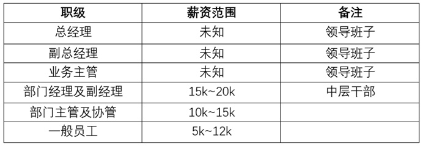

注：因为公司工资条实行保密制度也不允许员工之间公然讨论收入，所以这里的收入为大致推测

理论上国有企业为公有制经济，应该实行按劳分配。但现实中，即使是国有企业，管理层通常都比普通一线员工的薪资收入高出很多。

整个公司的层级简单地讲大体可分为上中下三个层级。

公司的上层：上层是由总经理室成员构成，包括总经理、副总经理以及业务主管。他们是公司的司令部，掌握了全部的话语权。他们召开公司会议讨论研究上级公司的指示和任务，根据情况分解发派到各个职能部门执行。执行过程中，会根据情况进行调整。除了总领全局之外，他们平时也经常代表公司到各个车商和企业进行访问和商务洽谈此。此外，在公司召开的各种晨会和夕会中，他们会给全公司员工灌输一套奋斗理论，并通过强灌各种鸡汤来维持公司的团结，已达促进业务发展的目的。他们的薪资收入与公司利润挂钩。虽然我们无法探知他们真实的收入状况，但从某些方面我们仍可窥见一斑，比如，他们未完成上级的指标，动辄被扣款上万，这说明他的薪酬非常高。从各个方面来说，他们都是公司里的“厂主”和“技术专家”。

公司的中层：公司中层往往是从有经验，业务水平优秀的员工中选拔上来的。和领导班子的工作相似，他们负责从总经理室那边得到指示和任务，再结合自己部门的实际情况去对其进行分解，把任务分派到各个员工身上。不同的是，业务部门的中层干部们的收入主要受公司利润和部门指标完成情况的双重因素影响；而非业务部门一般只受到公司利润的单方面影响。故而在科室任务达成情况优良的情况下，业务部门的中层干部收入会远远高于非业务部门的中层领导。但其工作压力也远比非业务部门的要大。在平时，业务部门的中层干部通常会在部门传播一些“正能量”思想，奋斗思想等。并向基层员工灌输，员工之所以能工作并有这样的收入，都是公司提供的平台这类的福报思想。以此让员工认识到自己对公司其实并不重要，只有努力为公司创造利润才有存在的价值。他们好比是公司里的“工头”，代表着“厂主”和“技术专家”们履行着监督职责。

公司的基层：第三个阶层就是基层员工们，这个阶层唯一要做的就是根据上一阶层的安排，去把任务具体落实完成。这个阶层大体分为两个部分。其中少数人担任部门中的主管或协管（从最下面提拔出来），这部分人虽然不是真正的干部或领导，但也与普通员工有所区分。他们除了干自己的活之外，还负责协助中层干部管理部门内部事务。他们属于基层员工里的优秀者，也有被拔擢的希望。所以他们是积极的，活跃的，也许某一天，他们可以从第三阶级跃升到第二阶级。他们通常会配合中层干部对部门中的不满情绪进行安抚，团结人心来确保部门内部的和谐，保障业务的顺利开展。剩下的就是完全没有任何职务的一般员工。他们是公司里的普罗大众，但这样的一些人，终究也是有区别的，有关系的，会来事的，领导喜欢的就会被安排好的岗位，尤其是业务部门，这样的人会被安排到轻松的，事少的，收入高的车商门店中去。而相反的则会被安排在一些，事情多还收入一般的门店，这样往往会陷入一种“陷阱”，事情多工作就不好开展，任务也不好达成，引至领导的批评并直接影响到本身的收入。

在招聘员工时，公司常常会打出“国营企业”，“收入稳定”以及“高薪不累”等宣传口号。通常会把收入水平按照优秀业务员的收入写到10k乃至15k，但是实际到岗后会发现按照公司的各种规章制度以及罚则等等，很少有员工能有到这样优异的收入，故而新进员工的流动性就会很大。不过，五险一金方面公司还是执行到位的，虽然工资会有部分拖延，但社保和公积金每月是准时缴纳的。此外对正式工公司还会提供职工互助医疗和年金的福利。

（三）劳动过程

由于保险业务的开展并非标准化的劳动，员工对于个人的劳动有一定程度上的安排和调整能力。但是公司方面也相应的可以通过各种手段对其进行监管和把控，来最大限度压榨员工。

过程把控：新车的保险业务受到汽车销售的影响不太可控，旧车的保险业务是可控的。公司通过业管部统计后将各员工相应的业务做成续保跟进表，每个员工根据表格进行电话呼出和填写每次呼出的结果。这样中层干部以及业务管理部可直接从定期的跟进表中获知每个员工的完成情况，并作出相应的应对措施例，比如加班、罚款等。

全天待机：保险行业具有一定特殊性，无论是前端的销售或是后端的理赔，几乎需要一线员工全天24小时的进行待机。只要上级领导或公司有需求或者是客户有需求，便要进行即时的回应。哪怕是休息天也好，深夜凌晨也好，只要有电话呼入或接收到信息，你就要进入到工作中去对其进行处理。这样的情况自微信，钉钉等APP的出现后越发严重。毕竟客户的选择很多，而如果因为没有及时回复而导致业务的流失，领导是不会接受这样的解释的。

活动与团购：保险公司经常性的会组织针对各类客户的优惠活动和保险团购。在这种情况下，往往需要员工进行加班工作。期间由于时间的局促，往往需要员工在短时间内对大量的客户进行告知和促成。在这种情况下，“白加黑”，“六加一”就是很普通的一件事情。

会议和培训：往往保险公司会经常性的组织公司晨会和夕会，进行业务进度通报，灌输“正能量”和“鸡汤”。遇到上级公司重要指示、重要事务，或者遇到新产品的上线等情况，公司也会召集临时性的会议和培训。这类会议和培训通常会在正常下班时间后召开，以确保不会影响白天的工作。在今年疫情之后，随着办公软件的应用，有时也会在非工作时间召开临时的语音或视频会议。总之务必不要浪费工作时间。

### 三、压迫、剥削制度与文化

保险公司本身并不创造实际的价值，而是通过投机的方式让钱“生”钱。不光对外的业务上追求利润，对内也有各种各样的方法对员工进行压迫和剥削。虽然公司属于国有企业，但因为领导们的收入和公司利润、业务完成情况挂钩，因此公司领导会尽量压缩员工收入、增加员工工作时间以及通过各种方式来节省开支，俨然一副“厂主”与“工头”的模样。

2016年到2017年这段时间，机动车商业险保费还尚未进行改革，保费收入和返点都处于一个比较高的水平。那时因为业务需求，每隔一两个月时间公司就会进行所谓的“团购”活动。有时是公司直接进行，有时是和车商合作举行。所谓“团购”就是在一定时间范围内，加大对客户的返现或赠送油卡的力度，以便快速吸收大量客户投保。这类活动通常会在4至7天左右，在这期间休息日是完全取消的，而且公司也不会给你安排进行调休。而因为活动的时间限制，需要在活动前期大量打电话通知客户。由于数量实在庞大，而且白天工作时间会有其他业务和工作经手，所以下班后加班联系客户就是家常便饭。当然这样休息日和下班后的加班都是所谓“自愿”的，公司一贯的说辞是，业务做进来都是你们业务员自己的收入，所以你们是在给自己加班，给自己赚钱。这段时间由于公司的任务和利润都算还行，故而在能完成的情况下对于员工到底在做什么也并没有很严格的管束。员工的收入也相对还算可观，一年下来也总有个十万左右。而B市一般普通职员的月收入大概在3k至4k，这样相较下就算很不错了。

近两年来，随着商业车险的各种改革和监管措施的出台，保险公司在车险业务这块受到较大的冲击。期间又因为领导班子调动的原因对于下面员工的管控和罚则也越来越严格，各种扣款措施和罚则纷纷出台。例如迟到一次扣罚20元，未打卡一次扣罚30元，未规范着工作服扣罚20元，办公区域未整理整洁扣罚20
元，各种你能想到的和想不到的罚则多如牛毛。业务方面推出了奖惩措施，但奖惩不成比例，完成并超出进度在奖金上可能上浮10%，但是完不成可能下降20%。具体的幅度总是由领导班子研究后公布，但往往奖少罚多。管控还不仅限于行为和经济方面。公司热衷于通常宣扬那些空洞的“正能量”，毫无营养的“心灵鸡汤”，和让人恶心的“奋斗逼”思想。公司灌输的理念不是国企职工当家作主，而是“没有公司，你什么都不是”，因为所有的展业平台都是公司提供给你的。这种似是而非的洗脑话术，和纳粹戈培尔那句“没有祖国，你什么都不是”如出一辙。整个公司都萦绕在“正能量”之下，“负能量”的话哪怕是真的，你也不能说。有同事在工作场合说了抱怨的话，招致的是在公司晨会的通报批评。

这段时间，公司甚至派发过一种带有定位功能的电子工牌，要求员工随身携带，即使下班后也要带回家。相当于只要公司愿意，随时可以对你进行定位。如果让公司发现工牌一直在同一个位置或者处于没电关机的状态，那么就会进行相应的惩罚和通报。虽然很多员工对这种严重侵犯人权的措施私下里都有怨言，但也仅仅在私下的状态绝不敢拿上台面来说，不过这一措施在后来不了了之。可见公司对员工的管控到如此地步。在这两年里，加班依然存在，加班依然免费。但是收入与前两年相比有所下降。

2020年是最惨的一年，年初疫情爆发。在地方政府的要求下，各企业和经营单位停止营业。一开始公司也按照要求安排员工在家办公，后来公司不顾风险，在尚未具备复工条件时，强行于二月中旬开始营业办公。期间有员工曾向当地主管部门匿名反应，情况被通报上级公司，上级公司自查自纠后，却回复未发现违规复工的情况，此事就此不了了之。

九月以来，新一次的车辆商业险改革开始，保费收入进一步大幅下调。在这种情况下，公司再次加大了考核力度，奖惩变得更加直观了。譬如，完成任务的情况下，每超出一台额外奖励20元，完不成每台扣罚30元。但是任务的目标本身就定得很高，孰难孰易可想而知。这一年依旧降薪，加班，令人窒息。唯一使人稍稍释怀得是自九月的改革过后，再也不用业务员垫钱送给客户了，这至少减轻了很大的压力。

公司除了职能部门外，还设有党支部、团支部以及工会。党支部书记由总经理担任，党员人数大概十多人。由于不是党员身份，并无法探知支部内部会议的内容。不过可以判断的是，支部的党员们大概没有一个人读过《宣言》，更不会有什么马列理论基础。比起这些，公司还是比较喜欢资本家那些成功学，管理学的思想，鼓吹这么一套理论的支部水平也就大致可以判断了。此外这个月支部还发展了三名积极分子，其中两人是班子成员，一人是鼓吹“奋斗”的领导的跟屁虫，都没有什么理论水平。工人阶级的先锋队不停地发展这样的人进入，也是一件十分悲哀的事情。团支部则更是人山人海，毕竟如今团员遍地都是。但团支部的日常除了让青年员工（无论是否团员）在手机上上省团委的团课外，便是收收团费，除此外毫无存在感。至于工会，工会主席目前是一名副总经理。除了日常组织工会活动（基本就是爬爬山或出去拓展玩玩）以及发放节日礼品和生日卡外，也不会有更多帮助员工争取利益的行为。公司的员工们可能也无法理解工会的作用，更不会通过工会去反馈什么压迫和剥削的情况。简单地来讲，这就是公司的工会而非员工的工会。

### 四、员工思想

面对剥削与压迫，自然会产生不满与怨言，当然这也只是停留在私下的层面。

一，无论监管部门对车险进行怎样的改革，员工的工作量实际是没有减少，反而增加的。但是因为公司的收入和利润的减少，对员工支付的薪资也大幅缩水，这是最不能令人接受的。此外年终奖也是按照领导随心所欲，时有时无。所以最直观的就是员工努力却得不到回报。

二，随意且强制的加班使员工身心俱疲，最夸张的时候一整个季度三个月都没有休息日。这样高强度的加班，不光造成人生理上的损害，对员工的社交以及家庭关系也会有很大程度上的影响。年假也要看领导肯不肯给以及肯给几天。但其实就算休假了你依然要继续办公，“工作性质”使然。

三，许多业务上的任务动则以政治任务的名义压下来，迫使员工不得不去完成，甚至强制员工自行购买。本质上就是一种强买强卖的行为，而员工迫于压力又不得不买，对于这样极大损害员工经济利益的行为员工是十分排斥的。

四，溜须拍马的人纷纷拔擢，真正劳动的人得不到保障。但是又出现多做多错，不做不错的情况。那些不干事的受到好评和表扬，干事的人却会引致麻烦。这在很大程度上引发员工对领导层管理上的不满。但大家又不好说，也不能说。长期压抑。

在各种不满和积怨产生后，刚刚进入社会的新新社会人们往往选择离职。他们没有贷款也没有家室，一人吃饱全家不饿。对于他们来说，此处不留爷，自有留爷处。更多年纪大一些的员工往往还是选择继续下去，毕竟如果贸然离职，工资收入断了，贷款是不会断的，家里的开支也是不会断的。而且就综合的情况而言，B市整体的薪资水平普遍偏低，且私有企业的剥削更加恶劣。A公司纵然有这样那样的问题，但总体而言各方面还是高于B市大多数企业的。比起个人创业的风险，大家也并没有什么更好的选择，只能背负着苦架继续前进下去。毕竟，太阳照常升起。

然而，当人们认识到自己奴隶般的状态后，改变这种状态的那一天就不会太远了。

 

 

第十一章 某通信运营商的县级分公司
---------------------------------

编者按：本文作者描述了某运营商县级分公司的基本情况。运营商是垄断资本的典型代表，拥有高额垄断利润，员工待遇明显高于私企。但是即使在这样的企业中，我们仍然看到：（1）企业内部森严的等级以及与此挂钩的不平等收入；（2）企业的违法现象，比如加班并不支付加班费。

作者笔下的垄断国有资本，提供给员工比私企更好的待遇和福利，但员工仍然改变不了雇佣劳动者的命运。他们在企业中并不享有主人翁的地位，他们在权益被侵犯时往往只能忍气吞声，显然，这样的国企仍然是资本式的国企。

由于企业内部的矛盾并不尖锐，他们自身的斗争性也相对较弱。相比于大城市的产业工人，甚至相比于大城市的脑力无产者，他们的压力更小，矛盾更加缓和，因此，他们可能觉醒得更晚。但是，近年来随着经济下滑和生活压力加剧，员工的压力也越来越大了。

矛盾在日常的压迫中缓慢地积累着，这是十年如一日的日子。在这样的日子里，一个又一个如作者般的劳动者正在逐步觉醒。

### 一、基本情况

本单位为某通信运营商的县级分公司。所在区县的人均GDP在全市范围内处于最后几名，不足全国平均的二分之一。县公司绩效一般，在全市范围内处于中间偏后，其中政企部门的绩效长期处于倒数。

据调查，该公司基本情况与所在地级市其他各县级分公司类似，具有一定的代表性。通信运营商从事国家规定的垄断行业，但各大运营商彼此竞争激烈。前些年，运营商凭借垄断地位盈利颇丰，员工待遇较高。近年来，国家提出“携号转网”和“提速降费”等政策，再加上恶性竞争的影响，运营商基层工作人员待遇每况愈下。

### 二、组织架构和人员情况

（一）职位层级

公司领导层共4人，其中党委书记兼总经理1人、分管市场副经理1人、分管网络及建设维护副经理1人，以上三人均属于某级别的经理（领导级别）。另有政企经理1人，政企部门为新设置部门，专门负责政府、大企业等集团客户业务。公司中层共20人。中层是实际工作中的主力，工作压力一般比基层员工大。其他正式员工60余人。另有负责卫生、保安、维护施工等工作人员约10人，该10人均为外包人员。

（二）员工基本情况

从年龄看。公司经理大多为40岁左右。近年来，公司有领导层年轻化趋向，上级曾发文件要求，新提拔的经理原则上年龄应在35岁以下。县公司中层大多数年龄为30-40岁，仅有1名人员年龄在40岁以上，1名年龄在30岁以下。其他员工年龄大多数也为30-40岁，有少数超过40岁或不足30岁。他们中大部分都是在24岁前进入公司工作。

从来源看。非领导层公司正式员工大体分为3类：原邮电局转入公司的老员工、省公司统招员工、其他正式员工。为表述清晰，将此三类员工命名为邮电局老员工、统招员工和社招员工。

其中，社招人员中仅有4人是全日制本科学历，其他全是专科学历。应上级公司关于提升员工整体学历的要求，公司和本市一所大学合作，给员工机会，取得成人自考本科学历。这种学历水分很大，员工不需参加实际学习，只要过了最后的考试即可。

社招员工是由区县公司在社会上自主招聘。先在县公司面试，后到市公司参加笔试，通过即可录用。超过80%的社招员工工作年限已经超过十年，约一半已经超过十五年。

在区县公司中，邮电局老员工、统招员工、社招员工，三部分人员比例大约为1:1:5，考虑到邮电局老员工中有部分已经退休，统招员工中有部分已经离职，实际工作中社招员工比例更高，可达1:1:7。在省公司、市公司和市区的区县公司中，统招员工比例会有所上升。

### 三、收入及其他福利

（一）薪资情况

员工工资与职级挂钩。自2016年以来，省公司统招的本科大学生定级约为5级，根据年份有上下浮动，硕士研究生比本科生高1级，一般市公司内没有博士研究生。邮电局老员工一般职级为8级左右。社招员工职级大多为1-4级,许多工作数年的基层社招员工职级仅有1-2级。社招员工是公司主力，但职级明显低于其他人员，具体情况详见后文第五部分。

员工工资由每月工资和年终奖两部分构成。月工资包括基本工资、职位工资、绩效工资和补贴。其中，补贴除常规补贴外，还包括过节费、取暖费、防暑降温费等。基本工资和职位工资由职级决定，每月不变，绩效工资由上月绩效决定，计算较为复杂，不再赘述。每月工资发放日期为当月最后几个工作日，没有扣押工资的情况。

由于绩效和竞赛奖金不同，同一职级不同员工间收入有差距，5级员工间差距可达1500元。即使是同一员工，不同月份间收入也有差距，多则可达上千元。5级员工平均每月工资约5000元，每年工资及奖金共约80000元。2级员工平均每月工资约3000元，每年工资及奖金共约45000-50000元。以上工资及奖金均为工资卡实发到手的钱，不包括五险二金等其他的收益。

近年来入职的大学生在入职前会缴纳履约保证金，本科生3000元，硕士研究生5000元。在缴纳时公司并未说明何时归还。理论上说，在员工入职后即应返还，至少应在工作半年转正之后返还。但实际上，2018届入职员工在入职约十个月后反还。尽管多次在员工交流群众讨要说法，2019届入职员工的保证金至今仍未返还。

领导层工资状况未知，但根据传闻和缴纳党费等情况推测，经理月工资不低于15000元，不高于30000元，年终奖未知。

（二）加班费

节假日如十一假期加班营销，公司会统一申请加班费，为国家法律规定的三倍工资，下月月底跟随月工资一同发放。

除这种节假日营销以外，所有的加班都没有加班费。日常加班名义上是员工自愿加班完成工作，员工也不会主动申请加班费。如果要申请加班费，需要在系统中提交申请，包括原因、时间、地点、保存的工作照片等信息。提交申请后先由区县公司总经理批准，再由市公司相关部门批准后才视为正式加班，发放加班费。市公司很不喜欢区县公司提交加班申请。有一次十一假期前，市公司发文，严禁区县公司在节假日实际没有加班，却以加班费的名义给员工发钱。

我曾在参加工作日区县公司组织的营销活动后自行申请加班费，但县公司领导没有予以批准。我后来还被综合部邀请谈心谈话，内容大约是：工作日没有申请加班费这种说法、员工应当一起努力为公司提高绩效、加班完成工作是很正常的积极上进的表现等，加班费也不了了之。

（三）社保和公积金

公司缴纳五险一金和补充企业年金，按实际应得收益购买，缴纳比例较高。但由于社保缴纳得多，相应扣发工资也多，故每月实际到手工资不高，许多员工对此有些许怨言。很多职级不高的社招员工，每月实发工资只有一两千元。

（四）休息休假

员工依法享有年休假和其他假期（如产假）。如无特殊情况，公司一般会批准员工的年休假。

公司会在国家法定假期（如十一假期）组织营销，统一申请加班费。基层员工对假期营销多有怨言，但一般会遵循公司要求。在营销中有很多闲逛偷懒的机会，很多员工会边聊天边逛街。

一般情况下，员工的病假和正当理由的事假，公司会予以批准。按照规定，公司会扣除员工相应的绩效分和工资。员工的病假、产假等时间较长的假期中，没有绩效工资和补贴，其他工资正常发放。很多职级较低的员工，基本工资和职位工资不高，扣除五险二金后剩下的很少。很多时候，员工请假只需跟领导说一下，公司领导为了表示人文关怀，不会将请假正式提到系统内，不扣工资。

（五）其他福利

每年8月，公司会组织所有正式员工体检。为保护隐私，体检报告直接发放至员工个人手中，公司一般无权过问。普通社会人员参加同等水平体检，费用约1000元。据观察，公司员工身体基本健康，但会有常见的程度较轻的办公室职业病。

每年中秋、春节等节日，公司会发放福利。一般有食用油、大米、酱油等调料品和其他食品。公司还会不定时发放洗衣液、卫生纸、肥皂等日用品，大约每年有2到3次。前段时间疫情较为严重时期，公司还会发放口罩，能够保证员工个人的使用。

公司有自己的食堂，早餐2元，午餐7元，区县级别的公司里没有晚餐。午餐一般为一荤一素一汤，主食不限。每天变换花样，一周循环一次。食物味道尚可，基本能满足一般人的口味要求。领导也会跟员工一起在食堂用餐。上一任总经理几乎每天中午都在食堂吃。他待人较为温和，中午吃饭时大家会一起看电视、聊聊天，气氛很好。现任领导每周大约两次在食堂吃，他较为严肃，大家中午吃饭时都很安静。

如有上级公司巡查，应中央廉政精神要求，中午食堂会专门为其准备午餐而不是去外面的饭店吃午餐。

公司不提供住宿，市公司会在社会上租赁房子供各区县公司总经理使用，所租赁房屋水平大约中等偏上。另外，市公司还会为新入职统招员工提供租房补贴，每月600元，持续半年。半年后新入职员工转正，该补贴取消。

在还未转正时，新入职员工基本工资和补贴全额发放，绩效奖金按照全市平均水平全额发放，职位工资按照60%发放。转正后平均实发工资会提升几百元。由于转正后租房补贴取消，有入职绩效较差的区县的员工，在转正后工资反而不如转正前拿得多。

公司也会有其他的一些福利。比如公司会不定期举办运动会，约每年一次，报名参加的人会发一套运动服；公司会每几年组织一次员工外出旅游；公司会每几年发一套工作服装。

### 四、工作情况

（一）工作时间

按照规定，每天工作时间为上午8:30-12:00，夏季（5月1日-10月1日）下午2:00-6:00，冬季（10月1日-次年5月1日）下午1:30-5:30。但几乎所有区县都会要求员工早上提前来公司开晨会，最多的区县要求提前半小时，即8:00来公司开晨会。大多数员工晚上都会加班半小时或一小时以上，某些较为辛苦的员工每天加班时间甚至有三小时以上。平均来说，市场部员工最为辛苦。

每周工作时间为周一到周五全天和周六上午半天，但周六没有打卡签到。许多工作未完成的员工，周六周日会自行来到公司工作。

公司会定期组织营销活动，每过一段时间组织一轮营销。组织营销时，每周三次，部门内人员轮流参加。营销时间大多从下午4点开始，持续到晚上8点以后。此类工作日营销均由县公司组织，没有加班费。

（二）工作环境

员工均有自己的工位，每人配一台工作使用的电脑，内网外网均可接入。办公室内有中央空调，冬季取暖，夏季降温。领导层有单独的办公室，但除总经理外面积都不大。客户经理均有外出走访任务，每周至少外出四天，外出可申请公务用车，也可骑自己的电瓶车。原则上，开自己的汽车外出走访可以申请油补。

（三）同事关系

一般来说，同事关系比较融洽。大家并不局限于工作关系，私下里也大都是好朋友。员工们会将买的好吃的东西带来公司一起吃、买的物超所值的东西与大家分享。领导层与员工一般不会产生冲突，领导层如果对员工工作不满，会有训斥，但不会辱骂。员工对领导层的某些要求如有不满，多是私下抱怨，明面上不会表现出来。

但是也有例外情况。传闻，某区县公司领导曾在晚上被人殴打。有人说，他手不干净，喜欢调戏妇女，因此被人打了；也有小部分人说，是他对待员工太苛刻了，所以被打了。该领导被打后，选择报警。但由于与他关系差的人太多，案件难以调查，被打的事也不了了之，市公司便把他调离了该区县。

（四）工作状态

三大部门工作状态如下。

政企部门员工大体可以分为两类。一类工作主要是在办公室内，平时需要统计数据、填报表格、调度指标等。此类工作十分无聊，且需要长时间坐在办公室内使用电脑，会让人产生厌倦感。另一类是负责对外面向客户的，平时需要各种走访、营销或在营业厅面向群众。此类工作也很让人厌烦，有时一天需要走访三四家集团。

网络和建设维护部与第二类情况相似，只不过不需走访客户，而是要去现场指挥施工。

综合部和市场部与第一类相似，但市场部员工是营销活动的主力，需带头外出营销。

以我为例，区县政企部门。早上8:00到公司开晨会，领导安排今日工作。每天的工作包括但不限于：统计各种数据、填报表格和申请单、电话调度各乡镇网格发展业务、办理或取消集团产品业务，枯燥又恼人。另外，还要参加电视电话会议，大约每周一次，这种会议一般都在晚上下班一小时后开始，持续约两个小时。晚上八点回家吃饭是常态。最烦人的是集团号码过户，每一个过户都需要上传8张盖过公章的资料，还要刷身份证、拍照验证身份，每办一个就需要十几分钟。有时，一个集团就有几十个需要过户的号码，一整天都办不完。

（五）补充情况

公司领导层为追求绩效指标，有时会下令让员工强制为家人朋友办理某项业务，或以内购会的名义让员工购买某些卖不出去的积压产品。最多一次，在某年元旦前后，整个市公司所有正式员工每人花费约2000元，购买公司积压的智能后视镜和智能门锁。

### 五、其他状况

（一）历史情况

大约十年前，公司和邮电局老员工及统招类员工签订劳动合同。社招类员工与第三方公司签约，公司以类似劳务派遣的方式与第三方公司合作来雇佣员工的。那时公司效益好，正式员工少，待遇极好。据说，老邮电局员工在2003年的工资每月就有上万元。每到发工资的时候，他们都能领到一沓百元大钞，让那些劳务派遣的社招类员工十分羡慕。传闻，有领导在那时凭借高工资，买了许多路边的门店，向外出租。

一般来说，统招员工和社招员工工作量差不多，社招员工略高。邮电局员工年龄较大，有些已经退休，没有退休的大多岗位较为清闲。除极少数特别的员工外，绝大部分人工作都算认真、尽职尽责，没有耍横、捣乱、摆资历、长期不干活等情况。

作为工作主力的社招类员工，不仅没和公司签订劳动合同，其待遇也和正式员工有天壤之别，让人心生芥蒂。在2012年左右，国家要求国有企业限制劳务派遣的比例。公司开始大量吸收社招类员工为正式员工，签订劳动合同。当时公司规定，所有社招员工必须参加考试，通过后即可签订劳动合同成为正式员工。考试内容大约为工作能力和基本能力。

此时，许多领导层严格禁止员工私底下建立QQ群互相联系，不让员工组织形成力量。尽管如此，还是有些地市的社招类员工组织起来到省公司抗议，具体情况已不可考。转正后，社招类员工待遇虽还和之前的正式员工有差距，但已不像从前那样悬殊了。

（二）离职情况

公司一般不会开除员工，如有解除劳动关系的，均为员工自己提出离职。由于有员工离职率的考核，公司领导一般不愿意员工离职。在员工提出离职后，领导会百般挽留、能拖就拖，并会提出尽可能满足员工的需求。若员工去意已决，公司也会依照规定办理离职手续。

近年来，新入职员工均为省公司通过校园招聘统一招收的员工，学历多为硕士研究生，也有少部分本科生。这类员工学历较高、眼界开阔、思想活跃且大多没有养家糊口的负担，故离职的全部是此类员工。常见的离职原因有：区县公司地处僻远、工作劳累没有休息、薪资达不到满意目标等。离职后常见的去向：考研、考公、考教师编、通过当地政府的人才引进进入机关、到大城市另找工作等。

2018年，有一名大学生不满于周六还要工作，说：“国家规定周六不上班，我签订的劳动合同上也没说周六上班。如果你要我周六上班，那你拿法律条文出来。该我完成的工作我完成，工作日我正常上班，你也不能扣我工资。”对于其他非工作日的营销类工作，他的态度也是如此。公司拿他没有办法，只好在这方面妥协。原本周六要全天工作，从他以后，如果没有工作，许多员工周六下午就不来上班了。其他的员工私底下十分赞赏他的行为，但都没有勇气效仿。该员工在工作不到一年后，辞职去考研了。

（三）工会组织

工会在员工中几乎没有存在感，只会在过节时发些福利时出现。员工平时在与公司出现矛盾时不够团结，且法律意识淡薄，遇到不满往往选择忍气吞声。仅有少数区县公司的基层工作人员会将不满表达出来。但他们不是通过工会等官方渠道反映，而是采取指桑骂槐、消极怠工等方式斗争。该区县的员工，家庭大多有另外的收入，即使不靠工资，也能维持家庭的正常运转。

工会有时会组织面向全公司的捐款。捐款对象包括但不限于：用不起手机的贫困学生；新冠肺炎爆发地湖北；公司内部患重病的员工。捐款时，工会会要求领导干部带头捐，捐款数额一般不会超过200元。捐款原则上是自愿参加、自己决定金额，但是有的领导十分重视捐款，如有不捐的员工领导会单独谈话，促使其捐款。

（四）生活情况

除少数大学生和3个老家外地，在本地工作生活的员工外，职工均是本县人。约90%已组建家庭，对象一般也有工作。大多数员工家庭通过工作积累或家庭支持，都有至少有一套房子。当地房价不高，在几年前平均房价仅两三千元。即使现在，房价平均也只有五千多元。很多有家庭的员工，都在几年前行业情况较好、工资较高时，购买了不止一套房子。只有近年来新入职的大学生，才会租房子住。

关于劳动再生产的花费（关于劳动再生产的花费，这里只参考了我和几个同事，是一个大体的估计）。

以一个单身男青年为例。如果生活简朴，只计算基本费用，则有以下情况。租房：650元，吃饭：700元，日用花费：150元，共计1500元。其中，租的房子是县城边缘的较为老旧的房子，甚至会缺少一些必须的电器；上下班通勤靠自行车；早饭、午饭在公司吃，晚饭及周末在家买菜做饭吃；日用花费包括话费、水电费、日用品等。

如果正常生活，则有以下情况。租房：900元，吃饭：1000元，日用花费：300元，其他花费：300元，共计2500元。

如果生活品质较好，每月花费不低于3000元。

以一个有自己房子的6口之家为例。如果生活简朴，只计算基本费用，每月消费不会高于3000元。如果正常生活，每月花费大约5000-6000元。如果生活品质较好，每月花费不低于8000元。

如果老人没有收入，仅靠夫妻二人收入，普通家庭每月剩余不多。有些家庭甚至是月光族，每年盈余要靠年终奖。

子女上学是个重大问题。各种校外补习班的花钱不少，对普通家庭来说是个负担（但补习班并不是占比最高的费用，实际上绝大部分家庭，占比最高的费用还是食品）。由于公立学校数量不足，有的人会花很多钱上私立学校，这给家庭带来了很大的负担。在县城里，仅有一所公立高中和两所私立高中，招生数量难以满足需求。有的初中生甚至要复读两年准备中考。有能力的家庭会选择让子女上私立高中，或者送到其他区县甚至其他市上高中。

### 六、总结

尽管目前工资不高，但其他的福利待遇相较一般私企还是很好的。除加班外，也几乎没有违反劳动法的地方。员工如果对于工资要求不高，不犯大错，一般可以安稳工作到退休。

在一般的生活工作中的矛盾主要包括：工作量大、效益低、工资少、恶心人的营销活动、各种乱七八糟挤占休息时间的会议、形式主义的各种检查。矛盾主要存在于员工和公司之间，普通员工间基本没有矛盾。一般来说，营销活动主要是市场部副经理发起、卫生整洁的检查是综合部主任发起、工作会议是总经理发起，这三人作为公司的代表承接了不少员工私底下的怨言。

总体来说，公司内部矛盾比私企小，员工斗争意识也不强。对于加班，员工大多逆来顺受，经常有人说：“领导要我们加班，有什么办法呢？”，也有人说：“工作没完成，不加班怎么办呢？”偶尔有某个大学生呼吁大家要团结起来争取权益，也很少得到响应，大家只把呼吁当成玩笑话。在大学生离职另寻出路后，情况又会变得跟之前差不多。

总体而言，通信运营商的员工是令人羡慕的好工作。

但近年来通信行业作为一个产业在走下坡路，许多业务被新型的互联网、计算机企业抢走。运营商这种央企，体量庞大、转型困难，被互联网企业牵着鼻子走，利润也随之减少。

前几年，由于行业衰落，各大运营商为了保住业务量、争抢用户资源，竞相推出了“无限流量”，“开套餐，送宽带”等产品优惠，导致了恶性竞争。近两年，中央提出“携号转网”、“提速降费”，加剧了运营商之间的恶性竞争。同时，国资委又要求，运营商要保证上缴的利润不能少。收入减少，利润却不能减，又不能凭空变出钱来，负担只能压在基层员工的身上。另外，中央对国有企业下发了廉洁的指示，许多隐性福利、五花八门的补贴也相继取消。

事实上，基层员工的压力越来越大，工资也不见涨，甚至有所下降。许多年轻人不愿再选择在运营商工作。许多三十多岁的员工也有离职另寻出路的想法，但年龄大，出去也没什么好工作干，就还一直待在这里。

在平缓的发展中，矛盾还在积聚。

 

第十二章 一线城市医疗器械制造公司海外销售人员调研
-------------------------------------------------

编者按：本文是一篇优秀的调研报告，调研对象是某医疗器材公司海外销售雇员群体。

该群体员工属于典型的脑力无产者，由于“普遍拥有更为特殊的专业能力（例如小语种），因此议价能力相对较强，企业尚可对他们开出相对较高的薪资。”

该群体由于相对较好的工资待遇，以及被资本家分割成原子化的个体而无法团结，因此，虽然“资本家在招聘和提拔员工的过程中肆意进行性别和年龄歧视，以员工的人身和财产安全为代价开拓海外市场，为了逃避赔偿以逼迫员工自离的方式进行裁员”，但是他们“虽有不满，却普遍认为这是整个海外销售行业的行规，反抗和维权意识薄弱。”

然而，逃避却并不能改变资本压迫他们的现实。加班没有加班费，社保公积金长期违法缴纳（今年合法了），“尽管自己已经辛勤工作，却仍旧无法脱离自身所处的阶级。一线城市高昂的消费使财富的积累变得异常缓慢，靠为资本家工作实现阶级跨越的梦想似乎遥遥无期。”

虽然当前该群体员工还处于阶级意识萌芽期，但作者却对他们的觉醒抱着乐观态度，因为资本对员工的压迫日益严重。“一方面，由于中国企业开拓发展中国家市场的意愿越来越强烈，语言类特别是小语种专业的全国招生人数日渐水涨船高，甚至某些专业已经出现了过剩的趋势。未来将会有越来越多的毕业生进入海外销售就业市场。当销售代表们的专业技能不再稀缺，企业必然会降低其工资待遇，对他们的剥削与压榨程度也会越来越高。另一方面，受日益复杂的国际形势影响，我国的海外销售业务开展得并不理想。特别是今年的新冠疫情更是使海外销售行业的发展雪上加霜。利润的降低使得资本家进一步开始牺牲员工的利益，即使是本次报告中的大型上市公司也在今年直接取消了年度调薪。这无不预示着该行业危机的到来。而随着工资待遇的降低，不满开始渐渐在这一群体中蔓延。”

### 一、公司及部门介绍

该公司主营医疗器械的研发、制造和销售，属于大型上市公司，员工数超过2000人，在国内一二线城市以及国外建有30多个研发销售分公司和办事处，也有自己的工厂。员工中研发人员近600人，其余为销售、人力、财务等人员以及签有正式劳动合同的工人。公司有相对固定的上下游企业，上游企业主要是原材料供应商，主要供应机械配件，下游企业则是货代公司，为公司提供销售发货方面的服务。

本次的访谈对象供职于销售部门，对其他部门的情况缺乏了解。销售部门分为国内销售和海外销售两大体系，这两者在组织结构以及实际工作方面几乎没有交集，因此本次调研主要围绕该公司的海外销售体系展开。

该公司海外销售的两大主要产品为超声器械和内镜器械，公司声称其业务遍布160多个国家和地区，但实际上由于我国医疗器械行业的总体水平和发达国家相比尚有一定差距，故公司实际业务集中在亚非拉的发展中国家，依靠中低端产品的价格优势打开市场。

按纵向管理结构划分，海外销售体系最大的领导是海外销售总监和副总监，总监负责全部产品的销售战略制定，副总监只负责特定明星产品的销售。总监之下是公司按销售区域划定的区域总经理，通常按大洲划分。区域总经理手下按照产品下设该区域的各个产品总经理，负责特定产品的销售。产品总经理会将自己所在的区域划分成若干小区域，通常以具体国家为单位，每个小区域设置区域经理来管理特定产品在该小区域的销售。而区域经理下面是访谈对象这样的销售代表，他们才是该公司在海外销售领域的基层员工，直接负责具体的销售事务。

| 职级                                 | 范围                                 |
|-|-|
| 总监/副总监                          | 全球。总监负责全部，副总监负责某产品 |
| 区域总经理/某区域产品总经理          | 大洲。区域总负责全部，产品总负责某产品 |
| 区域经理                             | 某国                                 |
| 销售代表                             | 基层                                 |

从中可以发现在类似这样的大型上市公司中，庞大的企业规模和复杂的管理结构使得基层员工普遍对其他部门的工作情况缺乏了解，公司不会向员工主动讲解这些内容，员工在没有业务交叉的情况下也缺乏主动了解的欲望。例如访谈对象身为海外销售代表，却对同一部门的国内销售人员工作情况一无所知，这严重局限了基层员工的眼界，阻碍了工人阶级跨部门联合的可能。

### 二、部门人员情况

公司整个海外销售体系共有300多位员工，男女比例方面，男性员工是女性员工数量的两倍，存在着隐性的性别歧视现象。公司认为女性销售人员在结婚特别是生产后会将重心转移到家庭，不能持续承担海外出差任务，再加上对安全的考虑，在招聘过程中会优先考虑男性，对于入职的女性所给予的晋升机会也非常有限。

年龄结构方面，其中75%的员工年龄在25-35之间，年轻人是整个体系的中坚力量，20%的员工年龄在35-45之间，至于超过45岁的员工只占5%。像大多数私企一样，该公司对年轻员工的欢迎程度要远远超过大龄员工，在招聘时也基本只考虑年龄在30岁以内的求职者。

在专业方面，除相关后勤支持类岗位外，主要海外销售代表几乎都是语言类专业科班出身或自身有着优秀的外语能力。又由于公司主要的海外市场在亚非拉地区，因此事实上许多销售代表都是小语种专业出身，例如西班牙语、葡萄牙语、法语、阿拉伯语等。由于一线城市本身就会聚拢全国各地的青年，因此海外销售体系汇聚了来自全国各地的员工。

值得一提的是，海外销售体系离职率较高，整个体系内只有三分之一的员工超过了三年工龄，每年都有大量工作一两年的员工离职。离职原因主要是对薪资待遇的不满和对海外出差的拒绝。

### 三、部门工作情况

作为一名基层海外销售代表，日常的工作主要通过网络进行。包括向前来咨询的客户介绍产品、提供资料、报价、处理询盘，对于下单的客户跟进发货、处理付款回款，在海外进行产品注册，主动开发新客户等内容。入职两到三年的销售代表将被分配海外出差任务，具体频率大概两三个月一次，一次十天左右，或者直接派驻海外分公司执行常驻任务，但由于今年的新冠疫情，导致全年的海外出差业务大大减少。而单纯的网络沟通实际上比较繁琐，按照访谈对象的话说“虽然不算重复，但每天都有新的让人很烦躁的事情”。公司每月会对销售代表的业绩进行排名，虽然并未实行所谓末位淘汰制，但这种变相的压力依然会使员工因不想排在后面而陷入业绩焦虑。

从整个体系角度来说，如果公司要完成一个新的项目，通常是由高层即总经理进行决策，随后将决策传达到海外销售总监那里，销售总监再将项目布置给相关的区域总经理，区域总经理根据需要找到对应的小区域经理，由区域经理制定具体的完成计划，由其手下的销售代表负责具体实施。完成项目后，区域经理需要向区域总经理和海外销售总监进行工作汇报，并由这两位领导评定项目的完成情况。

该部门采用弹性工作制，员工可于上午七点半到八点间打卡上班，下午五点到五点半间打卡下班，只要上满八小时即可。午休时间为中午十二点到一点半。出于恢复精力的考虑，基本上所有员工都会在吃完饭后趴在办公桌上午睡。但由于睡眠时间比较短暂，员工在下午开始工作时依然会感觉很疲惫。下班后员工根据通勤时间不同大概在六七点能回到家中，时间会在做饭、运动、玩手机和追剧等活动中迅速流逝，为保证第二天的精力，许多员工十点就会上床睡觉。由于员工普遍对自身工作感到无聊又烦躁，故很多人都将下班视为一天中最快乐的时刻。

必须注意的是，对于海外销售代表来说，一个很大的职业风险来自海外出差或常驻时面临的人身和财产威胁。公司为了获得海外市场的利润，经常会派员工出差或常驻到亚非拉一些治安状况堪忧的国家和地区。公司针对这种恶劣条件的补偿措施只有给出差员工购买意外险和提高个别艰苦地区的出差补助，并无任何保护措施来减少伤害事件的发生。然而意外险只针对人身意外，并不保护员工的财产安全，且员工对于公司安排的出差任务普遍没有拒绝权和选择权。这就导致员工在海外经常遭遇持刀抢劫等财产威胁，例如访谈对象认识的一名员工在非洲出差过程中就曾被抢走现金。

一个很大的矛盾点是，目前我国现行法律并没有针对出差期间公司对员工财产损失补偿的相关规定。虽然劳动者可以以用人单位未提供劳动保护条件或者危害人身安全为由立刻解除劳动合同。但显而易见的是，在海外销售行业，绝大多数企业都不能在海外为员工提供足够的安全保障措施，在这种大环境下，员工想要在这一行工作就只能被迫承担风险，在遭受财产损失时自认倒霉。因此在前往治安较差国家前，员工普遍会担忧和害怕，但最后往往不敢拒绝公司的海外业务要求，为了保住职位前往国外。

今年下半年，尽管国际疫情依然十分严重，公司仍然恢复了一部分海外出差业务，员工不得不冒着感染病毒的风险前往工作。这也是近年来中国企业在海外扩张过程中的普遍问题，出于利益考虑，企业会往治安混乱的国家和地区派出员工，并且不会采取一定措施加强对海外员工的保护和补偿。毕竟，资本并不会顾及劳动者的利益。事实上，正是这些企业开拓发展中国家市场的需求催生了越来越多的大学开设对应的小语种专业，这些学生的就业途径十分单一，几乎只能配合资本海外扩张的大潮成为海外销售的主力军。在这种情况下，拒绝海外出差的销售代表在企业眼里也就失去了存在的意义和价值，如果还想继续在这个行业工作，销售代表们除了服从出差安排也没有其他选择余地。

### 四、部门工资和待遇

除自建的工厂外，公司不包员工吃住，只提供每天十块钱的餐补，考虑到一线城市高昂的物价水平，员工基本要自己承担工作期间的吃住费用。海外销售体系内的员工工资主要由底薪、提成和年终奖构成。每月发薪日是15号。需要注意的是，同一体系内同一级别的员工，公司会按照所负责区域和产品的不同给出不同的底薪，为此公司实行严格的工资保密制度，并禁止员工互相询问工资，例如访谈对象只知道自己目前的工资数，即每月8000底薪加2000左右的提成和每年一万左右的年终奖。这一措施加重了劳动者之间的隔阂，使得同一部门内员工的联合和团结变得更为困难。除此之外，公司福利只有节日发放的礼品卡。19年以前，公司业绩处于上升期，每年普遍调薪15%，然而19年开始公司由于经营不善出现了业绩下滑，开始降低调薪幅度，20年受新冠疫情的冲击，公司业绩进一步下跌，索性取消了年度调薪。

每年的二季度和四季度是海外销售的旺季，此时相比淡季工作量会加大，有时需要加班处理工作。然而公司并不按劳动法规定的内容来支付加班费，公司自己规定的加班费还不足劳动法规定的四分之一，且在实际操作中存在着不支付加班费，让员工无偿加班的情况。并且，根据访谈对象的说法，这种免费加班在行业内几乎是默认的。不过让访谈对象感到比较满意的是，该公司海外销售体系淡季几乎不加班，旺季的加班频率也不是很高，其最长一次加班是在结束工作后加班了两小时，公司并未支付加班费。公司为员工购买五险一金，但今年以前只按底薪购买，今年该城市出台新政，规定员工五险一金直接由税务局代替征收，即意味着员工终于能够按自己的实际工资缴纳五险一金。

### 五、阶级关系

如前所述，由于公司海外销售体系的业务庞大，基层员工一般只参与自己区域的销售工作。即区域总经理（大多按大洲划分）是员工平时所能接触到的最高负责人，具有该区域所有事项的决策权和人事权。

在区域总经理之下是负责小区域（大多按国家划分）的区域经理，这部分人负责自己区域的具体销售任务的执行，可以管理和领导自己手下的销售代表，并需要向区域总经理汇报工作。而一线的销售代表们是真正的基层劳动者，负责直接与客户对接，需要向区域经理汇报工作。

在经理和总经理身上，可以发现阶级意识发生了明显的变化。区域经理只比销售代表高一个级别，大多都是三十岁上下的青年，平时也与销售代表们在一个办公室中工作，阶级意识上普遍更偏向基层，如果出现纠纷也能够代表销售代表向区域总经理提出意见。然而区域总经理在公司中已经属于中层管理者，对于生产资料有一定的支配权，收入也远远高于销售代表和区域经理，因此思想上容易将自己视为资产阶级的一员，缺乏对基层员工的理解。

在管理方面，海外销售体系对员工的管理比较严格。除通常的考勤要求外，还对员工的着装打扮有严格规定。除周五外，员工日常必须穿正装上岗。由于曾出现过夏季公司高层领导周五前来巡视，训斥女员工穿无袖装的情况，基本员工在周五也都不敢穿休闲装，依然以正装为主。

在请假和离职方面，通常员工请假比较顺利。但公司近年来由于经营问题开始加大裁员量，甚至会因某款产品销量不好而裁掉某一地区的一整条产品线，其中包括入职仅仅半年的应届生。而一旦决定裁员，公司会要求员工自离，同时承诺给予一定经济补偿。尽管该补偿低于国家规定的裁员法定补偿，但员工在这种威逼利诱下出于怕麻烦以及担心后续找工作受影响等心理基本最后都会接受。

同时，在如此一个规模庞大的企业中竟然并未成立工会，只有员工自己组织的兴趣社团。许多员工在思想上也认为工会是个可有可无的组织。可以看出就职于大型公司的脑力无产者依然缺乏基本的维权和斗争思想。

### 六、员工生活

大部分销售代表都是不满三十岁的年轻人，在一线城市租房度日。鉴于一线城市的高房价，许多员工并没有长远留下的打算，而是打算利用一线城市的工作积攒金钱和工作经验，以便日后前往二线城市安家发展。他们为此租住在不足十平米的单间中，与两三个人共用浴室、厨房和客厅。例如访谈对象租住在离公司较近的一个小区中，房东将本来的两室一厅的住宅改造成四室一厅，专门租给年轻的劳动者，一个单间面积6平米左右，月租为2000元。

然而，许多青年劳动者发现，尽管自身已经在一线城市取得了和同龄人相比相对较高的工资，但巨大的生活成本依然使攒钱的过程变得异常艰辛。例如，访谈对象每月的房租加水电煤气费用约2500元，尽管已经出于节约成本的目的选择了自己做饭，除租房外日常费用依然达到了2500元，另外还有约500元的日常社交费用，以及一些其他开销。由于父母认为访谈对象已经在大城市获得了体面的工作，加之家中还有一个在读书的弟弟，故经常希望其用工资反哺原生家庭。另一个值得担忧的现象则是消费主义对青年劳动者思想的腐蚀。据访谈对象所述，自己由于有明确的二线城市买房目标而有意控制日常花销，但身边不少相同工资的劳动者却热衷于购买远超自己财力的名牌衣物、手提包、化妆品、护肤品等，因此许多人工作了几年还是“月光”，攒不下工资。更有甚者，在花光自己的工资后会选择刷父母的信用卡或者利用花呗等限制条件较少的小额贷款进行超前消费。在这种不良风气的影响下，即使是有意节省的访谈对象也为了融入群体开始购买昂贵的奢侈品。

对于基层员工们来说，日常的社交圈比较狭小，基本局限于同事之间。日常主要的娱乐都是通过手机来进行的。例如追剧、刷抖音等，微博则成了青年劳动者获取新闻信息的主要来源。销售代表们日常关系比较融洽，在薪资待遇方面普遍存在着对公司的不满情绪，但这种情绪还处于朴素的初级阶段，从员工们对工会的无所谓态度可以看出，这种不满并未转化成联合与斗争的意愿。一旦遇到自身权益受到侵害的情况，员工们首先想到的还是寻求HR的帮助，但HR作为资本的代言人，其态度完全由领导的态度决定，并不能很好地站在员工角度维护劳动者利益。一般遇到这种情况，势单力薄的劳动者通常都会选择放弃维权。

### 七、总结

近年来，随着我国资本海外扩张的加速，在一线城市出现了越来越多的从事海外销售的脑力无产者。他们在拥有海外销售体系的大型企业的总部工作，与传统国内销售相比，他们普遍拥有更为特殊的专业能力（例如小语种），因此议价能力相对较强，企业尚可对他们开出相对较高的薪资，对他们的剥削与压榨似乎还没有到类似于国内销售和程序员等群体的地步。

然而，问题依然存在。首先，海外销售的相对独立性导致这一群体普遍缺乏与其他部门劳动者的接触与了解，工资保密制度又在无形间对海外销售内部进行了分化，这导致他们对外缺乏部门间联合的条件，对内也做不到真正的团结和坦诚。

而没有劳动者之间的团结，单靠个人是无法捍卫自身权益的。资本家在招聘和提拔员工的过程中肆意进行性别和年龄歧视，以员工的人身和财产安全为代价开拓海外市场，为了逃避赔偿以逼迫员工自离的方式进行裁员，凡此种种，劳动者们虽有不满，却普遍认为这是整个海外销售行业的“行规”，反抗和维权意识薄弱。这一方面是因为该行业目前的总体待遇比之其他行业已算是相对较好，另一方面也是因为多年个人奋斗观念的影响使他们本能地认为现行的社会秩序无法改变，社会只有剥削者和被剥削者两个阶级，而要想脱离被剥削者的行列只能努力成为剥削者。但他们很快发现，尽管自己已经辛勤工作，却仍旧无法脱离自身所处的阶级。一线城市高昂的消费使财富的积累变得异常缓慢，靠为资本家工作实现阶级跨越的梦想似乎遥遥无期。这也促使越来越多的海外销售们投身消费主义，以无节制的物质享受来麻痹自己，而忽略社会生活中真正的矛盾点。

尽管如此，我对这一群体阶级意识的觉醒还是持乐观态度的。一方面，由于中国企业开拓发展中国家市场的意愿越来越强烈，语言类特别是小语种专业的全国招生人数日渐水涨船高，甚至某些专业已经出现了过剩的趋势。未来将会有越来越多的毕业生进入海外销售就业市场。当销售代表们的专业技能不再稀缺，企业必然会降低其工资待遇，对他们的剥削与压榨程度也会越来越高。另一方面，受日益复杂的国际形势影响，我国的海外销售业务开展得并不理想。特别是今年的新冠疫情更是使海外销售行业的发展雪上加霜。利润的降低使得资本家进一步开始牺牲员工的利益，即使是本次报告中的大型上市公司也在今年直接取消了年度调薪。这无不预示着该行业危机的到来。而随着工资待遇的降低，不满开始渐渐在这一群体中蔓延。虽然目前只是处于萌芽阶段，由于缺乏科学的理论指导还达不到广泛的觉醒和团结，但星星之火可以燎原，如果资本家的压迫加剧，相信会有越来越多的人开始反思和行动。

第四部分 中大型互联网公司的劳动者
=================================

第十三章 某中型互联网游戏公司调研
---------------------------------

编者按：这是一篇相当优秀的调研报告，作者描述了某中型游戏公司的基本情况。在这篇文章中，作者描述了公司的基本结构，从中我们可以看到一个从脑力无产者（技术专家往下）、到新兴小资产阶级（技术专家到资深技术专家）、到资产阶级（技术合伙人往上）的等级序列。他们在工作中的工作内容不同，在工作中所处的地位不同，在分配中获得的收入也不同，他们中的一些人，能够无偿占有另一部分人的剩余劳动。

在这篇文章中，作者还描述了公司的各种违法现象。作者清晰地揭示了，随着经济下滑，公司怎么具体地增强了对劳动者的压迫程度。在这里面作者尤其提到了法务部门，他们作为资本的走狗，制定了各种规范，增加员工的维权难度。

在这篇文章中，作者还描述了受雇人员的思想状况。这些人，“大多在别人眼里光鲜，自己又觉得苦逼。时而感觉自己一无所谓是个无产者，时而嫌弃其他无产者或被其他无产者嫌弃背叛了阶级，显得十分分裂。”而这些人（特别是脑力无产者）所谓的高薪，“是几乎牺牲了全部的个人时间换来的。与此同时这个收入显得十分尴尬，看似在消费层面上拥有着极高的自由度，实则发现能改变生活和阶层的东西却一样都买不起。与其说互联网从业者赚着高薪肆意享受生活，不如说他们在自己仅剩的一点时间里疯狂花钱镇痛，用消费主义麻痹自己让自己感受到生活的意义奋斗的价值。”

针对资本对他们的压迫，作者分析到，“我们都一样，有人出卖力气，有人出卖身体，现在肉体价值被压的越来越低了，一些人开始选择出卖目前价格还可以的脑子。但本质上，我们出卖了自己。生活中自己越来越像个零件，自我越来越少，工作越来越多。每个人原本都是希望自己可以成材、与他人形成一片森林，却被这个世界逐渐打磨的变成了柴火，烧的慢了还被资本埋怨那么多木头烂在地里，想当柴火都当不上。”

在描述这些从业者的状态是，作者的语言是如此准确和精辟。

最后，作者希望有一个没有公司的社会，这个社会每个人都是合伙人。

作者最后的设想，我并不完全认同。消灭资本，不是把大生产重新回归小生产，而是在保留大生产的条件下，消灭大生产本身可怜的资本属性（即把公司变成全民所有）。

但是，出于对作者劳动的尊重，我仍然原封不动地保留了作者的思考。

在这里，希望各位朋友在讨论的时候，不要有任何的人身攻击，我们应该保护任何一个善意的思考，哪怕这种思考暂时与我们的观点不符。

对很多人而言，不成熟的对资本的批评，是走向科学社会主义的桥梁。感谢作者的辛苦付出，相信作者今天的思考，会搭建起作者明天走向科学社会主义的桥梁。

### 一、基本情况

该公司是一家中型游戏公司，目前公司有员工700余人。较早踩中风口有自己的爆款游戏ip，后续发展为多条产品线，但没有一线（腾讯、网易等巨头）的资源或相对优势的核心竞争力（文化属性、技术底蕴等）。

公司创始人属于高学历富二代，起点较高。故公司的资金状况和业绩压力比其他公司要好一些，公司在业界也是相对“养老”的风评，之前对于员工权益和自由的侵占较少。

近年来竞争愈发激烈，公司业绩不断下滑，开始逐步削减员工权益，并出台相关规章制度提高员工维权成本。

### 二、管理体系

（一）分工与部门划分

| 部门         | 工作室       | 人事行政     | 法务         | 平台         | 财务         |
|-|-|-|-|-|-|
| 人数         | 600+         | 18           | 6            | 41           | 17           |

公司研发部门以工作室形式自主形成不同事业群，分属各工作室负责人，每个工作室的构成类似，基本分为程序、美术、策划、测试四个工种，各工作室相对独立（例如劳动合同、员工要求）并对结果负责，公共部门由人事行政、财务、平台（类似其他互联网公司的运维部门和发行部门的结合）和法务等部门构成。法务部门近年才成立，成立后该部门采取了一系列的举措。

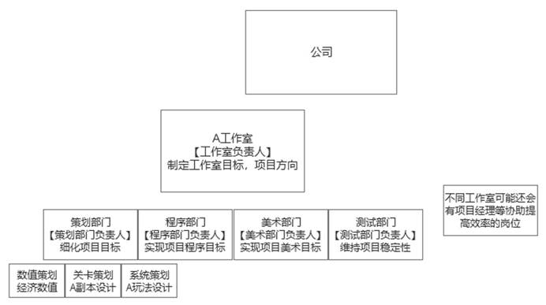

（二）工作室工作内容

下面描述一下工作室的工作内容。

策划部门类似互联网行业的产品经理，根据游戏品类有更详细的职责划分。部门是项目的发起者，对整个工作有较大影响（见后面例子）。部门对学历要求高，校招不低于985/211，主要工作内容是根据工作室负责人（通常为公司副总裁或类似级别）的版本目标，由策划部门负责人（制作人和主策划）拆解需求，再由具体策划完善需求方案。大多数策划的工作也是执行向的，个人无法影响决策方向。

程序部门主要为软件工程方向的程序员，对学历要求高，校招不低于985/211，但大多数程序的工作是实现表现层的重复劳动，得不到技术成长和积累，也接触不到底层框架设计与更富有技术含量的工作内容。而程序的工作内容主要源于策划的需求方案，当需求发生变更时会产生较多的重复修改，大部分情况下既浪费了大量时间，又增加了策划与程序的矛盾。

 

美术部门相对自主（游戏行业美术品质权重较高，所以部分公司中有较高的自主权甚至主导权），更多专注于达到更好地视觉效果（原画、模型、动作、特效等），但容易脱离需求本身。往往导致美术部门给出了自认为的好看设计（例如画风、表现内容），优先做了不重要的内容，由于工期紧张重要的东西砍掉不做了。他们与策划部门沟通成本较大，容易对于自己的工作内容产生挫败感，以及与策划部门产生矛盾（需求变更、不认同设计等）。

测试部门往往是压力最大的部门，他们的工作内容受制于其他工种，工作时间是由截止时间倒推的，所以工作压力较大，承担了上游的返工等问题衍生的结果。在版本末期爆发出较多程序问题（bug），策划问题（设计漏洞）等，容易和程序策划部门产生冲突。某种程度上是公司把不同工种间的沟通和试错成本转嫁到了员工身上。

（三）拍脑袋的决策

公司决策往往是拍脑袋，当工作室负责人或策划部门负责人有了新的想法，往往是完全推翻之前的方案重新设计，并会尽快推进到程序环节。这里举一个典型例子。

某次，工作室负责人开会说：“最近看了XX剧唐朝背景还有武侠风格和咱们差不多，他们的刺客暗杀的感觉特别棒，各部门推进下加点这种元素做出来这种盛世长安的感觉。”

策划部门负责人为了落实工作室负责人的指令，召集开会说：“这样，我们可以加个潜行玩法，主线剧情改改，把潜行玩法塞进去。大家跟美术对一下场景需求，找找富丽堂皇那个感觉，这版本把素材替换了。工期不变啊，时间想办法挤挤。还有，所有策划回家看看XX剧，找找感觉。”

负责战斗策划和系统策划的犯难了：“潜行的话，有些战斗底层的逻辑得修改得，需要和程序讨论。再说了，潜行这玩法本身也得从头设计。另外，今天出方案，争取2周做出来，时间是不是太紧了。”

负责剧情/关卡策划的开始抱怨了：“照这么说，主线又得重新翻一遍呗，可还两周出版本了，功能都没有呢！让我们怎么做到主线里！”

程序部门负责人和测试部门负责人一边抱怨，一边压迫下面的员工：“新增个玩法，战斗底层得改，程序腾不出人手啊，而且你两周就要，也没时间测啊。行吧，我们先做个阉割版的，不保证质量啊。”“你们这根本不给测试留时间啊，临封版做新功能，我们不保证稳定性啊。稳定包打不出来都加班，谁都别走。”

美术部门负责人直接开怼：“又要改风格，那之前排期的东西就往后推了啊。”

这就是一个典型的拍脑袋决策。由于截止工期往往不变，员工不得不加大工作量，甚至不断加班，试错成本完全由底层员工消化。这种工作模式导致工作内容不确定、压力大。

（四）层级划分与薪资体系

| 程序职级           | 薪资范围           | 策划职级           | 薪资范围           |
|-|-|-|-|
| 技术合伙人         | ？？+股权          | 制作人             | ？？+股权          |
| 资深技术专家       | 50k~65k           | 执行制作人         | 30k-50k+项目奖金   |
| 高级技术专家       | 40k~55k           | 主策划             | 20k-30k            |
| 技术专家           | 30k~45k           | 组长               | 15k-20k            |
| 资深工程师         | 20k~30k           | 战斗、系统、数值…  | 10k-15k            |
| 高级工程师         | 15k~20k           | 执行策划           | 9k-12k             |
| 实习生/校招        | 12k-15k            | 实习生/校招        | 7k-10k             |

注：上表以程序部门和策划部门为例。

所有制决定分配，地位决定收入。所以，首先来考察一下公司内部的层级划分。

工作室负责人往往是公司的高管兼任（cto、总裁等），拥有最大的权利，根据该工作室历史营收状况享有公司对应的资源和分配权。工作室负责人有人事任免权和财产处置权，例如任免该工作室的部门负责人、决定项目方向、奖金可分配比例。

部门负责人（编者注：似乎对应上表的技术合伙人与制作人）往往是游戏研发团队中的实际控制者，拥有由工作室负责人下放的人事任免权和财产处置权。各部门负责人可以决定自己的招人标准和实际决策，各部门负责人可以决定本部门内奖金分配比例。

技术专家（例如后端、前端、UI框架等方向的技术专家）或策划组长（系统、战斗、数值、关卡等）只是高级打工者，可以安排、分配具体工作。另外，他们还是下属员工考核的主要评价来源。

再往下就是具体执行人员了。

一般而言，应届毕业生是工程师，工作一到两年是高级工程师，工作三年以上一般就具备评为资深工程师的条件了，但是职级的评定并不是单纯看工作年限，而更多的依据在自己的工作简历和面试中表现出来的工作经验之多寡、技术水平之高低。从技术专家往上，一般的说，除了要求有相应的技术水平，也会对是否有相应的管理经验进行考量。越是高层的职位其任命越是复杂，越是不会单纯考虑被任命人的经验和资历。

员工的薪资调整也相对不确定，基本为每个部门有一定调薪额度，部门领导自己分配到成员身上，所以员工害怕上司。如果不和上司搞好关系，容易出现薪资原地踏步。另外，公司业绩不佳，也会出现调薪额度整体降低。例：调研人员A是校招在公司一直做了接近五年的程序员，入职时薪资11k、离职时17k，在接近五年的时间里只上涨了6k远低于同等级的市场价值。

总的来说员工的晋升（薪资和职级）都依赖更上级的领导评价以及部门需求，除了员工个人能力外，薪资的提升受到公司经营状况、提薪额度影响；职级晋升受制于晋升职位空缺数量。和大多数互联网公司情况一样，个人努力的提升远不如正确赛道带来的收益。相同的努力会带来完全不同的收益。如之前知乎上郭同学每一步踩在风口上可以29岁财务自由，行业内也听说网易阴阳师项目出来的普通数值策划5W起步。

### 三、压迫、剥削制度与文化

（一）福利逐步削减

公司是行业内名声较好压力较小的养老型公司，可就像互联网行业表面高薪的假象，当公司业绩不佳或试图从员工身上榨取更多剩余价值时，那些看似美好的福利显得脆弱不堪。

公司早期宣传的例如年度旅游等福利，很快就只存在于历史文件中。每天加班到9点可以获得25元餐补，并且该餐补是由大于等于该额度的餐饮类发票申请获得，也就是公司支出是由餐饮抵税得来，员工报销流程极度冗长且有时限。

员工手册禁止交流薪资、员工守则等相关话题（如果违反会以开除威胁）。在访谈过程中也确实感受到了中大型游戏公司的员工更容易产生“利己者”特质，希望争取自身权益，面对一些行业潜规则更倾向于明哲保身，确保自身“当前还不错”的地位不要受到侵害，不太愿意透露工资信息等。

项目上线奖金拆分为多次逐步发放（大多是半年甚至一年），有时营收情况不佳甚至不发奖金。因此，无法了解早期奖金发放情况，只是知道是此类发放方式。经进一步调查了解，公司近3-4年未发放项目奖金（数据来源于近年的新上线项目），包含公司核心爆款IP续作、公司历年最大投入的核心项目。

（二）制度日益严苛

公司补全法务部门后进行了相关制度的补缺，组织了“员工代表”选拔，并开展了代表大会，尝试民主推行公司的新员工守则，并以此公示为员工集体决议结果。

与员工利益相关性较强的如下：

​1.
按照标准工时规定了员工的工作时长、打卡标准，但是强调了公司可以根据生产状况调整工作时间，员工无条件配合。

​2.
加班必须经过审批，但默认平常加班不允许提交申请（即平时只能免费加班）、周末加班最多只允许提交8小时。

​3. 法定节假日员工可以享受休假，但因工作原因未能休假的，不视为加班。

​4.
员工应优先申请法定年假。实际执行中，员工申请年假外任意休假，会被HR强制调整为年假。

​5.
调休经过申请方可使用，年度内未休的调休需要主动申请，逾期作废。有同事连续每天加班了好几年，调休和年假根本不让用。

​6.
离职时默认无法折算加班费用，员工要求的话会“依法”让员工在交接后调休，即200%的加班费最多只会像正常上班一样退还给你。但是，大部分员工受下一份工作入职时限所限，往往只能放弃调休。

（三）各类加班休假中的违法情况

平时加班。禁止提交此类加班申请，根据工作室情况，有的强制每天加班到9、10点。这类加班没有任何加班费。

周末加班。依规定最多可申请8小时/日，没有加班费，依规定可以使用调休。但是，工作室不一定会批准调休。员工未用完的调休无法折现，超期作废。离职时如有调休，会按前文所述批准调休，但员工受下一份工作入职时限所限，往往放弃调休。

法定节假日加班。公司尽可能避开法定节假日进行加班。法务部新规制定后并未遭遇法定节假日加班情况，所以不了解执行力度。

年假（3倍工资）。最优先使用，先申请了其他假期类型的，会被HR强制修改。

倒休（2倍工资）。次优使用，由负责人根据项目情况批复。据了解，一个常年冲刺，日常996偶尔997的项目组员工，即便有倒休也往往无法使用。

事假/病假等常规假。最后使用。如果申请这类休假，按照条例会被强制改为年假，不确定目前条例执行力度（游戏行业的人请假较少习惯了）。病假要求医院开具证明，但根据工作室繁忙程度较多请假往往不批。

整体而言，公司不主动给加班费，请假制度又诸多违规。员工只能靠仲裁等维权途径才能维护自身加班和请假的合法权益。但是，法务部细化了规范流程和要素，导致员工维权很难。以请假为例，员工需提前数天申请，多环节负责人批复；这导致多数请假流程是不合规的，一旦发生劳资纠纷，公司即可以此条例为依据，主张员工违规请假，导致员工一方败诉。

（四）劳动条件变化

相比公司在行业内的历史风评，最显著的变化就是劳动时间的延长、加班情况的愈发严重。过去的加班主要是由于上线节点等游戏行业特性导致的，而目前的加班则作为摊低人员成本，对冲决策失误的重要手段。部门负责人甚至公开说，“行业内都这样，别人加班我们不加就输了，这种模式挺好的，打算引进到公司”。

公司对于员工健康漠不关心，甚至将其合理化为行业特点。管理者说，“我胃/颈椎/心脏……也不好，没办法，这行业就这样，想做出头就得拼，你们年轻人更得多奋斗。”

由于公司和行业马太效应的加剧，大多数人都是陪跑者，为了不被淘汰，工作压力越来越大。管理方面层层下压业绩压力，公司业绩压力大，需要各个工作室想办法创收和提高产品竞争力，各部门只能应承下来。同一个项目，员工需要在更短的时间内做完，这导致更多的工作。上级拍脑袋的决策，使得结果更不确定，同事间陷入了互相甩锅内耗的模式，所有人都在转嫁问题而非解决问题。

收入方面，在早期确实较其他行业更高（新兴行业红利），但与其说是薪资待遇好，不如说是行业早期成功率高。中期由于更成熟的研发体系，以及大厂资源优势凸显，中小公司只能以创意求新尝试占据一席之地，此时大部分从业者薪资偏高（没早期和其他行业差距那么大了），但失业风险大，只有头部公司维持着稳定的具有竞争力的薪资。目前该公司到了瓶颈期，大厂在有条不紊地进行技术升级、新品类布局，高薪收割人才、收购整合创新型工作室。对多数人而言，薪资较之前几乎没有变化（各行业都强化了压榨力度，收入被稀释），劳动强度却极度增大，实际收入购买力极度缩水。

### 四、员工思想

如上所述，大部分员工处于明哲保身的状态，剩下的员工则较为极端，应届生社会达尔文的倾向似乎更重（也是经受毒打太少），有的看到前阵子游戏行业暴力清退员工等信息，甚至会认为，“这个行业就是这样的，身体熬不起就别来，身体不行了管公司要赔偿就是讹诈”。这样的应届生不多，但容易占领员工的发声途径，甚至被当做“优秀员工”宣传，倒逼其他员工自我剥削。30岁以上的职场老油条则更加习惯摸鱼，认为“反正这行业都这样，这边还轻松点”。

公司在这种氛围下也形成了恶性循环，自己必须出高于市场价的成本，才可以招到大厂挑剩下的人，在培养成本更高的情况下，好不容易培养出的中层人才，在这种氛围和待遇下又会轻易地被大厂挖走。核心人员流失率高，导致公司难以构建自身的核心竞争力和人才培养体系，形成恶性循环。

互联网从业者大多在别人眼里光鲜，自己又觉得苦逼。时而感觉自己一无所谓是个无产者，时而嫌弃其他无产者或被其他无产者嫌弃背叛了阶级，显得十分分裂。据我了解大部分互联网从业者的高薪，是几乎牺牲了全部的个人时间换来的。与此同时这个收入显得十分尴尬，看似在消费层面上拥有着极高的自由度，实则发现能改变生活和阶层的东西却一样都买不起。与其说互联网从业者赚着高薪肆意享受生活，不如说他们在自己仅剩的一点时间里疯狂花钱镇痛，用消费主义麻痹自己让自己感受到生活的意义奋斗的价值。

我们都一样，有人出卖力气，有人出卖身体，现在肉体价值被压的越来越低了，一些人开始选择出卖目前价格还可以的脑子。但本质上，我们出卖了自己。生活中自己越来越像个零件，自我越来越少，工作越来越多。每个人原本都是希望自己可以成材、与他人形成一片森林，却被这个世界逐渐打磨的变成了柴火，烧的慢了还被资本埋怨那么多木头烂在地里，想当柴火都当不上。

我个人对于未来倒是和大多数人的看法不同，争取利益等本质上在我看来是缘木求鱼，只要在公司的框架下，就是在别人制定的规则下玩游戏。至少在脑力工作者的领域，我倾向于未来是没有公司概念的，每个人都是合伙人（既是甲方也是乙方），各取所需地进行商业合作。类似自媒体的模式，强化个体，把公司消解为真正创造价值的一个个个体。

 

 

 

第十四章 某独角兽互联网公司调研
-------------------------------

编者按：这是一篇优秀的调研报告。详细描述了公司的层级体系和劳动过程，并具体讲述了公司是怎么样压迫员工的，以及员工对公司压迫的反应。从报告中我们可以看到，该公司绝大多数人处于底层，是典型的脑力无产者，少部分人是管理人员，其中中低层管理人员是新兴小资产阶级，高级管理人员属于资产阶级。脑力无产者在巨大的压迫面前抱怨越来越多，当前主要的反抗方式仍然仅仅是离职这样的消极反抗，但团结的种子已经在他们心中种下了。

### 一、发展历史

该公司是一家互联网创业公司，2016年及以前，这家公司由于其业务并没有足够的市场需求，因此一直处于不温不火的状态，人数也只有一两百人。在业务转型之前，还曾经发生过较大比例的裁员。2016年下半年做出了转变业务方向的决定，趁着当时的风口，也趁着行内竞争的特殊情况及其战略的正确，更由于全体员工的拼搏，公司开始飞速发展。2017年底，公司大约有800人，2019年底，已经发展到了5000人以上，而此时，公司的每月活跃用户也达到上千万人，每年的收入也达到了数十亿。两三年内，公司就由一家很小的创业公司发展为了很大的准独角兽公司。

### 二、管理体系

（一）分工与部门划分

| 部门      | 技术      | 运营      | 人事行政  | 法务      | 客服      | 公关      | 财务      |
|-|-|-|-|-|-|-|-|
| 人数      | 1000+     | 3000+     | 100+      | 20+       | 100+      | 10+       | 10+       |

公司首先按照分工进行部门划分，同时也按照业务线来划分运营部门。与一般的互联网公司内部的职能分工类似，有负责软硬件技术的技术部门、负责业务运营的运营部门、
客服部门、公关部门、人力资源管理部门、行政部门、
法律、财务等等。也与许多公司类似，每个大的业务线由一个相应的事业部管理，而每个事业部则由一个副总裁来管理。
下面说一下这些部门的职责与大概的规模。

技术部门：该部门分为软硬件两大块，大概共有1000多人，大部分为本科以上学历。在公司初创时期及至千人规模以内时，由于公司在人才市场竞争中的地位不高，因此其对入职人员的学历要求也相对较低，那时大专学历也可以入职。后来公司规模较大了，在市场上有了一定的知名度，因而在人才市场上的竞争力增强了，于是入职的要求也就提高到了本科以上，甚至是较好的高校本科以上。

软件部门负责开发软件服务。在软件部门内既有与各个业务线相匹配的技术开发大组（包含后端与前端），还有基础开发、大数据、数据分析、算法等通用型技术组。
硬件部门也是按照各条业务线分别有相应的组。

在技术部门内，除程序员外，还有负责产品设计的产品经理，负责产品验收的测试人员，同时也有项目经理组（只负责帮助督促项目进度，但本身并无权力的项目经理，并非真的经理）。程序员、测试人员、项目经理的协作方式一般如下：产品经理负责根据运营方的需求并设计软硬件产品方案，将其交给程序员进行实现，程序员实现后由测试人员按照既定方案进行测试，保证产品功能和性能都能通过验收再上线。

在技术部门内部，产品、开发、测试之间经常会有一些矛盾。比如，有时候产品认为开发没有按照既定的方案开发，因此要求更改，开发则可能因此被迫加班，又或者开发认为是产品没有讲清楚方案要求；测试也有可能会不通过开发人员的代码成果，要求其更改，如果开发总是出错，测试人员也被迫需要跟着加班，也会有一些不爽。如果对于这个矛盾处理的不好，那么产品和开发人员就很容易闹矛盾，甚至会经常吵起来。在这种时候，好像产品就是代表资方的，而开发人员就是被压迫的劳动者。然而，
像这种同等地位但是不同分工的员工之间的矛盾只是人民内部矛盾，有的时候矛盾很尖锐实际上是由劳资矛盾所带来的。如果处理得好，相互体谅，都能够理解对方的不容易，都能够理解到大家都只是打工的，没有必要相互为难，那么也能够处得比较融洽。

运营部门：运营部门是规模最大的部门，有3000多人，占据了公司人员的绝大部分，该部门分为面向用户和面向设备这两大块。如前文所述，运营部门并非一个独立完整的部门，而是按照事业部进行划分，即每个事业部门都有其相应的运营部。

面向公司设备的运营。该公司有大量设备供用户使用，因此需要人来维护和运营。运营人员没有学历要求，在公司的地位相当于工厂的普工。除了有全职的运营人员，还有兼职的运营人员，而兼职人员的成本相对更低。

面向用户的运营，即负责用户的增长，营收增长等工作。他们需要根据用户的需求和习惯制定广告投放策略、价格策略等等来实现目标。大数据杀熟就是他们实现营收增长的一个策略。

由于运营部门是直接面向用户的需求的，因此他们对于公司的其他部门来说就是需求部门，他们在公司中占据着强势地位。

客服部门：客服部门主要负责接待用户的咨询和投诉，大约100多人，他们的主要工作就是接听电话。由于用户投诉量与订单量关系较大，因此在不同的月份和季度波动很大。公司将很大一部分工作外包出去，这样需求量少时即可马上减少人员，节省成本。客服部门在回答用户问题的时候，需要马上查阅用户资料，因此也需要开发一个系统来提取、展现和分析用户，这也是对技术软件部门的需求。

公关部门：该行业是一个与各个城市政策紧密相关的行业，如果政府关系和政策把握不好，就会带来巨大损失，因此需要有专门的部门来发展、维护与政府的关系，能够把握政府政策。

人力资源部门：负责人员招聘、考勤、奖惩等工作，是公司管理和压迫员工的极其重要的部门。主要有两部分，第一部分是负责人员招聘的，该部分职员需要按照其他部门的要求帮助招聘，因此与其他部门关系较为平等，相处时相对比较融洽。另一部分则仿照阿里的政委制度，由派驻各个业务和技术部门的政委组成。政委与主管一起负责员工的考勤、绩效评定等工作，具有较大的权限，很多人属于狗腿子类型，对上谄媚，对下藐视，在长期的锻炼中形成了一双势利眼。很多人说阿里、华为等企业用毛泽东思想来管理公司，这其实是无稽之谈。他们只是用了一些当时的字眼而已。红军的政委，是保障无产阶级路线的政治工作者。什么是无产阶级路线，官兵平等、士兵民主（士兵委员会）、打仗是为了建立一个消灭人剥削人呢的社会，这才是无产阶级路线。现在阿里的政委，却是保障资产阶级压迫劳动者的走狗。两者有质的不同。

行政部门：负责服务领导和员工。首先是服务领导，在各种接待和会议时的会场布置、端茶倒水等等。其次，是服务员工，如办公室及各种设备的维护、夜宵的供应等。

法务部门：与公司业务相关法律政策的研究、合同的制定、诉讼等等。以合同而言，对于员工来说，只有两个合同，即期权合同和劳动合同。法律部门就在这两个合同中琢磨着怎样对公司利益最大化，怎样尽量剥夺员工的权益。

财务部门：略。

（二）层级划分与薪资体系

| 职级                     | 薪资范围                 | 职级                     |
|-|-|-|
| 研究员                   | 60k~75k                 | M5                       |
| 资深技术专家             | 50k~65k                 | M4                       |
| 高级技术专家             | 40k~55k                 | M3                       |
| 技术专家                 | 30k~45k                 | M2                       |
| 资深工程师               | 20k~30k                 | M1                       |
| 高级工程师               | 15k~20k                 |                          |
| 工程师                   | 15k左右                  |                          |

所有制决定分配，地位决定收入。所以，首先来考察一下公司内部的层级划分。

按照程序员来看职级的划分。首先，按照技术等级划分，分别为工程师、高级工程师、资深工程师、技术专家、高级技术专家、资深技术专家、研究员等，再往上就是副总裁、总裁之类了。其次，按照管理线划分，分别为经理、高级经理、总监、副总裁、总裁。经理与技术专家大致对应，高级经理与高级技术专家和资深技术专家大致对应，总监与资深技术专家或者研究员大致对应。

一般而言，应届毕业生是工程师，工作一到两年是高级工程师，工作三年以上一般就具备评为资深工程师的条件了，但是职级的评定并不是单纯看工作年限，而更多的依据在自己的工作简历和面试中表现出来的工作经验之多寡、技术水平之高低；从技术专家往上，一般的说，除了要求有相应的技术水平，也会对是否有相应的管理经验进行考量。当然，如果是关系户或者是投资人派过来的，那么就很有可能与一般的资历条件不符合了。越是高层的职位其任命越是复杂，越是不会单纯考虑被任命人的经验和资历。

资深工程师及以下一般来说属于纯粹的劳动者，即一线工作者。除了极少数例外，技术专家及以上一般来说都是管理者。简单考察一下一线劳动与管理的分工比例。少的情况下，3~4个一线人员以上就有可能有一个技术专家来管理；多的情况下，一二十个一线工作者由一个技术专家或者高级技术专家来管理的情形；平均来说大约每十个人一线人员对应一个一线管理人员（一线管理人员一般就是技术专家）。

这个一线管理人员的主要工作是什么呢？首先，这个一线管理人员实际上大部分时间并不直接进行生产活动（也就是写代码），他的主要工作是进行项目的规划、跨部门的资源沟通、组内人员的管理等等。有这样一个说法，“不是在开会，就是在开会的路上”，很形象的说明了忙于会议而没有时间实际做事的情形。作为管理人员，他们有他们的生存之道。这样的管理人员可能一个月也写不了几行代码，而是在不停的做一些高大上的规划，不停的开会吹牛。对于他们来说，埋头干活是不行的，重要的是要把ppt做好，要把项目吹好，要把各种关系打理好。很多时候，一个项目的提出并不是真的为了公司的效益如何如何，而是为了自己要立足，要搞业绩。

每3到4个一线管理人员上面有一个二线管理（高级或资深技术专家），二线管理者大约管理50人左右（波动幅度可以有二三十），每几个二线管理之上有一个大的部门领导（总监或副总裁），这个部门领导能够管理几百人。部门领导就属于公司高管了，他们会组成一个高管会议，能够决定公司经营的大政方针。当然，这个高管会议并不是民主的，而是由老板说了算（也就是总裁），而投资人的意见也是极端重要的。

工程师的工资大约在15k左右，一般来说，每上往上一个职级其工资会增加30%左右，但是这也只是个大概的水平，在同一个职级间其实也会有不小的差距。每年的年终奖一般是2个月，但是并不是所有人都有，公司为了更好地压迫员工，会拉开年终奖的差距，通过这样的办法既不用多付一分钱（甚至更少了）又激励和督促员工加班干活。

工程师、高级工程师和资深工程师，负责具体工作，日常负担繁重，处于公司最底层，属于脑力无产者。但他们每年省吃俭用约能存下10万元左右，并且尚存一些上升途径，因此思想意识一定程度受到小资产阶级或资产阶级意识形态的影响，有些人也崇尚竞争、相信资产阶级发家致富那一套。

技术专家、高级技术专家和资深技术专家，脱离具体工作，属于公司中低层管理人员，在生产中有一定的组织生产的权利，并且薪酬一般超过50万/年，属于新兴小资产阶级。他们虽然不掌握生产资料，但是在生产中与生产资料的关系比脑力无产者更为紧密，能够在事实上组织生产，因此比脑力无产者的地位更高，获得的报酬也更多。

研究员（对应总监）及以上，薪酬一般超过100万/年，且有价值数百万至数千万不等的期权，这些期权上市方能兑现，因此他们急迫地压迫员工，希望公司能够早日上市。这些人不从事生产，但却占有了大量的剩余价值，属于公司里面的资产阶级。

（三）劳动过程

下面再说一下互联网公司究竟如何管理员工的劳动，如何把控工作的进展。程序员从事的是脑力劳动，是非标准化的劳动，程序员对于自己的劳动过程还是具有一定的掌控力，就像工场手工业时期的工匠一样。虽然程序员对于自己的劳动有一定的掌控力，但是公司会想方设法不断增强对劳动的掌控和压榨。

进度把控：一般的说，每个项目组会配备一个项目经理（平级的），这个项目经理会帮助拆解任务，把一个可能整体预估下来要一个月完成得任务拆成一天一天的任务，这样可以每天监督整个进展，也能够每天进行一定范围内的问题沟通和协作。

分工协作：一个项目会根据人力和特长分拆成每个人的子任务，子任务之间相互衔接配合，在进度上也会产生相互依赖。这个项目从一开始的时候就要进行方案设计，这样才能明确各个人的子任务，才能设计好各个子任务之间的相互依赖关系。有时候某些人会先将自己的子任务做完，那么他会被安排去帮助别人干活，而这并不会直接给他额外的奖励。员工之间也会经常就技术知识进行共享，就技术方案进行讨论。整体来说，相互协作的同级别的员工之间的关系还算是融洽的。

产品和测试：产品也会经常地来督促开发人员的进度，监督其工作质量。产品和测试就相当于工厂中的质检员，因此常常会和开发人员有一定矛盾。如果需要返工，则加班是必然的。

产品的上线：
互联网产品有一个特点，就是为了不影响用户体验，常常会在半夜上线，也因此开发人员每隔一段时间就可能被迫熬夜甚至通宵。甚至有的公司干脆直接把上班时间延后几个小时，再加上加班的时间，让员工深夜下班。熬夜常常深深地伤害了程序员的身体，也影响了其家庭生活。

### 三、压迫、剥削制度与文化

像其他公司一样，这家公司在发展过程中也不断地采取各种办法加强剥削。这些办法
包括取消或者减少福利、增加工作量、延长工作时间、减少年终奖等等。下面按照大致的时间线来阐述公司如何逐渐增加其对员工的压迫的。

2015年，公司还比较小，老板作为一个资本家的时间也还不够长，貌似还比较人道
。公司的历史文档显示，当时工作到8点以后即可算作加班，在文档中记录下来便可以作为员工申请调休的依据。此外，年假也有10天，远比当前多。由于这样的管理政策，公司员工队伍比较稳定，工作也比较踏实
。

后来公司决定转变业务方向，为了迅速完成技术转型、打开市场，也为了节省人力成本，公司挑选了一些人进入小黑屋，由他们在相当长一段时间内进行高强度工作，
疯狂加班。由于老板也带头加班，技术人员感到受重视和关怀，这段时间也就这样坚持过来了。后来业务终于发展起来了，小黑屋的加班再也没有足够的理由了，于是在员工的要求下取消了。这一段疯狂加班和领导冲锋在前的历史就成为了公司正儿八经的发家史，也成为了公司文化的底蕴和新员工入职的必修课。老板也更是认为能加班、能吃苦就是创业精神。但是，这时老板还不能太放肆，他不得不考虑如果这样做，公司的技术骨干们会怎样想，是否会会集体抗议、集体罢工或者集体辞职。这家公司还太小，而且正处于发展的关键时期，员工队伍人心的稳定事关大局，所以绝不敢冒这样的险
。

随着业务的进一步发展，公司员工总量不断扩大。此时，开始有了一些管理上的小动作。在公司改革的春风中，新上任了一个人力资源领导，他执行老板的意志，要好好抓员工队伍建设。首先，把年假从10天减少到5天。其次，更加注重考勤：以前考勤每天打一次卡就行了，主要是靠领导个人的管理来抓考勤，这是一种相对人性化的办法，现在要规定为必须在10点以前打卡，否则算迟到。而很多员工实际上由于要发布或者各种事情经常比较晚才下班，以前如果很晚下班是可以很晚过来的，如果这样规定那么睡眠就将严重不足，这不能不引起人们的反应。据说有一些公司的中层技术管理直接向老板反应这样规定的不合理，于是这个规定也就不得不取消了。这应当算是技术中层管理还在一定程度上代表着劳动者利益的象征，也是技术人员在公司有着一定地位的象征。公司对员工压迫的增强到这一步遇到了反弹，就只好先暂停了一段时间。

这样的状态持续了大约一年，这一年恰恰是公司业务发展最顺利的时候，是业务扩张最快的时候。这一年结束的时候，员工普遍期望着与业务发展速度相应的涨薪或者奖金。结果事与愿违，奖金不但没有相应的增加，反而总体来说还不如上一年多，至于调薪更是没有。这也相对比较明显地体现了资本与劳动在利益上的差别与对立。这个差别也不能不影响到员工的工作积极性。

然而，这年底年终奖及调薪的不如意还仅仅是个开始，资本才刚刚开始露出它的獠牙。第二年，公司很快发生巨大的变化。很多老员工都在抱怨：“公司不再是以前的公司了，老板也不再是以前的老板了”。下面来说一下公司的变化。

首先，公司引进了阿里的“先进”制度，招聘了大量的hrbp，也就是政委，由政委来帮助各级管理者落实公司的人员管理制度。政委们参与负责员工的考勤、绩效评定、晋升等等，许多政委都是深谙职场之道，懂得如何做资本的狗腿子的人。其次，引进许多拥有阿里工作经验的技术管理者。这样子，就很迅速直接地将阿里的一套管人压人的办法带进来。这些人进来后秉承老板的旨意：一方面对下使劲压迫，提高对员工的要求，迫使员工加班加点；另一方面，他们也向原有的不那么会压迫人、不那么会拍马屁的管理人员提出了挑战：在拍马屁、画大饼和残酷压榨这两个方面他们无疑地都被垄断资本主义大企业训练过而具有更加高人一等的本事。再次，通过开除或者赶走一些人以立威。有些新引进的管理者并不具有坚定的资本立场，因此就被老板们给变相开除了，这无疑给其他的管理者和员工造成了压力。

在这样的氛围下，很多老员工离职了，而许多资本的狗腿子却入职了，再加上新进入的许多员工相互都不认识因而比较分散，这样就很快的改变了公司的整体氛围。首先，加班明显变多了。以前八点走就算加班，现在八点走都好像是在偷懒，很多人都被迫九点以后甚至十点才下班。更有甚者，有一些全新的团队，竟然以业务较新为借口而实行996工作制度，而完全并不比别人多给一毛钱工资，也并不别人多一毛钱奖金，这完全是将摸索新业务的风险都转嫁到员工身上。另外，本来每年有两次调薪机会，结果这一年两次加薪全部取消，有一些员工在公司整整两年都没有涨工资，而物价却不知涨了多少。最后，就是年终奖减少，而且对一部分员工不给年终奖。即便是这样子，老板仍然说员工不努力、不积极，没有创业意识。老板的一句话就是，你看看人家阿里，人家都这么大了，可是晚上十点、十一点，楼里的灯都还是亮的。在老板的眼中，员工只是工作机器，即便已经回家只能睡觉了，人家仍然不满足，还想要在这个基础上再压榨出一些来。不错，这就是阿里的影响，这就是阿里的标杆作用。阿里对劳动者的控制和剥削，无疑是业界的一个标杆，是每一个老板梦寐以求的，所以阿里的工作制度，阿里的管理方式，阿里的管理人员才成为一个又一个老板的追求。也正是因为这样，公司的员工不但会骂自己的老板，也会骂阿里的老板。

### 四、员工思想

面对资本的压迫，员工首先是抱怨与不满。

一，最不满的是没有加薪，也没有足够的年终奖。在他们看来，学阿里也问题不大，但是你不能光学人家怎么压迫员工怎么剥削员工，却给不到相应的薪水和奖金。无疑地，阿里已经是一种高强度的劳动和严重的剥削了，但是毕竟还能够有相对更高的年工资（并非小时工资，实际上就小时工资来看可能会更低）；可是这样的学习方式实在是在人家的压迫和剥削基础上又加重了一重。

二，领导的强硬和不人道的做法。生硬的规定几点几点才能下班，玩命地看考勤，骂员工不够努力，这样的做法就是完全地不把员工当人看，一点也不尊重员工，无疑地，人们感受到了侮辱。

三，加班和超强的工作压力给人们生活带来的不好的影响。没有时间休息，也很久没有时间运动了，身体也变差了；单身者没有时间谈恋爱，有家室者没有时间陪家里人。

四，公司老板和领导们的浮夸风和瞎指挥。常常是领导们根本没有规划好工作方向和方案，就拼了命地让员工加班去完成他那个不成熟的方案。最后，员工花了很大的努力来完成工作，可是并没有工作成绩，而责任却要怪到员工头上。而且，常常是那些会溜须拍马、逢迎领导的人得到更好地待遇，即便他们的工作业绩一般般。这样的情况也无疑地会加重对于领导的不满。当然，这样的不满可能首先是直接指向自己的直属领导或者再上一级，有的时候也会指向公司最高层。但是，这样的浮夸风和瞎指挥毫无疑问是来自于最上面的。一方面是辛勤的劳动而不得休息，一方面是浮夸风和瞎指挥浪费人们的劳动，也浪费人们的青春，这无疑地使人生气。这样的浪费实在是太多了！！！

在有抱怨和不满后，人们会怎么办呢？

首先自发冒出来的第一个想法就是走，正所谓此处不留爷自有留爷处，这一家不行我换一家，跟这个领导不对付我就赶紧换一个公司换一个领导。这正是绝大部分人的想法。然而，就业环境越来越差，996越来越猖獗，似乎每个公司都在变差，走又能走到哪里去呢？这无疑地是每一个员工心理的疑问。于是，很多人会有想去创业的想法，有想转行的想法。然而，创业有风险，互联网的创业已然不现实，其他行业的创业又没有优势，很多去创业的都打了水漂。

在这样的情况下，人们不得不逐渐地想到，996是一个大家都普遍面临的问题，逃并不是出路，向上流动也希望不大，只有靠团结才是出路。而996.icu无疑地就是这样团结的开始。

 

第五部分 其他无产者
===================

第十五章 某区域公务员辅助工作人员工作生活情况调研
-------------------------------------------------

### 一、调研对象所在区域辅助人员基本情况

（一）调研岗位性质

本次调研的工作岗位是辅助体制内某类公务员进行工作的“辅助工作人员”岗位的工作生活情况。以下简称这类岗位为“辅助人员”。需注意的是，此处的“辅助工作人员”与“公务员”的差异有别于“临时工”和“正式工”的差异。“辅助工作人员”本质上已经是另外一个岗位了，只是和“公务员”共同配合进行工作而已。

（二）“招录辅助人员”与“非招录辅助人员”

调研对象所在甲区实行通过考试招录辅助人员，参加该类辅助人员的招录考试需要拥有大专及以上文凭。但同时保留了一些正式名称不为“辅助人员”、但民间也称其为“辅助人员”、并且实际工作内容实际和招录的辅助人员大体一致的岗位，以下我们统称这些岗位为“非招录辅助人员”，通过考试招录的辅助人员称为“招录辅助人员”，有编制的公务员岗位称为“公务员”。“非招录辅助人员”没有任何学历限制。非招录辅助人员数量多于招录辅助人员。

以下凡是以“辅助人员”作为主语进行描述的部分，皆是“招录辅助人员”和“非招录辅助人员”不存在差异的部分。辅助人员考试科目为职业能力测试+专业素质测试。招录辅助人员全部采取人事派遣模式，全部与第三方公司签订劳动合同，再统一派遣至工作岗位。

（三）辅助人员的年龄、性别及地域分布

考取的招录辅助人员分为勤务辅助人员和文职辅助人员，以往年为例，甲区总招录辅助人员数量拟招录人数中的10%为女性。非招录辅助人员中几乎没有女性。根据调研对象的经验，该区域无论是招录辅助人员还是非招录辅助人员，均全部是本地人。非招录辅助人员的年龄方差较大，其中最高年龄可达五十多岁，这其中许多老辅助人员从业达到十几年以上。招录辅助人员中未见到超过35周岁的。

### 二、调研对象个人基本情况

调研对象在2016年开始从事辅助人员工作，非招录辅助人员工作经验三年，之后通过考试开始作为招录辅助人员参加工作，招录辅助人员工作经验两年。其工作和居住所在区域为某发达城市郊区区域。调研对象负责的工作包括：（1）视频监控协调工作；（2）外勤排查工作。以下会对监控和排查的辅助人员工作情况分别进行描述。

### 三、辅助人员工作内容

（一）监控辅助人员工作内容

岗位实行翻班制，24小时岗位有人。一天的工作主要是坐在电脑前，通过视频监控相关信息。如果视频显示异常，即进行人工干预。在工作过程中随时可以去上洗手间。调研对象个人认为其进行的工作内容是非常适合使用AI等自动化方案进行替代的。

负责监控的公务员的工作内容和辅助人员类似，但是同时还要负责指挥辅助人员的工作，另外执法行为必须公务员来执行，辅助人员只能辅助，因为只有相关公务员有执法权。

工作一天中最累的时间是上午，会更忙一些，因为有时上午需要做一些相关的数据报表，该项工作对办公软件能力有一定要求。辅助人员经常需要跟着出去工作。每周固定一天开会，开会时间视专管公务员的心情而定。监控室时常会有领导过来看监控、让辅助人员调取一些数据等，此时通常会让操作的辅助人员感到较为紧张。

（二）外勤排查辅助人员工作内容

外勤排查的辅助人员无论是招录的还是非招录的，工作内容均为协助公务员检查相关人员，对违规违法行为等进行排查。

检查站公务员的工作内容和辅助人员类似，但是同时还要负责指挥辅助人员的工作，另外执法行为必须公务员来执行，辅助人员只能辅助，因为只有相关公务员有执法权。

（三）辅助人员临时增加的工作内容

有时该区域有大型活动（包括该区域有大型演唱会等）则辅助人员们的工作内容会进行临时调整，比如需要调配部分辅助人员前往维护秩序。活动期间通常工作强度会更大，所以辅助人员们大部分不希望有各类活动发生。

有时辅助人员会需要加班，通常是在大型活动或突发情况发生时，但这些情况的薪资几乎是保持不变的。

### 四、辅助人员工作单位配套食宿与活动

住宿方面。单位提供免费的宿舍，部分为上下铺的四人间。由于所有辅助人员均为本区域本地人，所以大家只在值班或者上夜班时才会使用宿舍。

伙食方面。每天早午晚餐均可在单位食堂解决，和公务员共用同一食堂。午休时间为中午11点到1点，晚饭用餐时间不固定，5点后自行前往食堂用餐后就回到岗位换同岗位的其他辅助人员前往用餐。

文娱活动。单位有阅览室、活动室，但是调研对象自己并没有去过，并且单位大部分同事从未使用过阅览室或活动室，因为这样会让领导觉得很闲。

### 五、辅助人员管理结构

（一）上下级关系

管理结构上，无论是监控室还是外勤排查，都是由一位专管公务员管理数名辅助人员，通常同一公务员管理的辅助人员工作性质相同。辅助人员之间没有等级之分，也没有晋升一说，但名义上来说，连续多年被评为优秀的辅助人员在报考相关公务员时可享受“优先录用”。调研对象所在单位有一名非招录辅助人员就是先考取了招录辅助人员，后又考取了公务员而离职。

调研对象没有遇到过专管公务员及其他领导辱骂或殴打辅助人员的情况，也没有听说过任何罚款情况。

公务员和辅助人员的业务能力大体一致；公务员的专业素养会比辅助人员略高；同时工作中对招录和非招录辅助人员的要求规则更多，使得辅助人员会相对略认真一些。

（二）岗位选择情况

无论是非招录还是招录辅助人员，被分配到哪个部门的哪个岗位上，本人是没有发言权的，除非能疏通一些关系才能有机会调到自己更满意的岗位。大部分辅助人员喜欢更自由的岗位，比如被调到监控室的辅助人员就会更希望能去做外勤工作等，因为监控室离领导更近，许多时候工作上受到领导的监督更多。调研对象就曾有一名同事打报告调离了岗位前往其他辅助人员岗位。

### 六、辅助人员工作时间及放假情况

外勤排查工作时间。辅助人员工作时间为4班2运转（包括非招录和招录临时工），做二的两天一天白班（上午8点到下午4点半）一天夜班（下午4点半到上午8点）。公务员工作时间早8晚5，周末双休。

视频监控工作时间。辅助人员工作为两班倒，上午7点到下午7点。依据值班表轮换值班，轮到值班的临时工需要当天通宵值班。公务员工作时间早8晚5，周末双休。

法定节假日。翻班的照常上班，常日班可享受部分天数节假日。

年假、产假与病假。辅助人员通常运气好的话可以请出年假，标准是连休五天。通常来说是否能请出年假需要看专管公务员、专管公务员上级和其上级的上级三级领导是否批准。通常来说逢年过节大概率无法请年假。单位严格执行产假。请病假理论上需要病假单，基本请病假大部分都很容易通过。

### 七、辅助人员收入情况

当前招录辅助人员扣除五险一金后平均收入到手在5000-6000元左右，
五险一金全部缴足，五险一金扣除1000元左右，另外，招录辅助人员在元旦春节会有慰问福利待遇。同市相关基层公务员平均收入约为招录辅助人员的1.7+倍左右。

非招录辅助人员收入通常在4000元左右，五险一金同样扣除1000元，到手3000元左右。

根据调研对象及身边同事的情况，2016年至今招录辅助人员及非招录辅助人员的工资涨幅不大。

### 八、辅助人员其他情况

（一）工会

单位有工会。招录辅助人员和公务员有工会，非招录辅助人员没有工会。每人每年需要向工会上交一百多元的会费，工会会在逢年过节发一些福利，比如在生日时发蛋糕券等。调研对象不清楚工会主席办公室在哪儿，甚至没有听说过有这个概念。

（二）业余生活

调研对象本人每天下班喜欢进行一些运动，除了使用一些健身APP进行自体重训练外（俯卧撑、引体向上等），还包括在小区内的操场进行跑步，偶尔在小区内的游泳馆进行游泳。调研对象平时喜欢使用的娱乐APP主要是抖音、B站，主要用于查资料的APP是知乎。同时，调研对象每月会不定期前往电影院看电影，尤其喜欢美漫系列电影（漫威、DC等）。

根据调研对象的观察，其辅助人员同事中较为年轻的同事业余爱好喜欢KTV、聚餐等，较为年长的同事业余爱好喜欢打牌、钓鱼等（该区域小河小湖较多）。

（三）流动性及职业危险性

无论是非招录辅助人员还是招录辅助人员，调研对象所见到的流动性都非常小，大部分都是老面孔。根据调研对象所述，未听说过哪些辅助人员岗位有常见职业病或者显著的职业危险性。

 

 

第十六章 某三甲医院护士工作生活情况调研报告
-------------------------------------------

编者按：本文是省会城市三甲医院护士群体的调研。但本文调研的对象并不具有代表性，因为其待遇和工作条件明显好于其他同业者。不过，这并不妨碍我们了解这个群体的基本状况。

三甲医院的护士收入相对较高，工作相对轻松，是典型的脑力无产者。她们从事着复杂劳动，工作有一定的技术含量，因此她们劳动力再生产的成本要明显高于简单劳动的体力无产者，“转正后，包括规培两年在内，工作五年以上大约每月到手在1万左右，十年以上约在2万左右。”

医院在公积金缴纳上是违法的，但是她们在工作中感受到的压迫并不强，对自己的收入虽有不满，但认为医院整体的分配是合理的。她们整体的管理相对人性化，能正常享受假期，并有一定的晋升空间。

从文章中可以看出，她们的收入构成和医院的“创收”相关，“绩效工资按照整个科室来算，比如你所在的科室这个月的创收多，那么分到每个人的绩效工资也多”。这是医疗产业化带来的必然结果。

她们工作时间虽然不长，但劳动也并不轻松，同时还有一定的工伤风险。她们工作似乎并不开心，对她们而言，“一天中最开心的时候是下午要下班的时候。”

总体而言，这是一个矛盾并不尖锐（虽然在逐步尖锐）的群体，她们（三甲医院护士）属于无产阶级的上层。

### 一、被调研者信息

被调研者在某省会城市市中心某三甲医院工作，目前是工作第三年，前两年先后在四个科室轮换工作，这个过程称为规培，是专科和本科毕业的护士在入职医院时需要进行的一个在各个科室轮换的阶段。目前被调研者是工作第三年的上半年。

### 二、护士管理

（一）管理结构

医院分为临床科室和非临床科室，每个临床科室都有护士。其中各个非临床科室包括护理部、保卫部等。

护理部中的领导是从护士中晋升上去的，护理部的第一领导是护理部主任，护理部主任分管各个大科室护士长（所有临床科室的护士长都由护理部管理），各个大科室护士长分管该大科室下属的小科室的护士长。每个小科室护士长分管该小科室内的护士，同时每个小科室还会成立一个管理小组来讨论一些管理问题，其中的成员通常为科室中工作时间较长、经验较丰富的护士。

科室中剩余的护士不存在上下级关系，但是会按照职称、年限分为不同的等级。年限取决于护士在该医院工作的时间，职称是护士在满足年限时长规定后，通过考试加上选拔后评上的，选拔标准中包括论文发表等项目。

（二）管理情况

被调研对象认为所在医院管理方式相对宽松，管理人员无辱骂、训斥、或殴打护士的行为。某些科室迟到等情况时需要进行一定数额的罚款，比如出些钱给大家买奶茶等。

护士能正常享受休假，向小科室护士长申请即可。病假比较好请，需要提供病情证明。产假在150-180天左右。年假方面，规培第二年有5天年假，正式上班第一年5天年假。

### 三、 护士员工情况

（一）学历与编制

护士工作第一年是0级护士，从规培结束开始算第一年，之后按照年限升级。硕士学历的护士可以免规培。编制方面，本科、专科是合同工，硕士是人事代理（介于编制和合同工之间），公积金等待遇不同。每年硕士、本科、专科按比例招收。有正式编制的护士极少，只有岁数较大的护士中极少数者有编制。

（二）性别与年龄分布

男女比例在1:15到1:10左右。年龄相对较小，主要在23到30岁之间（占比至少60%）。45岁以上非常少。一般护士长及以上都在40到45岁左右，护理部主任最高可以到50岁左右。医院一直觉得护士人手不够。40岁以上护士就不倒夜班了，部分护士会做到管理岗位，但是还是会参与临床工作。一线岗位相对来说一直比较缺人。

（三）其他信息

地域方面。被调研对象不清楚同事中来自农村或城市的比例。地域方面，来自省外的护士很少，来自市内本地的护士也很少，来自省内其他城市的占大多数。

流动性方面。流动性相对较大，流动原因以跳槽为主，转行不多。和被调研对象同批入院的三年工龄的能留下60%-70%。

### 四、 护士劳动内容

各个科室的护士辛苦程度差异很大，比如ICU等突发情况较大的科室，护士的工作量大、压力重。

除了一些医院特有的科研、教学、记账任务，同一科室的其他非管理岗位的护士的工作内容都是一样的，甚至管理岗位的护士（如护士长等）也会经常参与到常规劳动中。新老护士工作内容相同，但经验相对更丰富的老护士们会负责一些重症病人，因为重症病人的护理难度更高。

（一）内科和外科护士工作内容

有的临床科室是外科科室，有的临床科室是内科科室。

内科科室护士工作内容：基础护理、输液、检测生命体征。

外科科室护士工作内容：除内科科室护士工作内容外，还涉及到要做手术的病人的术前准备和术后护理。

术前准备：以癌症需要进行切除肿瘤手术为例，要进行肠道清理、提醒病人不要进食、抗生素皮试、验血、打针；手术当天早上要再次灌肠、刮毛、消毒。术前准备会在每天早上七点左右对今天要做手术的病人集中在病房进行，可能做一个到一个半小时。术前准备一般都是夜班护士做。

术后护理：如护理引流管等各种管道、伤口护理（观察、换药等）、配制营养液并输入等。手术室有另外的手术护士。护士工作的辛苦程度极大地和病人数量和危急程度相关。

（二）工作时间和白班夜班

护士的白班一般是早上8点上班，晚上6点下班，工作8小时（中间午休2小时）。护士的夜班一般要做到白班护士来上班时才能下班。夜班和白班工作内容差不多，晚上事情会少很多。夜班是轮换的，每名护士被轮换到的频率较低。

一天中最开心的时候是下午要下班的时候。最累的时候是上夜班时病人有突发情况时，由于夜班本身人手较少，会比较辛苦。护士上下班不需要打卡。护士们对白班或夜班没有倾向性，但对工作量有态度，如果工作量过大则会导致护士跳槽等流动情况。除非下班时遇到抢救，不然下班到点直接走即可。一般在突发情况较多的科室才会出现这种情况。

（三）工作时长与加班机制

每天会轮换安排一名机动人员，如果没突发事件的话机动人员就正常在家休息，有突发事件缺人时就让机动人员过来上班增援，但上班多长时间就可以在之后补休息同样长的时间。由于这个机制，护士不存在加班情况。

护士工作没有周末，按照排班来上班
，排班灵活，每周都不一样，根据实际情况来调整。不过每名护士每周严格执行工作40小时（但是被调研者强调说，很多医院并非如此，不具有代表性），如果一周工作时间超过了40小时，则会在之后补休息满相同的时间。被调研者最长曾连续工作过六天没有休息，后面再补的休息。由于护士每天早上需要起床时间较早，如被调研者每天通勤时间仅需5分钟，但也需要早上7点10分就起床，所以连续工作六天时被调研者会觉得比较绝望。

（五）工伤、职业病及其他风险

工伤：有一些科室会有有毒有害物质，比如护士配化疗药物时会有风险，有可能弄洒了会挥发，或者其他方式接触到，就会对人体有害。另外工作过程中有很小的可能性被针刺伤、手术刀片划伤等，并有因此感染上相关病人的疾病的风险。当然这些都是极小概率的事件。工伤的话单位全额报销并帮助治疗。

职业病：会有一些静脉曲张，毕竟会有久站的情况出现。

### 五、 薪酬待遇及福利

（一）工资情况

护士的收入组成为：基本工资+绩效工资+夜班费。

基本工资根据职称划分；夜班费按照夜班次数算钱，按年限划分；绩效工资按照整个科室来算，比如你所在的科室这个月的创收多，那么分到每个人的绩效工资也多，绩效工资的分配比例按照职称和年限来划分。

以下收入情况是根据被调研者的经验、基于被调研者所在医院的情况所写，不具有普遍性。护士的工资，每月扣除大概800多元的五险一金，规培期两年通常到手收入在2500到3000元左右，试用期到手收入在5000到6000元左右。转正后，包括规培两年在内，工作五年以上大约每月到手在1万左右，十年以上约在2万左右。由于绩效收入不同，每月工资有浮动。

医院还在扩建，来了很多新人，新人来了以后工资普遍降低
。对于极少数有编制的护士，被调研者只知道她们的公积金会更高一点，其他不清楚。护士的公积金、社保都是按照底薪缴纳。

（二）食宿提供

不提供住宿或相关补贴。饮食方面，每个月医院会发部分餐补
，一般足够护士一个月的早午餐。医院食堂的盒饭16块一份（普通男生吃一份也正好的量），医院食堂的小碗菜大概普通人一顿吃20多块左右。大部分护士不在医院吃晚餐，仅解决午餐。食堂的口味一般，比外卖差一点。

（三）其他福利

工会过节会发一些东西，厨具、吃的、四件套等，比如每个人生日会发几百块的蛋糕券，党员还会发购物券。交给工会的钱直接在工资里扣掉了，被调研者不清楚具体扣了多少，但知道交的钱很少。

### 六、 日常生活及娱乐

（一）工会及相关活动

护士们都知道工会存在，但都不知道工会主席办公室在哪里。工会会组织社团等活动，如羽毛球社等，但被调研者不清楚社团活动具体情况，因为没参加过。医院有活动室、阅览室、健身房、图书馆等，有些科室还单独配了阅览室（学习的地方）。

（二）日常开销

被调研者表示自己在规培和试用阶段收入无法自给自足，转正后收入可以自给自足。这里需要注意，被调研者本身是该省会城市本地人。以下是被调研者粗略估计的自己当前的每月花销。

交通：300元左右。

伙食：500到700元之间（排除医院给的餐补）。

娱乐社交购物：1000元左右。

房租：1000元（合租）。

（三）租房情况

医院不提供住宿。外地的护士一般和同事同学一起合租等，或者贷款买房。租房渠道包括医院内部的租房群、本地中介、二房东等。也有遇到被二房东欺骗的情况，比如入住房子后发现各种问题但已经退不了钱等情况。

（四）App使用情况

被调研者常用的娱乐App：微信（公众号看得挺多的）、微博、爱奇艺或腾讯视频（看动漫看剧）、B站（每天都会刷）、知乎（每天都会刷）、小红书（一周三次偶尔看）。

被调研者常用的获取资讯的App：主要是微博、公众号、知乎。

### 七、被调研者对社会问题的看法

（一）关于被调研者个人工资水平

被调研者在对比她的同学收入后（去了其他省份省会城市的医院做护士），认为自己的收入偏低。比如她所在的医院，工作5年才能达到1w+以上收入，而她的同学去其他相对较差的城市做护士，2.5年左右就能达到1w以上收入，并且相对被调研者的一天8小时工作时长，她的同学一天7小时工作时长。但是，被调研者又认为她所在的医院的分配是合理的。

（二）关于资历和年限对业务能力的影响

根据被调研者的观察，护士是非常讲究专业知识、熟练程度和经验水平的职业，高年资护士中的优势是临床经验丰富、操作熟练程度高等，但年轻护士也有自己的优势，比如接触新的护理理念和知识较多、有出国等学习机会、科研能力较强等。

（三）关于护士和病人相处情况

被调研者表示，在工作中自己感受到了有至少50%的病人相处起来是不太融洽的，比如病人会经常质疑你、不相信你说的话，自己在百度上查等。虽然被调研者认为她所在的医院反复强调护士们要注意态度、平时要多和病人交流、关注病人的情绪健康，而护士们也执行得不错，但是依旧有许多病人不十分配合工作，使被调研者在工作中产生了一些负面情绪。

（四）关于“为人民服务”

被调研者表示，她可能达不到“为人民服务”那种高度，但是她觉得在医院作为护士来工作，至少能尽量地去帮助别人。在遇到上面提到的“不配合的病人”时也会在内心产生“不想为他服务”的想法，但是还是会控制自己的情绪好好完成工作。

（五）关于整个社会的财富分配问题

被调研者认为，技术高超的外科医生和认真工作的护士，相比较之下比炒股高手和坐收利息的资本拥有者而言，对社会有更大的贡献，但是收入却更少，她认为这个情况是不太合理的。

（六）关于社会主义等意识形态

被调研者表示对这些概念不太了解。了解到这些只有在被调研者最近备考研究生的过程中，学习考研政治时看到过这些概念，但也学得不是很懂，只能尽量把知识点背下来。被调研者表示对于政治事件她是基本不关注的，但对于社会事件她会关注一下。

（七）其他

被调研者认为护士考取本专业的非全日制研究生，是和全日制研究生的分数线一样的；但是毕业后非全的认可度不高，许多医院在计算待遇、评职称等情况时还是要求得有全日制研究生文凭。被调研者认为这件事不太合理，如果是这样的话，开设非全日制研究生的意义何在呢？

被调研者认为在国内考取普通高校研究生并发论文毕业的困难程度，要比出国去一些国外普通高校读研毕业的困难程度更高（比如考研难度更大、读研压力更大、毕业要求更多、读研时间更长等）。然而在医院在招聘及其他需要用到学历的地方，对这些毕业难度不同的研究生学历的认可程度都是一样的，这让被调研者觉得不太合理。注意这里的比较对象都是国内外的“普通高校”而非各类名校。

在谈到研究生自杀问题时，被调研者认为目前高校中更多地是关心导师的学术水平等专业能力，而对导师的品德考核不够。

第十七章 某一线城市滴滴司机（私家车）访谈
-----------------------------------------

### 一、工作时间

宋师傅是河南人，1987年出生。来到该城市五年，干滴滴三年。宋师傅说，“要想赚钱就要早点出来。我一般6点半起来，7点出车，一直跑到晚上9点后才收车。这段时间公司推出奖励（长期伙伴奖），鼓励我们去跑早晚高峰（早上7点到10点，5点到8点），两个月左右跑400单，每个季度能拿1000块左右的奖励。为了跑这个，我肯定要每天早起晚收。”

当问到累不累的时候，宋师傅说，“干什么不是干啊。我以前干快递，八点起来，挤地铁一小时，9点到公司开始上班，一直干到晚上8点半才下班，回家也是九点半。”

乔师傅是江西人，1992年出生，到这个城市七八年了。乔师傅以前在一个公司做桌面维护，后来公司夸了，没办法就出来跑滴滴。乔师傅说，“我干的时间短，也就干了两个月。我们新手要赚钱就要多跑。我都是早上7点来钟出车（有时也晚一些），晚上9点收车。要想收入高，你就要多跑。”

李师傅籍贯年龄不详，专职跑滴滴数年。李师傅说，“我早上6点起床，6点半出车，晚上一般8点才收车，下午也就休息一个小时，刨除吃饭休息，一天要跑11-12个小时。”

除上述三位受访者外，其他滴滴司机也表示工作时间很长，一般而言，每天跑的时间在12小时左右。如果跑白天的，基本都是早上7点出车，往往要晚上8点后才舍得收车。

当问及他们平常有没有休息时，李师傅说，“想休息就休息啊，我们很自由。”而宋师傅却说，“我们看着自由，但是每天一睁眼就两百块钱出去了（此处指成本，后文详述），你得把这钱跑回来啊。跑滴滴的，哪个敢休息，我们一个月能休息一天就不错了。”

### 二、劳动情况和收入

访谈过程中，滴滴师傅普遍表示工作非常累，收入并不高。

宋师傅说，“网约车太累了，想回去上班，但是上班钱又太少了。跑个网约车，感觉还有希望。我有一次周日单很多，一天就跑了1000多。但是这个钱，都是拿命换的。我吃饭不规律，现在已经有胃病了。为了多赚钱，我一个月上跑12天夜班（夜班单好价格高）。”

乔师傅说，“跑车不光累，不光吃饭不规律，还要憋尿，对身体很不好。”

关于收入，宋师傅说，“我一个小时平均跑40多块，一天跑下来400-500块。但是，刨除费用，一个月就8k不到。我给你算个成本。我是私家车，落地上牌大概20万，能跑八年，基本算下来每个月折旧就要2k左右；营运险一年1万，保养费用一年1000多，充电费用一天40-50，这几项加起来一个月大概2.2k；还有罚款，我今年被罚款三次，合计1000块，一个违停500，一个实现变道200，另一次300。
乱七八糟加起来，一个月成本就要将近5k。你说，我们能剩下多少钱？也就不到8k。”

宋师傅接着说道，“我刚开始跑网约车，第一年罚款4000，主要是违停。我记得一次黄线内违停，罚了1000。还有一次斑马线没有礼让行人，罚了500。我是私家车，每公里滴滴抽成大致是20%-25%（宋师傅说以前拿20%，现在拿25%）。”

乔师傅说，“我这是租的公司的车，一个月上缴公司4k+，营运险由公司购买，另外，我还有充电成本，大概一天40+。这样算下来，一个月成本大致在6k。”乔师傅补充说道，“滴滴一单抽成25%到35%（公司车），像我们这些新手，要是想收入稳定在1w+，必须跑到晚上11点。”

当问到李师傅为什么流水这么高，净收入才这么少时，李师傅说，“车没有成本啊，我这个车上牌价15万（李师傅自己的车），8年必须报废，就算能跑八年吧，一个月成本就1500多。再算上每天电费（一天40-50）、损耗、保险（一年一万）、罚款，每个月成本差不多就要3000块。”

其他滴滴师傅也表示，在这样的大城市，一小时也就能跑40多元的流水，一天11小时下来能跑到四五百块（加上休息，实际的出车时间超过13小时），一个月能跑1.2-1.5w左右的毛收入，扣除成本后，大致收入区间也就在8k上下波动。

### 三、生活

多数受访的师傅都会聊聊自己的生活，聊聊他们的辛酸。

宋师傅已经结婚，老婆在老家，全职带着两岁的小孩。宋师傅压力非常大，“车贷房贷压在身上，动都不敢动，房贷3k，车贷4k（前述8k的收入是扣除车贷后的收入），能怎么办？不买房不行啊，媳妇闹。买房也是为了小孩上学，县城买房子，镇上教育哪行啊，学不到什么东西，县城教育好一些。”

宋师傅生活非常节俭，“我吃饭一天30-50，没办法，外面吃饭就是贵。我房租一个月600，就一个单间，在城中村。没有热水器，没有空调，就一个床一个厕所，我也不做饭。好的房子舍不得租，有阳台的房子要1000多。”

说到生活，宋师傅似乎有说不完的话，“压力实在太大了，老婆没有工作。好在父母还有些小生意，一个月能有几千收入，小孩生活费不用我出。我一个月打给老婆一两千，剩下的钱还要还房贷。我每天都是省吃俭用，一年下来大概能攒下2万左右。”

乔师傅也结婚了，但没有小孩。乔师傅和老婆一起在城中村租了一个公寓，1500的房租，一室一厅。乔师傅说，“水电费比较贵，你就算不用水电，他也给你算钱。一个月下来总要扣你两百来块，实际上租房花销是1700块。”

乔师傅老婆在车行上班，干销售，收入不稳定，但大致下来，夫妻两人每个月能有1.5w左右的收入。乔师傅以前是大学生（大专），学计算机的，做过桌面维护，也干过房地产销售。前几年有些积蓄，但是被人忽悠去做了小生意，血本无归。乔师傅笑着说，“做奶茶店亏惨了，年少无知，被割了韭菜。当时用赚的钱买个房就好了，哎。”

乔师傅花钱不算节省，“我每个月开销加起来合计4k+，一家人合计花大几千。每个月能余下几千块钱，但还要还以前欠的一些债务（加盟奶茶店亏的钱）。哎，我们真的属于社会底层了，当然，比工厂的还是好些。
”

说到欠钱，宋师傅补充到，“我当时买房买车都是信用卡套了一部分，现在信用卡还欠好几万。每个月都要还信用卡的钱。我家里有三个pos机，来回倒。”

很多出租车司机在聊到生活的时候，都有一肚子苦水。

一个五十来岁的师傅说，“我之前在国企干，后来下岗，没办法啊，什么活都要干啊，听人说滴滴赚钱就来跑滴滴了。儿子已经上班了，也就是打工的，靠他，根本靠不住，我还得赚钱给他娶媳妇啊。”

一个四十来岁的师傅说，“我之前在一个公司做，这个公司不给加班费，我现在准备去告他。程序都走到二审了，应该能赢。我之前很怕麻烦，后来搞了几次熟悉了，有啥好怕的。本来就没钱，这些钱是我该的。”

### 四、未来

外地的滴滴师傅，很难在这里立足。

宋师傅说，“现在跑车越来越不赚钱了。以前补贴多，现在没有补贴了。我第一年，一个月流水2万多。有时候一个礼拜奖励都六七百。前几年，滴滴两头补贴，现在垄断了，他就开始割韭菜了。以前滴滴有很多优惠券，现在滴滴有啥，啥都没有。”一边抱怨，宋师傅又一边说道，“但是滴滴成功了，它的市值很高。它投了这么多钱，但是现在的市值远高于投资。网约车出来后，把出租车搞得很惨。”

乔师傅说，“以前滴滴赚钱，价格高，车辆没这么多。今年很特殊，很多人没工作就来跑滴滴，充电的时候听其他老司机说，很多其他行业的人都进来跑滴滴了。”

李师傅说，“以前平台还有奖励，现在呢，搞垄断，什么奖励都没有了。单价也调低了，以前30公里的单子小100块，现在最多就60-70块。这两年赚钱越来越少，去年一天能跑六七百，今年一天也就四五百了。”

谈到未来，大家普遍感到很无力。

宋师傅（私家车）说，“我自己没有买社保，实在没钱，想等几年再交。我也不知道以后咋弄，这里买房肯定买不起，但是我必须干下去啊，回家也没活干。过几年再把老婆接过来呗。差不多得了，最近几年把债还一下，希望能缓过来。这个社会就是这样，如果不买房买车，没啥压力，一旦买了，就被绑上去了。”

宋师傅不停地抱怨自己的车买贵了，“哎，这个车买贵了，本来想跑优享，但是不给我升级，业务员说是机器筛选的，气死我了。优享一个月可以多1-2k，可以买好多东西啊。”

乔师傅（公司车）说，“滴滴公司不签劳动合同，也不买社保，就租车给你。干外卖、滴滴，都是被资本压榨的。”

谈到未来的期望，宋师傅说，“过两年把老婆接过来。她也喜欢在一起。但是她过来，我就不能这样跑车了，还要腾时间陪她。希望车子能升级优享，一年多赚1-2万，5年就10万，也能解决好多事情的。还希望小孩能上大学。如果他能读，我就供他读大学，如果他可以，我卖房都供他。但是河南高考很激烈，哎。”

乔师傅补充说，“跑滴滴没有前途。你开车，开两年和二十年没有区别，没有任何技术含量，没有提高。你赚一天就是一天，没有任何前途。我想要做一个有技术含量的职业。我以前学计算机的，但我年龄大了（1992年的），也不能入行程序员。程序员生命周期很短，现在入行做几年就会被解雇。我现在每天开车都在想下一步的事情，想明天的计划。
”然而，乔师傅似乎也不清楚未来能做什么。

### 五、小结

私家车的滴滴司机类似于自带劳动工具的佃户，他们用自己的劳动工具从事劳动，但劳动成果的一部分却会被平台无偿占有。在这里，我们仍将其归于无产阶级，这类群体在劳动条件、劳动时间、工资收入等方面有如下特点。

工作时间长。以白天跑车为例，他们一般在7点出车，晚上9点后才收车，每天出车时间超过14小时。

工作强度大。由于工作时间长，跑车需要精力高度集中，一天工作下来非常疲惫。而跑车吃饭不规律，又要憋尿，长期保持坐姿，因此胃病和前列腺疾病是司机的常见疾病。

收入并不高且呈下滑趋势。刨除成本，到手收入大致在8k上下，这样的收入，是以全年无休，每天工作14小时得来的。一个工厂工人，如果底薪按2200计算，平时每天加班5小时，周末无休且加班13小时，一个月下来也将近7k。因此，滴滴司机的实际小时收入，与工厂工人相差无几。前几年滴滴的收入还不错，随着垄断加剧，滴滴司机收入持续下降，这是所有受访者抱怨最多的事情之一。

意识方面。访谈中曾询问过滴滴师傅，是否知道滴滴司机“搞事情”的事，有人表示听过，有人表示没听过，但多数人都不太关心。

一个整体印象。前几年滴滴司机中，幻想发家致富的比例明显大一些，现在越来越多的人抱怨干滴滴赚不来钱，发家致富的幻想越来越小。但是，很多滴滴司机还是觉得滴滴比上班好，不论是私家车还是公司车，滴滴司机都会觉得干滴滴更自由。他们觉得自己可以按自己安排出车，按自己意愿休息，想干就干，不想干就歇一天。但是，这种所谓的自由却被资本禁锢，每天的成本使得他们不得不早出晚归。工厂的工人还有一些休息，而他们甚至是全年无休。

 

 

 

第六部分 部分小资产阶级群体
===========================

第十八章 困顿于职场的职场女性
-----------------------------

编者按：这篇文章作者用流畅的文笔描述了两位在线教育行业的职场女性。从文章中，我们看到了两位独立、上进的职场女性，有自己的追求，但也受困于资本的压迫；她们追求美好的生活，但工作却让她们没有生活；她们有反抗的萌芽，但却有妥协于现实的环境。

她们是典型的新时代职场女性，她们的生活和消费方式代表着资本希望的中产阶级的方式。她们的工作和生活，又是资本化的媒体所向底层人民宣扬的阶层跃升的方向。通过教育上大学，通过大学进好公司，在好的公司里面好好工作，这样就能过上美好的生活。被资本控制的媒体和教育体系，向底层无产者勾勒的美好生活，不就是这样的生活吗？

但是，这样的生活，是生活吗？无休止的加班，繁琐的流程，冷漠的人际关系，勾心斗角的职场氛围，被加班拖垮的身体，报复性的消费心态，这就是生活吗？如果这是生活，这只是被资本统治的生活。

当资本的蛛网已经遍布全社会，当所有的经济活动都仅仅是在资本蛛网上的活动之时，哪个劳动者的生活不被无休止的工作占据呢，哪个劳动者逃脱得了被资本榨干青春供其增殖的命运？无产阶级不会幻想在资本的统治下，获得美好的生活，小资产阶级在幻想着，但这个幻想正在被资本一点点敲碎。

### 一、引子

A说：只有往死里加班，才能往死里吃好的、穿好的、及时行乐。

B说：公司是一个修罗场，只要在其中，总会看到自己的不足，需要全力以赴，才能不出差错……

不论如何，时代的病症已经在每个人身上无可避免的发生，当时代的风暴酝酿着爆发时，只希望有更多人的已经做好了准备。

本次调研的对象是新兴小资产阶级的女性（此处预先说明，本人不参与并不支持田园女权及恨女症、性别对立的任何论争，纯粹因为朋友多为女性）。

对象一：帝都某大厂的在线教育板块的产品经理（后文称之为A）。A现为某教育产品的负责人。A所在公司采取项目组制，一个项目组的结构如下：教育板块的负责人（大boss，并不实际参与到各项目推进工作中，作为对各项目的总控而存在）、项目负责人（负责协调项目中各部门之间的关系，实际把控项目进度）、项目牵头人（A的角色，直接对项目负责人负责，虽为项目的实际推行者，但在调动其他部门人员时处处受掣肘）、各组配合人员（如其他产品、技术、运营人员等）。

A所在项目组的人数在10-20之间，会随着项目的推进而增加一些人员或者减少一些人员，并不完全固定。另外，A虽在项目组中，起着实际推进的作用（协调安排各项目组人员的工作范围及进度），但并没有人事权及奖金分配权，项目组人员都需要配合A的工作，但A对他们并没有直接的上下级关系也并没有实际的支配权。

对象二：某二线城市在线教育的项目负责人（后文称之为B）。B为运营负责人，下属包括活动运营、新媒体运营、推广等20+人。B对下属人员有直接的支配权，比如新进入人员的面试以及离职人员的批准等。但在薪资及奖金分配上，B的权利并不如行政部门大，岗位薪资范围是人事及财务部门拟定的，在这个范围之内就可以留用。另外，奖金或年度优秀员工等是由行政采取的集体无记名投票产生的，但B具有一定的推荐权。

当然，两者的公司在内部结构情况及人事情况都有很多不同的地方，本文会在择取共同点的基础上，尽可能对具体情况稍加解释。

### 二、基本情况

（一）个人基本情况

她们都出生于小城镇/农村，通过高等教育进入城市。她们是人们眼中的高知女性，是现行教育体制的受益者。但她们却对教育体制有诸多不满，最终选择了在线教育行业。产品经理A，月薪3W左右，年底可有项目奖金及年终奖（16薪），属于大龄单身女青年，租住在二环的公寓，单间，向阳，月租4500元（相当于一个普通工人一个月的工资）。运营负责人B，月薪1.8W+，年终奖（14薪），已婚，在双方父母的支持下买房，两个人共同还房贷，无子（原因是两个人都忙，顾不上生孩子）。

（二）公司的基本情况

在线教育平台近年来得到了一定程度的发展，特别是在成人教育及考研培训方面，疫情期间及疫情之后，在线教育真正站在了风口上，赚足了流量，也更加获得了风投的青睐。

A所在公司的与B所在的在线教育平台大体相同，都有产品团队、研发团队、教师团队、班主任及助教等，还有具体负责运营的团队，运营团队里也增加了数据分析等具体的岗位。

在A与B身上可以看到颇为矛盾的两种状态，一方面因为遭遇过一定的晋升挫折（A是项目实际推动者，且项目也颇有成效，但在上半年的加薪调整中，却因直属boss将利益“输送”给了自己的亲信，A从期望中的加薪20%变成了奖励一个i
watch与几千块奖金），或者公司大规模调整带来的动荡（如B所在公司，因扩张及上市计划而空降了COO、CFO之后，公司一些元老级人物被迫离开），而看到并承认公司制度的冰冷性及人文温度的缺失；另一方面，又因看到公司上层管理人员如大boss及直属boss等也常常加班加点工作，加上受到公司鼓吹的“奋斗”文化的影响，以及高房价、高消费的外在催逼，而认为只有加班奋斗与努力苦干才能最终获得自己的一席之地。一句话说，她们既看到了晋升空间被压缩，又抱侥幸于万一。这也是小资产阶级软弱性的表现之一。

另外，问及公司是否对生育假期后的女性存在歧视，她们均表示目前暂时未发觉。A所在公司员工均为90后员工，大部分为未婚状态，小部分为已婚但未育状态。B提及自己的一个去年刚生育孩子的下属（该下属已在B手下工作多年），认为并不存在歧视现象。但又无意中透露生育后的女性确实存在注意力不能集中、工作效率较低等情况。问及出现这种情况如何解决时，B无奈地说，只能加班啊，工作量固定，她自己效率下降，只能通过加班的方式来追赶。B承认下属很少使用哺乳假（根据劳动法相关规定，哺乳期女性可每天有1小说哺乳假），在她的印象中，下属一周只有1-2次会提前1小时离开。

### 三、加班及福利情况

加班对于在线教育平台来说是普遍的现象，且没有加班工资。加班时间可计入调休，但公司员工手册或者人事入职培训时都会说明：调休时间每年都会在元旦或者春节重新归零，也就意味着未用完或者未使用的调休时间在元旦、春节后便一笔勾销。

A所在公司加班超过996，笔者与A数次在晚上11:00联系时，被A告知还在加班。A所在公司本身就是大小周休息，每天的还加班至深夜（晚上11:00到凌晨2:00）。另外，手机软件如钉钉、企业微信以及公司自己开发的工作软件等，延长了A在家工作的时间，也就意味着即使可以早点回家，在家也依旧被绑在工作之中。用A的话说，她每天睡4-5个小时，其中还有2、3个小时的时间梦到工作。

交谈中，A曾提及项目前期的密闭式产品开发（时间是一个月左右）。此间，公司甚至不允许员工使用手机，她们与外界联系甚少，每天都处于12+小时的工作状态中。精神状态紧绷，导致A不断失眠。另外，她要与技术开发、测试等不停进行会议及产品原型的修改，正常生活如吃饭、休息甚至上厕所等都受到了很大的影响。A
在封闭开发结束后，因身体不适前往医院，最终确诊患上急性膀胱炎。

B所在公司加班也是常态，加班时间并没有A那么长，但若有活动或者遭遇考试期，员工需要在所有时间随时待命。据B描述，有下属长达400小时的调休假（也就是平均每天加班近1.6个小时），因公司元旦清零的规定而作废。在线教育，需要抢占市场也就是所谓的流量入口，抢在竞品前面推出课程、流量获取率及流量转化率等，是员工KPI的重要指标。所以，尽可能压缩项目周期也成为了负责人的能力标准，而这些是需要员工加班加点才能达到的。另外，在B公司，大部分直播课程均在晚上7:00-9:00之间，因此大部分运营人员都需要在此期间留在岗位上。

不仅如此，员工还受困于繁琐的汇报和总结工作。以B公司为例，B公司员工每天要“早汇报、晚总结”，每天早上有项目碰头会，每天下班后要写工作日报（这里强调是下班后，因为如果下班前就已经提交了工作日报，会被上级认定你的工作量并不饱和），每周还要写周报（总结本周工作，安排下周工作）。员工本就很累，还不得不写这些东西应付上级，因为日报与周报是上级评价工作态度的主要参考。此外，员工还要在worktile里，再走一遍流程，完成每日任务跟进及汇报等。繁复的文案、流程和制度化的工作，加重了员工的负担，但却便于互联网公司把人训练成工作的标准件。在这样的制度下，人们成了工作的机器，按照本能去重复着每一个动作。于是，公司得以不断使用年轻人，即那些成本低且好控制，那些无家庭负担且有精力和意愿大量加班的年轻人。

另外，值得注意的是，A、B都提及公司有员工休息室、台球室等一些休闲娱乐空间，但真正用这些空间及设施来休闲的人寥寥无几，这些空间大部分时间会被某个部门当作临时的会议室使用。

A所在公司的五险一金是按照实际工资标准来缴付的，但如产品经理这类岗位的试用期就有6个月。B所在公司五险一金是按照级别来缴付的，一般员工是最低工资标准来缴付的，中层管理以上是按照实际工资来缴付的。

### 四、同事间关系情况

如果说在马尔克斯笔下，孤独成为了布恩迪亚家族乃至整个马孔多小镇的特质，那么可以毫不夸张地说，孤独正慢慢成为现代人的生存方式。某种程度上来说，现代人都是在“套子里的人”，在疫情之下的“隔离”只是借偶然的疫情而成为一种引人注目的现象，但“隔绝”的状态其实早已经渗入到城市人的生活中。

A所在公司为大厂，人事关系更为复杂，因此不时便会有如宫斗剧般的戏码上演。如一些项目进度会，表面上是为了顺利推进项目，实则在会前就已经“招兵买马”，会议开下来也变成了一场“站队会”。

A表示，除了工作对接交流较多的技术及运营之外，对其他同事都很生疏，平常各忙各的，很少交流。比较熟悉的同事或者要好的同事之间交流会有各种小群。小群体范围内交流相当顺畅，说话也会比较随意一些，这些小群也成为了他们平时划水、吐槽的主要渠道之一。

B情况如上，对一起工作较长时间的同事会有一定程度的了解，包括个人生活的一些了解，但对于新加入公司的人甚至下属也并不了解。B所在公司也在全力推行工作的SOP流程，说白了也即将工厂的流水线搬到办公室环境中，为省时高效而让每个执行人员成为整个工作流水线上的一员。

格子间式的工作环境，本来是为了方便相互交流的，但却越来越形成了一种极难被打破甚至大家都害怕去打破的“沉默”状态。因此，一进入这种开敞空间里的100+工位的环境中，便会自觉成为“沉默”的一部分。

与之相应的情况是，公司团建越来越像“任务”，一部分甚至是大部分年轻人对团建（吃饭、唱K、别墅轰趴、拓展训练等）都有一种逃避的心理。就算聚在一起，也大部分是熟人找熟人，熟人扎堆的情况。当然，对于短途或者长途旅游，大部分人都是抱着欢迎的态度的。

### 五、个人成长情况

A为知名高校的理科类研究生，目前已完全脱离了学术研究，仅关注一些学术界知名人物如施一公等的动态与研究成果、学术界的重大事件如关于诺贝尔生物奖得主的一些争论等。个人可利用时间很少，若有空余时间，会用来刷一些热门综艺及热门电视连续剧。对于国内外重大新闻等的了解，大部分来自微信自媒体推送及微博等，但相对关注较少，“新闻过个几天，就成了旧闻，世界该咋样还是咋样，我知不知道都一个样。”这句话既说明了她对于热点报道总是热闹一时却并没有相关的深度追踪结果报告的失望，也在表明现代人特别是部分年轻人对于社会感的疏离。

B虽为文科高校毕业生，但现在读的书大都是职业工具书如《向前一步》《如何高效沟通》等等。B虽然会对于弱势群体产生一种天然的同情感，对一些社会现象产生义愤，但整体上对于时事的关注不如对于行业热点及竞品公司动态的关注。

当然，在加班比较严重的情况下，对A来说，“生活”就是不用加班时多刷几集电视剧或者综艺节目。另一方面，在A身上也出现了报复性消费的现象，如十一黄金周期间会报复性地进行连续性消费，用她的话说：平时连逛街的时间也没有，偶尔周末有时间，也没有人可以一起，所以能有人陪着的时候就要吃好玩好。对B来说，虽然在双方父母的支持下购房，但两个人也要一起还房贷，依然有一定的经济压力。且因为在教育行业工作，所以对于教育资源的分布不均、教育的不公平有更多的感触，在考虑到生育孩子的时候，也在尽量提前准备孩子的教育基金问题，因此觉得与单身生活时相比反而经历了较大的“消费降级”。

### 六、对于996情况的看法

A虽然对于目前的情况多有抱怨，但一因薪资基本满足个人要求，二因加班已成为常态（“工作换来换去，哪里也都得加班”），已默然接受了996状态。问及是否觉得“八小时工作制是应得的权利”时，A觉得“听起来很不错，可惜没法实现。就算被写进了《劳动法》，也照样没啥用。”

B对于加班的状况，觉得可以接受。她认为现在正是职业上升期，职场也如逆水行舟，不进则退。在竞争激烈的情况下，随时都可能会有更年轻、更有能力的人来取代你，因此必须加班加点的提升自己，这样才能立于不败之地。

当被抛给了一个假设场景：若有同事反对加班，并被boss在会议上点名批评时，她们会持什么态度。两人均表示：觉得此同事“要凉”。A认为，自己会在精神上支持此同事，但未必敢跟该同事站在统一战线上正面刚。B则认为，同事犯了职场大忌，不会站在该同事的立场上支持，且认为加班是整个行业的风气，若竞品公司都在加班做项目，我们“溃不成军”，则没法在市场中立足。

此外，当问及当前生活中最糟心的（也是最希望改变的）三件事，A认为是：1.加班太多，整个人都被困在工作状态中，成为了工作的机器；2.对项目具有决定权的人“不懂教育”，产品一旦上线并获得一定市场反响后，往往会“变了味”；3.同事间太淡漠，特别是出差时，明明是一天的行程，但大家都是各走各的。

B认为糟心的是：1.很难处理工作跟生活的平衡关系，所以在生育小孩这件事上一直处于犹豫状态；2.部门之间的协调任务较难处理，处理不好会导致项目整体延滞；3.市场变化迅速，总是有层出不穷的新玩法新热点，要学习的东西太多，而自我充实的时间太少。

综上，当下的新兴小资产阶级身上仍然带有矛盾性与软弱性。虽在一定程度上了解996是对自己生活的压榨，但在没有看到具体的解决方案时，会选择妥协甚至是自动成为了加班文化的一部分。另外，虽然看似对未来及自己目前的生活较为满意，也比较有掌控性，但在内心里也带有很大的迷茫性及不安定性。

### 七、后记

本来是放在编者按写的，但是由于比较长，怕影响大家阅读原文，因此挪到后记了。

本文作者描述了两位独立的职场女性，这两位职场女性有如下特点：

（1）均为小城镇或农村出生，通过自身努力考上大学就读名校。

（2）在职场工作一段时间后晋升到了一定职位，其中一人是某大厂产品经理，某项目牵头人，另一人是项目负责人，有下属20余人。

（3）工资收入明显高于一线劳动者，其中一人（帝都）年薪税前在50w左右，另一人（二线城市）年薪税前在25w左右。

（4）两人在工作中有一定的自主权，但A的权限更多限于协调，并没有对其他人的支配权，也没有人事权及奖金分配权，B有对下属的支配权，但在奖金分配上权限不大。

（5）两人都受苦于无休止的加班，这种加班导致的问题（比如工作和生活无法平衡等等）在她们最糟心的三件事情中均排在第一。

（6）两人均渴望在职场中保持竞争优势或者能进一步升职，这也使得两人均在相当程度主动或被迫认可加班文化，而在面对权益被侵犯时，两人的斗争性也相对较弱。

这样的两位女性，是职场中众多女性的代表，她们是欧美阶层划分中的中产阶级，经济独立、背景光鲜、事业有一定的成就。这样的两位女性，作者将其归为“新兴小资产阶级”。这样的归类，想来会引发各种不同看法，这里编者大致讲讲自己的看法。

列宁对阶级有一个经典定义：“所谓阶级，就是这样一些集团，这些集团在历史上一定社会生产体系中所处的地位不同，对生产资料的关系（这种关系大部分是在法律上明文规定了的）不同，在社会劳动组织中所起的作用不同，因而领得自己所支配的那份社会财富的方式和多寡也不同。所谓阶级，就是这样一些集团，由于它们在一定社会经济结构中所处的地位不同，其中一个集团能够占有另一个集团的劳动。”

列宁时期，小资产阶级主要是自耕农、小商人、小作坊主等等，他们掌握了生产资料，并主要通过自己的劳动使用生产资料，通过商品交换获取货币。小资产阶级不受雇于资本家，也基本不雇佣人（或者非常少），也就是说，他们不无偿占有别人的剩余劳动，也不被人无偿占有自己的剩余劳动。他们受着资本的压迫，却又揣着发家致富的梦想，有一亩三分地的牵挂，总是动摇在反抗和妥协之间。

这就是传统的小资产阶级。但是，随着社会生活的发展，小资产阶级这个概念的内涵也在发展。新兴小资产阶级就是有别于传统小资产阶级的另一个重要群体。

新兴小资产阶级是随着经济的发展而新兴的群体。二战后，随着经济越来越复杂，随着垄断资本所有权和使用权的分离，大公司管理人员作为一个新兴群体诞生了。这个群体又分成两个阶层，高管人员和中层管理人员。

以美国上市公司为例，高管人员名义上可以不享有任何公司股份，但他们在购买、处置生产资料时具有决策权，在生产什么以及怎么生产时具有决策权，在关于公司下属人员的薪资和奖金分配中具有决定权，也就是说，他们在事实上支配了整个公司的生产资料。因此，他们也获得了与这种支配地位相应的薪酬（2019年美国最大350家上市公司CEO的平均实现薪酬为2130万美元），这个薪酬远远高于他们付出的劳动，这个薪酬无疑来源于众多工人的剩余价值。这样，这群哪怕在名义上不占有生产资料的大公司高管群体，毫无疑问成了新兴的资产阶级。

在这个群体之下，是一个执行高管意志，并具体安排、协调劳动的中层管理人员群体。这个群体的人员，主要是大中型公司的部门经理或者相应层级的人员。他们在本部门（本劳动领域）中具有实际安排劳动的权力，能够支配下属从事劳动，对下属的晋升、薪酬、奖金具有一定的话语权，他们的薪酬也明显高于基层的劳动者。这样的一个群体，名义上也不掌握生产资料，但是他们在“社会生产体系中所处的地位”明显有优于基层劳动者，在“社会劳动组织中所起的作用”也比基层劳动者更主动，因此他们也能获得比基层劳动者更多的薪酬，比如某些二线城市传统企业大公司，部门经理薪酬在数十万左右。然而，他们薪酬主要来源并不是劳动者的剩余价值，而是自己的劳动。因此，他们的阶层可类比于传统的小资产阶级，我们称之为新兴小资产阶级。这个群体和传统小资产阶级一样，虽然也受着大资本的压迫，却有些坛坛罐罐舍不得，有些许发家致富的现实可能性让他们魂牵梦绕，在斗争和妥协之间不断动摇。

新兴小资产阶级有别于脑力无产者的重要之处，在于新兴小资产阶级在劳动中的支配权以及对其他劳动人员奖金和人事的权力，但这本身也要辩证地看。工厂一条产线的拉长也能分配劳动，并对普工是否加班有决定权（因此决定了普工的加班工资），但拉长工资和普工差不多，也就4-5k，他们的意识形态和普工也差不多，在斗争中基本也会站在普工一边，这显然不属于新兴小资产阶级。另一方面，某些大型券商的投行工作人员，也许并没有任何下属，但一个资本市场周期内，每年年均薪酬能到50-80w，他们有车有房，谈的是理财，想的是发财，离基层劳动人民较远，似乎归为新兴小资产阶级更为合适。

本文中，作者描述的两位职场女性，有新兴小资产阶级的各种特点，但也并不完全具备，但从抓主要矛盾入手，作者将其归为了新兴小资产阶级的范畴。

关于这一点，各位朋友可以讨论，也欢迎各位朋友讨论。

最后，感谢作者的工作，也感谢两位受访者，祝两位受访的朋友工作顺利，也希望两位受访的朋友以后少一些加班，多一些生活。

 

第十九章 北方某较富裕农村小规模访谈
-----------------------------------

编者按：这篇文章调研了北方某富裕农村的基本情况，大致描述了村庄的结构、经济生产和村民概况，是我们这个调研系列中的第一篇农村访谈，非常难得。在调研中我们看到，这个北方的富裕村，依靠经济作物增加了人民的收入。即使是从事农业，贫富分化已然非常明显，大户出现了雇工，而其他小农仅能靠自己的劳动力维持。但是小农作业不抗天灾，一场病就耗光了某个访谈对象的一生积蓄，这无疑为进一步加速阶层分化。在这里面，我们还看到农村的青壮年劳动力几近缺失，而留在农村的人男性很难脱单。

当然，就如作者所言，这次调研规模不大，还有很多情况了解不透。故此，在此再次诚邀更多的朋友，能够利用自己的便利，去做一些力所能及的调研工作。

### 一、调研背景

A村所在的县以经济作物为主要产业和收入来源，根据资料显示，2019年，该县全体居民人均可支配收入为16159元。其中：城镇居民人均可支配收入为25427元；农村居民人均可支配收入为11108元。

我乘车经过该县农村的途中发现，相较于周围县城的农村，该县农村多半为大棚作业，农业非常发达。A村便是该县的农业典范之一。A村在2010左右开始逐步种植某水果，刚开始几年效益就相对不错，而近几年某水果的涨价更是推动了村庄的发展，目前全村都种植该水果。据我们了解，某水果价格相比十年前，涨了大约四倍，价格波动非常厉害（一直增长）。我们于2020年8月前往并访谈了两位村干部。由于我们去的时间很多人刚好外出务农，所以只访谈了五户村民。

### 二、村庄基本情况

（一）人口与土地

A村共五百零八户，其中贫困户七十一户。据村干部称，由于近几年水果行情好，基本上每户都种，所以年轻人基本都回来了。但是据我们对村民的访谈和观察，农业劳动力依然以四十到六十的中年人为主（不少中年人也是因为家里种地有收入才回来的），只有部分三十多岁的年轻人参与农业劳动，而二十多岁的年轻人几乎没有，都在外打工。村庄在县城买房的人数众多。根据村干部的说法，村里男性单身情况非常严重，彩礼并不多（很少超过十万），主要原因是女性都往城里跑。

A村每户平均拥有土地5亩左右，部分富裕家庭有土地二十多亩（通过土地使用权流转），这些“大户”常年雇人（以邻村的短期临时工为主）——该水果对劳动力的需求非常大。

根据村民的说法，该水果主要是手工劳作，很多工作机械做不了，这似乎使得该村不具有大规模作业的基础。关于这些二十多亩的“大户”，村干部以“很少，只有几家”作为回应，访谈中村民也只提到有“大户”，“大户土地有几十亩吧，具体我都不太清楚，现在这地都乱得很”，因此我无法弄清具体的数据。

据我们对村民的访谈，该村土地使用权的归属以本村人为主，同时存在少量外村的与A村有亲戚关系的农民在该村承包土地。

（二）经济状况与产品销售情况

根据我们的调查，A村每亩土地的纯收入在1到2万元之间。由于该水果种植需要大棚，前期投入较高，一亩投资在四到五万之间（据村支书说，一次投资可坚持十年），因此近几年新种植该水果的村民基本都背负高额贷款（以无息为主）。农民实际上的可支配收入并不是很多。此外，多数村民都加入了合作社，据说不用交任何费用，近几年每年分红几百元（以前几十元）。A村的合作社里面有电商，合作社日常基本处于闲置状态，主要在收获后帮助村民往外销售水果（村干部说，电商主要服务对象是村里的“几家”大户，他们的销售量比较大）。但这里我觉得有一个矛盾，“几家”“二十多亩（前文村干部所言）”的大户在我看来销售量似乎不会大到离谱，所以我猜测村干部在这方面有所隐瞒。这里说一下被访谈村民水果的销售情况，根据村民的反映，由于该村的水果质量高，所以销售都是以客商来村收购为主，今年疫情严重的时候不是收获时间，并没有出现销售受阻现象，其中一位被访者说“用了一个月全部卖出去了”。除客商收购外，我们访谈的这几位“小户”（5亩左右）会通过“站点”向外出售，无一人详细提到“合作社”这个词，而我在路上发现镇里有不少私人开办的中介收购点，这里的“站点”究竟指哪个我们当时没有深究，算是一个遗憾和不足。

该村在全面种植某水果后，多数家庭的收入都增加很多。村干部说，村里目前的特困户主要都是些天灾人祸引起的，这些特困户目前村里给提供了公益性岗位——扫地，一个月四五百元，同时他们将村里的土地流转后每年每亩有四五百元的收入。就我们访谈两个经济非常困难的家庭来看，此说法有一定的根据。村干部还自豪地说：“这两年扶贫人员来我们村，不时说我们这些贫困户好多超过规定收入了。”（大致意思）。

（三）基础设施

道路方面，我们发现村里和村里到耕地的所有路都实现了水泥路，据村干部讲，到耕地的水泥路是这两年刚修的。对比我的老家，到现在还没有把通往耕地的道路实现水泥化，的确说明A村之富裕。该村汽车数量就我们观察不是特别多，以电动三轮和电动车为主。

住宅方面，A村存在一定的差距，但是下限水平较高，没有遇见特别破旧的住宅。部分住宅有多元化的趋势，风格独特，设施新颖，应该是本村较富裕的一批人。

教育方面，村里没有幼儿园和小学，村干部说早都消亡了。小孩子去镇里的幼儿园的较多，每天有校车接送。

医疗方面，村里有一个卫生室，有一位本村医生，药品比较便宜。同时，村里有家庭医生制度，免费上门检查（似乎各村很普遍）

### 三、小结

A村是北方较为富裕的农村，对中国广大贫困农村没有太大参考性，我们这次访谈的规模也太小，了解不够充分。但是，这次访谈也让我们了解到较富裕农村（无法同江浙沪富裕农村相比）农民的部分情况。总的来说，该村农民平均收入水平的确较高。但多数还是小农作业，我们询问了村干部关于农场的问题，回答是A村没有农场，基本都是以家庭为单位，“我们村未来五年都没有可能农场化”。在这种情况下，即使农业优势的村庄，先天不足的家庭（天灾人祸）和普通家庭依然相对于“大户”处于较贫困状态，贫富差距依然较大。在我的推测中，村庄的大户占有的土地应该比我们所访谈到的情况要严重。而实际上村民对于这些贫富差距等现象并没有不满。可见在较富裕农村，从事农业的村民的阶级意识似乎同工人相比要弱很多。

每当回忆起以前，总会有很多感慨。我个人出生于小城市，但小时候所有寒暑假都生活在北方某普通乡村，目睹了传统农业乡村的悲与乐。一方面，小时候的“蹦蹦车”，数年前的面包车，如今的国产小汽车，农村逐渐接入现代化的轨道；另一方面，乡村道德继续败坏（老家村庄赌博成风），基层干部继续劣化（一位朋友的父亲“说事”最爱叫村干部撑场子），幼时乡村的伙伴们几乎全部走向流水线。真是魔幻啊。这不得不让我思考，如果当年我们继续坚持集体化，会是什么样的情景呢？

### 附录：一些访谈片段

具体访谈对象（选取其中两个）

（一）女性C

五十六岁（我访谈时其丈夫一直在旁边，很内向，很少说话）。

C家里有五口人，种植某水果十一年，目前劳动力主要为其丈夫和儿子。孙子只有父亲陪伴，儿媳妇外出打工，每年回家一两次。C的儿子之前一直在外打工，在C四年前得了一场癌症后回家帮助种地。这场疾病基本耗费了C家的积蓄（据称多亏了种植水果收入高，不然都治不起）。在问及村里的贫富差距时，C并未表达出任何不满，“人家屋里的人厉害，挣得钱多嘛”。我们无意间聊到了前三十年，C对之前的时代持否定态度。C对村干部比较信任。

（二）男性B

六十八岁。B的妻子已经瘫痪十几年，基本由B自己照料。同时，B还需耕种土地。由于贷款的数额巨大，B一直对种植水果犹豫不决，直到两三年前才下决心贷款种水果，并将其儿子（一直单身）从深圳叫了回来。我们在试图访谈其儿子时被拒绝，似乎比较内向。B对于村干部也非常信任，说他们在自己刚开始种植某水果时提供了很多技术支持。

（三）村干部

​1. “那现在村里的婚姻情况怎么样，就是单身男性多吗？”

村干部：“挺多的，现在不只是我们村，几乎所有村的光棍的非常多”

“那既然我们这个村比较富裕，是不是会相对好一些”

村干部：“这跟有钱没钱关系还不大，关键是人家一听你住在农村就不愿意了，现在人都往城里住，女方多数都要求县城里面有房子。现在我们村在城里买房的起码有一半还多，还有百分之七八十的家庭买了车，即使这样，还是找不到媳妇”。

​2. “那这些特困户都是什么情况？”

村干部：“比如说有一家，丈夫意外死亡，父亲也去世了，母亲脑梗，就剩儿媳妇还有两个娃娃，没有劳动力了，这种根本就没办法种地。”

​3. “目前临近的镇的那些农场的收益怎么样？”

村干部：“不是特别好，有些利润非常低，投资还非常大”

 

第七部分 典型个体的思想转变
===========================

第二十章 一个工人的思想转变
---------------------------

编者按：这篇文章是一位体力无产者记述自己思想转变的经历，非常难得。从这篇文章我们可以看到，无产阶级接受马克思主义是一个历史必然，但是在这个必然中却充满了各种偶然因素。在当前社会，只有很少的无产者能够遇到足够多的偶然因素促成其接受马克思主义，但是，这样的人无疑将越来越多。

### 一、懵懵懂懂

我出生于1992年，为了规避超生罚款问题，我身份证改成了1995年（3姐是1990年的，必须隔三年）。

2009年我初中毕业后走上社会，这个时候的我懵懵懂懂。我干的第一份工作是在老家当不锈钢学徒。这是一个典型的小作坊，一个老板，一个师傅，一个我。老板揽活，出材料，师傅出技术，我负责打下手。工作时间不长（早8点对晚6点，中午休息两小时），但是非常累。由于要一直蹲着工作，腰常常会非常疼，有时候忍不住站起来伸一下腰，却又感觉双腿发麻甚至抽筋。不锈钢学徒要负责抛光，抛光的时候会出现大量粉尘，这对肺伤害巨大。我每个月能拿到600块钱，没有任何社保，我当时连社保是什么都不知道。

工作虽然累，但是毕竟在老家，吃住在家，没啥压力。我也曾受过工伤，有一次学不锈钢切割，手指被割伤，但并不不严重。当时的我浑浑噩噩，没有任何想法，但却也无忧无虑，虽然在家里没有自由，没有自己独立的空间，却也觉得生活很快乐。直到有一天，师傅让我装顶楼的阳光瓦片（7楼），却什么防护都没有，就系了根绳子。我很恐惧，反复给师傅说我恐高，怕出问题，就因为这个事情，师傅把我裁掉了。这是我人生第一次失业。

我清楚地记得，当时是南非世界杯。虽然失业，但我并不难过，有了大量时间看球玩耍，反倒挺开心。但这也毕竟不能长久，后来有个关系很好的初中同学，把我介绍到他姨开的餐饮店，从此，我开始了长达5年的厨房生涯。

朋友们都下过馆子，但是多数人对餐饮并不熟悉，我大致给大家介绍一下。以我的第一家店为例，这家餐饮店大约15人，除老板外，其他人职位和薪酬大致如下：（1）掌勺三人。一勺，工资6000-7000元。二勺，工资5000元。三勺，工资4000元。（2）案板两人。头砧，工资4000元。二砧，工资3000元。（3）配菜两人，工资2000元。（4）水台、打荷、包仔各两人，工资800-1000元。（4）收银员有人，工资600-800元。

一勺是大佬，老板基本见不到，大佬对我们来说就是老大，是统治阶级。有些大佬是包厨房的（包厨房的不多），比如老板给他一个月五万，他再拿这个钱去雇人，这样的话压迫就更重一些。一勺有自己的圈子，这个圈子相当于管理层。这个圈子里面有头砧，他负责采购，有时候能捞些钱。这个圈子的人往往站在资方立场压迫我们，要是我们有怨言，他们就威胁我们，“是不是不想干了，不想干就走。”

工作时间一般从早上九点到晚上八点，中午从一点休息到五点（有时候中午有客人来了也要去上班），每月休息两天。一般早上九点做准备工作，十点半才能吃早饭（下一顿饭是四点半吃）。我是做水台的，就是杀鱼弄海鲜，工作时间看着不多，但是也累。我们工作环境非常脏，衣服进了厨房总有一股味道，永远去不掉。掌勺的会骂人，有时候他晚上出去赌博输钱了，就会骂我们这些打下手的。有一次掌勺的输了一千多，当天做宴席，下面的人把碟子拿错了，八角的拿成四方的，也不是多大错，结果被掌勺的恶狠狠骂了一顿。

我最初工资600元，包吃住，当时觉得还挺好。我们老板很抠门，逢年过节连个东西都没有，但是好在没有罚款。这种小餐饮店基本都没有社保，加班费更是听都没听过。

这样的工作，一年到头基本存不下钱。

我在老家陆陆续续换过几家餐饮店，基本都是类似的，最坑的是有一家餐饮店，老板娘和政府有关系，专门做旅游团。中午经常有旅游团过来，叫你加班你就加班，根本没有休息，当然，也没有加班费。

直到这个时候，我的思想还是浑浑噩噩的，但是我产生了一个想法，我年轻，我要去闯一下，我要出人头地。

### 二、艰苦度日

2014年我怀揣着梦想，和一个朋友一起就来到了现在这个大城市。才来的时候特别好奇，大城市，钢筋铁骨，现代化气息浓厚。有句话怎么说的来着，如果你恨一个人，你把他送纽约，因为那是地狱，如果你爱一个人，你也把他送纽约，因为那是天堂。这句话太对了，我觉得每一个大城市都是这样。

我来到这里之后又干厨房。这次的店更小，老板三兄弟，我，我同学，一共五人。我每天从早上九点干到晚上十点半（中午两点到五点休息），每周休半天。工资大概一千多，没有任何加班费，也没有社保。工作非常累，以前我只干水台，现在水台和打荷我一个人做，相当于干了两个人的活。工作环境恶劣，又臭又脏，伙食非常差，老板还经常骂人（但是不扣钱）。此外，这个工作会对肠胃造成损害，我每天11点吃早餐，2点吃午餐，晚上10点半才能吃晚餐。这个小老板很努力，睡得晚，起得早，但异常抠门，且不讲良心。他经常把烂鱼给客人，比如喊我杀条烂鲢鱼，我要是不听敢杀了条好的，他就骂我。

2014年11月，老板倒闭了。我为了找工作误入传销，好不容易攒下的几千块钱几乎被骗得精光。我满怀希望来闯荡大城市，以为能出人头地，现实却给我浇了一盆冷水，做厨房太累了，学不到任何东西，社会太坏了，满是尔虞我诈。我非常迷茫，不知道出路在哪里，也就是这个时候，我开始看心灵鸡汤。鸡汤的确有毒，但是对当时的我，却起到了正面作用，他让我还保有一丝希望。我继续寻找未来的出路，我去了很多历史名胜，我想开拓眼界，我觉得这对我未来会有帮助。

2015年5月我回家做手机促销员。这个行业底薪很低，主要靠提成。我们当时业绩是1个月20台。大家为了冲业绩，都是8点上班一直干到晚上10点半，每个月就休息两天，也没有加班费。我最多的时候拿过一个月4000多，但是这样的好日子非常少。我开头还赚了一些钱，但是后来行情越来越差，2016年后半年开始入不敷出，只能靠借贷度日。那个时候盛行消费主义，我钱不多，但是也买，比如买山地自行车。现在想想，这些钱根本不应该花。我最多时欠了花呗好几千块钱，这个月的工资就还上个月的花呗。2017年6月，我们店又垮了，这好像是我干倒闭的第3家店了。我被迫失业，成了佛系青年。我在狭小的出租屋里吃了睡，睡了吃。无聊了就去旁边的特色书店看书，我当时很喜欢一个叫大冰的人写的书，现在想来这个书是心灵鸡汤，但是对挽救濒临颓废的我起了很大作用。

### 三、压迫和转折

我不能颓废下去，我要去找自己的路。这个时候我还是有出人头地的想法，我觉得老家只是CBA，大城市才是NBA，我不能只打CBA，我要去打NBA。当时我看了一部电影，讲绝地武士，把我看得异常激动，我就觉得自己是绝地武士，我把自己想成光明的绝地武士，而把一切压迫我的人（比如我爸）想象成黑暗的西斯，我要打到他们，我要去大城市，寻找更多的绝地武士。

2017年11月，我再次回到现在的大城市，经人介绍进了某大型电子厂。在这里，我第一次了解了什么叫社保，什么叫住房公积金，以及学历有什么用。

由于我适应不了夜班，没做多久我就换到一个零售行业巨头去做店员。而这，成了我一生第一个转折点。来到这家零售巨头之后，我给自己定了两个目标，第一，在这里做满两年；第二，拿到一个大专学历（我报了一个国家开放大学的大专）。

这个零售巨头在当地有各种荣誉，我所在的店是其中一家，最初有员工100人左右。我由于有水台经验，被分到生鲜部去杀鱼。

这个店让我充分体会到了什么叫做资本的压迫。之前再怎么压迫我，至少还有休息时间，这个店我去之后连续干了四十多天，一天休息都没有。我实在受不了要请假，结果领导不准，我和他大吵一顿，从此管理层把我认定为刺头。2019年这家零售巨头发生巨变，由于之前快速扩张财务爆出亏损。公司无耻地进行“优化用工”，说白了就是裁员。我们当时超市100多人，后来锐减到50多人，钱不多，事没少，50个人要干完以前100人的事情，员工内部上下矛盾开始激化。

也就是在这个时候，我认识了一个江西大叔，他是我们店的门卫。大叔是赣州的，性格有些见风使舵，有些现实主义，但是他却成了我思想的领路人。他当时觉得我还不错，下班不吃喝嫖赌，喜欢和人聊时政新闻（我喜欢看老梁的节目），他就开始给我讲很多我从来没听过的事情。我现在清晰地记得，他给我讲过列宁，讲了国家是什么，也讲了法律是什么。他有一次给我讲毛主席，他问我，“毛主席去世的时候这么多人哭，那些人都傻吗？都是被洗脑的吗？”我答不上来，他接着说，“怎么可能傻，这么多人呢，你想想。”然后他给我举例，“毛主席时候，人们的关系多好啊，农忙的时候我去你家帮忙，下次你来给我帮忙，现在呢？都成什么样子了！”他还总结说，“公有制下面人情非常好。那个时候学雷锋，学邱少云，学黄继光。现在呢，表面上在学，背地里很多人却说他们是傻子。为什么会这样？”他还给我讲了很多其他毛主席时代的事情，我听了之后对毛主席很好奇。

这个时候，我一个同学以另一种方式加深了我对这种思想的兴趣。我有个同学，上了大学后（26岁读继续教育大学）有一次争论问题，他说不服我，就直接喷我，“我和你不是一个阶级的”。当时我虽然很生气，但是也很好奇，什么是阶级，我想搞清楚。另一次，这个同学给我说，“你爸经常说，什么都是命，哪有这样，这个是唯心主义”。完了，他还给我讲了唯物辩证法之类的概念，我也很好奇。这个时候我就开始对马克思产生了很大的兴趣。他虽然和我吵架，对我不友善，但是于我而言，却是我思想的第二个启蒙人。我当时很多都理解不了，但是没有关系，他给我讲的，我就记下来，就像牛吃草，先吃再消化。

### 四、质的变化

而我思想真真发生巨变，是在疫情之后。疫情初期每天很早下班，无聊之余学会了科学上网，看到了很多信息。5月后我们恢复工作，但人员再次缩减。管理层给我安排的工作任务更重了，以前3个人的工作，现在就我一个人来做了。每天工作九个小时，每周只休1天，还没有任何加班费，我的怨气越来越大。我不断和江西大叔聊这些，聊我的想法，聊我知道的信息，他觉得我讲这些越来越激进，甚至有些危险，他不太愿意和我聊了。其实，我当时也不太愿意跟他讲了，但是我没有放弃进一步的思考。

2020年7月，我买了《宣言》，囫囵吞枣的看了一遍，其实也看不太懂，但是我一直希望弄懂。后来又买了《毛选》，看了第一篇，讲到哪些人可以团结，哪些人不可以团结，哪些人是我们的敌人，哪些人是我们的朋友。他写到书店的店员、农民、工人、资本家，我觉得都好像，感觉伟人的思想真是很超越。于是就自己找一些公众号，看毛主席的东西。我想搞清楚什么是共产主义，到底能不能实现。我到处找东西看，也就是在这个过程中，我才真正的发生了变化，我了解到，原来社会主义没有雇佣劳动，没有一个阶级对另一个阶级的压迫，没有谁对别人劳动的无偿占有。

也就在这个过程中，我把自己的整个经历都整理出来了。最初的我无忧无虑，什么也不懂；
2010年之后，逐步有了出人头地的想法，这个想法曾长期伴随我，中间有时强烈，有时又破灭；2018经历了电子厂和零售店，这种想法才最终破灭，才慢慢感受到我穷不是我不努力，而是“人家有个好的爹”；学了马克思后，这一切都更加清晰了，回想这几年的经历，觉得马克思讲得太对了，我一辈子打拼，为了什么，不就是给资本家当肥料吗。这个时候我才明白什么叫剥削，什么叫压迫。

现在，我脑子里面还是两股力量在那里打架，一个是要努力向上爬的想法，一个是马克思的思想。也许这种打架还会持续一段时间，毕竟，最初了解真相是很痛苦，很绝望的。但是那又怎么样呢？罗曼罗兰说，看透了生活的本质，依然要热爱生活（某个心灵鸡汤公众号看来的），我愿意做这样的人。

我特别喜欢看NBA，我特别喜欢詹姆斯。我知道他是个资本家，但是他的毅力我仍然钦佩。如果把我的人生比作一场球赛的话，我的目标就是要加盟一支球队，夺得我们无产阶级的总冠军。

 

第二十一章 在起伏中转变：某中小企业主后代的自述
-----------------------------------------------

编者按：这篇文章的作者是一位中小企业主的后代，家庭经历了较大的起伏，在这个起伏中，作者的思想也发生了很大的变化。

当作者的父亲白手起家，从一个无产者变成一个老板的时候，作者很自然地接受了某些宣传，成了标准的粉红。作者在国外留学时期发现，老板的小孩都是粉红，因为他们是获利者。

当作者的父亲生意破产，作者重新沦为无产者之后，作者经历了社会的辛酸，经历了思想的挣扎，这一切的经历，构成了作者改变的必然性，但必然性总是通过无穷的偶然性来开路的。在作者偶然二刷《让子弹飞》之后，满屏的弹幕促使作者去了解这些自己看不懂的话。最终，一个青年回归了真理。

这篇文章非常精彩，值得所有朋友认真阅读。

### 一、大学之前初步的意识

2008年之前，我家是标准的穷人家庭，我父亲在亲戚的工厂里干活，,却得不到重视，甚至于工资也不会因为有“亲属关系”这一层而得到照顾，他最喜欢说的一句话就是“当年口袋里只剩20元过年”。当时我还是一个小学生，因为出生小镇，接触的信息有限，对社会也没什么看法，偶尔会被网上的愤青言论煽动情绪，此外除了学习就是正常的玩乐。

迫于生计，我父亲离开亲戚的工厂，因为了解相关技术，就贷款办了自己的厂，当时恰好是家电下乡以及全面推动房地产和基建的时期，跟随社会的浪潮，我的家庭也因此完成了跨越。

贫穷日子跨越了我大半个童年，但我确实对此没什么印象，也因此，初中之后开始建立世界观的我，接受主流的思想就是水到渠成的事。

初中后，我可以感受到我家庭的些许变化，但影响也不是很大，尽管他们换了进口车，却也与我无关，我亲生父母是相亲结合，没有情感基础，因而早早离异，父亲母亲的概念对我来说也很生疏，总而言之，我和我身边的亲人，其实关系并不是很好，他们赚着自己的钱，忙着自己的事，而我这边则完全是放养状态，探索世界，了解世界，建立世界观，都需要我自己来完成，也因此相比同龄人我或许会有些晚熟，我想这就是所谓的小镇做题家到大城市后和同龄人相比较的感受吧，常识，见识，知识，各方面都不如其他人，当然这些是之后成熟以后和其他人比较而得出，事实上，在小镇中，几乎所有孩子的家教都不是很好，父母忙于工作，孩子们大部分时间都在学校里，而小镇的初中里，混社会又是特别正常的事情，也因此，很多孩子一入初中就会被带歪，对此，因为教育资源的缺失，学校也并没有什么办法，甚至会出现班主任带着学生们霸凌穷人家孩子的情况，作为当初被煽动参与的一份子，我深感惭愧。

高中之后，学生们有了基础的价值观和世界观，高中学生们会开始攀比家庭状况，攀比穿搭，攀比手机，当时我考上的高中虽然不是很好，但也有不少富人家庭出生的孩子，最顶端的是当地某上市集团股东家的孩子，算是学校的风云人物，大部分家庭条件好的孩子，会被老师们优待，放宽学习要求（我也不清楚这到底算不算优待），但这取决于孩子个人想法以及家庭教育，有些家庭可能会因为有了生产资料而不屑于做题这种晋升渠道，如那位学校的风云人物就是走的体育生这条晋升通道，但大部分的富人家庭还是会以优渥的条件来支持孩子的读书，就全镇比例来看，小镇上最好的高中里，富豪家庭以及“中产阶级”家庭比例相对较高，总而言之，有钱其实就可以上好的高中（当然还是需要一定的人脉的），在富人家庭中，送入好学校也就是为了所谓的“人脉”，“见识”。

高中期间，部分老师会说出“要是你们父母是哪个上市集团的股东，你们也不用好好学习，但是你们不是，所以你们只能努力”这样的话语。相关的教育，以及网络上的不少拜金言论，让我的心里开始出现了阶级的萌芽，当然，我自然是不会认为自己是社会的底层，对于“努力就会成功的观点”，我相当认同，毕竟在我眼里，我父亲就是从一穷二白变成一个还算有钱的老板的，但我也理所当然的认为，我不努力就可以得到成功，这些财产，以后自然是要给我的。

基于这样的想法，在高中里，我的学习态度并不是很好，但也不差，三年有两年是分了强化班的，我都因为期末考试考的好而被分配进去（当然都是强化班中的吊车尾），因为吊车尾的缘故，高三班主任有过传呼我家长见面，我父亲当时已经没有在管工厂，而是通过人脉拿到一个工程，高中三年他基本都在外地，所以被叫过去的是我后妈，当时我后妈可能觉得脸面过不去，就对我的班主任吼了一句“你们这种穷书生活该穷一辈子”，这里也要感谢我的班主任没有因为这件事记恨我，我早早地知道了这件事，却也没脸提，到了高中毕业班主任才和我说这件事，我也只能无奈地说一声“她不是我亲妈”，再次感谢无私奉献的老师们，你们是现有体系下无产者家庭孩子获得更好生活的保证(相对，在现在的我看来这没有根本上改变无产者家庭的孩子们的困境，但好老师的存在让他们可以接触到更广阔的世界知晓更多的思想从而做出自己的选择）。

### 二、国外留学与小粉红阶段

高中毕业之后，我以省内二本的分数线考上了省外的一本，教育资源的差距已经是肉眼可见了，某省出来的学生们（大部分）要是大一想考四级算是很轻松的事情，但对于当地的学生们（大部分）来说却并非如此，也因此出现了某省大学大一自己报名考四级而当地省份的大学却需要由学校来限制大家大二才可报名，只有部分英语成绩较好的人可以大一参加考试。同时城市孩子和农村或者小镇孩子的见识差距也十分明显，如农村或小镇孩子不知道高铁票该如何购买，并为此感到恐惧，而城市孩子们平时聊的兴趣爱好或是什么，部分农村及小镇孩子也一问三不知。（这还是在东部省份）

上了半年大学之后，我发现我并不是很喜欢那个专业，因此我提出了我要出国，我家里其实原先在高中就有这样的安排，但因为当时在做工程资金有些紧张就搁置了，然后在上了一年大学并在家休了半年之后（期间考雅思办手续）我开始了出国之旅，当时刚出国我就已经接近20了，在普通家庭中，这个年纪就是应该好好学习并为未来做准备了，但我是没有这个烦恼的，在我和家人眼里，出国就是为了镀金，镀金完之后我可以更好地享受我现有的资源，获得更好的人脉，学习、读书、做题，似乎变得一文不值。

因为雅思没过6（我是真的five,不好好读书），我在国外还读了一年的预科，再由预科转到大学，所谓的预科就相当于花更多的钱省去努力的成本来进入国际上有名声的大学。

预科阶段，除了部分“中产阶级”家庭的孩子会特别努力的读书外，大部分人都是混着过日子，翘课、泡吧、性、品牌成了不少人国外生活的名片。

我有个同学家里通过关系让其进入了北大的一个国际交换项目，上完这边大学之后可以得到双文凭，但其学习很差，也并不认真，在我离开时也还在读预科，甚至考虑之后买个文凭。不得不感叹，大部分小镇做题家不管怎么卷都卷不进的北大文凭，但对富豪而言，这只是轻而易举就能得到的。

过了预科就可以去大学了，国外大学的教育资源确实是很好的，理论和实践会结合，甚至于pre或者各种小组作业也是必要的评判标准，这很锻炼个人，在各方面都可以得到提升，也因此，国外想要不挂科还是要努力的，几万的重修费用对大家来说也是个威胁。国外家庭条件比较好的，普遍有很多的选择，或者说，生活更丰富，学习和做题并不是他们必须的，举三个例子：一位同学很喜欢拳击，大学学的是体育相关专业，一年也会花不少时间在泰国训练，似乎更想当个拳击手；一位同学平常学习也算认真，疫情期间直接安排去哈工大某位教授那边做实习，出来以后接着找实习，见识什么的就远超普通公司的要求；也有休学创业或者去男朋友家里银行实习的等等；当然也有学习是必须的家庭：因为不好好学习真的要回去继承家庭财产。总而言之在教育资源堆叠的情况下，其实不少富豪家庭的孩子都很优秀，也很努力。

我高中同学中也有几个出国留学，偶尔聚会也会交流，在我们眼里，部分沉沦于感官刺激和消费主义的“中产阶级”家庭的孩子是最可悲的，在比上不足比下有余的情况下，他们在国外会快速堕落，贩卖肉体的女孩子有许多，不外乎为了多几个奢侈品，多吊几个凯子。富豪的小孩表示在国外不敢找女朋友，因为无法确认是否是真爱还是只是看中了财产。这里也可以看出富豪对家庭和私有制的维护，在他们眼里，家庭是私有制的基础单位，资产在家庭内进行分配，继承，所以，有外人进入家庭篡夺资产是万万不能的。另外，这种少数几个人的聚会，请的也是“未来的富豪”，讨论的大多是市场如何，家里的现状如何，如果我们创业，可以做什么等等，即使是未来的资本家，也开始下意识地维护自己的阶级统治，与其他资本家结成同盟。

在国外，除了部分因为信仰新自由主义而出国的学生之外，大部分人都会是天然的小粉红，我也是，因为大家都是既得利益者，看问题的角度也和无产阶级有根本的不同，如：国外某城市中心有条街道建造轻轨，从我刚到就开始修建了，2年后还没有结束，我们经常嘲笑：“他们协调和行政能力也太差了，一条轻轨两年还修不完，这要中国早就修完了，也是，他们工作时间这么短，工资还那么高，工人这么舒服，修的完才怪了，不过他们工资高舒服又有什么用呢？他们从生下来就是社会的底层，没有任何渠道晋升，高工资和8小时工作制不过是对他们的腐蚀，让他们不去努力晋升阶级。（打这句话的时候我自己要尬死了，救命）”

我陷入了一种无脑狂热，我认为我有现在的资源和经历是我的家庭努力得到的，只要别人努力自然也可以得到，至于国外努力没用，那是因为他们阶级固化了。是的，中国的资产阶级和民族主义者就是这么双标，我们会认为国外已经阶级固化，在承认国外有阶级的同时却不承认国内也有。我们就是好，我们的经济有快速的发展，我们的人民可以轻松赚钱暴富，我们不是资产阶级，只不过是努力的有钱人罢了。

### 三、家庭变故与社会毒打

在我国外上学的第二年，也就是2018年，
我父亲的某项投资出现了问题，家里的大部分钱都砸了进去，甚至开始变卖资产，我的生活水平骤降，在国外，我不再每顿都出去吃，开始学着买菜自己做饭，事实上，在那时或者在那之前，资本家们的现金流普遍出现了些问题，生活水平或多或少在逐渐下降，在那半年间，每个月两万的零花钱不再按时汇到账上，我体验到了交不起房租被威胁提交黑名单的感觉（远比蛋壳租户们好多了），之后我便回了国，没有再去了，家里已经无法供我继续“镀金”。当时我的思维也还没有转变过来，我还是那个粉红，不过开始为自己的未来感到有些绝望，事实上，这完全可以证明我的言行不一致，我说着努力就可以成功，但当时我其实已经明白了，努力并不能让人成功，不然我也不会感到些许绝望。

最开始，我在我父亲的项目里帮着工作，长白班，一天12小时，从中午12点到晚上12点，这是这一行的标准工作时间，公司里的员工还叫着我少爷，虽然内心有些不喜欢，但我接受了这种地位上的不平等，虚伪至极。但这时候，我也开始接触到了无产阶级，了解到了他们的生活，如有个和我差不多年纪的有了孩子，去上海打工，但赚到的钱连生活费和房租都不够；有不上学出来打工混社会，赚到钱立刻去夜店花掉的；也有前台和某个老板勾搭在一起，为某个老板打探消息的；第一次，我感受到了生活的琐碎，底层人民（那时候还没有阶级这个概念）的不容易。到了过年期间，员工断断续续要回去过年，工作安排我就待在前台一天坐12小时，此时，我心里认为，我这是在给我自己工作，公司好起来的话，那我的生活也变好，所以也没有觉得多累，也还算有动力。不过之后终究是公司没撑住，家里所有的资产全部被扣，我的家庭重新回到了无产阶级的行列中。

之后我只能去投奔我亲生母亲那边，他们给我租了房，让我自己去找工作，第一份工作是奶茶店，一天站9-10个小时很累，与当初在我父亲公司里帮忙工作时不同，此时我失去了动力，我不再是为了自己而工作，也很显然地感受到了各种负面情绪，也就是所谓的“劳动的异化”。在工作的时候我深感自己与生活脱节，看着别人利索的工作，我感受到了自己的无能，当时因为区域经理觉得店里人太多，就让店长给我变成兼职，于是我主动离职，只干了三天。

第二份工作是在幼教做销售，工作9小时（已经是有良心的了），每天电话推销出售课程，在培训过程中甚至被教导我可以利用我的外貌优势来撒娇争取客户，第一次，我感受到了我作为商品时，外貌带来的优势——我成为了商品。于是机械又重复的工作持续了一个月，在我眼里，类似的幼教机构可以说就是骗钱，消费家长们的焦虑，什么都教不了，甚至在话术中要带上欺骗，我对这样的工作与生活不满又绝望，我辞职了，然后我迷失了，我不再出去找工作，整天蹲在家里，玩游戏，看视频，偶尔看些经济相关的知识（我学习的专业），那段时间又正好兴盛入...关学，我把自己的负面情绪宣泄到民族主义上，但毫无意义；同时我又把希望寄托在我父亲身上，渴望重新回到原有的阶级，事实上，即使在资本家失去生产资料以后，也还存在着“人脉”这种资源。在这个圈子里，“人脉”某种程度上甚至比生产资料本身更加重要，也因此，资本家或许会掉落阶级，但也有机会重新回去；同时，我以前的同学也有试着拉我一起创业（也就是之前说的小聚会），从这也可以看出资产阶级的“团结”。总之我开始自暴自弃，不再说努力就可以成功之类的话，我开始认可，这个世界存在阶级壁垒，而一无所有之人，可能永远也无法打破它。（当时还是太过于矫情，不是我不能做，而是我不想做，在大家都在忍受着生活的时候，我成为了逃兵。）

### 四、思想剧变与共产主义

这一切的经历，构成了我改变的必然性，但必然性总是通过无穷的偶然性来开路的。一次偶然的机会，我二刷《让子弹飞》。满屏的弹幕在说着我不太理解的东西，我开始研究，然后，了解到一些我不曾想过的东西（当然其中也有很多阴谋论，但当时确实给了我很大的冲击），突然有人点醒我，当时我就更迷茫了，而这种迷茫盘随着我跌回泥土并在地上挣扎的阵痛，我越来越清晰，不论我是否愿意承认。但是，不承认又如何呢？就连我父亲也不得不承认，现在这个年代，所有的机会都已经被他们抢光了，年轻人已经失去了机会。

我开始变得怨天尤人，和人抱怨为什么会这样，然后声讨，然后控诉。声讨和控诉，也许是因为自己真的这么想，也许只是因为自己阶级掉落回不去而这样。

等我慢慢冷静下来之后，我开始读一些书，开始真的把自己看作无产阶级，同时也学习一些零散的理论，对于学过经济学的我来说（虽然是半吊子），部分经济理论很吸引我，很容易就认可了，而一旦开始认可这些经济理论，我思维中的底层逻辑就发生了变化，我对社会、对世界的看法也有了根本的变化，我知道了一次次经济危机发生的根本原因，知道了现在资产阶级所面临的的困境，知道了未来我将要面对的变革。

我想，经济基础决定上层建筑，也绝对是适用于精神和思想的（字面上的经济基础x），当了解了政治经济学之后，历史和政治中很多东西都有了答案，所以我认为，经济也是同志们必不可少需要学习的科目，毕竟这也是构成社会的基础，可以帮助更好地了解社会，不少精资吹捧资本主义和“努力论”，有一个很重要的点就是不懂经济发展的规律，他们甚至不知道不少资本家也在苦苦挣扎着不让自己阶级掉落呢。

在学习辨别好与不好方面（不论是主义还是政策），我懂得了，对大多数人，对工农群众好的，那就是好的，对少数人好，对多数人不好的，那就是坏的。在学习了这些之后，我很轻松的从民族主义中挣脱了出来。

随着矛盾的加深和经济危机的到来，我想，中下层资本家们的生活水准会逐步下降，其中也会有不少资产阶级家庭失去生产资料变为无产阶级，或许也会有不少人在体验到我体验的这些以后转变思想接纳自己。

同志们，资产阶级最强大的时候，就是他们最虚弱的时候，风暴没有到来，但风暴终会到来。——不过在此之前，我还是得多看看书，理论还是学的太少了。

 

第二十二章 从五毛到美分到共产主义者：一个国企子弟的思想变迁
-----------------------------------------------------------

编者按：青年人作为一个整体，重新认识毛主席，重新回归马克思主义，是一个必然趋势。这是由整个大环境所决定的，不以任何人的意志为转移，这个趋势越来越明显了。

青年人作为一个个体，是否能重新认识毛主席，是否能回归马克思主义，充满了偶然性。这是由青年人个人的阶级背景、成长背景、以及其他社会关系等一系列因素决定的。

每一个重新认识毛主席和重新回归马克思主义的青年人，都经过了不同的路径，都经历了不同的事情。本文作者，最初是一个美分，视毛主席为暴君；公知的谎言破产后，作者又在各种爱国主义宣传下走向了五毛，作者为华为的“耀眼成绩”而“沸腾”，会为任正非熟读毛选而骄傲；但是，在现实的教育下，在作者自身的学习下，作者最终走向了马克思主义。作者走向马克思主义的第一个表现，是“我意识到了阶级才是人的第一属性，民族不是。”这使得作者“对爱国主义有了全新的认识”。

正直善良的青年人，拥有朴素的感情，爱国是天经地义的事情。一部分青年人止步于爱国主义，但越来越多的青年人，通过爱国主义的桥梁，最终走向了共产主义，而这个趋势，是不可避免的。

### 一、我的五毛和美分阶段

总的来说，我对毛主席看法的变化，贯穿了我个人思想转变的全过程。这个过程，在政治光谱上，就是从右端一路向左的的过程。这个转变，产生于理性的分析和不断的理论学习，而不是从那些空洞的口号中得到的。

我出生在一个思想上相对保守的家庭。父母从毕业至今，都是东北某国企的员工。他们都是贫苦出身，虽说是80年代的农村，但有时也难免要饿肚子。我的祖父母辈很能吃苦，在如此艰苦的条件下，硬是把父母供上了大学。参加工作后，当时国企早已改制，就连他们这种“金贵”的，在研究院工作的大学生，为了搞研究，也需要和一线工人一般白班夜班来回倒，比996还要辛苦。而他们国企的领导，在改制后却拿了大钱，在公司的疗养院旁边盖起了一座座别墅（当时人们经常称其为“陵园”），日子过得相当舒坦。年轻时痛苦的记忆，使得他们经常对我说：“你可要好好学习啊，否则将来当个工人，在厂子里工作得多苦啊！”于是，对工人阶级的鄙视和逃避心理，在我幼小的心灵中逐渐形成。

想必各位年龄和我相仿的同志们，小时候都有这么一个印象：国家的一切都是欣欣向荣的，我们的未来是光明的，一切现在的问题，都可以通过GDP解决。至于毛主席呢？他耽误了整整一代人，没有他，春天就会早点来，我们的日子就更好了。这就是我直到大学为止，对毛主席的看法。

同时，那个时代，右翼自由主义者是当时网络舆论的主导者，也就是一些人说的“公知”（当然这个词汇被污名化了）。那时，我接触了一些所谓的关于毛主席和一些革命烈士的“黑历史”。当时的我，坚信他是暴JUN，是想做皇D的人。落入新自由主义话术圈套的我，对毛主席满是厌恶。

有三件事情的发生，开始改变了我对毛主席的看法，甚至从“美分”变成了“五毛”。其一，公知破产。社会的快速变化，以及信息的快速传播，一些“美分”常年编造的谎言也不攻自破了。其二，《那兔》的出现。这部剧赚足了我的眼泪，增长了“民族自信心”。其三，我的毛概老师。我从他的课程中，听到了“两参一改三结合”、“鞍钢宪法”、“四三计划、中美破冰是对外开放的开端”等一系列我听起来很陌生的东西。

此时，我对毛主席有了全新的认识，他不是一个暴君，也不是一个皇帝，他是一个孤独的革命者。但是此时的我，仍没有跳出英雄史观的局限性。我当时对毛的理解就像姜文导演的《让子弹飞》中的张麻子一样，仿佛历史的车轮是他推动的，而人民，只不过是“谁赢他们帮谁”的乌合之众罢了。

这段时间，也是贸易战打得最火热的时期。我会为华为的“耀眼成绩”而“沸腾”，会为任正非熟读毛选而骄傲。但同时，我也有个疑惑：有些“国嘴”，有些“国师”，在号召本国人民爱国的同时，自己却早早到美国享福，都是中国人，理应为自己的祖国奋斗终身，却弄出了“反美是主义，赴美是生意”的闹剧。每当别人拿这些做例子的时候，我都觉得自己无力为此辩驳。这些疑惑，也为我后来的“觉醒”埋下了伏笔。

### 二、疫情和我的变化

今年的疫情，揭开了某些人的遮羞布。随着人民富豪的言论、腾讯阅文事件、阿里的蚂蚁金服、蛋壳公寓垮台背后的租房难等等一系列问题的出现，我看到了资本的为所欲为，网络上也充斥着“盼毛归”的呼声。一些微博大V振聋发聩的动态，让大家（包括我），有了重新拾起毛主席思想的决心。

说来惭愧，当时的我，行动上仅仅停留在网上冲浪跟风喊口号的阶段。有时还会复读一些大V传来的烂梗（比如百万亿十七家之类）。直到有一天，在贴吧上被某位朋友严厉批评了之后，我才冷静了下来：自己一直在网上高喊毛主席思想万岁，可自己却不知道毛主席思想是什么，我跟“乌合之众”又有什么区别呢。于是乎，我下定决心，买了毛选，开始了我的理论学习之路。

随着学习的不断深入，我逐渐开始崇拜毛主席。毕竟，一个在如此年轻的时候就能准确分析出中国的阶级状况，并且能带出一个纪律严明又不乏民主，官兵平等、水平奇高的人民军队的人，谁没有理由崇拜呢？正当我带着收获知识的喜悦向那位贴吧朋友分享成果的时候，我又被泼了一脸冷水：“毛主席不是神，他对时局所做的分析和判断，无不来自于他在湖南地区深入的考察和对马列主义辩证思维的深刻理解。只读毛选而不读马列，就理解不了毛主席思想的来源和灵魂，就不可避免地走上了用神秘主义去分析毛主席的邪路。”

那位贴吧朋友还非常贴心地分享了他的书单：包括但不限于《怎么办？》（列宁批判经济派和工联主义，系统提出先锋队思想的名著），《国家与革命》（无害神像，国家为阶级矛盾的产物），《反杜林论》（马克思主义百科全书）等等。我非常认真地读了这些著作，这些书终于解答了我心中的疑惑。我意识到了阶级才是人的第一属性，民族不是。同时也让我对爱国主义有了全新的认识，我的思想也逐渐向共产主义靠拢。

现在，我也发现，毛主席自始至终，都是从群众中来，到群众中去的革命者。井冈山时期，他的自下而上的路线，就深受中下级军士的爱戴，新中国成立后，“让人说话天塌不下来”，使得他成为了“红太阳”。一位真正的无产阶级战士，是绝对说不出“谁赢他们帮谁”这种英雄主义的幼稚话的。

从此以后，我认识到某些大V是仅仅停留在形式主义的古墓派“毛左”。同时，我也尽可能，像批评过我的那位贴吧朋友那样，鼓励那些停留在喊口号的人，多读理论，系统地认识毛主席思想。毛主席当时面对的群众，很多都是充满封建思想的农民，连这些人都能成为坚定的无产阶级革命战士；如今，随着生产力的发展，无产阶级的队伍规模早已不是当时的吴下阿蒙。在这样的情况下，我们又有什么理由去抱怨呢？

毛选不是圣经，毛泽东思想更不是某种教义。一个真正的马克思主义者，是要学会“扬弃”的。另一方面，毛主席思想是马克思主义的延伸，成为毛主义者首先要成为马克思主义者，如果割裂马克思主义和毛泽东思想，就会陷入“读毛选学创业”的庸俗主义怪圈。也就是说，我们要防止毛主义被神像化，庸俗化。当然了，毛当时的论断有一定的时代性，但这不能成为否定毛主义的理由，正如我们不能用19世纪科学发展的局限性去否定恩格斯的《自然辩证法》一样，我们还是要辩证去看待毛主席思想。

最后，我想用张广天的《毛泽东》的歌词作为本文的结语：

有些歌听起来熟悉充满希望

就好象在多年以前听你演讲

原来这都是些我心中的歌唱

多么啊多么美好 毛泽东

毛泽东 毛泽东 跟你冒着枪林弹雨走！

毛泽东 毛泽东 跟你闲庭信步向前走！

毛泽东 毛泽东 跟你谈笑风声向前走！

毛泽东 毛泽东 跟你忧伤似海向前走！

 

第二十三章 小镇做题家和毛泽东思想：我的思想历程
-----------------------------------------------

编者按：这篇文章写得非常好，首先，好在极具代表性，很有典型意义；其次，好在逻辑清晰，抽丝剥茧地叙述了无产阶级的子女怎么从教育改变阶层的迷梦中醒来；最后，好在作者勇敢地指出了小镇做题家的出路在于重新回归无产阶级。

本文作者是一位“小镇做题家”，也就是说，他出身贫寒，依靠自己的努力考上名校，进入社会后却发现名校并不能改变命运。他在阶层的夹缝中挣扎，社会却不因他的挣扎而停止对他的毒打。在这个大背景下，作者开始接触毛主席的著作。阅读毛主席的著作，让作者获得了观察社会、分析社会的新的工具，作者终于认识到当前高等教育的本质，“本质上是资产阶级为了缓和阶级矛盾，刻意拿出一点资源分给高学历人群，为无产阶级打造了一个取得高学历就能获得高收入的信仰体系……在高学历信仰的毒害下，广大的无产阶级寄希望于自己的下一代，放弃了自己的权益，斗争意识被不断削弱。而他们费尽心血培育出来的高学历的下一代，少数尝到了资本的甜头而迅速转过头来压迫无产阶级，而其他人正为了那点求而未得的残羹冷炙而苦恼，这些人便是小镇做题家。”

更为难得的是，作者不仅认识到了高等教育的本质，还认识到了无产阶级才是小镇做题家真正的朋友，“小镇做题家真正的朋友是含辛茹苦培养自己的无产阶级，就像那只爬到井口的青蛙，它的朋友始终是仍在井底挣扎的其他同类。毛主席说过，知识分子是毛，无产阶级是皮，皮之不存，毛将焉附？小镇做题家真正的敌人是资产阶级，是打造高学历信仰的人。我们不应该感谢这条通道，相反，这条通道是资产阶级用我们父辈的血泪铸成的，应该深刻地认识到建造这条通道的人才是真正的敌人。”

作者在最后说到了小镇做题家和马克思主义的困惑，部分观点我并不赞同。比如作者说，“由于教育资源的马太效应，寒门能考上名校的学生逐渐变少，小镇做题家也将随之减少，能迅速理解马克思主义的群体将缩小。但长期来看，当通道彻底关闭时，必定有更多的人拿起马克思主义和毛泽东思想的武器（只是他们相对没那么快理解）。”其实，资产阶级为了缓和就业压力，是可能扩大招生范围的，虽然被扩招的朋友不是985/211的所谓名校，但是数量巨大，小镇做题家这样的群体只会越来越多。另外，不仅仅是部分小镇做题家走向了劳动人民，部分城市中产家庭的孩子，也在追求真理的道路上勇敢前行，这一点，是需要看到的。

我们的朋友遍天下，我们的歌声传四方。随着社会矛盾日益凸显，这样的人只会越来越多。

### 一、一个小镇做题家的迷茫

我是一个工人家庭出身的小镇做题家，也曾像这个群体里的大多数人一样迷茫。直到接触毛泽东思想之后，我才认识到，小镇做题家的困境主要是没有认清自己的阶级导致的，只有依靠无产阶级才能有真正的未来。

我出生于1996年，家是东南沿海的农村，后来发展成一个小镇，父母都是65后，他们文化水平不高，从事最低级的体力劳动。我的父亲是一名建筑工人，他身上的砖石水泥味伴随着我的成长，长期的重体力劳动让他落下了一身的伤病。我的母亲是一名电子厂工人，做着月休两天，每天工作11小时以上的流水线工作（有时超过11小时，超过的部分才算加班），并且工资计件结算使她几乎没有休息的工夫。在如此工作生活条件下，他们除了寄希望于我认真读书考上好大学以外，还不遗余力地贬低自己的工作，让我千万不要像他们一样。

在这种理念影响下，我为了高考不懈努力，终于考上了一所985大学。然而并没有人告诉我上了好大学之后应该怎么办，之前的十几年我除了做题一无所知，而且在新的环境里有人比我更会做题，加上我厌倦自己所处的这个理工科专业，更加没有学习的动力。

高考前高压状态的反噬，我开始放纵自己。到了毕业时期，我发现自己连过去的做题能力都失去了，两次考研失败，没有光鲜的履历，看着过去许多做题能力不如自己的人考上了研究生，我焦虑、迷茫，成了一名“985废物”、小镇做题家。或许出于是吃不到葡萄说葡萄酸的嫉妒心理，我开始怀疑自己过去的追求，开始认真思考高学历的光环究竟代表着什么。在我遇到读书生涯以来最大的低谷的时候，我想起了过去同样遇到过人生低谷的革命家，我想了解那段历史，想明白毛主席是如何走出人生低谷的。因此，我买了套毛选，一下子被其吸引住了。

### 二、毛泽东思想造成了我的心路转变

其实每一个中国人对毛主席的生平以及思想都不陌生，但印象里大都是教科书上那种流水账似的人物履历和冠冕堂皇的政治宣言，就像是一道数学题直接给出答案而省略了中间过程，多少令人反感。而毛选则还原了这个解题过程，毛主席用平易近人的大白话详细地向人们解释了他是如何在革命斗争中一步一步完善自己的思想。我的两次考研虽然都以失败告终，但却让我对近代著名的历史事件铭记于心，我清楚地知道毛选中每篇文章写作时所对应的革命形势，因此很快就被毛主席的信念所惊讶。毛主席最突出的特点不是他的睿智或文采，而是不论革命的客观形势是否处于低谷，他都始终如一地坚信人民的力量，他对人民的信心从未有过低谷。毛选中的思想强烈地吸引着我，驱使着我深入了解更多毛主席的事迹以及马克思主义思想，并开始思考自己的人生与社会现状。

今年7月份，我入职了一家制造业央企，与我一同入职的还有其他几位985、211毕业的本科生和研究生。入职后不久，领导（博士学历）组织了迎新的酒局，强迫新人必须喝白酒且必须打通关（就是跟全桌每人对喝一杯），从没喝过白酒的我也只得勉强应付。酒酣之后，领导们开始围着在场唯一的女员工不停地说黄色段子，并且“教育”我们新人说公司会重点培养我们，要我们尽快适应职场，要学会在酒局上说适当的话以活跃气氛。也许过去的我会把这些“教诲”奉为真谛，向往着成为领导这样的人，然而了解了毛泽东思想之后，我意识到过去的我追求的不过是高学历所代表的高收入和高的社会地位，而毛主席33岁就官至国民党部长，却为了底层人民放弃了高官厚禄，从此我改变了过去的追求，成为一名坚定的马克思主义者。

随着小镇做题家的大火，我也在网上了解到，许多人与我出身类似，有着同样的烦恼。看完毛选之后我知道这一社会现象必有其深层的原因，我开始尝试从毛泽东思想来分析小镇做题家的困境。

### 三、根据毛泽东思想看小镇做题家的问题

在我看来，毛选5卷通篇就讲了两个问题，一是如何区分朋友和敌人；二是如何团结朋友击败敌人。这两个问题不是孤立的而是互相联系的，随着事态发展，旧的敌人消灭了之后又会产生新的敌人，而这新的敌人也可能是原来的朋友，需要重新区分。这两个问题覆盖了从个人到国家发展的全部历史进程。过去我曾以为上了名校，就可以结交更多社会上层人士，以为所有名校生都是志同道合的朋友。可是当我发现自己与其他同学的差距时，我陷入了怀疑。对小镇做题家来说，考上名校就像一只青蛙费劲心力地爬到了井口，大多数都需要停下来休息一下，感叹一下世界之大，很难马上知道下一步该怎么走；而有社会资源的人像一只在井边歇息的鸟，他们早就见过井外的世界并明确知道自己将要飞向哪一个目标。小镇做题家以及他们身边的人最大的错觉，便是以为和鸟儿到达过同一高度的青蛙自然也能飞翔。我以为名校生之间容易互相理解，便跟同样名校背景的新同事一起交流我学习毛泽东思想的心得，结果他们不屑一顾，其中一人甚至说我被洗脑了。我实在想不到一位985研究生毕业的中共党员，竟然将毛泽东思想斥之为洗脑，那时我意识到青蛙和鸟儿永远成不了同类。

那么根据毛泽东思想，谁才是小镇做题家的朋友，谁又是真正的敌人？过去高学历代表着高素质以及承担更多的社会责任，如今高学历却与高收入挂钩，其本质上是资产阶级为了缓和阶级矛盾，刻意拿出一点资源分给高学历人群，为无产阶级打造了一个取得高学历就能获得高收入的信仰体系，我称之为高学历信仰。在高学历信仰的毒害下，广大的无产阶级寄希望于自己的下一代，放弃了自己的权益，斗争意识被不断削弱。而他们费尽心血培育出来的高学历的下一代，少数尝到了资本的甜头而迅速转过头来压迫无产阶级，而其他人正为了那点求而未得的残羹冷炙而苦恼，这些人便是小镇做题家。但是，他们普遍瞧不起体力劳动者，很少有人，能够回头关注一下培育出自己的无产阶级。

高学历信仰是类似印度教一样的思想糟粕，它让人们忽视了自己这辈子的利益而寄希望于来生或下一代，与印度教强调虚无的轮回不同的是，高学历信仰仍具备极小的成功的可能性，但这些成功的人无一例外会背叛无产阶级。在高学历信仰的影响下，越来越多的父母将子女送进这个唯一的通道，而世界经济形势的低迷使资产阶级不愿意再拿出原来分出的资源，通道正不断变窄，有些人把这种现象称为内卷。

由此得出，小镇做题家真正的朋友是含辛茹苦培养自己的无产阶级，就像那只爬到井口的青蛙，它的朋友始终是仍在井底挣扎的其他同类。毛主席说过，知识分子是毛，无产阶级是皮，皮之不存，毛将焉附？小镇做题家真正的敌人是资产阶级，是打造高学历信仰的人。我们不应该感谢这条通道，相反，这条通道是资产阶级用我们父辈的血泪铸成的，应该深刻地认识到建造这条通道的人才是真正的敌人。

在我看来，小镇做题家是能够理解和接受毛泽东思想的人。首先，我们具有一定的知识储备和学习能力，我们了解革命历史，能理解消化马克思主义理论知识；其次，小镇做题家获取财富和地位的难度加大，使我们不得不重新审视资产阶级打造的高学历信仰；最后，小镇做题家是能够了解工人阶级的状况，他们的原生家庭要么是无产阶级要么是其他底层群体，他们天然在无产阶级的一方。

我们有强烈的改变父辈处境的愿望，我们应该也必须将对父母亲的同情扩大到整个工人阶级和劳动人民，这样我们才有希望。

反对高学历信仰并不意味着放弃高学历，而是不该以物质利益为目的去追求高学历，相反无产阶级队伍需要高学历高素质人才，需要有人深入学习马克思主义理论知识。老一辈革命领导人基本都具有扎实的理论功底。小镇做题家在当下应该积极学习和传播马克思主义及毛泽东思想。但是，仍有很多小镇做题家将这些理论斥之为“洗脑”。究其原因，大学里的马克思主义相关课程要负很大的责任。现在教科书的内容始终以应试为目的，考试题目无非是毛主席在什么时候做了什么事提出了什么思想。这样的内容除了枯燥无味、教条主义之外，还充斥着英雄史观。尽管有比如“毛主席依靠人民取得了胜利”之类的话，可是并没有解释人民发挥了什么作用，不断地重复这样的字句只会体现毛泽东一个人的作用。英雄史观会扼杀人的主观能动性，抹去人民在历史中的贡献，让人以为革命只是一两个领袖的事。毛主席一生都在致力于发动人民的力量，提高人民的觉悟。毛选的语言如此平易近人，也是因为毛主席努力地想把自己的思想传给读者，他希望人人都能继承他的事业，“春风杨柳千万条，六亿神州尽舜尧”。

### 四、小镇做题家及其他马克思主义者当下的困难

一是父辈消极思想的影响，在高学历信仰的影响下，父母们会贬低自己从事的体力劳动，同时权利意识和斗争意识淡薄，这种思想多少会影响下一代。对我而言，满身泥泞的工人是我的父母，是我最熟悉和亲近的群体，而城市高楼大厦中衣冠楚楚的资本家哪怕他们收入再多也引起不了我的兴趣。而还有许多小镇做题家受父母以及高学历信仰的影响而看不起体力劳动者，并且甘愿受资本家的剥削。

二是由于教育资源的马太效应，寒门能考上名校的学生逐渐变少，小镇做题家也将随之减少，能迅速理解马克思主义的群体将缩小。但长期来看，当通道彻底关闭时，必定有更多的人拿起马克思主义和毛泽东思想的武器（只是他们相对没那么快理解）。

三是整个社会重理轻文的思想。理工科教育加强了人们对自然科学的理解，推动了科技进步。但却忽视了对社会问题的思考和人文精神的培养。除了少数高素质科学家外，绝大多数理工科培养的人都将成为服务资本运作的一颗螺丝钉，是劳动异化的产品，从而忽视对社会人文的思考。我对我本科专业厌恶也是因为了解到该专业的前景就是日复一日地泡在实验室里，感觉那种生活没有意义，而对有些人来说这种工作却是唯一的上升机会。这也是我从小镇做题家变为马克思主义者的原因之一。

 

 
