来自 https://zhuanlan.zhihu.com/p/366556691

# 网约配送员调研报告

2021年3月11日

不知何时起，外卖配送员飞驰而过的身影开始成为城市里一道独特的景观。大多数时候，自称为“骑手”的配送员似乎分属于不同的配送平台。除此之外，骑手们是否还有更多的不同？笔者带着这样的疑问开始了调研。

 

# 1    众包骑手的一天

## “进入”系统

“轻触屏幕下方的‘上线’按钮，伴随着‘您已上线’的语音提示，任务列表自动刷新出当前可选任务。点击任务进入详情页，可以获取配送时间、地点、里程、商品清单和配送收入等具体信息……”。这并非什么科幻作品里新奇场景的描写，而是对美团众包这款早已投入使用的手机APP的真实写照。它的任务配送员，有一个约定的称号——众包骑手。

正值疫情时期，虽然北京已连续多日无新增病例，但一定的防控措施还是必不可少的。正式上线前，骑手需要完成每日的面部检测和健康申报。按照美团众包的说明，称为“微笑行动”的面部检测一是为了防止冒用账号跑单的行为，避免保险理赔上的纠纷；二是为了检测骑手形象，给客户提供优质服务。

|  |  |
| --------------------------------------------- | --------------------------------------------- |
| (a)微笑行动页面                               | (b)规则说明                                   |

图 1 众包APP“微笑行动”检测

健康申报就更好理解了，主要是提供今日身体状况、健康码状态、体温和配送箱是否消毒等信息。但除了页面中有“如实填写”的要求外，并无进一步的核对措施，似乎骑手每日健康信息的准确与否完全取决于本人的重视程度了。

| 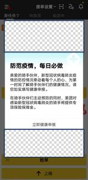 | 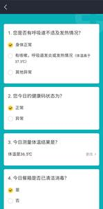 |
| --------------------------------------------- | --------------------------------------------- |
| (a)健康申报提示                               | (b)健康申报内容                               |

图 2 众包APP每日健康申报

完成两道必要环节后，骑手就处于上线状态，进入系统开始提供配送服务了。根据屏幕显示的配送服务需求方和消费者的位置、单价等信息，骑手可以自主接单。而这也是以美团众包APP（以下简称APP）为代表的美团众包平台（以下简称平台）的一大招牌，正如APP欢迎界面所说，“自由接单，想赚就赚”。但事情真的有这么“自由”或者美好吗？

图 3 美团众包APP欢迎界面

 

## 骑手的“怕”

最近正赶节后开工，订单量增加的同时每单价格却在以肉眼可见的速度下降。对于很多骑手而言，众包模式的一个吸引之处就在于它比较“自由”，在接单方面拥有相对较多的选择权利的同时还可收入日结，也因此而不得不捏着鼻子接受了单价下降的事实。特别是配送行业的门槛相对较低，“你不干总有人会干”，每时每刻都不断有人进入。表现在APP上就是节后开工以来单变得难抢了，往往是一刷新就秒没。这种情况下自然只能先保证“有单可跑”了。

眼疾手快，总算抢到一个价格、距离都还算适中的任务。若是除夕那几天，这样的单子恐怕五分钟以内是无人问津的，但现在也就顾不了许多了。骑手当日首次成功接单时，APP任务界面同时显示“已购买保险”的信息。这算是为数不多的、骑手日常所能获得的来自平台的直接保障。当然羊毛出在羊身上，每人每天3元标准的保险费还是要从骑手的众包账户里扣缴的。

|  |  |
| --------------------------------------------- | --------------------------------------------- |
| (a)保险方案                                   | (b)保险支出                                   |

图 4 众包APP为骑手提供的保险

|      |                                               |
| ---- | --------------------------------------------- |
|      | 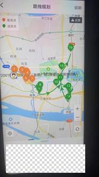 |

抢单成功只是一个开始，要想顺利获得配送收入还要经历许多重“考验”。根据任务页面指示，骑手首先来到商家处取货。若是骑手或商家手上只有这一单，自然无需等待太久。但实际情况往往是骑手为

图 5 骑手为了增加收入，往往选择一次接多单

了增加收入，经常会同时接三四甚至七八单；商家除了淡季也很少会遇到只有一笔订单的情况，因此等待成为了骑手取货时最怕的第一件事。备货时间短则几十秒，长则十多分钟，对于“时间就是金钱”的骑手而言真可谓心急如焚。当然，有经验的骑手们往往会在到店前电话询问商家，以求实时掌握动态，节省配送时间。

到店及取货的同时，还需要在APP上进行操作，以更新配送状态。有些商家为了节约成本，在店面选择上可谓绞尽脑汁。新骑手由于经验不足，经常要面临“商家在哪里”的挑战。特别是任务页面只标示“X号楼”、同一商家多块招牌亦或者商家标识不明显等情况，对于不熟悉的新人来说真可谓天书一般，有时甚至不得不电话联系商家寻求帮助，造成了配送时间无谓的浪费。因此商家定位不准或位置难以

 

|      |                                               |
| ---- | --------------------------------------------- |
|      |  |

图 6 类似的商家位置信息常令新骑手感到抓狂

|      |                                               |
| ---- | --------------------------------------------- |
|      |  |

寻找可谓是取货之路上的第二“怕”。相比之下，准确到达商家处点击“我已到店”时出现的“未抵达取货地”告警，对于骑手来说真是那么的微不足道。

图 7 骑手上报时可能出现的“未抵达取货地”提示

拿到货品的下一步是火速赶往顾客处。在送货路上最令骑手们烦心的应该就是等红灯、堵车、封路等众多交通情况了。而这背后则是APP对于配送时间的严格要求。只要任务详情页面显示状态为超时，在6分钟以下的即扣除订单配送预计收入的40%。超时超过6分钟的扣除比例按照一定的规则增加。尽管每笔订单的时间要求一般都在

图 8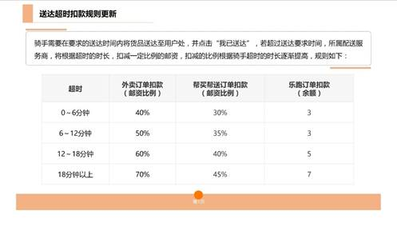
 众包APP送达超时扣款规则

30分钟以上，但骑手并非分毫不差的自动机械，取送餐的路上往往会有各种意料之外的情况。如果一次只接一单，自然能保证绝不超时。但如果以每单平均配送时间20分钟、平均收入8元来计算，骑手按照一次一单的模式日工作12小时，月工作30日，最终收入为8640元。这还是建立在全月无休、每天除了吃饭睡觉工作无其他活动且每单之间无任何等待的假设上！因此就能理解对于专职从事配送的骑手来说，要求一次一单是多么的不切合实际，而他们对不超时的要求又是多么的急迫。也就能理解尽管不合规则，逆行、闯红灯、人行道骑行等现象对于他们来说又是怎样的无奈之举。

历经“千辛万苦”，跨越“万水千山”，终于来到了顾客所在的位置，这或许意味着更多挑战。疫情影响下，部分地区封闭管理，往往需要等待顾客到达指定位置取餐。诚如上文中多次提到的“时间就是金钱”，对于骑手来说每多等待的一秒都是一种折磨。有心放下东西离开但一旦被顾客投诉，轻则罚款，重则限制接单甚至封号，两害相权取其轻下也只能选择等了。

等待顾客来到指定位置在某种意义上却还是“幸运”，因为此时骑手获取了某种程度的主动权。正像在日常生活中遇到的那样，约定去做某件事时等人的人一定程度上比较“占理”。骑手虽然在等待，但大可利用这段时间浏览任务信息、规划之后订单的配送。更令骑手们烦心的是上门配送，这意味着你必须把货品精准配送到顾客处，也带来了更多不确定性。

精准配送的第一“怕”是防疫登记和“车不让进”。前者无可厚非，是防疫需要所带来的合理要求，尽管又增加了配送所需时间。后者则可谓“致命一击”，想象你参加一场马拉松，在终点近在眼前的时候被告知还需要跑数百米。相信就算是再儒雅随和的人心里也会泛起那么几分急躁。

第二“怕”是导航错误和夜间配送。骑手其实很难对本区域的每一栋楼标号都了如指掌，或者说需要一定时间的训练才能达到这种程度，很多人还是依赖于APP标示和其他导航软件的支持，而手机导航就有一定的错误概率。比如顾客明明在南区的23号楼，地图却导向了北区的23号楼，骑手因为心急往往很难注意到这种差别。特别是夜

图 9
 夜间配送对骑手技能提出了更高要求

间情况下，地图上十几米的误差反映在现实中往往是两栋甚至多栋楼的区别，骑手还要多花时间进行确认。最绝望的莫过于来到地图指示的目的地，却发现距离目的地还有一墙之隔，而要越过这道墙又只能原路返回再另寻他路。那种心境下简直有种甩手不干的冲动。

第三“怕”是等待电梯与无人应答。如果每单的目的地都写着“101”、“102”之类的位置，很多人是能乐出声的。这样一来完全避免了对电梯等待时间过长、叫天天不灵叫地地不应的恐惧。更不用担心电梯使用

图 10
 被电梯“支配”的恐惧

高峰期无电梯可用的情况。当到达指定楼层时，骑手最希望遇到的就是顾客已经在此等候而不用再去花费时间进一步的联系。

到此为止，一单的配送才算正式完成。如果骑手对于一天的收入感到满意，那么就终于可以点击屏幕的左上角，在弹出列表中选择“下

图 11 “离开”系统

线”。随着“您已下线，下班路上请注意安全”的提示，骑手终于可以离开系统，获得对自己时间的支配。当处于“上线”状态时，看似自由的骑手实质上必须按照APP、亦即按照平台的要求去完成配送任务。所以也就无从谈起对时间的自由利用，换句话说“你的时间不是你的“。

|      |                                               |
| ---- | --------------------------------------------- |
|      | 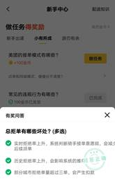 |

如果骑手尚有未完成的订单或者不拒绝系统派单，自然要继续进行配送。可既然是“自由接单”，系统派单又从何说起呢？原来这是APP的两种任务选择模式之一。骑手可以通过抢单或接受派单的方式获取任务。尽管平台一直以“自由接单”作为一大特色，但在新手中心的问答模块中却对“总拒单有哪些坏处？”给出了如下的回答：第一系统减

图 12 众包APP对“总拒单有哪些坏处”的解答

少派单；第二影响系统推单优先级；第三部分城市拒单量达到一定数额以后会产生扣款。通过这样的回答，我们是否可以认为总拒单会给骑手的收入带来一定的影响？想必通过这样的带有倾向性的操作，相当数量的骑手还是不愿意拒单的。基于以上逻辑，看来所宣传的“自由接单”也并非真就那么自由。

在习惯于外卖带来的便捷的人看来，从下单到收货也许只不过是短短的几十分钟。但人们可能还未意识到，就在短短几十分钟内，货品从取到送经历了怎样的环节。类似的过程只不过是很多骑手一天劳动的缩影，同样的流程他们往往要重复进行几十甚至上百次。正是千千万骑手的“一天”，帮助平台实现了精准配送“最后一公里”的跨越。从此意义上讲，骑手们就是系统所不可或缺的重要组成部分，他们发挥的作用是绝不容轻视的。

 

# 2    走过最长的路，是平台的套路

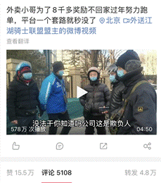
在报告写作期间，一则名为“外卖小哥为了8000多奖励不回家过年努力跑单，平台一个套路秒没”的短视频在全网内流传，播放量达到百万级别。大意是：饿了么为鼓励骑手春节跑单，推出一共7期的

图 13 社交媒体相关截图

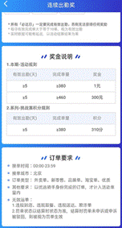
分期奖励计划。每期7天，均有单数要求。骑手必须达到或超过该数字才算该期达标，奖励随达标期数增加而增加。如果说前五期的达标数量还算合理的话，第6期380单的达标要求就让很多骑手完全不能接受，也由此引发了他们的强烈反弹。毕竟如果该期不能完成的话，到手的奖励会缩水许多。很多人当初之所以选择留下来跑单，也是为了总的奖励金额而并非一个打过折扣的数字。

图 14 “饿了么”达标要求

消息一出，不少社交媒体用户都对“饿了么”的行为表示了不同程度的抗议。人们在同情外卖骑手遭遇之余，也不禁感慨“饿了么”旗下配送平台的套路之深。明面上来看平台并未对骑手跑单做出限制，能否达标全看个人能力。但问题在于，380单的总要求对应的就是日均跑单数量在54单以上。对于设置在2月15日至21日的第6期来说，其中前3天属于休息日，部分商家还未营业，总单量较少；后四天虽然已经开工但返工的骑手数量也相当可观，笼统而言平均到每位骑手的单数也会受到影响。综上所述能完成该期的骑手还在少数，平台就是通过这样的“技巧”或者说“套路”成功地减少了支出。只要骑手还在事实上从平台获取任务信息的这种模式继续执行，那么他们天然就处于一种不对等的地位。而平台的套路就只有这点吗？让我们再次把目光转向“美团众包”一探究竟。

 

## 众包骑手如何上岗

一个新众包骑手是如何走上岗位的呢？为了获取详细信息，笔者下载并注册了众包APP。根据提示，如果想长期跑单至少需要两个必要条件：以健康证为主的资质证明和交通工具、餐箱等装备。

配送行业必然涉及直接入口食品，需要对从业人员健康情况进行检查。APP要求提供健康证合情合理。但有意思的是，笔者刚刚完成注册还未办理健康证时接到了电话，来电者自称是美团众包的工作人员。工作人员询问笔者是否开始跑单，在笔者以尚未办理健康证无法跑单回复时，对面却说新人注册后30天以内可以在不上传相关资质的情况下承接配送任务，同时建议笔者可以尝试“先接几单”。考虑到当时正是年前，很多骑手已经返乡，不能不让人思考这其中的联系。似乎在某种程度上，以众包APP为代表的平台就是以获取充足的骑手进而增加订单量为第一目标。

在办理健康证的过程中，笔者惊讶地发现在不同的软件平台上均有不少用户自称可以提供办理服务，但是否合规就不得而知了。

| 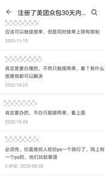 | 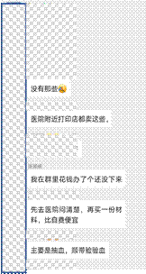 |
| --------------------------------------------- | ------------------------------------------------------------ |
| (a)某问答平台                                 | (b)某社交平台                                                |

图 15 不同软件平台上对“办理健康证”的说明

（注：本文不保证相关记录真实性）

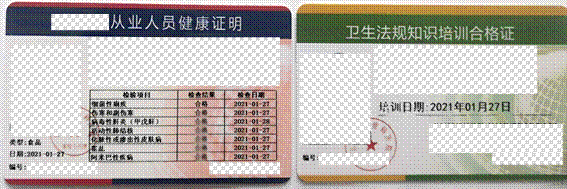
考虑到对自己也是对他人负责，笔者选择正规医疗机构进行办理。而部分机构数百元的检查费用恐怕也是不少私人办理能够存在的重要原因。

图 16 笔者办理的相关健康证明

在准备装备时，笔者也了解到同样有骑手接到了众包APP工作人员询问跑单的电话。根据一位骑手的说法，类似情况一般发生在骑手数量较少的时期，“你不跑他们还盼着你跑”。当然了，餐箱、工服、头盔乃至交通工具都是要众包骑手自行准备的，平台只负责审核。也很容易联想到“合伙人”模式，在此合伙下骑手准备工具，平台则提供信息发布等技术服务。这一点也在APP的《众包平台服务协议》中有所体现：“

本协议的签约双方为美团众包平台服务的实际运营商上海三快智送科技有限公司与使用美团众包平台相关服务的众包员（下称“您”），本协议是您与美团众包平台之间关于您使用美团众包平台提供的各项服务所订立的服务条款，具有正式书面合同的效力。”

根据这份协议，众包员也就是骑手使用了平台提供的服务，属于“被服务者”。但上述解释似乎有悖于一般人的认识，毕竟在大家看来平台才是处于强势地位的一方，骑手“服务”平台或者说为平台劳动，而非平台服务骑手。

 

## 平台的“七十二变”

在上传健康证并完成准备后，笔者正式开启了“跑单”生活。对于众包骑手而言，大到交通工具，小到一个口罩，全是自行准备，可谓把“自己动手”的理念发挥到极致。与之相对应的是，跑单过程中能直接感受到的来自“平台”的保障似乎只有前文提到每日代缴的3元保险。尽管这3元是足额购买，并未有被网友爆出的其他平台将保险费用部分挪作他用之事，却仍然让人感到一丝“比烂”的无奈。不知道从什么时候起，实际由骑手全额支付的保障都成为了平台“有良心”的一种体现。

| 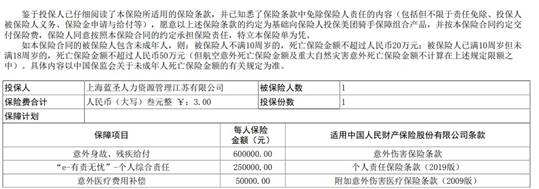 |
| ------------------------------------------------------------ |
| (a)美团众包骑手每日购买的保险保单                            |
| 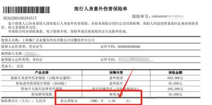                |
| (b)网友爆出的“饿了么”旗下骑手购买的保险保单                  |

图 17 不同平台为骑手购买的保险

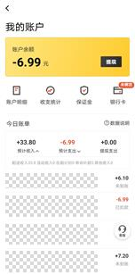
如前所述，骑手的“怕”一定程度上都可以归结为对超时的担忧。

图 18 笔者由于配送超时而被扣款

|      |                                               |
| ---- | --------------------------------------------- |
|      |  |

因为一旦超时，就将面临扣款。笔者由于经验不足，在配送第一批订单时即出现超时导致消费者取消订单的情况。平台经过审核做了相关扣除，也引发了笔者思考。配送超时相当于违反了配送规则，直接损害了消费者利益。因此扣款一定程度上可以理解但这笔钱最后似乎并没有返还到消费者那里。按照笔者的经历并未听说过有顾客因为外卖配送超时而拿到补偿的事情。问题是扣款去了哪里？根据众包客服的反馈，扣款是由众包骑手所属的劳务公司执行的。且不论劳务公司和平台又是什么关系，至少我们在众包模式下又见到了一种经典的管理制度——以罚代管。尽管平台还在反复的提醒着大家，自己只是技术服务的提供者，众包员和平台间存在的是服务而非劳动关系。

图 19 众包APP客服对扣款的说明

当骑手完成一单配送后，源于劳务（第三方）公司的收入将在24小时内到账并可以提现。但是且慢，笔者很快发现提现并非免费或者说每月只有两次免费额度。尽管众包采用日结的模式相对灵活，满足了部分骑手急用钱的需求，但同时也意味着频繁提现所带来的每次1元的收费。这样的标准已经足够让人心疼了。再一次我们面临了一个尖锐的问题，提现手续费是交给谁了呢？客服的答案是，平台服务费。

| 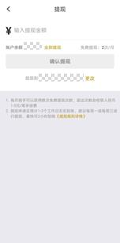 |  |
| --------------------------------------------- | --------------------------------------------- |
| (a)众包APP提现页面                            | (b)众包APP客服回复                            |

图 20 骑手提现次数超过一定值时会被收取服务费

如果把以上这些都归为平台“套路”似乎有失公允，毕竟有些行为的主体是劳务公司。但站在骑手的立场上终究对这些有所不满，因为现实地讲一天的收入大概率是无法足额的到自己手里。在不满之余令骑手稍感欣慰的，恐怕只有春节间高单价和不同时期的各种奖励活动了。

在笔者租用交通工具时，就听到了这样的说法——“现在（指春节期间）是一年中最赚钱的时候，没有之一”。具体有多赚呢？为了对这个问题有一定程度的认识，笔者在体验跑单时专门进行了留意。首先记录分析了每次跑单的数据，其次比较了不同时期同一时段同种订单的顾客支付金额，最后比较了众包APP不同时期不同订单所显示收入。

汇总后的跑单数据显示每单均价确实在不断变化。对其简单拟合（参见图 21）后可以看到存在一个理论上的单价“峰值”，且出现于除夕期间。这也符合跑单时的直观感性认识，即年前年后的几天内单价较高，可能刺激骑手放弃休息跑单。由APP内显示的配送收入除以配送里程得到

图 21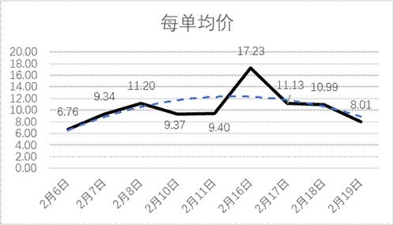
 基于笔者跑单数据绘制的单价曲线

了多次配送的单位配送里程收入（参见图 22）。随着配送经验的完善，笔者的该类数据在年后各行业普遍开工前一直处于增加态势。在一定程度上可以支持春节假日期间单价较高的结论，同时在初七之后该项数

图 22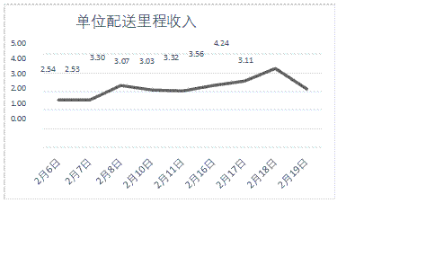
 基于笔者跑单数据绘制的单位配送里程收入曲线

据出现明显的下降。为了避免小样本容易带来的分析误判，在历史数据的基础上对比了具体订单在不同时期的变化。图 23(a)是正月初五某笔订单的相关信息，而图 23(b)是三天后（初八）同一时段在美团APP上购买相同商品并具有相近配送距离时的顾客所需支付金额。可

| 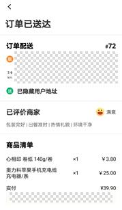 |  |
| ------------------------------------------------------------ | ------------------------------------------------------------ |
| (a)订单一信息                                                | (b)订单二信息                                                |

图 23 不同时期同类型订单信息比较

以看到商品价格并未发生变化但支付金额有所减少，这显然要与骑手感受到的“单价下降”建立联系。最后随机比较了两笔不同时期订单的具体信息。第一笔订单发生在2月10日，顾客实付33元，配送距离2.9公里，要求45分钟内送达。完成该订单骑手可以获得12.2元。

| 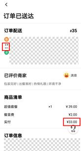 | 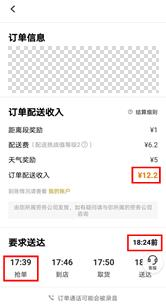 | 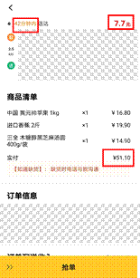 | 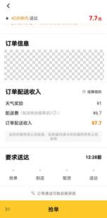 |
| --------------------------------------------- | --------------------------------------------- | ------------------------------------------------------------ | --------------------------------------------- |
| (a)订单一信息                                 | (b)订单二信息                                 |                                                              |                                               |

图 24 不同时期订单随机对比

第二笔订单则提交于2月26日，顾客实付51.1元，配送距离3.5公里，要求42分钟内送达。骑手收入7.7元。尽管存在配送对象、具体时段等的不同，但第二笔订单明显配送距离更远、要求时间更短、配送货品价格也更高，对应的骑手收入也明显降低。当然其中有天气的影响，冬季傍晚与正午时段气温不同不可一概而论，但难道说仅凭这一项就要产生36.8%的价格调整而无视其他因素吗？这就引发了另一个问题，平台标明的价格究竟是根据什么确定的？

为了保证论述的重点，笔者会在之后章节对此进行分析。现在则把问题集中于骑手所能感受到的平台价格波动。通过三方面比较，确实在一定程度上理解了“一年中最赚钱的时候”，也就能理解为何在大年三十、万家团圆的时刻人们仍然能看到那些穿梭在街头巷尾、辛勤忙碌的身影。而春节期间吸引骑手的除了高单价还有各式各样、往往令新人目不暇接的奖励。

针对骑手的额外奖励活动当前分为周激励赛和冲单奖两大类。笔者所属的铜牌骑士等级与周激励赛无实质联系，能够参加的也只有冲单奖一类。本章开头的“饿了么”达标活动就具有冲单奖的性质，而众包APP的冲单奖在春节期间则有惊喜跑单礼、春节挑战赛和666元现金奖励等三种具体形式。不论哪种具体形式都有时间、空间和单数方面的要求。惊喜跑单礼一般是规定某天的具体某个时段，达到不同单数对应不同奖励金额。在笔者看来，部分活动例如5.5小时内最多完成20单获取45元等，对于较熟练骑手来说还算容易完成。而节后开工期间同样时长下设置的35单量则有些强人所难了。

| 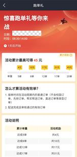 | 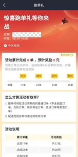 |
| --------------------------------------------- | --------------------------------------------- |
| (a)活动一信息                                 | (b)活动二信息                                 |

图 25 众包APP“惊喜跑单礼”活动

春节挑战赛则同样采取了分赛季、每季分期的模式。当前正在进行的第3赛季由4个赛期构成，每期均有达标天数和单数要求。尽管达标的天数和单数都设置在正常范围，例如一周三天、最少75单等，对于特别优秀的骑手甚至只是一天的工作量。但达标后的定额奖励至

| 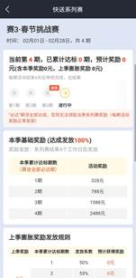 | 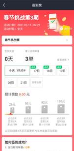 |
| --------------------------------------------- | --------------------------------------------- |
| (a)春节挑战赛第3赛季                          | (b)第3赛季第3期                               |

图 26 众包APP“春节挑战赛”相关说明

多不过百元，4期累计奖励才2000多元。与之对应的却是骑手仍然需要付出不亚于平日的辛劳才有全部获取的可能。“666元现金奖励” 同样如此，虽然听起来有些诱人，但要想足额拿到奖励可是要在7天内完成200单。以笔者的跑单经历而言，最多的一次也才在9小时内完成24单。这固然有经验不足等原因，但一是并未计入吃饭休息时间，二是能力出众者还在少数，大多数人是不可能轻轻松松就获取页面中所示奖励的。

图 27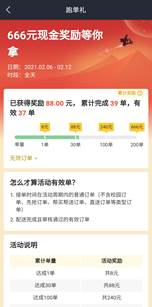
 众包APP“666元现金奖励”说明页面

平台上的种种活动，令人联想到部分网络游戏的营销策略。玩家必须要在规定时间完成规定的任务要求才能获取相应奖励。这种任务要求往往介于能达到或不能达到之间，使得玩家不得不投入更多时间乃至金钱于其上。所不同的是玩家们实际接触到的毕竟只是虚拟数据，而骑手们却往往要以汗水乃至生命去完成这场“游戏”。也无怪乎在很多骑手心中，与他们利益纠葛最深的就是平台。毕竟日常打交道最多、最直接的就是平台，平台的“千变万化”令骑手在被迫适应的同时也产生着不满。从骑手的立场出发，具象的平台是不能与抽象的、所谓协议上的劳务公司相分割的。

 

# 3    平台的“变”与“不变”

## “劳务公司”乎？障眼法乎？

任何一位骑手在与“平台”打交道的过程中，都会很快发现“劳务公司”的概念。这一点在上文中也有体现。所谓的“劳务公司”又是何方神圣呢？答案还要从众包APP提供的一系列文件中寻找。

新骑手注册时，会得到一份《网约配送员协议》。根据协议内容，骑手将与名为“上海蓝圣人力资源管理江苏有限公司”（以下简称劳务公司或蓝圣公司）的法律主体进行签约，成为公司的服务人员。注册由众包平台审核通过后，骑手可承接众包平台发布的配送任务。在提供配送服务后可以收取由劳务公司支付的服务费或奖励。

|      |                                               |
| ---- | --------------------------------------------- |
|      | 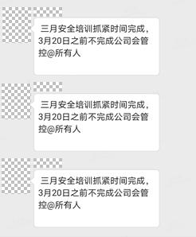 |

值得一提的是，协议中的各种条款都具有明确的主语，或者是“劳务公司”，或者是“众包平台”，又或者是“网约配送员”。乍一看，骑手与平台之间只存在服务关系。平台提供任务信息，骑手据此自主接单。更多的例如购买保险、支付和领取服务费、违规扣款等事项都发生在骑手和劳务公司间。尽管骑手在日常跑单中，除了会被要求完成每月

图 28 众包APP会话群内要求骑手完成线上安全培训的通知

安全培训外很难感受到“劳务公司”的存在，但我们还是能确认骑手和公司间实质性的劳动关系，即骑手接受公司管理并从公司领取报酬。现在的问题是，既然骑手从公司“领钱”，劳务公司从哪里获得收入呢？

根据商业查询平台的公开信息，上海蓝圣人力资源管理江苏有限公司是一家注册资本1000万人民币，主营人才供求信息的收集、整理、储存、发布和咨询等人力资源相关服务的企业。在经营范围一项中，明确标示了该公司可提供“人力资源管理服务但不得从事劳务派遣”的字样。换句话说，公司只能以服务的形式向客户提供相关产品，

图 29 商业查询平台显示的公司经营范围

但不能以直接派遣劳动者的方式满足客户或者用人单位的需求。如果上述理解确实无误的话，似乎“提供人力资源管理服务”和“从事劳务派遣”是至少在概念上存在一定独立性的两类行为。但一旦联系实际就会意识到两者很难区分。A公司为B公司提供了人力资源管理服务，但实质上是派遣了3名劳动者，其中2名劳动者受另外1名的管理。在管理者的管理下，被管理者完成了一定量的工作，领取了A公司提供的报酬。那么这样的情况究竟是属于“人力资源管理服务”呢，还是“劳务派遣呢”？由于笔者并非相关司法及商业领域的研究人员，无法对此进行更为深入的研究，只能凭借一些信息进行推理。但也可以反映出关于该公司的经营描述足以引发更多思考。

“司法风险”表明，该公司涉及的法律诉讼有186起，其中机动车

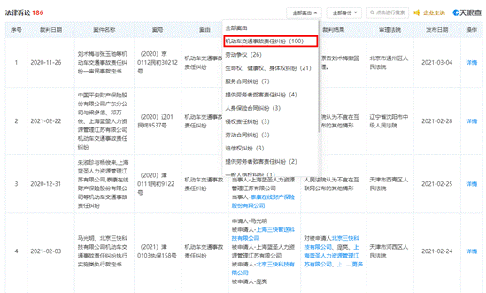

图 30 该公司涉及的法律诉讼

交通事故责任纠纷100起。这个数据至少给人以该公司主要提供交通运输相关“人力资源管理服务”的印象。在交通事故责任纠纷一栏下查阅具体案情。例如一桩由北京市顺义区人民法院审理的民事诉讼（案号：（2020）京0113民初6937号），可以看到该案是由电动车碰撞引起的赔偿纠纷。除电动车碰撞双方为原被告外，被告还包括北京三快在线科技有限公司、上海蓝圣人力资源管理江苏有限公司和泰康在线财产保险股份有限公司。法院认定（图 31）中，明确指出碰撞一方（被告之一）为美团众包骑手，而蓝圣公司则与骑手存在劳务关系。至此可以确定蓝圣公司确实是部分美团众包骑手的管理公司，而法院关于蓝圣公司的部分认定在事实上承认了众包骑手的跑单行为属于劳务派遣，显然也与上文指出的“不得从事劳务派遣”形成了“微妙”的对比。“劳务派遣”作为动词来讲，应当有动作的发出者和接收者，既然蓝圣公司派遣了“劳务”，那么它又是向谁派遣的呢？用工单位又是何方神圣呢？

 

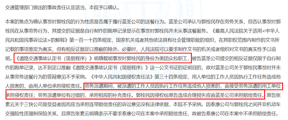

图 31 顺义区人民法院的部分认定

在本案中，原告诉称北京三快在线科技有限公司为用人单位，但由于证据不足并未得到法院认定。在另一起由黑龙江省哈尔滨市中级人民法院审理的劳动争议性质的民事案件中（案号：（2020）黑01民终6711号），原告同样为美团众包骑手，被告则分别为江苏莱恩服务外包有限公司、上海蓝圣人力资源管理江苏有限公司、北京三快科技有限公司和上海蓝海人力资源股份有限公司。在一审中，原告指出被告中的四家公司都对其实行管理，承担了用工者的角色。法院则认定蓝圣公司未对骑手进行强制性管理，两者间不构成劳动法意义上的劳动关系。

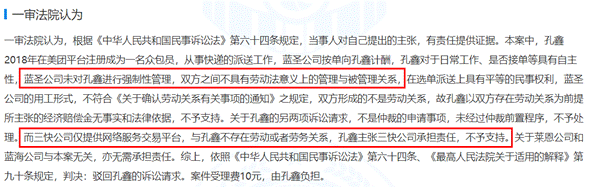

图 32 哈尔滨市中级人民法院的一审认定

姑且不去理会骑手与劳务公司间的关系该如何用法律术语去界定，也不讨论追求术语、形式上的精确是否有悖于内容、实质上的初衷，从法院的认定里仍然可以感受到一种倾向，那就是劳务公司和骑手间确实存在管理与被管理的关系，尽管是“非强制性”的。除了劳务公司本身外，与第一个案例类似，北京三快在线科技有限公司同样不被判定为和骑手具有劳动或劳务关系，也就不成为用人单位。这样一来，寻找用工单位的努力似乎走入了一个死胡同。

在梳理第二份案例时，一审法院的其他认定为用工单位的确定提供了新的方向。法院指出：

“……三快公司（北京三快在线科技有限公司）与案外人上海三快智送科技有限公司合作，由上海三快智送科技有限公司开展对外经营。上海三快智送科技有限公司与蓝圣公司签订《平台服务协议》。由上海三快智送科技有限公司提供信息展示交易服务的网络服务平台，由蓝圣公司对众包员进行管理。”

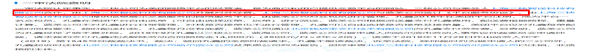 

图 33 哈尔滨市人民法院一审查明事实

通过法院认定，首先可以确认蓝圣公司确实在管理众包员，这就与上文的“不存在强制性管理”形成了对照。其次，一个新的法律意义上的主体被引入到审理中——上海三快智送科技有限公司（以下简称上海三快）。公开信息显示，上海三快是“美团众包”这款APP的著作权人。最后，上海三快和蓝圣公司之间确实存在联系，有《平台服务

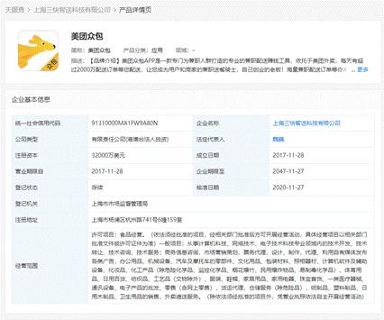

图 34 上海三快智送科技有限公司产品详情页

协议》作为参照。这份协议是否就是第二章介绍过的《众包平台服务协议》？如果是的话，不同地方提到的同一份协议的签约双方明显构成矛盾。上海三块到底是和上海蓝圣，还是和众包员（骑手）签约？如果不是的话，新的协议内容又是什么呢？

为了进一步分析，笔者尝试引入第三份判决（案号：（2020）京0102民初1143号）。该判决与第一份类似，属于机动车事故纠纷，由北京市西城区人民法院审理。原告为交通事故的受伤者，被告分别为众包骑手、上海蓝圣人力资源管理江苏有限公司、上海三快智送科技有限公司、中国太平洋财产保险股份有限公司北京分公司和中国人民财产保险股份有限公司南京市分公司。在原告提出索赔申请的同时，作为被告的上海蓝圣、上海三快做出了如下辩称：“

……

蓝圣公司辩称：我公司为美团公司的服务商，被告XXX为众包类兼职骑手

……

三快公司辩称：三快公司与蓝圣公司属于外包关系，骑手是通过软件平台与蓝圣签订了劳务合同……”

图 35 该案部分被告辩称

考虑到诉讼双方都是从尽可能多的维护自身利益出发，有理由在一定程度上相信不同被告辩称的真实性。蓝圣公司说，它是上海三快的“服务商”；上海三快又指出，它与蓝圣公司是“外包关系”。是否可以认为，上海三快将一部分本属于自身业务范畴的服务“外包”给了其他有类似能力的“服务提供商”？这种服务究竟是什么呢？根据上海三快公司的性质，我们当然可以认为它技术实力雄厚，应该不用上海蓝圣去提供“软件编写”等技术服务。既然如此，又有什么必要去外包呢？毕竟，一个“主体”不可能把自身所没有的东西外包出去。再考虑一下上海三快的企业架构图，尽管缺乏实质证明，也很难不让人想到其与北京三快的联系。而美团正是北京三快旗下的著名品牌。正如报告第一章指出的，正是有了众包骑手乃至所有骑手的存在，“精准配送”才能实现“最后一公里”的跨越，单个消费者与美团的一笔交易才算正式完成。从这个角度讲，“美团众包”是这一流程得以完成的重要环

 

| 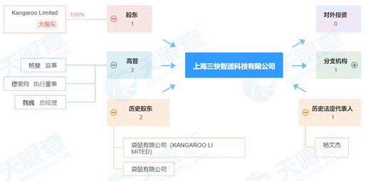 |
| --------------------------------------------- |
| (a)上海三快智送科技有限公司企业架构           |
| 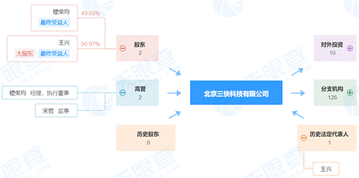 |
| (b)北京三快科技有限公司企业架构               |

图 36 两家公司企业架构对比

节。就算软件再发达，其也不可能脱离硬件而存在；就算美团众包上展示的任务信息再完善、处理任务信息的能力再先进，也要由“人”来完成最后的配送服务。

写到这里，逻辑其实已经很明确了。美团众包乃至整个平台需要人力去提供配送服务，亦即不能提供配送服务的平台并不具有商业上的意义。总不能说上海三快投入成本研发这款平台只是为了“慈善”吧？尽管需要提供这种配送服务，但平台自身基于某些考量选择不去亲自组织并提供服务能力，而是选择一些具有类似能力的“服务商”。考虑到目前无人配送技术尚不成熟，这种服务必须要由人来完成。如何用一个词概括上述过程呢？除了“劳务派遣”以外笔者暂时还想不到第二个词汇。一旦引入这一角度的思考，之前的一些问题也就得到了解答。蓝圣公司提供人力去完成众包平台要求提供的服务，尽管这种“要求”并未体现在任何一份文书协议里。这种服务需要人的劳动去完成，即它要求“人的劳动”。再进一步画上等号，“平台”要求“人的劳动”。至于这是否构成平台骑手间实质意义上的劳动关系，就远非本文所能探讨了。

既然已经在某种程度上分析了平台、劳务公司与众包骑手之间实质而非形式的关系，笔者的关注重点就转向了下一个话题，平台的出发点何在？这样一环扣一环、公司连公司的做法目的何在？毕竟任何人要理解类似的联系都要耗费一定精力，也就是需要成本。面对商业合作带来的成本，平台为何不去选择自己组织人力、提供配送服务呢？答案仍然要从现实中寻找。

在第三份案例中，上海三快指出（参见图 35）：“据该协议由上海蓝圣公司与骑手建立劳务关系，并承担用工风险，我公司与骑手不存在任何劳务关系，应该由蓝圣公司承担责任”。在上海三快看来，骑手配送中可能引发的种种风险于己无关，不需要承担种种责任或者说义务。但我们明明看到，它确实享受到了骑手配送带来的便利呀？没有这种便利，消费者哪里会去选择“三快”或者说“美团”呢？“权利和义务的一致性”是现代社会的一个常识，一个人如果只想享受权利和不承担义务，必然受到道德甚至法律的制裁。尽管公司并非个体，但同样是法律上的主体，类似的权利义务的要求也概莫能外。对于平台这种只想享受骑手带来权利而连一丁点对骑手的义务都不想承担、采取各种手段撇清自身、掩人耳目的行为，该如何理解背后的逻辑？我们可以光明正大的说一句，平台的逻辑恰恰是强盗的逻辑。

 

## 单价由谁来定？

对于众包骑手而言，他们可能不会刻意区分劳务公司和平台的差别，但每单收入的变化却是实打实的，由不得不加以关注。在第二章里，笔者已经探讨了春节前后单价的变化。问题在于，单价为什么会出现这样的变化？它的确定机制是怎样的？

关于类似问题，众包APP在《网约配送员协议》的“计价标准”一节中给出了说明：“服务费及活动奖励的计算标准以众包平台实时显示的数据为准”。但这似乎有循环定义之嫌，就像在说“单价由单价确定”。看来要尝试理解单价变动，就必须再次深入。

骑手眼中的“单价”，按平台规范来讲应该称为“服务费”。骑手提供了一定时间的配送服务，之后获得这种服务对应的报酬。这样的交换形式不禁使人联想到一般实物性商品的购买。因此某种程度上，配送服务也可看作一种商品，服务费就是它的价格。既然一般商品价格总是受到供求关系的影响，自然配送服务价格或者说“单价”也要受到它自身供求关系的影响。配送服务的提供方自然是骑手；需求方是谁呢？是千千万万点外卖的消费者吗？直观来看确实是这样。可是除今年外春节期间一般都有大批人员离京返乡，考虑到单个消费者一段时期内需求保持恒定，因此总的配送需求应当随常住人口下降而下降，但为什么笔者遇到的配送员还坚持强调“春节是一年中最赚钱的时候”呢？如果把消费者作为需求方，难以解释单价的上升。有些观点可能认为消费者和配送员数量虽然都在下降，但后者下降幅度相对较大，总体上也可表现为供不应求。但这样分析实际忽略了一点，就是价格随供求关系变化应该建立在供求双方具有信息交流渠道的基础上。如果供求双方完全隔绝的话，产品的价格又如何根据供求关系进行动态变化呢？根据日常经验，首先消费者无法指定配送员，其次配送员也很难不依赖平台、直接地了解到单量需求。这就从实际上推翻了消费者作为需求方的观点，尽管就使用价值而言消费者确实是那个“需求方”。

抑或者商家是需求方？这似乎也有一定的道理。但根据笔者自己跑单经历，大年三十前后商家大多歇业的同时单价却维持在高位水平。显然商家不能作为需求方。

运用简单的排除法，答案似乎直至平台。毕竟联系一单配送任务从产生到完成的过程，可以归纳出四类对象的参与：平台、骑手、商家、消费者。需求方不是商家，不是消费者，当然只能是平台了。考虑到平台始终坚持认为自己只负责相关信息工作，换句话说相当于搭建了市集但不参与市集中具体商户的交易，笔者暂时只以平台作为需求方的假设进行论证。春节期间大量骑手返乡，配送任务数随在京人数减少但仍然处于一定量级上，总体供求关系表现为供不应求，平台期望骑手跑单，单价上涨；节后开工时期尽管单量大增，但骑手总数也在增加，此时供求关系整体上表现为供过于求，单价频频下降以致骑手产生不满。

|      |                                               |
| ---- | --------------------------------------------- |
|      |  |

在一般商品的供求中，由于双方都并非严格意义上的整体，每一方内部在交换中也存在竞争，因此商品价格并不总表现为一方的期望。但本文提到的商品——基于平台的配送服务却表现出了一定的特殊性质。平台成为需求方意味着其并非只是“市集的组织者”，同时也是交易的参与者。如果用体育活动类比，平台可谓既是裁判员又是运动员。由于拥有APP等软件乃至用户使用APP时产生的全部数据的所有权，同时隔绝了消费者与骑手之间关于供求的交流渠道，平台在理论上获得了近乎无限的定价权，在实践中也可根据不同时段数据对

图 37 众包平台服务协议中关于网络服务内容的规定

价格做出动态调整并展示在APP中。与之相对应的是，作为供应方的骑手群体完全没有议价权，在紧随春节而来的淡季中不得不忍受不断下调的单价。即便单价偶有上涨，那也只能存在于春节等特殊时期和雨雪天气等极端时段。且这种上涨更像是平台为了避免实际成交单量下降“不得已而为之”的特殊行为。更多的常态则是骑手方面的意见完全没有被引入到价格确定机制中，毕竟只要有一定数量的骑手不太在乎价格，平台给出的单价就总会被接受而不至于引起反弹。

在平台掌握定价权的分析基础上，就能理解为何平台总是倾向于给出低单价了。作为商业性公司，平台存在的首要目的就是盈利。众所周知，利润等于总收入和总支出之差。对于平台而言，如果由其自身承担配送服务将会带来包括骑手组织、管理、保障在内的负担。而如果能把这部分服务外包出去，则在保证服务质量、降低运营风险的同时可以削减支出，从而增加利润。当然不管怎样外包毕竟还是要支出一部分服务费，而如果再使这部分服务费缩减，平台的利润就能得到进一步增加。可见，始终在变的只是手段，不变的则是平台对利润的追求。

 

 

 

 

 

 

 

 

 

 

# 4    平台经济：美丽新世界还是皇帝的新衣？

## 配送任务的四方演义

在第三章分析中，笔者提出每单配送任务都存在着顾客、平台、商家、骑手四方主体的参与。不同主体在协作中扮演着不同的角色：

（1）顾客通过平台下属的各种APP购买各类型实物商品或服务。具体到配送服务，顾客发挥了“激活任务”的作用。

（2）接入平台的商家获取顾客的订单信息，根据订单内容准备对应产品，实质上扮演着“生产者”的角色。

（3）骑手通过平台的相关配送APP获得配送信息，或自主或指派式的确定待完成的配送任务。骑手作为“运输者”而存在并最终实现了商家和顾客间的连接。

（4）平台在全流程中发挥着重要的“组织者”作用。在顾客端，平台APP负责运营多样的商家信息，供消费者挑选。一旦有新订单发出，商家将通过平台获取订单信息并准备生产，同时骑手端将得到对应的配送信息以便实现商品的实际配送。

从果蔬生鲜到常规用药，从美味佳肴到日常用品，“在线下单，精准配送”的模式已经深入到人们的日常生活中。不同类型配送具有的相似实现过程则清晰的表明，平台正越来越成为不可或缺的重要一环。没有平台展示的商家信息，消费者必然要投入更多成本去了解和选择自身所需服务；没有平台的支持，商家也难以对抗线下经营带来的更多不确定性，而线上模式似乎可以投入更多精力于接单中；最后，没有平台的引导，骑手根本无法了解哪里有配送需求也就无法提供服务并获得收入。因此平台组织的过程，实际上就是信息流通的过程。正是消费者需求、商家类型、骑手实时位置等诸多信息的流动和交汇，为平台带来了直接的利润。

为了更好地理解平台利润的产生，考察实际的配送过程仍然是必须的。不管何种类型的配送，一定涉及货币的流动。如果以货币流动作为线索，可以绘制出如图 38所示的过程。特别对x2进行说明，为

图 38 配送中涉及的货币流动

何商家在一笔订单的配送中还存在支出？这似乎不符合一般的感性认识。顾客日常下单时经常会遇到配送费减免的情况，但这并不代表真的“减免”，只是由其他主体替顾客支付而已。这里的主体是谁呢？很大一部分就来自于商家。

实际配送中货币由某几方流出，最终又流向另外几方，据此列出如下恒等式：

​                                      

以下使用三笔订单对该公式进行分析，其中两笔的部分数据来源于访谈。

|  |  |  |
| --------------------------------------------- | --------------------------------------------- | --------------------------------------------- |
| (a)骑手端距离信息                             | (b)骑手端单价信息                             | (c)顾客端相似订单信息                         |

图 39 订单1信息

第一笔订单虽然产品价格较高，但由于配送距离不超过500米，顾客不需要支付配送费。关于该店铺一定距离内免除配送费的信息，也通过对商家的访谈和笔者自己的实践得到确认，对应公式中的x1设置为0。商家指出该订单自己支出13元配送费，对应公式中x2为13。骑手端显示的单价为10元，即公式中y1=10。以上就是订单1可以直接获得的全部信息。代入相关数字并做简单变换可得：

​                                   

根据x3和y2表示的含义，其差值正是包括劳务公司在内的平台通过骑手配送获取的利润。

订单2由于配送距离较长，明显属于同城订单，顾客需要支付一定的配送费，因此x1>0。具体数值无法确定但并不影响分析。在商家

|  |  |
| --------------------------------------------- | --------------------------------------------- |
| (a)骑手端距离信息                             | (b)骑手端单价信息                             |

图 40 订单2信息

访谈中获知该订单对应的x2=16，骑手端显示的单价为13.5元，即y1=13.5。公式带入以上数值后变换得：

​                             

可见，以平台为代表的用工方从骑手配送中至少能获得2.5元的净利润。

|  |  |  |
| --------------------------------------------- | --------------------------------------------- | --------------------------------------------- |
| (a)顾客端支付信息                             | (b)商家提供信息                               | (c)商家提供的信息                             |

图 41 订单3信息

订单3显示顾客支付的配送费为10元。商家反馈的信息表明该订单商家顾客总的配送支出为11元，即x1+x2=11。骑手获得的配送总收入为10.4元。因此公式可写为

​                                  

平台整体又拿走了0.6元的利润。

  以上三笔订单的分析显示，平台整体是有可能从骑手的配送服务中获取利润的。分析并未对平台和骑手所属劳务公司做出严格区分，骑手带来的利润必然还要在这二者之间进行分配。但这并不代表平台的某些例如“配送完全是倒贴钱，平台一直在亏损”的宣传就一定正确。另一方面，调研中也有部分商家指出他们并不需要支付骑手配送费，但往往伴随的是诸如“平台抽成已经够多了，再要我们出配送费不就没得活了”的抱怨。这让笔者有理由相信：平台可能会少赚，但永远不亏。

 

## 平台里的“人”

前文的大部分内容聚焦众包骑手，接下来将把商家引入分析。正如刚才如提，很多商家指出“平台抽成”的问题，“抽成”作何理解呢？在笔者印象里，“抽成”常见于中介性商业活动。例如某些中间商并不直接参与某些商品的交易，亦即并非买卖双方，而是在交易完成后按照一定标准从供应商（卖方）的收入里提取部分金额。

尽管平台为商家提供了产品信息展示、订单配送等服务，但这些服务并非“免费”供应，收取一定的“抽成”也无可厚非。但在笔者调研中，认为“平台抽成太多”的声音并非少数。平台在部分地区采取的不满20抽4、满20抽20%（以上价格均不含配送费）的标准看似平平无奇，但很多中小规模商家在抽成之外还要扣除材料、水、电、气、房租等诸多成本，剩下的才是利润。这样的利润在层层扣除后还剩多少，让人不由得在心底打个问号，社交平台上的聊天记录也能从侧面反映问题。

图 42
 某社交平台相关记录

由于并非行业从业者，大多数人很难接触到“抽成”的概念，但APP显示的种种商家优惠却是能感受到的。对于这些“优惠”，部分商家也给出了另外的观点，例如“你可以不搞这些活动，但不搞你的排名就上不去，别人就看不到你的店”。看来“优惠”背后也有一番玄机。至于商家促销力度如何与APP上的排名联动，其中涉及的技术手段不属于本文讨论的对象。但考虑到程序终究要由人来完成，借用技术方式对排名做出动态调整在理论上也并非不可实现。在“优惠可能少赚，但不优惠一定会亏”的观念驱使下，商家间犹如开启了一场“军备竞赛”。对此平台则乐见其成，毕竟商家优惠并不会对抽成有所改变，该抽多少还是多少，而商家竞争带来的单量增加却会极大提高总的抽成金额。商家为了确保优惠力度对收入不致产生太大影响，本着“能接就接”原则不放过来自平台的任何一单，实质上增加了劳动强度和劳动时间，也意味着相对于平台的自主权的不断下降。

报告在将关注点聚焦于众包骑手的同时，也探讨了顾客、商家、骑手和平台间的互动。正是在平台的参与下，不同职业身份的人发生了自身难以意识到的联系。笔者完全可以想象这样的场景：在主营外送餐饮的甲商家工作的小A为了节省时间，通过平台APP购买了乙商家的外卖。下班后则选择成为平台的众包骑手，以增加收入。在小A看来，这只是日常生活的一次重复，但与之同时却有千千万万个小A在从事着类似的劳动。如果用货币价格衡量的话，千万个小A在劳动中创造的价值却并不能尽数归其所有，总有一部分价值通过各种渠道流向了平台。也许小A觉得自己是自由的，但上班时总在响起的“您有一个新订单”却预示着繁重的劳动量；送餐路上电动车的风驰电掣虽然能让小A产生如骑士冲锋陷阵一般的快乐，但总在波动甚至下调的单价却让其不得不思虑起电费支出。也只有真正“下线”的那一刻，自由的感觉才重新占据了小A的身心。此时只想回到熟悉的一居室好好休息一番，至于什么“自由接单，想赚就赚”还是等明天再说吧！

一个小A“下线”了，但伴随着APP“您有一个新订单”的提示，仍然还有许多个“小A”或在准备餐品、或在争分夺秒，总之在辛勤工作。而在平台那里，小A们并不具有完全的“人”的意义，倒不如用“一组流动的数据”形容。平台更加关注的是这些“数据”是否在限定时间内达到限定空间，呈现限定状态。也可以说，平台通过订单信息完全支配了小A们的工作。或许平台会强调小A们的“自雇”性质，但抽成和配送利润却无时无刻不在提醒着小A们，事实上并非如此。尽管平台可能会对提取的这部分价值有其他说辞，但笔者更愿意用“剥削”来对此精确定义。至于平台经济真的如其宣传所说代表美丽新世界，还是只是给剥削披上了一层温情脉脉的、“信息化”的面纱，这是一个仁者见仁，智者见智的话题，笔者选择将判断权交给读者。