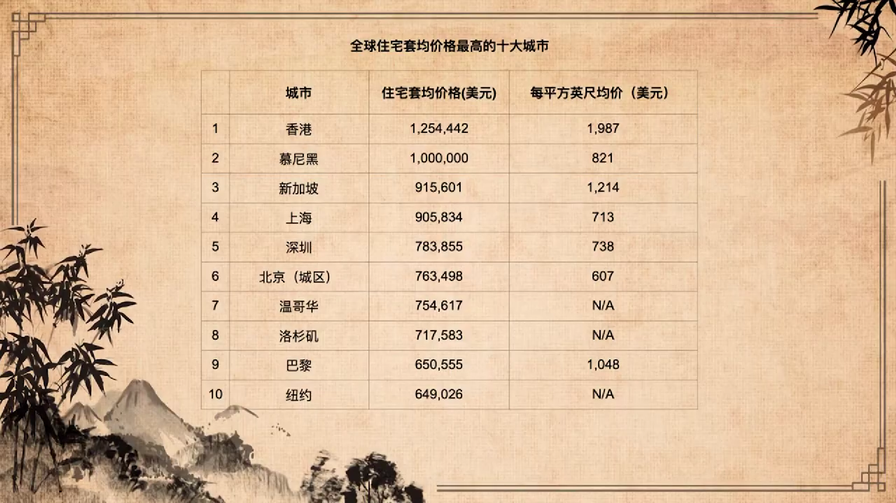
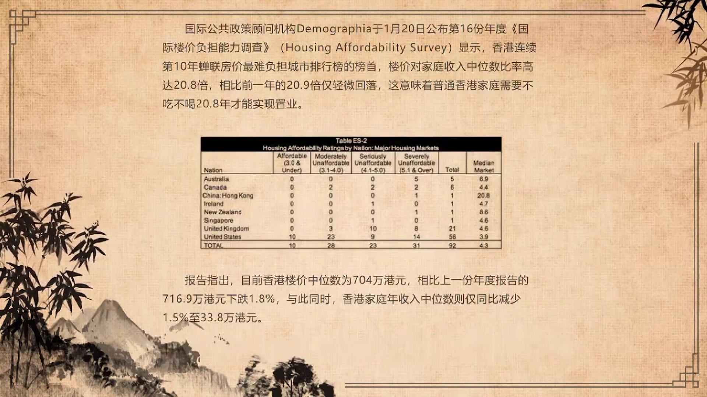

来自https://www.youtube.com/watch?v=nJFX-EYtdrA  此为文字整理

# 卢麒元：如何跨越官僚垄断资本主义的陷阱（中）

我们现在进入到第三个环节，就是我们该如何面对和解决中国的官僚垄断资本主义的问题。我提了三句话，第一句话是针对中国的政治主权的。

中国政治主权相当一部分被官僚垄断资产阶级或者资本主义僭越、控制、掌控的，包括立法权、司法权和行政权。我有个建议就是，通过集约化和数字化来解决中国政治主权问题，不要通过民主化。所以任何提民主化的人，我个人认为它无益于真正解决中国面临的官僚垄断资本主义僭越政治主权的问题。

什么叫集约化？就是我们这个成本太高了。就是三级政府取消两级，就是中国应该是中央、省、县。没有市和乡。因为我们已经进入到如此交通发达和信息方便的程度,五级政府是没有意义的。所以大概有一半的人要离开这个体系，不需要他们。

司法方面，完成直辖。公安、法院、检察院全部直辖，这样便于全国调配，避免形成某种对地方行政权利是官僚权利的保护或者是形成工具。谈到立法权，集约的意思就是我们不需要那么多层级的立法权，中国保留两级立法权，足以。就是全国人大直到省。我们县一级还需要立法吗？乡一级需要立法吗？既然不需要，为什么要养五套班子？中国只需要两级立法，而且第二级立法，省一级立法，必须简化。只有中央立法需要加强。

中央立法它的加强是什么呢？我以前就建议国资委应该归人大管，因为是国有资产。将来我们的整个的金融体系全部要归人大，它是立法权范畴，把立法权说清楚。比如说上直接税是个立法过程。发钞票，人民币发行钞票需要有一部人民币发行法案，发行多少，发行的法律依据是什么？必须是立法权，是人大批准你印多少钞票印多少钞票，这跟央行有什么关系呢？好多人说美联储是私人机构，完全不懂美国联邦储备法案。司法管辖权才意味着主权，不是那个央行的股东是谁，股东有什么关系，是你印多少是参院说了算，这才叫中央治理，这才叫社会治理。

同时，这三权数字化。数字化的意思就是全部要公开，就是数字化政府。所以所谓的中国未来的政治体制改革就是数字化的过程。你办理一个行政事务，你办了一个案子，就是应该在互联网上看得到的，没有什么需要保密的。数字化完了以后，其实效能可以大幅度提高。我个人认为中国的制度成本可以去掉三分之二，让中国社会重新充满活力。不要通过制度成本侵占社会资源和整个社会的本应用于资本积累的部分，全部被社会资本占有。

不对，这要做到当然很难了，但是总得有人去想嘛，不能每个人都想国际关系问题，都想这个热点问题啊。对不对？毫无学术价值，亦毫无新闻价值的所谓的热点，调动老百姓内心的情绪的这些东西。应该回归主要的问题，核心问题，对焦点问题进行深刻透彻的思考，而不是一天到晚的东家长、西家短的。这个不行的。

我们进入到。第二个部分，关于经济主权的部分。经济主权的部分，三个主权：财政主权、金融主权和要素主权。其中财政主权的核心就是立法权，财政的立法权基本上就是一个国家宪政的水平，宪政的主体是起于议税，议税我也反对用民主选举的方法来议税，不用。在今天数字化、信息化到如此水平，讨论税政问题，通过互联网，已经可以完成。其实民意的调查现在不是个难题，所以社会化对财政主权的改造主要是议税权重新形成民意为主体的一种过程，再不能让吃猪油的人来讨论征税权了。货币发行主权必须交给全国人大。

中国的金融一直迟迟不能进步，包括人民币迟迟不能国际化，不是我们的劳动者不努力，我们已经是全世界第二大经济体。同时，中国如果是按不以美元计价，我个人认为我们的经济总量已经是美国人的一倍了。如果从钢铁上看，从钢存量来看更是如此。

如此大的总量，我们的货币那么的弱，原因在于这个官僚垄断资本主义，这个集团，在强力的遏制人民币的国际化过程。所谓的离岸人民币离岸交易中心在香港，怎么可以搞离岸交易中心呢？难道英镑成为国际货币，美元成为国际货币，是因为建了离岸交易中心吗？非常可笑。正确的努力是人民币发行权必须交还全国人大，这是其一，因为它意味着一个货币的主权的信用的可信度。第二个部分，人民币国际化是人民币债券的国际化。要允许一带一路国家，我原来提出来的是大陆朝西，要允许上合组织的国家，到北京发行人民币计价的主权债券，形成最大的人民币债券交易中心。

为什么今天，欧元、日元、英镑、瑞典克朗、瑞士法郎是美元指数的构成的成分，为什么我们不是？在某种意义上，我们目前给人民币设定的方法，我们拿了多少外汇，印多少人民币，我们是它的延伸货币，我们借助的是美元信用。我们不打算建立具有主权特征的主权货币的应有的发行体制。到今天人民币发行，没有立法。你并不知道它里边的逻辑，全世界都不知道。

另外。我们没有一整套的让他国际化，国际化就是使人民币的人越来越多嘛。但是当年北朝鲜哈萨克斯坦需要到中国来借我们的人民币的时候，我们不借的。我们外援都是给美元的。我们不认为我们人民币要国际化。如果我们允许，比如说伊朗、阿富汗这些需要重建的国家到中国来发行人民币主权的债券，并且这个债券可以在国际上流通。连伊朗元和朝鲜元其实都是以人民币为基础发行的。当年朝鲜发朝鲜元就是这个意思。是我们的金融不同意吗？这两件事情拦住了人民币国际化，只是中国的学术界。不说。不讨论。

我们所有的审美，还是以金融为最高审美。作为一个父母，子女如果谈恋爱，对方是做金融的，你想高兴成什么样？如果是对方去支教了，大体上就不同意的，对吧。老师、工人、科研工作者？

第三个部分是要素的部分。要素的主权是真正的人民主权，必须是社会化的。所以土地的权利，本身就是全体国民的权利，绝不可以将它交给一部分的地方政府和地方政府的一部分的官员，来决定土地的价格和土地的使用。感谢我们的党和政府，现在还只是卖使用权，没有卖产权，使用权还终于可以收回。

不能感谢的是他们在香港做的事情，一九八三年的附件三签错了，一九九七年就必须改。理论上应该是我们来改。曾先生曾荫权说，打一份工嘛，我们党说港人治港。曾先生说，打好你一份工，就是我不治，港麻烦你阿爷来治，我是打工的，你说怎么做，我来怎么做。港人不治港，中央政府不治港。财政主权在附件三被交给了地产商。

金融主权在一九八三年十二月份交给了美国。香港是一个主权不知道是谁的地方。

> 香港的联系汇率制度
>
> 香港特别行政区从1983年10月17日开始实施与美元挂钩的联系汇率制度，以百分百外汇储备保证，以7.75至7.85港元兑1美元的汇率与美元挂钩。
>
> 政府或金管局在正常情况下不会主动插手干预外汇市场，只通过控制港币的供给与需求来影响汇率；汇率调节主要由香港三家发钞银行——中银香港、香港上海汇丰银行、渣打银行通过逃离活动完成，即所谓汇率自动调节机制。

到今天，我们收回了香港，没有立法权，没有司法权，没有行政权，没有财政主权，没有金融主权，没有土地主权。我们收回来一面五星红旗、一支驻港部队、一个外交公署。解决香港问题也非常简单，还是今天我们讲的那三权。当然了，香港更没有文化主权，没有教育学术和传媒主权。九七年没有人有意愿，是因为国内负责这个事情的朋友们一块儿跟着去吃肥猪肉了，等九七年我看到他们的时候，他们也都是每个人都是满嘴油，一起在吃香港这块肥猪肉。英国人在吃，我们的人在吃，香港的既得利益阶层。吃了二十年，终于把小孩儿吃穷了，吃到街上去变成了黑衣。

中国现在的问题，同样的我们希望在要素问题上不重复香港的错误，我们尽可能的以最快的方式，解决要素归属和使用的权利问题。深圳最近发生的事情还是令我们感到非常震撼的就是，习主席那么的提醒他们，希望他们能够在这个事情处理好，他们也一遍遍的告诉处理的很好，但深圳的房价的确在疫情期间翻倍，太让人感到震撼了。确实是有人在里边做事，而做事的这些人，不仅仅是海外的资本，也不仅仅是国内的一部分人，他确实带有极为强烈的官僚垄断资本主义的特征。

对于要素的处理，还包含了一些其他的东西。我们最近在提出一个非常严肃的问题就是，我们希望中国与美国在处理资本过剩危机的时候，能够做正确的选择。所谓正确的选择是，我们是否要将那么多廉价的商品、廉价的资产卖给今天印刷出来的美元。如果我们正在卖，我们应该怎么办？这是一九八五年那场美日、美苏博弈的第2.0版本。我们一再向央行建议，向财政部建议。我们今年的第一季度，外贸增长百分之六十。就是美国人拼命在买我们的东西，就是他不在乎贸易赤字。我们收了美元以后，我们竟然增加了一千亿美元的美国国债。我们一再建议我们每收一个美元就应该买一克黄金，或者是碳排放权，或者是其他的战略物资资源。我们绝不能再买任何国家的债券，包括美国国家的债券，我们也不跟他们进行什么货币互换。我们必须把它变成资源。这是一九八五年平成天皇唯一可以做的正确选择，但是他们没有做。

一旦我们购买美国债券，形成美元流通的闭环，我们在三年到五年之后必然被完成收割。我们可以出口商品，我们不需要出口那么多。如果出口的话，我们绝不留任何国家的货币、货币债券或者是去购买他国资产，我们必须让他沉没于黄金。沉没的意思就是，你也别流通，我也不流通。我买黄金是在海外购买，我将钱让回流你的国家去。

我们大体上认为美元今天的合理价格对黄金应该是五千美元一盎司，现在市场价是一千五百美元一盎司。美元的价格被严重高估。他用五千美元的货价格来购买我们现在货品，相当于我们所有的商品向他打折，我们是以三折出售中国的商品，甚至是两折出售中国的资产。这样的做法，不妥。其实我不主张如此大量的出售中国的商品和资产，我们应该处理好有效的、范围之内的、合理的循环。如果你非要卖，也不要骄傲，不要说我贸易增长多少，出口增长多少，请你把它沉没。

如果我们在处理经济问题上。既不知道如何克制我们内部自身的官僚垄断资本主义，也不知道如何应对外边的金融垄断资本主义。那么，长此以往。就美国MMT所造成的后续的效应，两三年之后开始浮现，如果处理不当，可能就像日本是一九八五年签广场协议，九一年彻底崩掉，所有的资产泡沫破灭，苏联也是在那一年垮了，中国是八九年六四事件的时候，我们也也伤的很重啊，但我们走过来了。八九年伤的很重。我们走过来，但是我们走过来以后，真正出现的问题也并没有得到全面和有效的改进。如不能表达为社会化，经济主权出问题的时间长度不会超过十年。

第三个部分是文化主权，包括教育、学术、传媒。在文化主权上面。这是我唯一强调必须国际化的部分，就是我们的教育必须是国际化的水平。我们应该请全世界最牛的教育家来中国办教育。教育不怕国际化，我们不能关门把它变成教育食堂。不能自吹自叹，不能把它关成某个人家的。

我对现在的一些大学，他们的党委书记和校长目前的做法，真的不能接受。我们请不来蔡元培，但我们可以请一些真正具有国际视野的教育家。中国有没有？有。但我们现在可能因为教育这个体系，别人不知道我是知道的，被严重私有化。好多人说那个学校不是一个人的呀，他就不知道管理权僭越是怎么监狱的。

学术。为什么中国华为前一段时间一再强调，就是中国的学术上面，不行。我们的学术很神奇。比如举例我们今天在讨论的问题，这个是一个重要的学术问题，这个学术问题，财政部的科研所会研究官僚垄断资本主义的问题，或者会研究官僚垄断资本主义在财政的问题上的表达吗？会研究如何跨越官僚垄断资本主义对财政的影响？不可能。他研究的问题恰恰是怎么吃猪肉的问题。而且是耗用国家巨资。而且我知道那些研究机构是什么构成，基本上算是一个特定的族群，因为它是一个饭碗。所以亲戚朋友、七大姑八大姨凑在一块儿，还是一个食堂。我刚才说了，有文化食堂，这个教育食堂、科研机构食堂。

我说国际化的意思就是我们学一学国际上先进的国家，我们购买成果。比如说你今天写这个东西，我们认为它是有价值的。我们愿意重金来购买你的研究成果。谁说有一个外国人写一篇如何跨越官僚垄断资本主义陷阱这样一部书，我们国家可以不买呢。如果他的提出的方法非常好，美国人写的我们也应该社科院把它买回来的。他是一次确认，成果决定一切。这样的话，其实机构和个人会迅速成长。因为我知道我身边的这些人在机构里成长的人的状态，他不可能做研究的，没有意义。就是你写的东西会导致你生不如死，或者是身败名裂，或者是反正不信服你独立的研究。而在课题内，你会活得风生水起。谁会像有些科学家那样的，穷到吐血还在那做呢？

官僚垄断资本主义，在文化主权上，如果得不到遏制，中国的文明崛起会少了重要的一个支脚。三支鼎，没有一支脚。也不要浪费央视、浪费各级卫视这样的平台。

我总结一下的解决思路。我们提出了解决官僚主义的三个主权的解决方案，第一是关于政治主权的：集约化和数字化。第二个是关于经济主权的：社会化。第三个是关于文化主权的：国际化。不完整，抛砖引玉，先提一个框架。

我最后讲一段话。这段话呢，实际上是对我自己近年来的文章的一个解释。最近有一个好朋友，做传媒的多年的好朋友，因为好朋友呢他就表达了对我的关心。他说你确实能抓得住那个焦点。也能爬到某一个高度。但你知道吗？所有人都讨厌你。国内的左的恨你，因为左的在跟芳芳打架。你从来不提芳芳。你上来就提天降组。真正的天降族更恨你，所有那些从事金融的，目前的金融的负责的同志都是留美回来的。你叫他们怎么办？大家彼此都非常难以相处。原因是这个社会性的属性和人民性的属性，会得罪所有正在吃肥猪肉的人，一嘴猪油的人。所以，在讨论问题的时候遇到了巨大的障碍。我现在二零二一年，我给我自己的要求是自囚。自己囚禁自己啊，尽量不不去惹事啊，不去做事。但我借今天说两句，就是我觉得还是要关心重大问题，关心道路问题，不能模糊焦点，不能丧失高度。我希望我们一同来努力，一同完成这个新社会主义论。因为我认为新社会主义论才是资本论的第四卷。这是我们这一代人必须完成的一个责任和使命。今天就说这么多，谢谢大家。