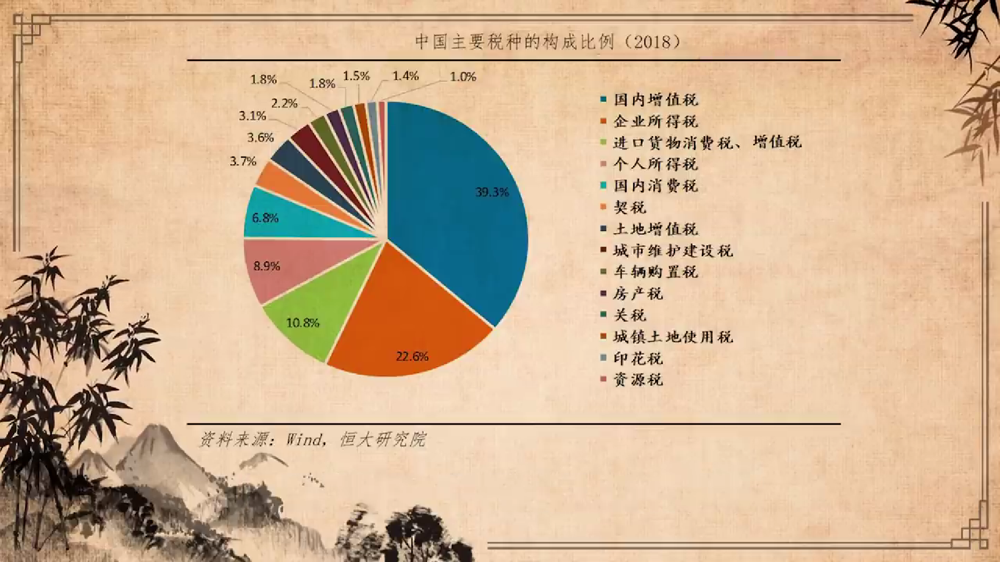

来自https://www.youtube.com/watch?v=QikoqoZ9HCw  此为文字整理

# 卢麒元：如何跨越官僚垄断资本主义的陷阱（上）

今天呢想跟大家讨论一个问题，讨论的问题是如何跨越官僚垄断资本主义的陷阱？

这件事情呢听上去有一点怪怪的，但他是我这三四个月一直在思考的一个问题，春节的时候跟老领导和一些好朋友聚会。大家一直在关注这件事情，就是大家认为在二零二一年进入到一个崭新的状态。无论是西方还是东方都面临道路选择问题。其中西方的道路选择问题也走到了一个极端的状况。比如说美国，美国从占领华尔街运动一直到特朗普现象的发生，并没有能够解决美国出现的问题，而特朗普恰恰采取了纵切的手法，他进行了种族的一系列的纵切，显然不能解决问题。

> 占领华尔街：指2011年从美国纽约开始的一场占领运动，后扩展到美国十多个城市和全球其他地区。运动提出的口号：“我们99%的人不能再继续容忍华尔街1%人的贪婪与腐败。

> 纵切：值对宗教、民族、种族进行纵向切割，强化阶级或联盟内部矛盾，美国优先
>
> 横切：对内通过做阶级分析缓解阶层内部矛盾，对外建立战略同盟，团结国内外大多数。

中国的问题和美国的问题不同，但又有同质性。我们将美国的问题概述为金融垄断资本主义。就是他在解决了日本和苏联问题之后，由于外部压力减少，内部的问题变得就非常的极端，它开始迅速累积。所以呢，出现了在上个世纪九十年代之后持续的高度的甚至是高强度的金融垄断。这种现象的发生，我们管他定为金融垄断资本主义。

可能在使用概念，使用定义方面呢，有大家有不同的想法。我们对中国后改革开放的这一段时间就是，进入到新世纪的这段时间，比较快速发展的这个状况，我们管它叫官僚垄断资本主义。其实是原来毛泽东概述的三座大山里边的最后一座，帝国主义、封建主义和官僚资本主义，这是最后一座大山。这座大山是如何再次出现成型并成为中国的一件大事。

因为春节的时候，老领导提出一个想法。他说我们提出两个一百年，那么这两个一百年的第一个一百年，一九二一年到二零二一年已经完成了。那么还有第二个一百年到二零四九年，在这二十八年间，中国最大的问题是什么问题？思考的结果就是官僚垄断资本主义。

就是我们要处理的最大的问题，它本质上是道路问题。当然美国最大的问题是金融垄断资本主义，它本质上也是一个道路问题。美国的就是零八年的危机之后，占领华尔街运动，一直到桑德斯一系列的努力失败了。就是美国在解决金融垄断资本主义道路上的一系列的尝试，体制内的尝试，体制外的尝试均以失败而告终。所以美国的金融垄断资本主义还会导致更深层次的危机。是否能够解决，我们现在确实看不到希望，至少体制内的努力，以桑德斯为代表的，通过体制内来解决的努力失败了。占领华尔街运动并没有能够构成体制内的自觉。

中国呢？在新世纪开始逐渐形成了官僚主义，我们管它叫官僚垄断资本主义。这件事情呢，它产生的背景实际上也很有趣。因为我我最近在准备新一轮的线上的资本论的课程，我我这是第五次读资本论。

为什么会谈到资本论？我记得我好像上次课里边说过，马克思写资本论只写了两卷，第一卷是价值论的部分，就是说明了剩余价值。其实所有的经济学都得从价值论开始。第二卷写的是资本流转。马克思写第三卷的时候遇到障碍，写不下去，到死也没完成。后来恩格斯他们攒起来的那个第三卷，根本不是我认为的马克思本意的第三卷。因为第三卷，马克思要写国家与资本的关系。第三卷没有能够完成，有没有人办这件事呢？我认为列宁办了一半，就是列宁写了部书，叫《国家与革命》。这部书我把它当成资本论第三卷。

《国家与革命》谈的是什么呢？《国家与革命》谈的是国家资本主义。其实列宁并没有遵从马克思的本意，但是残酷的斗争现实要求立刻来解释，从理论上解释一个无产阶级的国家如何建立和发展。这个时候列宁的总结是到位的，就是国家资本主义。通过国家来掌控一切资本或者是一切必要的资源，形成完整的资源、资本和劳动力的整体配置，迅速完成工业化。

列宁的国家资本主义的这一套理论，有适应历史发展的需要的部分，就是它很好用。无论是斯大林建立的苏联式的社会主义这个政治经济体系，还是后来在德国试验的那套国家资本主义，还有后来中国搞的国家资本主义，还有新加坡市的国家资本主义，都非常成功地解决了工业化问题。

但他的问题是显著的，就是国家资本主义发展到一定的阶段，必然出现官僚垄断资本主义。因为官僚体系会不可避免的完成对主权的僭越。这个主权包括国家主权和人民主权，完成对主权的僭越。形成了另外一种，其实是一种私有化，但我们有时候不好解释。中国在新世纪的官僚体系，迅速完成了对三重主权第一个政治主权：立法权、司法权和行政权的某种程度的僭越。

有没有做反抗呢？二零一二年开始到二零一八年的反腐败，实际上是我党体制内对官僚垄断资本主义的一次强力的反抗，它起到了一定的正面的作用，阶段的部分的解决了问题。我个人认为可能在政治主权上官僚僭越政治主权上起到了部分的阻挡的作用。但在经济主权上，我把权利的结构分成三层，经济主权、财政主权、金融主权和要素主权。要素主权，以土地为核心的在第二个层面，其实中国的官僚垄断资本主义走到了一个相当的程度。现在我们动不了。

我们从财政的角度，从税收角度，我们可以看到中国的税收几乎是全世界最扭曲的税收。百分之九十以上的税收来自于劳动者劳动，而不是针对资产和资本利得课税。

中国的金融资本发展到了现在，已经进入到一个非常危险的状况，就是国家、企业和个人的负债杠杆居高不下，而杠杆所形成的那部分的资本利得被少数人占有，并且相当部分转往国外。从二零一二年到二零一八年，三万亿美元外逃。

> 注：2012-2018年我国货物进出口总额顺差合计2.746万亿美元，外储却下降了2500亿美元，合计外逃3万亿美元

其实中国也处在一个高速发展之后的非常危险的过程。其实这里边涉及到道路问题。但是现在呢，我们在学术界，在思想界，学术界呢出现了一个非常麻烦的状况，就是我们处在一种麻痹的状态。我们有热点，而无焦点。就是真正的问题不成为焦点，大家都在蹭热点，不抓焦点，我们有热度，我们没有高度。我们很少有人从哲学、史学和经济学的角度，系统的论述我们遇到的问题和我们的道路选择。

我想今天呢这算是个缘起。我们正式提出这个问题，尝试给予这个问题一些我们的思考，国内呢也有人做了解读，但他们解读官僚主义是不对的，必须完整的说是官僚垄断资本主义。他与美国目前的金融垄断资本主义正好形成东西方两个主要的问题，也是要解决的焦点。美国的政治家已经开始着手思考并解决这个问题。但是他们的路是不对的。将来我们有时间我会我会讲一次MMT，就是史蒂芬尼凯尔顿去年那本热销的书《赤字迷思》。

美国人显然在选择一条中央集权的道路，因为当美国的地方政府的财政陷入全面失败的时候，必须通过中央强化中央财政来解决美国问题，强化中央财政必然走向集权的这样的路，我总是在说美国人正在变成他最不想变成的样子。中国呢也很有趣，中国呢正在变成他理论论述上最不应该的样子。

这里边我要谈到华盛顿共识，就是华盛顿共识围绕着新四化，第一化是私有化，第二化是市场化，第三化是资本化，第四化是国际化。现在美国人在反这四化，反私有化，反市场化，反资本化，反国际化。美国在四反特朗普算代表性人物。

中国在四化上面没有办法收手，我们出现了过度私有化，连教育连医疗连养老全部在搞私有化。过度的私有化市场化和过度资本化，过度国际化处在一种甚嚣尘上的过程中，并且形成一种扭曲的病态的一种逻辑和审美。甚至我们的主流媒体并未意识到其中内部的严重的问题。

另外呢就是我们在观察到一种问题，就是中国的官僚垄断资本主义跟美国的金融垄断资本主义，在高端上具有同质性并且有关联性。从一二年到一八年，中国的大量资本外逃，实际上与美国的政策有对接的成分。所以我们在这个问题上对自己的道路要有清醒的认识。同时呢我们可能也需要对美国的状况有清醒的认识，也要有一次相互之间关系清楚的论述和准备.

例如美国在特朗普的后期和拜登的前期实际上是接受了新货币理论就是MMT。他们是接受了斯蒂芬尼凯尔顿的想法，所以美国采取了如此夸张的激进的货币政策、财政政策、货币政策，就是大量的救助，1.9万亿的救助加2.3万亿的大规模基建。他们接受了MMT。

我仔细阅读了凯尔顿的那部赤字迷斯的书。其实凯尔顿的意思和美国政府现在的这种操作方法上是一致的。但其实他们的逻辑基础和目的是不一致的。这个做法的本质有一个重要的前提就是，美国人，试图通过美元和美国在市场的独特地位重演一九八五年到一九九一年的旧故事。

一九八五年到一九九一年发生了，一共是三件大事。大家注意到的是广场协议。我把这件事情概括出三个主题词，第一个叫资本过剩的危机，这是跟马克思生产过剩的危机是不一样的，是资本过剩的危机。第二句话，平成战败。平成是日本的皇帝的号。他一九八九年登基，二零一九年退位。平成是非常悲惨的一个天皇，因为昭和男儿，昭和还有日本，虽然战败了，但是他仍然日本的精神和日本的优势还。在到了平成，就是一九八五年到一九九一年，日本经济陷入全面衰退，到今天无法恢复。这次昭和战败，他是从精神上垮掉的。所以日本平成废柴这个词并没有用错。

第三个重要的词汇是天降组。

> 天降组，原神道教用语，指神从天界降临到地上。这个词在英文中为政治术语旋转门(Revolving door)。我国很多法律都设定了相关条款，规定了公务人员离职后的从业要求。

国内的朋友确实不熟悉，因为日本呢特别是西方媒体基本上把这三个字删光了，我其实挺佩服互联网这个媒体的。天降组，是上个世纪八十年代，日本央行内部的一批少壮派的人。他们有一点儿模仿当年日本军部的少壮派发动军事政变，夺取日本的行政权力，就是东条英机那帮人。这个天降组呢，他们深受美国影响，其中很多人是留美回来的。他们向大藏省和通产省夺权，因为日本这个国家它的货币的发行权并不完全在央行，相当部分在大藏省。他们的夺权行动成功。

平成天皇是没有行政能力的，他甚至不再像他以前的前任天皇，他也不像英女皇。因为日本的天皇以前是问政的。英女皇虽然不问政，但英女皇有全世界最牛的顾问班子，就是最重要的英国的思想家和美国的思想家都会成为英女皇的顾问。她没有过问，但是他在思考。她的思考的结论可能会对英国产生深刻的影响。但是平成天皇呢他的问题是，他个人甚至整个的日本的大和民族认为他们的敌人是苏联和中国，是共产主义。他从意识的底子里边没有认为美国可能构成日本的问题。所以日本在五十年之内，从一九四五到一九八五，五十年之内，被两次干掉，一次是军事上，第二次是精神上，彻底打垮。日本的平成战败，导致美国资本严重过剩的危机得到了根本性解决。

1971年美元与黄金脱钩之后，美国政府开始大规模印钞，出现了严重的财政赤字和贸易赤字。他们的解决方案就是祸水东引。第一站是日本，第二站是苏联，第三站是中国。中国八九年爆发了那场运动。那不是中国国内单纯的问题，他有深刻的经济上的原因和背景，就如同当年文革的爆发，他是一个政治现象，但它有它深刻的经济原因和经济背景。上个世纪八十年代到九十年代，美国通过完美的操作，美元操作将七十年代就是越战留下的遗留问题一次性打扫干净。

新世纪开始，随着911的爆发，他又开始累积问题了。而这一次他的问题比上个世纪的问题严重的多。因为在苏联解体之后，美国的金融资本主义迅速得到扩张，美国这个国家已经很难想象，它不是一个真正的由美国人领导的一个民主称体，我把它定义为金融垄断资本主义，这也是占领华尔街运动爆发的根本性原因，也是现在美国的思想家也包括凯尔顿他们在思考的问题，但是他们提出的解决方案不行，作为我来看是不行的，而且时间上出现了错位，就是不匹配。

美国如果在二零三零年前不能解决他的金融垄断资本主义的问题，美国将不仅仅面临严重的经济危机，而且面临深刻的政治危机，他的政治危机可能会导致这个国家解体。

所以中国超越美国与否取决于两个因素，一个是我们能否解决我们的官僚垄断资本主义，美国能否解决他的金融垄断资本主义问题。

我们前面这一个部分就讲这么多。

