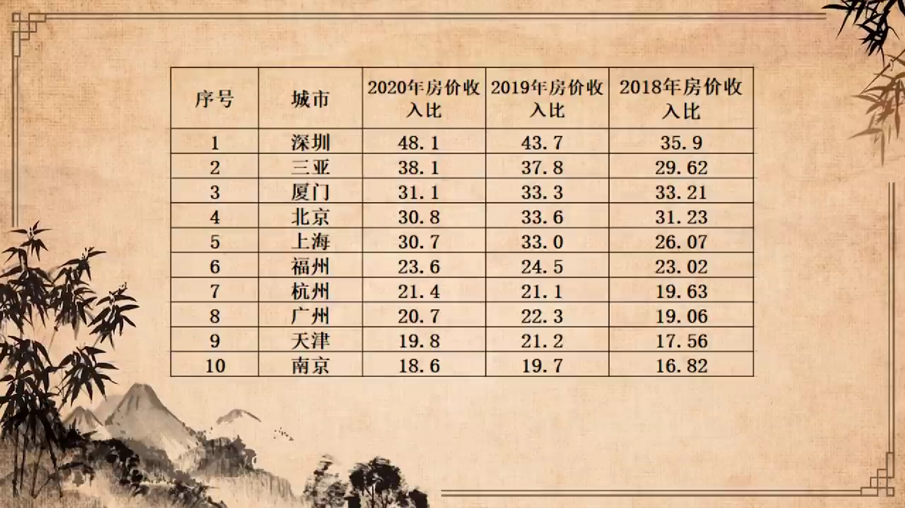

来自https://www.youtube.com/watch?v=MfmVDO0GYhM  此为文字整理

# 卢麒元：如何跨越官僚垄断资本主义的陷阱（中）

官僚垄断资本主义的发源地或者是发源的起点，是国家资本主义。我刚才讲了，列宁写的国家与革命概述了国家资本主义应该怎么做，苏联建立的国家资本主义道路是一种非常实用主义的选择。由执政党建立政府，集中全部的社会资源，包括劳动力资源、包括自然资源、包括资本，以最佳配置的方式，找到最高的效率，在短时间之内完成工业化，这显然是人类历史上一种非常理性的思考。

最近为了准备资本论，我在读笛卡尔，在读康德、黑格尔,在讨论理性主义。理性主义在很多的时候，理性主义是非常血腥的。理性的资产重组从来都是血腥的。如果要是人文的话，就是印度的选择。但实际上，印度的选择对人民、对人民的历史来看、长远来看并不好。所以有的时候真正的理性主义选择,就是西方延伸出来的理性主义选择，它最后变成苏联。

我们呢，在经历了土地革命和土改、工商业改造之后，中国建立了完整的国家资本主义。这个国家资本主义发挥了他强大的效能。我们在短短的时间之内，由一个农业国家迅速上升为一个工业化国家。就是我们的现代化的过程，走的是非常的快的。但我们确实没有处理好现代性。

在不断地思考国家资本主义这个问题上，苏联让我感到失望。苏联的那么多学者专家对这个问题的思考截止于托洛斯基、布哈林这一代人思考，再往后他们放弃了思考。但这个事情在中国，从未停下脚步。在上个世纪六十年代，毛泽东带了一批人去读苏联政治经济学教科书，在杭州他读出了很多的东西。刘少奇带人在海南，读政治经济学教科书，他们都带了一批经济学家，还有身边的警卫员工作人员，他也读出了他的看法，“三自一包”、“包产到户”就是读完之后，他认为，单纯的国家资本主义应该对它进行补充。但是那一代领导人没有完成理论论述。他们同时意识到了马克思的思考的问题，就是社会资本主义的问题。

> 社会资本主义：由社会资本主要构成的经济社会。即资本被社会占有或者由社会共享，承载资本的主体是社会企业，而非私人企业。
>
> 马克思认为，资本经济的更高阶段，是资本的社会化。他在《资本论》中支出：“直接取得了社会资本，即哪些直接联合起来的个人的资本的形成，与私人资本相对立；并且它的企业也表现为社会企业，而与私人企业相对立。“走向社会（股份）企业”是资本再转化为生产者的财产所必须的过渡点，这种财产不再是各个互相分离的生产者的私人财产，而是联合起来的生产者的财产，即直接的社会财产。“

毛泽东思考的结论是，社会资本主义，必须让国家资本主义中的一部分权利交出来。所以他发动了文化大革命，发动文化大革命初始的动因是想交出立法权，夺权，人民夺权。因为官僚垄断资本主义在国家资本主义基础上的产生是必然的，是不以人的意志为转移的，它不是胎生，不是卵生，是化生。所以毛泽东说，资产阶级就在党内，他说的就是，官僚垄断资本主义是必然产生的。他的化解方法是通过人民夺取政权，再次夺取政权。这就是马克思认为可能要发生的悲剧。其实，人民只需夺取政治权利里边的立法权，但是人民砸烂了公检法，他不光立法权、司法权、行政权，他连党委，各级学校他都建了党委。造反派占领了一切，而造反派没有国家治理能力，所以中国文革的那场试验以失败而告终。

国家资本主义必须与社会资本主义相融合。什么叫改革，改革就是允许社会资本进入国家资本主义体系之内。所谓个体户。改革就是让社会资本主义长出来。开放是什么？是允许国际资本进来，当两种社会资本进入到中国，形成与国家资本主义的交融的时候。其实中国找到了一条正确的道路。

中国是比较好的，国家资本主义与社会资本主义的混合体，它兼具国家资本主义的效率，同时又很好地通过社会资本主义激发了社会资本和社会上广大的人民群众的创造力。这种融合几乎可以说是一条完美的道路。但是每一件事情它有它历史的发展的必然规律。所以当这个状态进入到新世纪第一个十年的时候，我们注意到，随着中国财政主权的下放，我们实现了分税制，地方财政要以土地为依托，建土地财政。这个时候出现了没有料想到的，官僚集团对国家的政治、经济和文化主权的僭越，开始进行了部分的私有化。中国出现了官僚垄断资本主义。这个问题呢，在全世界早有表演，但是呢作为一种历史的必然，它还是发生了。

我们现在呢可以给官僚垄断资本主义一个基本的定义。实际上是，体制内官僚阶层利用中国宪法赋予他们的特殊的权利，它包括政治权利、经济权利和文化权利，完成了个人或者是以个人为主体的集团对执政党主权，执政党是代人民持有的主权，的僭越和私有。这个过程到二零一零年前后达到高潮，所以他才有了二零一二年的反腐败运动。叫反腐败运动，实际上是对这种越权的一种反击。

官僚垄断资本主义。他最终会走向哪里呢？实际上是官僚阶级对中国最核心的资产、对资本完成了集中，就是贫富分化。他跟金融的资本主义的目的、结果完全相同。实际上，中国的贫富分化非常严重。我们看三件事。

第一件事情是，中国最可能是最优秀的领导干部的孩子都去做金融了。这件事，是需要思考的。不可以这样。他们不愿意做老师，他们不愿意做解放军，他们不愿意做工人，他们也不愿意做高科技，他们全部进了金融机构。这是二零一零年以后令人震惊的一种结果。他们也不当官，全部进入金融。

第二件事情是中国经济的构成的主体。我们今天打开上市公司。中国上市企业第一名是茅台，第十名是五粮液，中间夹着八个金融机构，四大行还有保险。就是看中国经济，像我这样的人会心如刀割。这样做过了。因为茅台也是金融现象，茅台本身是货币，茅台不是酒，它是金融属性。连带五粮液进入到金融这个板块里去。房地产也是金融金融现象。官僚垄断资本主义垄断的核心的部分就是金融。我们国家竟然通过官僚垄断资本主义搞出了金融垄断资本主义。这件事情呢，我们的情况并不比美国更轻，只是由于我们处在高速发展中，我们的老百姓没觉得疼，没有美国人觉得那么疼，但问题的严重性具有同质性。在二零一零年之后一段时间里边。整个中国上市资产里边，百分之七十的利润构成是金融和非银行金融机构，现在它下降到百分之六十，但他仍然让我们无法接受。我们认为金融这个行业给中国人的贡献不应超过百分之二十，百分之六十说明你完全越界了。这是第二件事情。

第三个现象也是非常残忍的现象。就是我们在讨论普惠金融的时候出现了P2P，出现了大规模的非法集资和金融欺诈。什么意思呢？就是我国的社会主义金融无法照顾底层老百姓的金融需求。中国出现了一个非常残酷的现实，我们的财政收税是针对劳动和劳动者的百分之九十以上，这在全世界不可思议。正常针对劳动者的收税应该是四成是极限，收到九成，我们出现了公平正义问题。金融是为所有人服务的，必须是公平正义地覆盖每一个人。怎么可以中小企业贷款难呢？

极度垄断下的情况导致一种结构性的严重的问题。而这个问题呢，对中国来讲，它是一个焦点核心问题，但却没有引起中国广大的思想家、学者的认识。大体上，我们给官僚垄断资本主义一个基本的定义啊，一个概念，我们也将它的特征做了一点描述。官僚垄断资本主义，之所以叫资本主义，就是他最清晰的表达在资本的控制权上面，或者是中华人民共和国的资产主权上面，围绕着主权而展开的政治上的活动，包括立法、司法和行政。经济上的活动包括财政，财政上的税收、金融管理和土地管理，包括围绕的资本运作的文化。文化包括教育、学术、传媒，它都具备了完整的官僚垄断资本主义的特征。

在立法权方面，其实我们表达的已经到了极限了，就是我们的基本在立法权上面无法表达社会属性。就是社会主义或者是社会属性，就是主体性不明确，才会出现了那么多的体育明星，演员的人大代表。它既不具备人民主体性，也不具备社会属性。我们知道它是一种装饰物，这就是经典的官僚垄断资本主义的特征，就是立法权出了问题。所以，直接税立法没有办法，因为当我们看到每一个人都是一嘴猪油的时候，怎么可以讨论直接税问题？

所以立法权出了问题，司法权出的问题更为严重，司法权不应该是地方党委领导的司法。我从来要求党的领导，但是要求直辖。公检法都必须直辖中央。一定要党的领导，但不能交给地方党的领导。因为一旦司法体系不能垂直，被地方权力切割，它就变成地方权力服务的一个工具了，非常惨烈，它跟老百姓成了对立面。所以在政治层面，立法权、司法权出了问题。

行政权。行政权导致一个财务现象，就是我们的制度成本急剧上升。制度成本，这又是提出一个新的概念，就是一个国家管理，所有的行政管理所构成的那部分成本。其实中国的制度成本。已经高到一个不能容忍的程度。他当然包括了三层，第一层我管他叫白色财政，就是正儿八经通过国家财政支出供养的那部分的财务支出。第二部分是灰色，就是他们在合法、不合理的部分，比如说围绕着土地财政而展开的那部分收入收支，甚至包括地方政府的融资平台所展开的。它构成了严重的成本，社会运行成本，但它又不见得全部违法，灰色部分，但是它不纳入预算，就是预算外。法内预算外预算内的，我管他叫白色，预算外合法的，我管他叫灰色，还有就是黑色贪污腐败。这三个成本我以前给出的定义就是，当灰色超过白色的时候，这个社会扭曲。当黑色超过白色的时候。这个社会就不能再存活了，就要造反了。

经过反腐败，黑色被压缩了。但灰色没有办法处理它，表达为地方债，表达为机构的杠杆。现在目前没有好的解决方法，一会儿我们会讨论这个问题。整个制度成本不断的攀升，攀升到一定程度，国家资本主义的利多、好处、红利被吃光。我们很快面临的全部都是问题。所以在处理我刚才说的政治主权上，出现了一系列问题。

经济主权上、财政问题上面我们看到了，金融方面，我们看到了，前两天新闻出了问题，就是有一个中金的部门经理，跟另外一个人的老婆，谈恋爱，然后有一段录音啊在互联网上爆掉了。大家对那段录音呢就感到很奇葩了，就是现在我们的金融机构的高管原来是这样子的。感到另外奇葩的就是他的工资，中金的部门经理是六百万年薪，中金的老总是两千万年薪。这里边就大家有一个想法，那是国有企业，百分之百的国有企业。我在以前上市公司做薪酬委员会主席，我知道了。他这恐怖的不是他的绝对高度，是他的差距，就是平均工资和这个水平的差距。他确实到了一种足以震撼人心的程度。而且这个机构是国家设立的。我们先不说这个机构，对不对，它的合理性。我们只是说现在这个金融治理到这个程度，其实是需要思考的。

当然土地问题最近也开始变得非常严峻。你刚才说的那个深房理的问题就是。为什么中国的房价居高不下啊

中国的房价和收入比变成了一种非常残酷的状况啊。为什么会出现所有的要素价格，我们在处理要素价格，出现严重的问题。整个经济主权这一块，如何让他社会化其实非常严峻。

更为可怕的就是文化主权，就是教育出了问题，学术出了问题，传媒出了问题。我刚才讲传媒是讲大公、文汇和香港商报。本来他们以前是我党重要的很好的报纸，后来出现官僚垄断资本主义之后，他们就变成黑板报了，他们为什么会变成黑板报呢？因为他不要人民性，他不要社会性。把一份那么好的报纸变成黑板报，变成一个文化食堂。你知道官僚垄断资本主义很残酷的，大学何尝不是如此啊？媒体何尝不是如此啊？教育文化传媒整体的胡闹。如果不拦着，你知道我们看到日本一九八五年的现象必然重演。天降组，是不是被人拿下的特别坏的一个组织，到今天都不敢说。至少他的当时的日本的政府。那种亲美的情绪，到了一个我们今天看来不可思议的程度。就是我要杀了你，但你是我的恩人，就杀我的人，我愿意让你杀我。我认为旁边提醒我那个人是我的敌人中国，所以我回过头还是说要捅他去的，他是一种奇怪的审美逻辑，今天就是这样。我们今天中国谁是英雄啊？谁是大家的目标啊？我们是怎样审美的？我们的传媒在看谁呀？我们的学校。在宣扬什么样的理论？我们的整个的文化气象扭曲到何种程度呢？所以我今天在出租车上面。我问他，我说我再做一次社会调查，你心里边香港的英雄是谁？果然未出我所料还是老套路。“应该算李嘉诚吧，要不李小龙”。我说第一个，你不能说他是十恶不赦吧，但在我心中只是个小丑，因为一个手套嘛。第二个呢算半个英雄，至少还能打架，对吧？对香港电影有贡献。

关于官僚垄断资本主义的思考，我们今天只能是开篇。这个思考过程会非常的痛苦。因为我们看到的，我们看到的可以上台面的，都是满嘴猪油，所以不太好聊天现在啊。就是一旦聊起来，大家就不想跟你说下去了。因为再说下去。你这就像深圳这房地产，虽然换了几个领导，吃的正香啊。停不下来。社会主义示范区就示范房地产吗？吃饭吃猪肥猪肉吗？胡闹呢吗？

这这个部分也不能讲太多，讲太多把时间全耽误了啊。关于这个官僚垄断资本主义的部分呢，我必须做一个折中，就是任何一个现象的产生，按照黑格尔的逻辑，它是有它的合理性存在的。就是在国家资本主义走向官僚垄断资本主义这个过程中，为什么在社会资本主义的一个部分我们没有走好，出了问题。它里边有它一些历史上形成的主观和客观的原因。而我们的学者在处理重大问题的时候，思考是不够深刻的。就是我们现在如何避免官僚以社会资本的名义，进入中国的经济体系之内，现在的情况是中国的官僚僭越了国家权利，然后以社会资本的方式进入到中国的经济体系里面来。他们貌似社会资本，但不是。

这个过程，它有一个历史的过程，就是我们进入到九十年代的中叶。我们改革开放进入到九十年代中叶的时候，就是中央财政，财政不足，金融呢又出现了严重的杠杆、泡沫，这个时候解决的思路呢就是给地方政府放权。所以一九九四年，中国进行了分税制，一九九五年人民币跟美元挂钩，建立联系汇率，这两件事情呢有一点像一九八三年香港的联系汇率，八四年中英联合声明附件三，就是两件事构成的一件事。这个处理完了以后，当土地的要素的权利下放到地方以后。必然产生我们所说的这种官僚对资本权力的一种僭越，这个是自然而然的一个发生的过程。我们对这件事情的思考，本来在新世纪初已经开始了。但确实是我个人的能力问题，我其实在新世纪初就写了新社会主义论。但那个时候认识到不了今天的这个高度，我们只是建基于资本论，写社会资本应该怎样发展？但没有想到如何正常的扶植正常的社会资本，来替代那个不正常的、假的社会资本，叫官僚垄断资本。在这件事情上处理上面，既需要理论的自觉，同时也需要强有力的立法和行政的跟进。

值得高兴的是，显然我们这一届领导是有解决问题的意愿的。能否在短时间之内完成一个比较彻底的解决？我今天可以这样说，我是有信心的，因为直接税立法已经被提上了议事日程。只是他的时间可能需要到了二十大，就是明年可能才正式提出。虽然有些迟，但我个人认为，以直接税立法为核心的制度变迁，可以慢慢促成整个的资产的分配结构、分布结构和分配结构出现慢慢的调整，可能会有一定的好转。因为直接税立法比以反腐行动升级了，直接税立法是针对资产的，财产公开了，实际上税务局就自动的反腐了。只不过是以前是通过纪委反腐以后呢，税务局的功能就具备了。因为针对资产和资本利得的课税，一旦开始，中国就进入到一个崭新的阶段。

前两个问题我就讲这么多。

