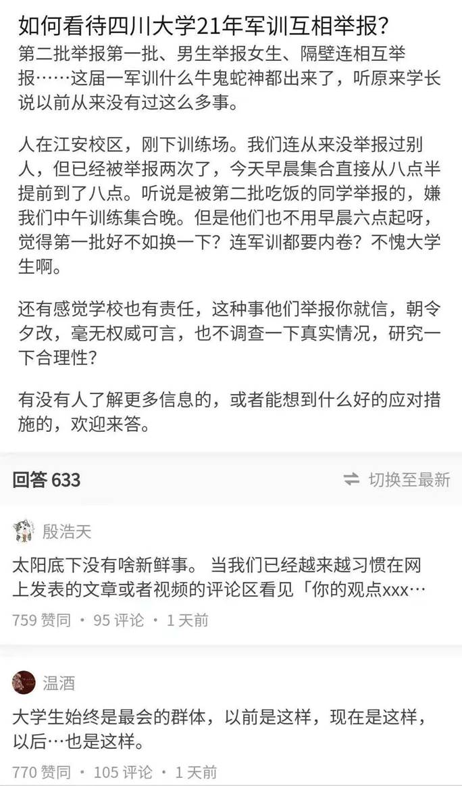
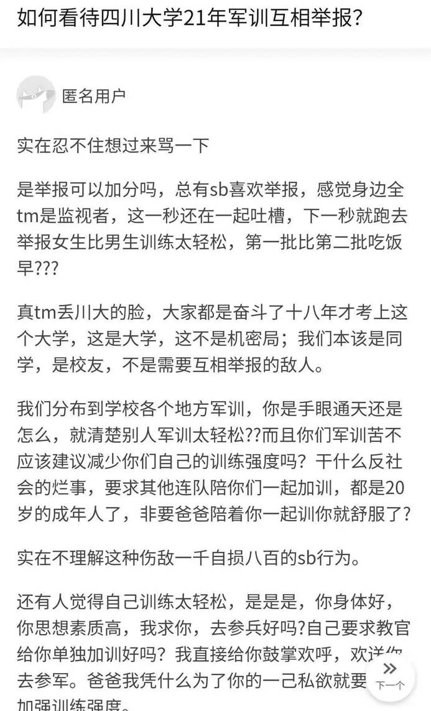
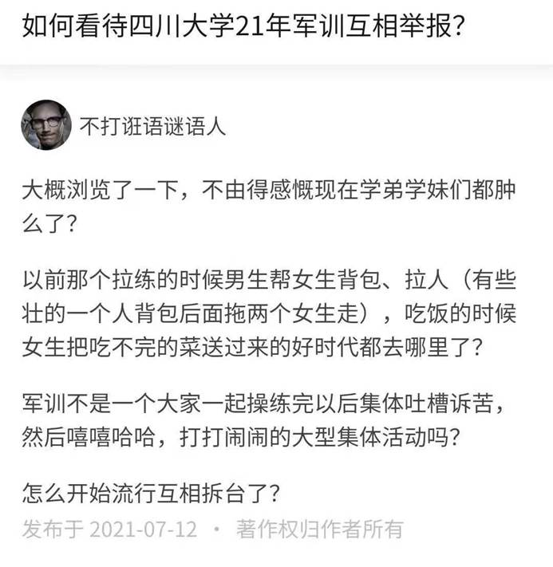
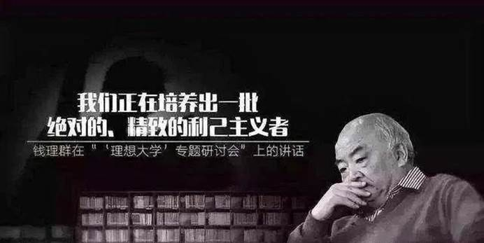
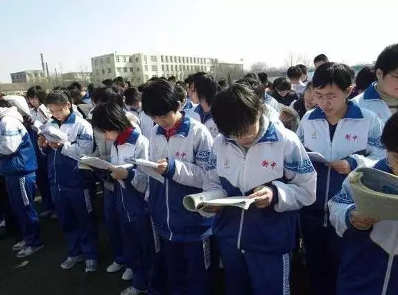
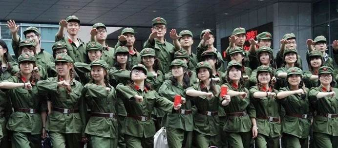
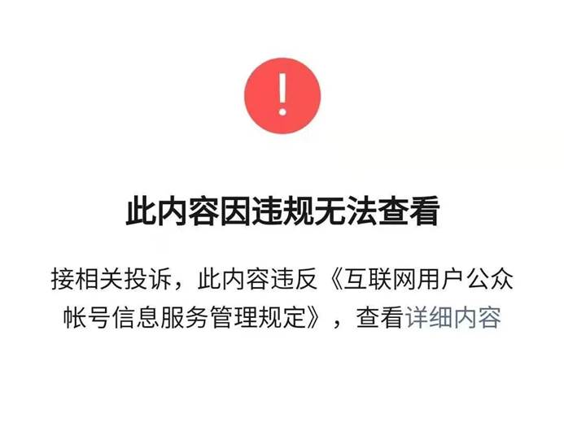

修明经略：四川大学军训相互举报，年轻人卷疯了
============================================

[原文地址](https://mp.weixin.qq.com/s/kgU8Fdacvb0q5e0IaUB6jg)

00后普遍是独生子女，又在应试教育的熏陶下长大，这使得他们成为最为原子化，最善于互害的一代。

今天在知乎看到一则消息，说是四川大学2021年的军训出现了大量举报现象。男生举报女生，一连举报二连，第一批举报第二批。

举报的是什么事呢？基本就是女生训练少了，男生不服要求加大女性训练量，一连集合晚了，二连不服，要求提前集合时间。三连起晚了，二连就争相打小报告。

举报来举报去，大家的关系越来越差，还没有得到实质的利益，因为举报越多，军训要求越严，大家受苦越多，互相举报完全就是囚徒困境，没有人从中得利。

回答中的80后答主表示，在自己那个年代，同学们往往合起伙来欺瞒老师，一同抵制权力，最终大家的待遇都改善了，他怎么也想不明白，为何现在的孩子不但不团结起来抵御权力的侵害，增加共同的福祉，反而争相向权力献媚，试图表现自己是个好孩子，以破坏同学关系的方式让自己得到表扬。

**这种互害甚至不需要带来实质的利益，而更多呈现出我过得不好，你也别想好过的嫉妒心理，我赢不了谁也别想活，可谓是自私到了极点。**

**无止境的内卷和互害，是这代年轻人的标签，他们仿佛陷入了霍布斯说的“每个人对每个人的战争”，每个人都想借助公权力消灭掉潜在的竞争对手，从而让自己获得上位的机会。**

****

****

****

四川大学的举报事件早已不是孤例，钱理群曾评价北京大学充斥着精致的利己主义者，他们都是内卷高手，一个北大学生回忆，经常会有同学在班级群中要求增加考试的难度，原因竟然是只有难度大了才有区分度，才能将那些劣等生淘汰掉。如果考试太简单，自己的优势如何显现？他们拼了命的想要将同僚刷下去。

**去年北交大自杀的吴磊，也在遗书中写到自己的死亡对于室友是一种幸运，因为他们少了一个竞争对手，又少了一个内卷的对象。**短短的几句话就让人汗颜，曾经让人羡慕的同窗关系竟然成了赤裸裸的敌人。

吴磊还算轻的，最严重的莫过于毒杀室友，总之内卷在加剧，年轻人的举报越来越猖狂。

以前以为只有在网络上才有：“你说了反动言论，我要举报你！”，没想到如今举报已经到了线下。以前举报只是针对公共知识分子，现在这把火终于烧到了每个人头上。

我们不禁要问当代年轻人怎么了？其实发霉的种子早已埋下，只是我们长期忽略了他的存在，我们总是想当然的认为中国在进步，一代更比一代强，我们如此坚信00后上来，国家就好了的幻想，殊不知现有的制度已经埋下了祸根。

95后、00后在什么样的环境上长大？

**一是独生子女**，他们普遍是独生子、独生女，他们缺乏兄弟姐妹，他们的社交能力贫弱，不懂得合作、分享，更不懂得责任为何物，独生子女加上原子化的城市生活，让他们变得更加孤僻，相对于前几代人，他们更难具有同理心。公主病、王子病更加明显。

**这样的家庭环境让他们更容易成为精致的利己主义者。**

**二是应试教育，应试教育是一场零和博弈，不是你死就是我亡。**只有把你挤掉我才有登上独木桥的机会。在衡水中学，老师无数次会说你只要多一分，就会刷掉一操场的人，你没有北京孩子的特权，你就要加倍的努力，甚至不择手段。张锡峰的演讲是衡水中学的缩影，他没有教会孩子道德，只有赤裸裸的竞争。

虽然大部分中学比不了衡水中学，但方针是一样的，应试教育就是如此，非我即敌。这样的教育模式下长大学生会将同伴视作潜在的竞争对手，对他来说，竞争对手死的越多越好，他们死的越多，自己就越有可能上985/211。

应试教育严重熏陶的一代，很难指望他们有多少同理心，80后上学时，应试教育还不完善，等95后、00后上学时，应试教育已经发展到巅峰，因此毁伤了一代人的心理。

**三是国内近期的极左浪潮**。无限的吹捧苏联、极左思潮，无限的强调公权力，左的思潮迅速扩散，很多年轻人受到影响，认为举报是一次效忠的机会，而且举报还被冠以公共利益的名义，从而显得至高无上。

比如学生举报老师，都是以卖国和历史虚无主义等大口号作为理由，通过扣帽子压服老师，如今知识分子战战兢兢，再也不敢信任自己的学生。但是举报的理由仍然是自私的，比如电子科大举报老师的学生，他的真实原因是老师要给他期末挂科，因此他就通过举报的方式进行报复。

**举报的背后，都是个人的利益，他们希望借助利维坦，公权力消灭掉任何可能的潜在对手，他们的关系呈现出极致的原子化，完全是每个人对每个人的战争，完全达到了商鞅以弱去强的目的。**

这样的场景让人感到非常可悲。

面对这样的局面，我还能说什么呢？你再传递些理性的声音又有什么用？但我还是想对同龄人乃至后辈说，人终究是社会动物，没有人能完全脱离他人来生存，极致的利己主义者只会被社会孤立，最终自食其果。

**你举报别人，迟早别人会举报到你头上，最终所有人都没有好下场。**

 

修明经略：文章被删，我还是希望年轻人不要沉溺举报
------------------------------------------------

我批评川大学生相互举报的文章再坚持了一天半后，还是被删了，删除的原因估计是举报太多，很多大学生在后台骂我，想必他们一定积极投诉，最终让我这篇文章石沉大海。

说实话，我并不生气，这篇本就是我的随笔，我特意把他发到小号上，本不想引起太多人的注意，但没成想竟然大火，一天多的时间阅读量接近40万，这是我始料未及的。

这也反映出一个问题，就是当下的国人对肆虐的举报深恶痛绝，我那篇文章写得很烂，但胜在感同身受，但凡了解历史的人，都会有所触动。

举报，真不是什么好事，如果真的违法了，伤害了别人，举报没问题，但如果只是政见不同，亦或妨碍了自己的利益，就争相利用权力打压对方，这绝不是光彩的事。

不管是对老师还是同学，不要轻易沉溺举报。

这几年，举报真的太多了。多少知识分子因为几句不同的言论就被学生举报，我见过几个大学老师，他们都说自己战战兢兢，据说有的学校，老师上课前甚至要提前恳求学生，不要举报自己。据说还有位老师直接拿出了《最后的晚餐》这一名画，直接对台下的学生说，你们中谁会是犹大？

老师和学生之间的信任荡然无存，所有的自然的情感都被斩断。

也许会有学生说，我是正义的，我是为了更伟大的事业，你们全是误国的害群之马，只有我才爱这个国家，我想说，事情真的没那么简单，不是说批评就是卖国，吹捧就是爱国。

记得明朝时，最义愤填膺的就是东林党，崇祯迫于现实准备先平定李自成再收复辽东，因此他安排了陈新甲去和皇太极议和，此事由于意外被东林党的大臣们知晓，他们义愤填膺，号称宁愿战死也不议和。

最终崇祯受不了巨大的舆论压力，放弃了议和。

最终李自成攻破了北京，这些大臣们未做任何抵抗就投靠了闯王，后来清军南下，他们再次毫不抵抗的给清军当牛做马。

抵抗清军的是什么人呢？要么是史可法这样原来不受重用的臣子，要么是夏完淳这样名不见经传的少年，甚至是被称为大明反贼的海盗，后来，李自成的残部也成了抵抗最激烈的人群。而像钱谦益这种受尽明朝恩惠的，竟然迅速投降了清军，节操还不如一个妓女。（妓女出身的柳如是反对降清）

地区上看，抵抗最激烈的是江南，而江南恰恰是刁民众多的地方，当年苏州抗税，把万历皇帝派来的太监活活打死，一向被视为冥顽不化。

大明，最后竟然要靠反贼、妓女和刁民来维护，真是莫大的讽刺。

其实想想也好理解，正因为爱这个国家才去批评他，希望他更好，鲁迅最爱批评国家，但他不爱国吗？那些天天吹捧的人，绝对不是什么好人，爱的表现应该是实话而不是说假话，一个国家怎么可能没有问题天天都是好的。

某些人，作为中国人，不去指出中国的问题让国家避免灾难反而天天批评美国替美国人指点迷津，这是爱国吗？

年轻人总是一腔热血，容易被忽悠，历史上，霍梅尼和塔利班、基地组织最喜欢少年军，因为少年信仰最坚定，最容易去送死，少年人天然热情太多而理智不足，因此我原则上反对任何学生运动，那些把中学生卷进来的组织者更是卑鄙，学生就应该好好学习，为自己的生活谋划，不应该参与到政治中。

世界不是非黑即白，只希望你们能善待身边的人，不要用恶意的心理去揣测长辈、老师。

除了老师，对同伴更应该少用举报，应试教育让同龄人的关系成了零和博弈，成了互相之间的内卷，但人不应该这么活着，人是社会性动物，应该要和别人和谐共存，社会绝不是弱肉强食，社会达尔文主义这么简单。

科学早就证明，那些最成功的的人，都是最善于交际的人，没有人能孤军奋战到最后一刻，大学期间应该多交朋友，少树敌人，幻想着搞掉同学就能飞黄腾达，不过是痴人说梦。

不要想着利维坦能够解决一切问题，也不要相信可以操控的网络，更不要坚信自己现在知道的就是绝对正义的，还是保持基本的善意和理性。

说了这么多，我知道还是会挨骂的，但我也明白今天的局面年轻人不负主要责任，他们是被迫接受而不是主动创造。

但我还是希望，他们能积极乐观，荣辱与共的活下去，千万不要沉溺于举报，更不要自甘堕落的接受内卷，相信一切终究会好起来的。

又是一篇随性的文章，大家随便看看就好。

